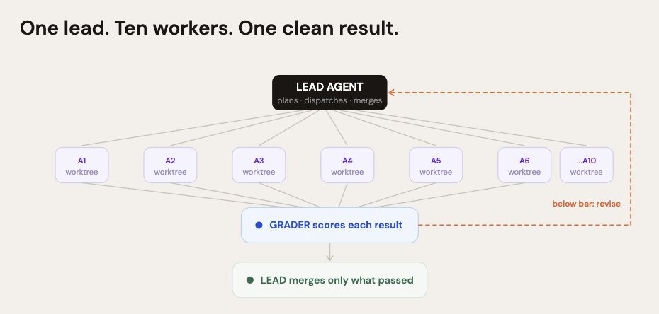
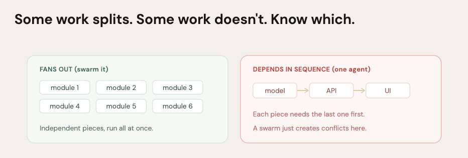
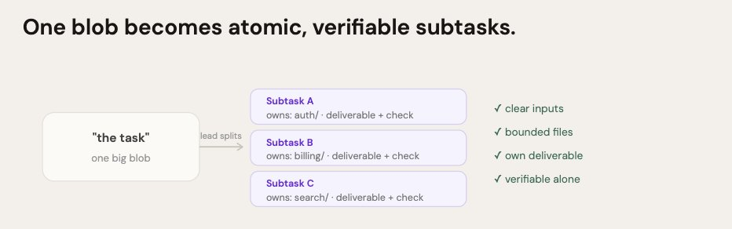
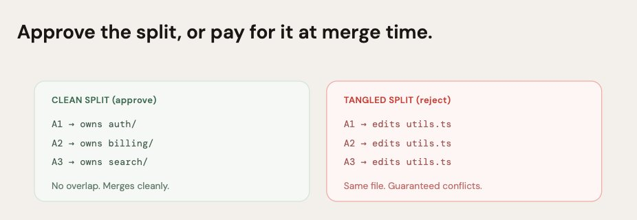
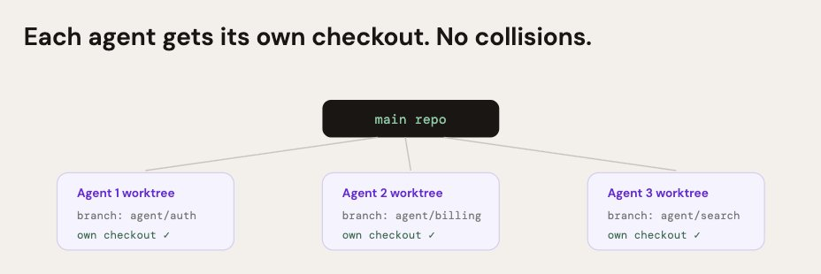
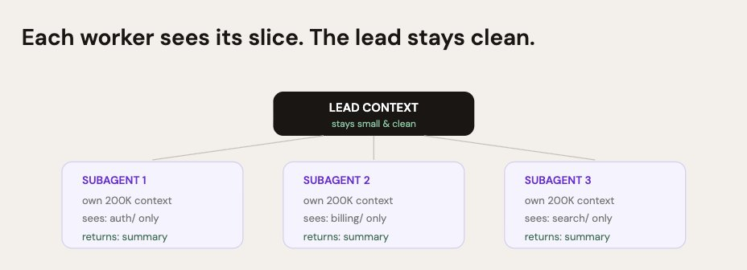
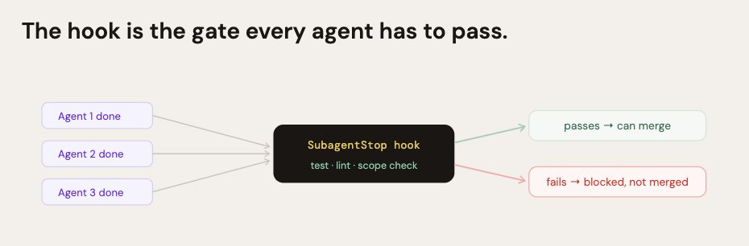
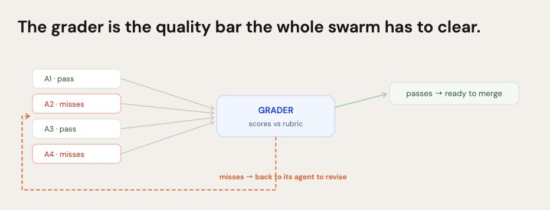
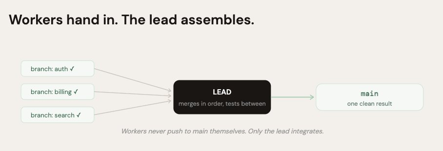
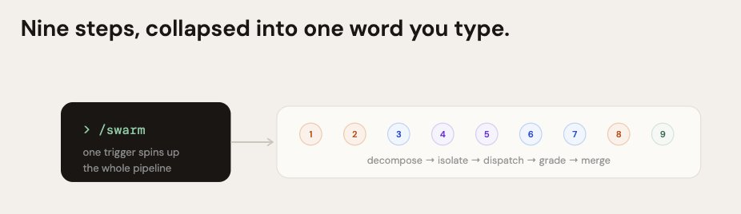

<div style="background:#e8f4fd;padding:14px 16px 10px 16px;border-radius:6px;margin-bottom:18px;">
<div style="text-align:center;margin-bottom:10px;">
<strong style="font-size:16px;color:#1a6ba0;">要点速览</strong>
</div>
<div style="font-size:14px;color:#3f3f3f;line-height:1.75;">
- <strong>Claude Code 原生支持 Swarm 模式</strong>：一个 Lead Agent 可以并行调度数十甚至上百个子 Agent，每个在独立 worktree 中工作<br><br>
- <strong>9 步循环是核心</strong>：分解→审批→隔离→派发→Hook 检查→评分→Lead 合并→打包成命令，不是简单的"多开几个 Claude"<br><br>
- <strong>合并混乱才是 Swarm 的致命伤</strong>：不需要管理的 10 个 Agent 只是 10 种产生合并冲突的方式，结构化的循环才是"快且好"的关键
</div>
</div>

**给 Claude 一条指令，十个 Agent 同时开始工作。二十分钟后你回来，十个完成的分支，每个都已经测试和审核过了。**

这不是幻想或第三方工具。这是 Claude Code 内置的一个模式，叫 **Dynamic Workflows**——一个 Lead Agent 可以规划并并行派发数十甚至上百个子 Agent，还有一个评分器把不合格的结果打回去修改，直到达标为止。

关键在于：**十个 Agent 启动得不对，你会得到十个冲突的 diff、一个被污染的上下文、花在合并混乱上的时间比省下来的还多。** 一个能工作的 swarm 和一个自相残杀的 swarm 之间的区别，是 Lead 运行的循环。以下是 9 个步骤。

**1. 选一个真正能拆分的任务**

Swarm 只在工作能拆成独立碎片时才有用。

这一步决定了 swarm 是帮忙还是添乱。**当任务能自然拆分成互不依赖的碎片时，子 Agent 才有价值：** 每个模块的文档、跨多个独立文件的迁移、几十种组合的基准测试。如果碎片纠缠在一起，十个 Agent 只会互相踩脚。

```
GOOD SWARM TASKS vs BAD ONES
Good: "为所有 12 个模块生成文档"（每个模块独立）
Good: "把 30 个文件从旧 API 迁移到新 API"
Bad: "构建一个功能，每一层都依赖上一层"
经验法则：如果你说不出 3 个以上真正独立的碎片，用一个 Agent 就行
```



✓ 你只在工作真正能拆分时才召唤 swarm

**2. 让 Lead 先分解工作**

Lead 在派发任何人之前，先把任务拆成原子的子任务。

Lead Agent 的第一项工作不是派发 Worker，而是分解。**它把任务拆成离散的子任务，每个都有清晰的输入、输出和验收标准。** 好的子任务是原子的：限定的文件、明确的交付物、可独立验证。这个分解过程是并行安全的关键。

```
ASK THE LEAD TO DECOMPOSE
"你是 Lead。把这个任务分解成独立的子任务。
每个子任务要包含：它拥有的文件、确切的交付物、
以及如何验证它完成。先不要派发任何人。
先把分解结果给我看。"
```



✓ 工作现在是一组干净、独立的单元，不是一个整体

**3. 在任何人派发之前审批计划**

检查分解结果。**这里的依赖关系错了，后面的合并就是地狱。**

这是你唯一的人工检查点，也是最重要的一步。分解计划决定了什么能并行运行。如果 Lead 搞错了依赖关系，两个 Agent 会编辑同一个东西，你会得到集成冲突。**一定要先读计划，再批准派发。**

计划中要检查什么：有没有两个子任务碰了同一个文件？（不应该。）每个交付物是否可独立验证？依赖关系是否正确？现在修计划只花一条消息的成本。后面修一个纠缠不清的合并，一小时打底。

✓ 你在依赖关系变成合并冲突之前就抓住了它们

**4. 给每个 Worker 自己的 Worktree**

隔离是阻止十个 Agent 互相覆盖的关键。

如果你的子 Agent 并行写文件，它们需要隔离——否则会互相覆盖。**Git worktree 给每个 Agent 自己的检出（checkout），在自己的分支上，这样它们可以同时工作而不碰同一个工作目录。** 每个完成后，它的分支就可以干净地合并了。

```
ISOLATE EACH AGENT
# 在每个子 Agent 的前置配置中加入
isolation: worktree

# Claude Code 为每个 Agent 分配一个全新的 worktree
# 并在 Agent 完成后自动清理
# 十个 Agent、十个分支、零文件冲突
```



✓ 十个 Agent 同时工作，从不同时碰同一个文件

**5. 派发 Swarm**

现在 Lead 派发 Worker，并行。

计划已审批、隔离已设置，Lead 开始派发。对于少量 Agent，Lead 直接派生子 Agent。**对于大规模任务，Dynamic Workflows 让 Lead 在一个 session 中规划和运行数十到数百个子 Agent。** 每个在独立的上下文窗口中运行，只报告结果回来，这样 Lead 的上下文保持干净以做协调。

```
DISPATCH THE SWARM
"计划已批准。为每个子任务派发一个子 Agent，
并行，每个在自己的 worktree 中。
每个 Agent 只获得它需要的上下文，
并返回一个单一的结果摘要。
在所有 Agent 报告完成之前不要合并任何东西。"
```



最佳规模：**3 到 5 个并发 Agent 是大多数日常工作的合适规模。** 只有当任务真的需要大规模并行（基准测试套件、跨多个独立文件的修改）时才推到数十或数百个。超出最佳规模后，你花在合并摘要上的时间比节省的时间还多。

✓ 整个 swarm 现在同时工作，各自隔离

**6. 用 Hook 把关每个结果**

没有 Worker 的输出能合并回来，除非通过了你的硬性门槛。

十个 Agent 意味着十个可能出错的机会。**SubagentStop Hook 在子 Agent 完成时立即运行，在 Lead 被允许合并结果之前执行你的硬性检查：** 测试通过、diff 中没有密钥、没有超出范围的文件写入。它是确定性的——检查每一个 Agent，而不是大多数。

```
.claude/settings.json // GATE EACH AGENT
{
  "hooks": {
    "SubagentStop": [{
      "command": "npm run test && npm run lint"
    }]
  }
}

# 每个子 Agent 的工作在它被允许合并之前都会经过检查
# 一个坏 Agent 不能悄悄毒害最终结果
```



✓ 每个 Worker 的输出在靠近主分支之前都经过验证

**7. 评分结果，把差的打回去**

一个独立的评分器对每个结果打分，不合格的强制修改。

这是把 swarm 从"快但毛糙"变成"快且好"的部分。**一个独立的评分器根据评分标准给每个子 Agent 的结果打分，把不达标的打回去修改，自动反复，直到通过。** 你定义一次"好"是什么样子，swarm 自己朝着那个目标修正——不用你手动审查全部十个。

```
SET THE BAR
"按以下评分标准给每个子 Agent 的结果打分：
- 变更的测试存在且通过
- 遵循 CLAUDE.md 中的规范
- 没有遗留的 TODO 或占位代码

把任何不达标的结果打回给它的 Agent
修改。重复直到所有结果通过。"
```



✓ 不合格的结果自动修改，而不是落在你头上

**8. 让 Lead 合并，不要给 Worker**

Lead 是集成层。Worker 从不集成自己的工作。

这里有一个毁掉 swarm 的错误：**让子 Agent 集成自己的工作。** 那样做你会得到重复和冲突。Lead 是集成层。它收集评分通过的结果，按受控顺序合并——就像一个技术负责人从团队汇总工作，而不是每个工程师各自往 main 推送。

```
LEAD-ONLY MERGE
"只有你，Lead，负责合并。收集通过的分支，
按依赖顺序集成。每次合并后，在取下一条之前
运行完整的测试套件。如果任意两个结果冲突，
停下来告诉我，不要猜。"
```



✓ 一个 Agent 拥有集成的控制权，所以合并保持干净有序

**9. 把整个 Swarm 打包成一条命令**

把整个循环封装起来，这样你用一个词就能触发 Swarm。

一旦循环工作稳定了，把它打包。**Claude Code 已经内置了一个 batch skill，可以把一个大的变更拆分成多个 worktree 隔离的子 Agent，每个开一个 PR。** 你可以把自己的 9 步循环包装成一个可复用的 skill 或 slash command。设一次，"对这个跑 swarm" 就变成了单个触发器。

```
.claude/skills/swarm/SKILL.md // YOUR LOOP, ONE TRIGGER
# /swarm : 分解、隔离、派发、评分、合并
1. 检查任务是否真的能拆分
2. 分解成独立的子任务
3. 展示计划，等待审批
4. 给每个 Agent 自己的 worktree
5. 并行派发 Swarm
6. 用 SubagentStop hook 把关每个结果
7. 按评分标准评分，打回不合格的
8. Lead 按顺序合并通过的结果
```







✓ 整个 9 步 Swarm 现在从一条命令运行

---

<div style="background:#f5f0eb;padding:14px 16px 10px 16px;border-radius:6px;margin-bottom:16px;">
<div style="text-align:center;margin-bottom:8px;">
<strong style="font-size:15px;color:#8b6f4c;">结语</strong>
</div>
<div style="font-size:14px;color:#3f3f3f;line-height:1.75;">
任何人都可以启动十个 Agent。大多数人的 Swarm 产生混乱的原因是他们跳过了结构：没有分解、没有隔离、没有评分、没有单一集成者。十个没有管理的 Agent 只是十种制造合并冲突的方式。<strong>循环是把一群乌合之众变成团队的东西。</strong><br><br>
分解加上你的审批，意味着工作被干净地拆分，而不是混乱地分裂。Worktree 意味着十个 Agent 从不互相覆盖。Hook 加上评分器意味着质量在每个 Agent 上被强制实施，而不是被期望。一个 Lead 集成者意味着合并保持干净。<br><br>
<strong>跑 10 个 Agent 本身并不令人印象深刻——它很容易做到，而且通常是一团乱麻。跑 10 个 Agent 并让它们回来成为一个干净的、经过测试的、合并好的结果，才是真正的技能。这个技能是循环，不是 Swarm。</strong>
</div>
</div>

---
<span style="font-size:12px;color:#888888;">参考：https://x.com/0xMortyx/status/2069002136873058485</span>
