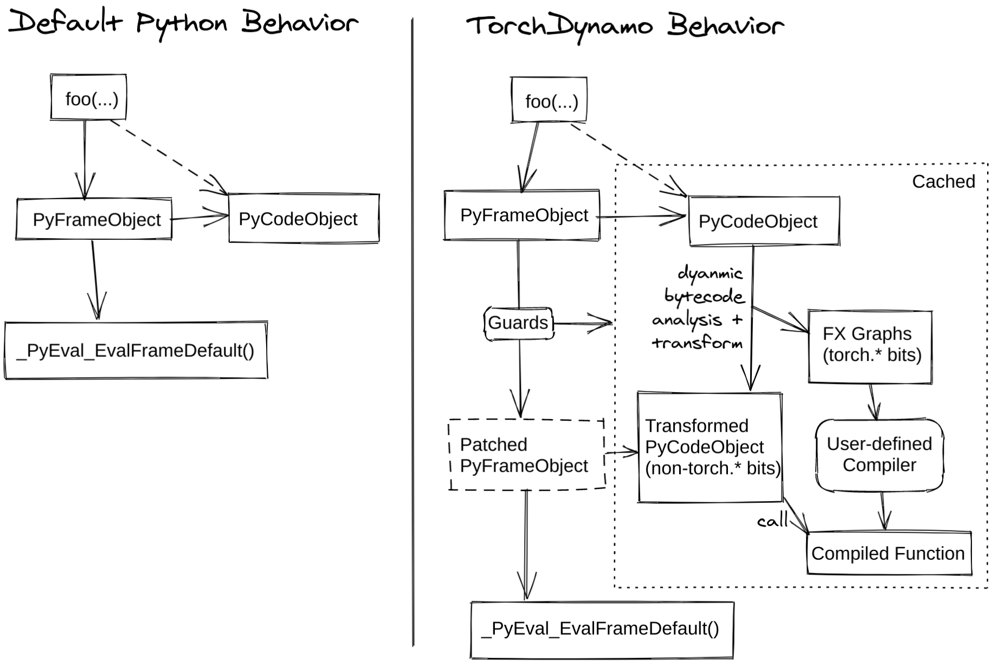

<div style="background:#e8f4fd;padding:14px 16px 10px 16px;border-radius:6px;margin-bottom:18px;">
<div style="text-align:center;margin-bottom:10px;">
<strong style="font-size:16px;color:#1a6ba0;">要点速览</strong>
</div>
<div style="font-size:14px;color:#3f3f3f;line-height:1.75;">
- <strong>字节码级追踪</strong>：TorchDynamo与torch.fx不同，它在Python虚拟机执行前拦截帧（frame），逐条解释字节码指令，将张量操作记录到计算图中<br><br>
- <strong>三栈模型</strong>：Python虚拟机维护调用栈、求值栈和块栈，Dynamo在每个栈的层面上模拟执行，实现对张量操作的精确追踪<br><br>
- <strong>Guard守卫机制</strong>：编译后的图通过Guard检查输入属性（shape/dtype/device）是否有变化：不变则复用缓存图，变化则触发重编译<br><br>
- <strong>Graph Break</strong>：遇到print() 或数据依赖的控制流等不支持的操作时，计算图被拆分为多个子图，控制权在Dynamo和解释器之间来回切换
</div>
</div>

---

# Torch内部解析（第二篇）- TorchDynamo

对于关注PyTorch 2.x编译生态的读者来说，torch.compile早已不是陌生的概念。但在这行简短的装饰器背后，具体的追踪机制是如何工作的？继上篇文章介绍了torch.fx的符号追踪后，本文深入PyTorch编译栈的另一个核心组件：TorchDynamo。

## Dynamo的不同之处

Dynamo是一个追踪器（tracer）：给定一个函数及其输入，它会执行该函数并记录一个**线性指令序列**（不含控制流）到计算图中。

与torch.fx使用Proxy对象的符号追踪不同，Dynamo通过**在字节码级别模拟Python虚拟机**来工作。这意味着它不需要像FX那样改写Python对象的行为，而是直接在PVM执行之前拿到函数的字节码，逐条解释。这种底层侵入式的设计让Dynamo能处理更复杂的Python代码模式。

## Python字节码基础

在理解Dynamo之前，我们需要先理解Python实际如何运行代码。Python将函数编译为**字节码**：这是供Python虚拟机（PVM）执行的低级指令序列。

当函数被调用时，Python会创建一个**帧（frame）**，其中包含了函数的完整执行上下文：

- 字节码指令本身
- 局部变量的绑定
- 全局变量的引用
- 求值栈（存放中间计算结果的临时数据）
- 块栈（跟踪循环、异常处理等控制流）

PVM维护三个独立的栈，各自承担不同的职责：

| 栈 | 用途 |
| --- | --- |
| 调用栈 | 跟踪活跃的函数调用。当 foo() 调用 bar() 时，bar 的新帧被压入栈顶。 |
| 求值栈 | 存储字节码执行期间的临时值。a + b 的过程：压入 a，压入 b，弹出两个值计算结果，再将结果压回栈。 |
| 块栈 | 跟踪活跃的控制流块，如循环、try/except、finally 和 with 语句。当控制流变化时（如 break、continue、异常或退出 with 块），它告诉 VM 该跳转到哪里。 |

## Dynamo如何捕获计算图


<span style="font-size:12px;color:rgb(153,153,153);">TorchDynamo的工作原理：在PVM执行前拦截帧，逐条解释字节码并记录FX图</span>

这张图揭示了Dynamo的核心机制。通常情况下，调用函数时Python创建一个帧并直接交给PVM执行。Dynamo在整个执行链路中**插入了一个拦截层**：在PVM即将执行帧之前，它有机会检查该帧的全部内容。

既然拿到了帧中的字节码、局部变量和求值栈数据，Dynamo就不再让Python立即执行字节码了。它逐条遍历每条指令，**维护求值栈的符号版本**，遇到张量操作时直接记录到FX图中。

这种基于字节码的追踪技术与FX的符号追踪有本质差异。FX需要替换Python对象（Proxy），迫使所有操作都经过代理对象来记录；而Dynamo在底层动手脚，不改变Python对象的原生行为，因此能处理更多边缘情况：比如带有副作用的内建函数、复杂的控制流等。

## Guard（守卫）

Dynamo捕获计算图后，通常将其交给Inductor后端进行算子下沉和优化。

但关键在于：**捕获一次后这张图能用多久？什么情况下它会失效，必须重新追踪？**

答案就是Guard。Guard是一个函数，它检查编译函数的输入属性的变化。如果Guard通过，缓存的计算图被直接复用；如果Guard失败，函数被重新编译。

```python
import torch

@torch.compile(backend=my_custom_compiler)
def foo(x, y):
    return (x + y) * x

foo(torch.randn(10), torch.ones(10))  # 首次编译
foo(torch.randn(10), torch.ones(10))  # 形状相同，复用缓存
foo(torch.randn(20), torch.ones(20))  # 形状变化，重新编译
foo(torch.randn(10, dtype=torch.float64), torch.ones(10, dtype=torch.float64))  # dtype 变化，重新编译
foo(torch.randn(10, device="cuda"), torch.ones(10, device="cuda"))  # device 变化，重新编译
```

函数的重新编译次数有上限。如果超过任一限制，Dynamo放弃尝试编译，直接以eager模式运行：这是**不编译的兜底策略**，防止每一次调用都触发重编译导致性能雪崩。

通常情况下，张量的dtype、device、shape等属性变化都会触发重新编译。

## Graph Break（图断裂）

当Dynamo遇到不支持的操作时，它会创建一个**图断裂**（graph break），将计算图拆分为几个它能处理的子图，同时将控制权交还给Python解释器。

```python
def foo(x):
    x = torch.relu(x)       # 被捕获到子图 1
    print("hello")          # 图断裂！Dynamo 无法捕获 print()
    x = torch.neg(x)        # 被捕获到子图 2
    return x
```

底层的执行流程是这样的：
1. torch.relu(x) 被捕获到子图1
2. print("hello") 造成图断裂：控制权还给解释器
3. torch.neg(x) 被捕获到子图2

图断裂的开销取决于发生位置。**每次断裂都意味着Dynamo必须挂起并等待解释器执行完毕，再把控制权拿回来**。这种来回切换是潜在的瓶颈，生产环境中的PyTorch模型如果频繁出现图断裂，编译带来的加速可能大打折扣。

常见的图断裂诱因包括：
- `if x.sum() > 0`：数据依赖的控制流，Dynamo无法在编译期预知条件结果
- `print()`、外部I/O、Python内建函数等Dynamo管不到的操作

---

<div style="background:#f5f0eb;padding:14px 16px 10px 16px;border-radius:6px;margin-bottom:16px;">
<div style="text-align:center;margin-bottom:8px;">
<strong style="font-size:15px;color:#8b6f4c;">结语</strong>
</div>
<div style="font-size:14px;color:#3f3f3f;line-height:1.75;">
TorchDynamo的技术路线在PyTorch 2.x中扮演了承上启下的角色：上接用户代码，下接Inductor等后端优化器。与torch.fx的符号追踪相比，字节码级别的拦截显然覆盖了更广的Python语法范围，这解释了为什么torch.compile在面对复杂Python代码时仍然有效。<br><br>
但Guard和Graph Break的权衡也揭示了编译策略的固有限制：每一次Graph Break都在削弱编译的收益，而过度频繁的重编译又会让编译器得不偿失。在PyTorch 2.x的生态中，编写"编译器友好"的代码正在成为一项新的工程能力。
</div>
</div>

---

<span style="font-size:14px;color:#888888;font-family:'Courier New',monospace;">【传送门】<br>
<a class="normal_text_link mp_article_text_link" href="https://mp.weixin.qq.com/s/qcIFzXsBalSGpca5fzJKxg" target="_blank" data-linktype="2">Claude Code动态Workflow Vs. SubAgent Vs. Skill</a><br>
<a class="normal_text_link mp_article_text_link" href="https://mp.weixin.qq.com/s/aiJs5CC8Gb6qa_xDRNEjTA" target="_blank" data-linktype="2">Dynamic Subagents：用代码编排Agents，告别逐轮工具调用</a><br>
<a class="normal_text_link mp_article_text_link" href="https://mp.weixin.qq.com/s/mFuUJ79DRodIK6shVWOgpw" target="_blank" data-linktype="2">OpenAI GPT-5.6: 安全之外新增Prompt Cache断点+两种推理模式; 放弃版本号</a><br>
<a class="normal_text_link mp_article_text_link" href="https://mp.weixin.qq.com/s/xP1cEoO_plRpWItxhqeQnQ" target="_blank" data-linktype="2">Agent Harness Engineering：为什么Agent可靠性的天花板不是模型，而是基...</a><br>
<a class="normal_text_link mp_article_text_link" href="https://mp.weixin.qq.com/s/o6pnSWW01pahFQelJSbSPA" target="_blank" data-linktype="2">华为「韬定律」全解析：从 τ 常数到4GHz麒麟，一张时间表看清未来十年芯片路线</a><br>
<a class="normal_text_link mp_article_text_link" href="https://mp.weixin.qq.com/s/PLNx54PxO1A0oYc47hz99g" target="_blank" data-linktype="2">Anthropic三连：Claude Opus 4.8-更聪明+诚实；CC动态工作流+算力控制</a><br>
<a class="normal_text_link mp_article_text_link" href="https://mp.weixin.qq.com/s/Pdjz39WG9SS6IpWWAJ6pPw" target="_blank" data-linktype="2">Claude Opus 4.8击败Opus 4.7、GPT-5.5和Gemini 3.1 Pro</a><br>
<a class="normal_text_link mp_article_text_link" href="https://mp.weixin.qq.com/s/oDZJbvskv_ocNgPUH1DHVA" target="_blank" data-linktype="2">AI暗输出：为何AI价值在GDP统计中失效了</a><br>
</span>

---

<span style="font-size:12px;color:#888888;font-family:'Courier New',monospace;">参考：https://jino-rohit.github.io/blogs/13_dynamo.html</span>
