

<strong style="font-size:16px;color:#1a6ba0;">要点速览</strong>

- <strong>外卖公司造出万亿参数大模型</strong>：美团LongCat Lab（原"光年之外"团队）发布了LongCat 2.0，一个1.6T参数的模型，完全在华为国产910C芯片上训练，Terminal Bench 2达到70.8%  
- <strong>华为CloudMatrix 384正面挑战NVL72</strong>：384个NPU的单扩展域（vs NVL72的72个GPU），BF16计算量接近翻倍，内存容量超3.6倍：代价是功耗高出4.1倍  
- <strong>UB-Mesh统一互联取代NVLink + PCIe混合栈</strong>：华为开源的内存语义互联协议，支持384 NPU + 192 CPU的P2P全互联，节点间带宽退化低于3%  
- <strong>N+1备用NPU + 自动愈合架构</strong>：每机架一个备用NPU，路由系统支持快速故障恢复，让大量低性能组件也能可靠训练

---

**美团LongCat Lab发布LongCat 2.0，一个完全在华为Ascend 910C芯片上训练的1.6万亿参数模型**：这一消息在AI社区引发了不小的震动。但比模型本身更值得关注的，是这件事折射出的两个深层次故事：一个外卖巨头为什么要自建前沿AI实验室？华为又如何用一套"低配硬件的并行集群"做出了比肩Nvidia旗舰系统的算力？

先说美团。想象一下把Uber Eats、DoorDash、Yelp、Groupon、TripAdvisor全部塞进一个App，那就是美团的日常：中国最大的生活方式超级应用。用户在同一界面里订外卖、骑共享单车、买电影票、订酒店、抢美发团购券。而超级应用的超能力来自AI：用户只需告诉原生助手"小美"预算和位置，AI就能在7亿实时商家库存和13亿用户评论中完成交叉检索，自主完成决策。

**AI对美团不是可选项，是生存必需品。** 在阿里巴巴、京东、字节跳动等超级应用对手环伺的战场，谁先让AI帮用户自动驾驶日常生活，谁就能拿走每年数百亿的增量收入。美团的逻辑与Meta完全一致：LLM层太重要了，必须自己掌握。

LongCat Lab的诞生本身就是一个充满戏剧性的故事。2023年初，ChatGPT发布后不久，美团联合创始人王慧文自掏腰包5000万美元创立"光年之外"，立志打造"中国的OpenAI"，吸引了包括CEO王兴在内的多位美团元老投资。他开启了中国AI实验室追逐OpenAI、Anthropic的浪潮（DeepSeek、Moonshot、Z AI均在此列）。可惜压力太大，到2023年6月王慧文因心理健康问题退出，美团出手收购了这家实验室。

**今天回头看，那笔收购是一笔超值的投资。** 团队虽然不完全一样，但王慧文奠定的基础催生了LongCat 2.0：一个1.6T参数、60%+ 基准测试成绩的模型，而且是完全在中国国产芯片上训练出来的。这在训练大模型越来越难的今天，本身就是一次宣言。

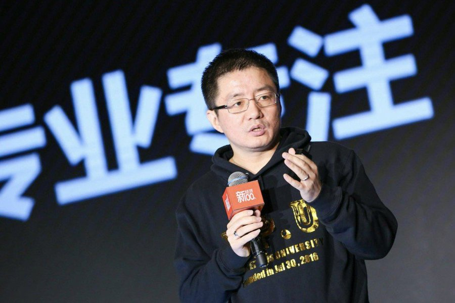
美团LongCat从Nvidia NVL72"跳"向华为CloudMatrix 384

LongCat 2.0最大的亮点不是参数规模：DeepSeek V4 Pro也是1.6T，Moonshot据说也有1T参数模型。真正的新意在于：**这是第一个公开已知完全在华为Ascend 910C上训练的模型，只用了5万颗ASIC。**

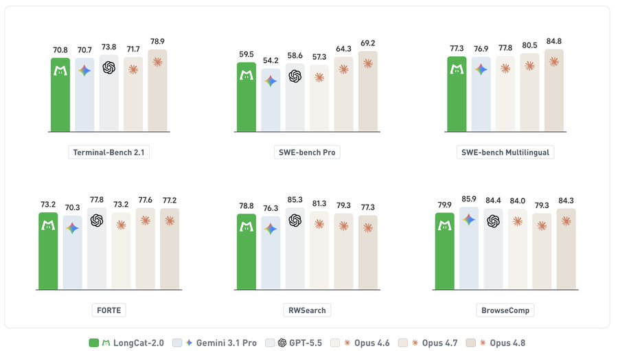
LongCat Benchmark成绩对比

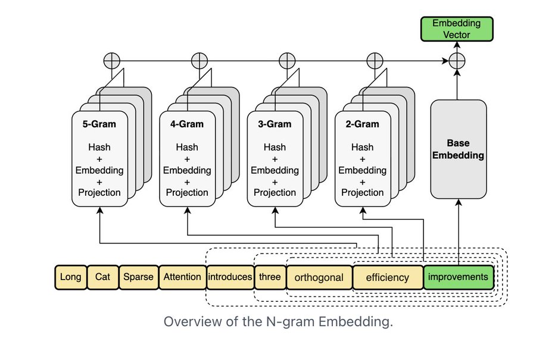
Terminal Bench基准测试结果

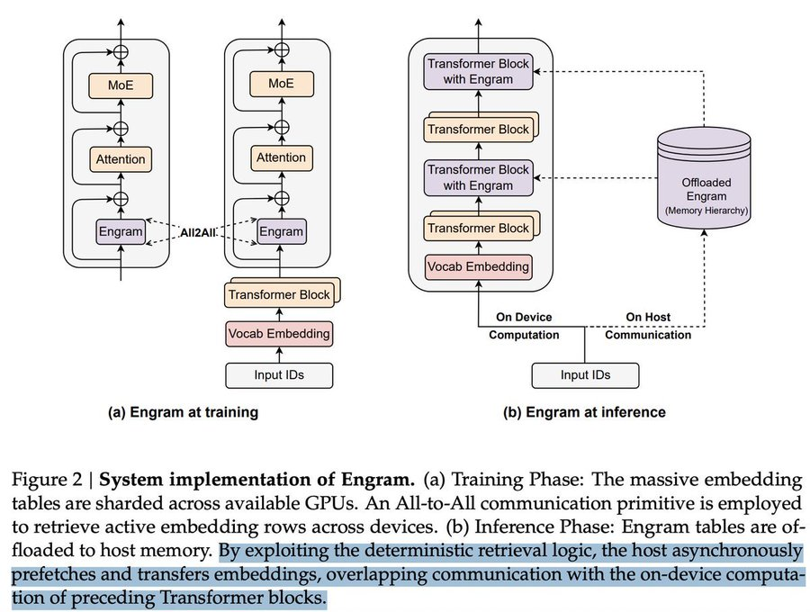
LongCat 2.0在多个基准上的表现

据SemiAnalysis的分析，华为存够了160万颗910C芯片的零部件。5万颗就能训出一个1.6T模型，160万颗意味着什么不言而喻。而且中芯国际还在基于7nm节点为华为持续供货：逻辑芯片不是瓶颈。

但华为Ascend 910C的纸面参数其实不算亮眼：128GB HBRAM、3.2TB/s带宽。对比Nvidia B200的192GB HBM/8TB/s带宽、B300更是到了288GB/22TB/s。单芯片完全不在一个级别。

**华为的破局之道，不在单芯片，在集群体系结构。**

Nvidia NVL72用72个GPU组成一个单扩展域：任何GPU都可以直接访问其他GPU的HBM，铜缆背板连接，低延迟高带宽。这是一台"巨型GPU"。

华为CloudMatrix 384的思路完全不同：**用384个NPU组成一个单扩展域。** 每个Ascend 910C单芯片确实降级，但把384颗拼在一起，总BF16算力达到300 PFLOPs：几乎是GB200 NVL72的两倍！聚合内存容量超3.6倍，内存带宽超2.1倍。

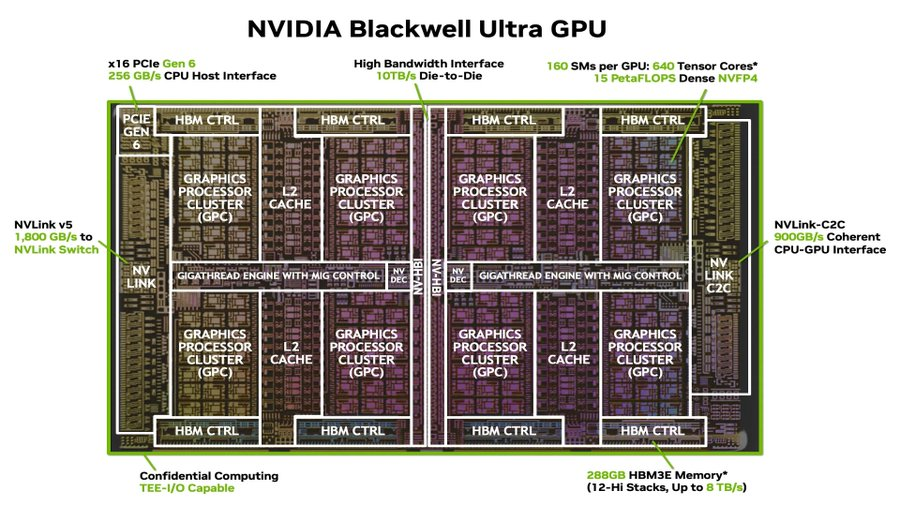
NVL72 vs CloudMatrix 384规格对比

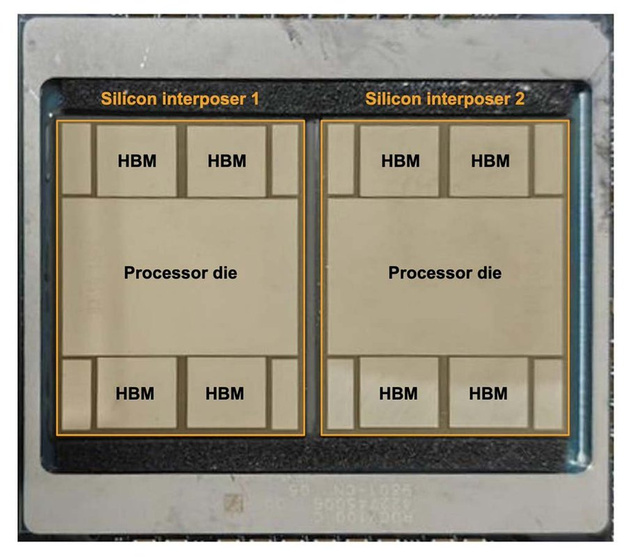
NVL72 vs CloudMatrix 384详细参数对比

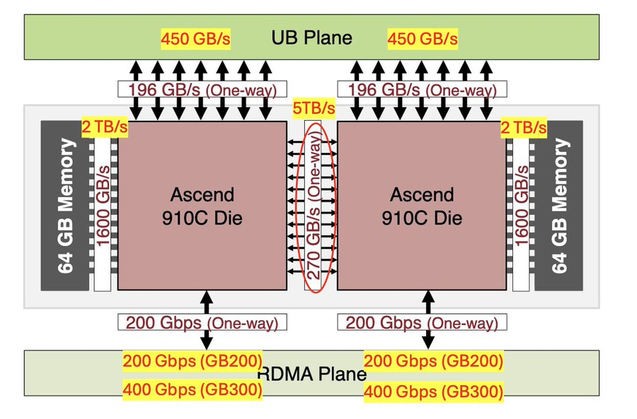
不同GPU/NPU集群性能映射

**代价也是巨大的：功耗是NVL72的4.1倍。** 每FLOP功耗差2.5倍，每TB/s内存带宽功耗差1.9倍。但对中国来说，电力是国内供应链，光通信和网络设备也是：这是一笔可控的成本。

支撑这套系统的核心是 **UB-Mesh**：华为开源的统一互联协议。它被设计用来取代目前数据中心中PCIe、NVLink、TCP/IP的"混合"方案，统一为内存语义（load/store/atomic）的互联结构。在CloudMatrix 384中，384个NPU和192个鲲鹏CPU通过UB交换机全互连，节点间带宽退化低于3%，延迟增加不到1微秒。

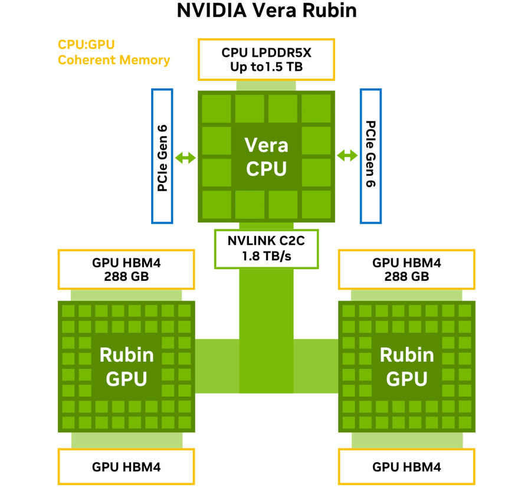
UB-Mesh互联架构拓扑

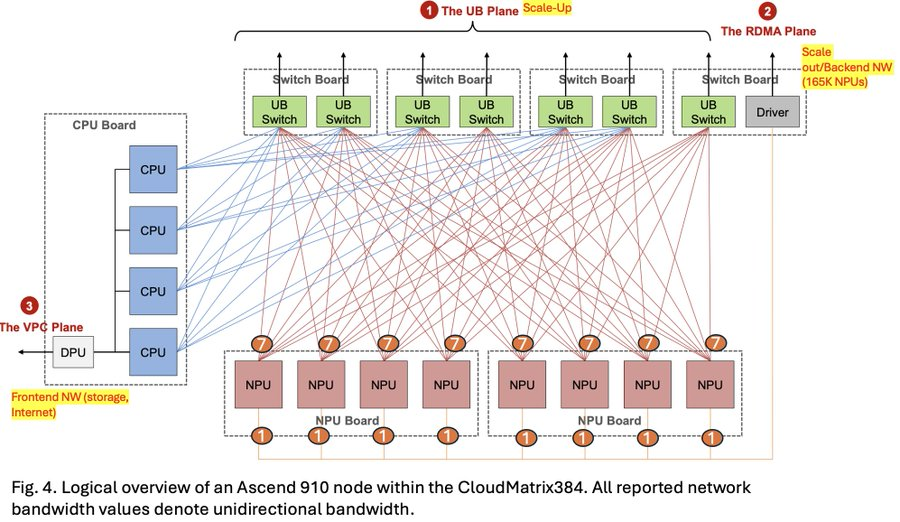
CloudMatrix 384内部互联结构

**更值得关注的是内存池化。** CloudMatrix 384把所有192个CPU的DRAM聚合为一个共享高性能内存池，384个NPU中的任何一个都可以通过UB网络以统一带宽和延迟访问。这彻底改变了一个关键瓶颈：传统架构中KV缓存必须路由到持有它的节点，否则远程访问太慢。在CloudMatrix中，任何NPU都可以从共享池直接拉取数据，请求调度完全与数据位置解耦。

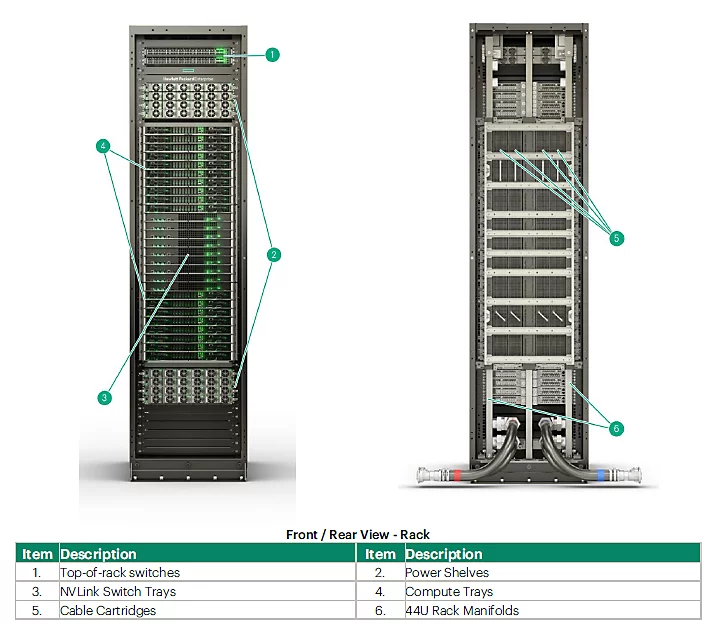
内存池化架构示意

来源：SemiAnalysis CloudMatrix 384分析

好处是三重：消除了传统架构中DRAM利用率低下的孤岛问题；简化了调度（不需要缓存感知路由）；显著提高了突发工作负载下的缓存命中率。**这几乎是每个做KV缓存优化的人梦寐以求的能力：Nvidia生态系统中还需要通过SGLang HiCache + Mooncake等软件层实现，华为已经在硬件层面内置了。**

另一个巧妙的设计是 **N+1容错**：每个机架有一个备用NPU。当NPU故障时自动激活恢复训练。路由系统还支持链路故障的快速自动愈合。这使得华为可以在系统中大量使用"低性能"组件而不牺牲可靠性：因为他们的系统组件数是Nvidia等效系统的数倍，故障是必然的，关键是如何从故障中恢复。

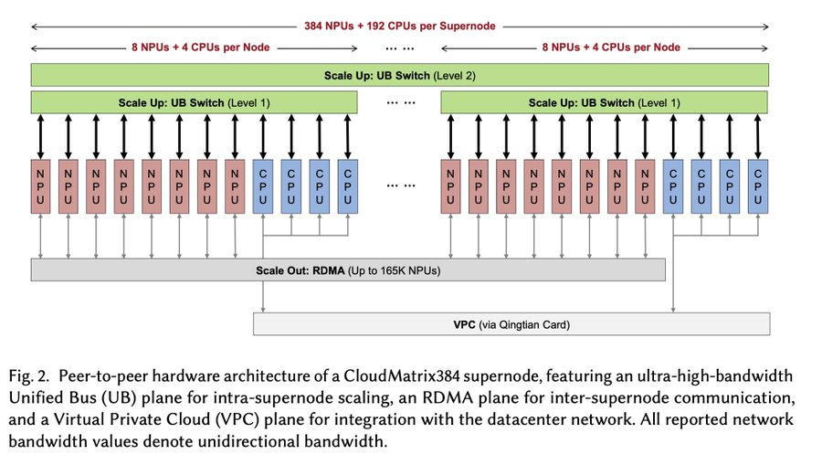
N+1容错机制示意

**LongCat团队自己也做了一个同样精妙的设计。** 受DeepSeek Engram方法的启发（用CPU内存换取ASIC计算和HBM），他们添加了一个N-gram Embedding模块，将嵌入空间扩展了约100倍。通过保存n-gram token组合来捕获更丰富的局部上下文，代价是多用了一些CPU DRAM，但省下了更宝贵的ASIC FLOPs和HBM带宽。公平地说，LongCat的论文《LongCat Flash》在DeepSeek Engram发布仅两周后就发表了，且关键设计有显著差异：很可能是独立发明。

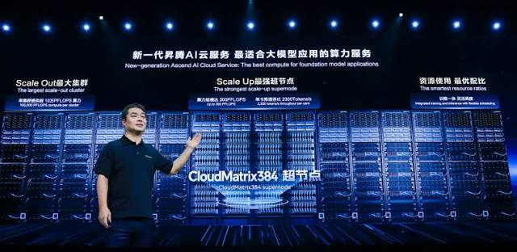
LongCat Flash N-gram嵌入架构

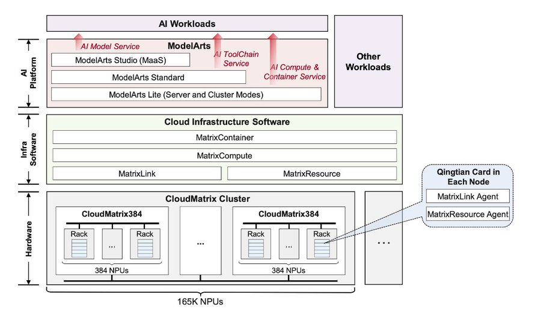
N-gram模块与标准架构对比

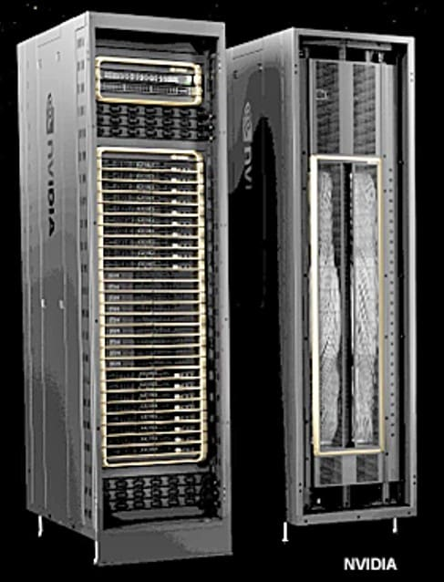
预热策略效果对比

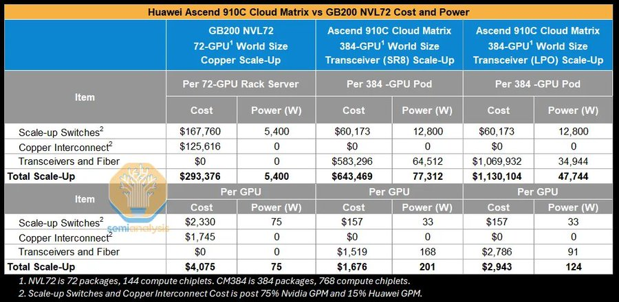
处理流水线示意

这背后反映的是一个更宏大的趋势：**整个中国AI生态系统已经达到了"逃逸速度"。** DeepSeek的MLA、DSA、CSA、HCA等技术被广泛采用：比如CSA和HCA将KV缓存的HBM需求减少98%，DSpark将解码阶段带宽需求减少66%。长鑫存储正在突破HBM3，长江存储提供了"足够好"的NAND。从芯片到互联到内存到模型架构，所有关键环节都开始有了国产替代方案。

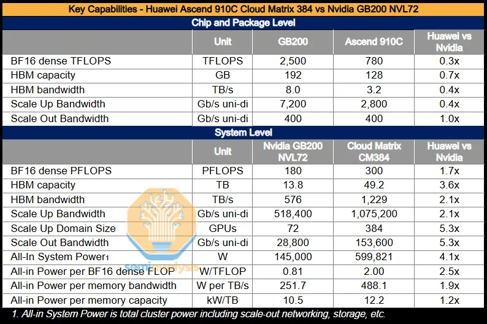
中国AI生态供应链全景

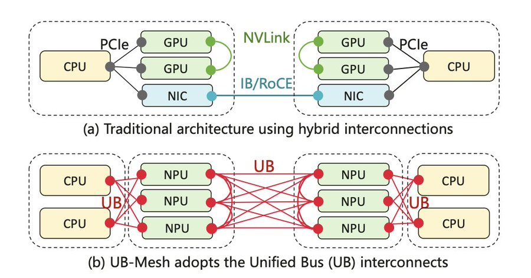
中国芯片产业链布局

**一个外卖公司做出了一流的基础模型。** 如果Uber或Doordash不造模型，为什么美团要？答案是：中国有微信、支付宝、抖音、淘宝这样的超级应用：西方还没有见过这种东西。AI让这些超级应用变得更强大，帮助用户自动驾驶日常生活。不能掌控LLM层的公司，在这个赛道上连参赛资格都没有。

而对于华为来说，他们正在证明一件事：**出口管制不是不可逾越的天花板。** 用更多芯片、更先进的互联、更聪明的架构设计，可以用"低配组件"做出"超配系统"。CloudMatrix 384不是Nvl72的替代品：两者根本就是不同哲学下的产物。

---

<strong style="font-size:15px;color:#8b6f4c;">结语</strong>

华为CloudMatrix 384不等于Nvl72，它不是"对标品"而是"替代方案"：用系统工程的思维，在单芯片性能被限制的条件下从集群层面找突破。这种思路本身就给整个行业提了一个问题：当电力不再是约束时，"更多但更弱"的方案是否比"更少但更强"更有工程优势？  
LongCat Lab的出现也值得深思。当一家外卖公司都开始训练1.6T参数的模型，说明AI竞争已经从"技术赛道"变成了"生存赛道"：不上船，就会出局。下一个"意想不到的选手"会是谁？高德？货拉拉？还是携程？  
最后，华为把UB-Mesh开源这件事值得单独提一笔。内存语义互联如果成为行业标准，整个数据中心的网络架构都将重新洗牌。这不是一个"国产平替"的故事：这是一场互联革命的前奏。

---

参考：https://x.com/bookwormengr/status/2072421710692028900
