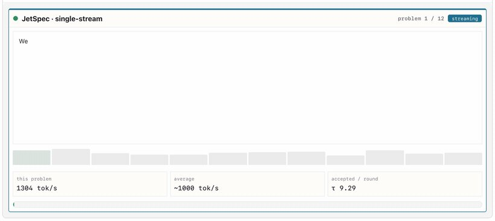
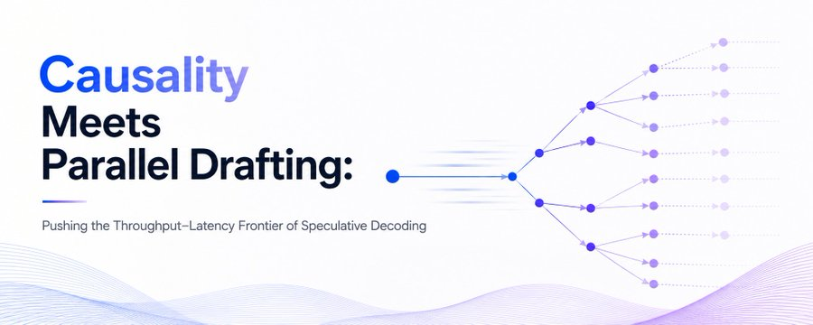
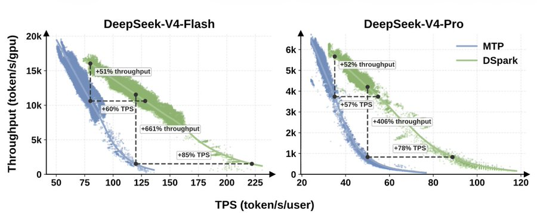
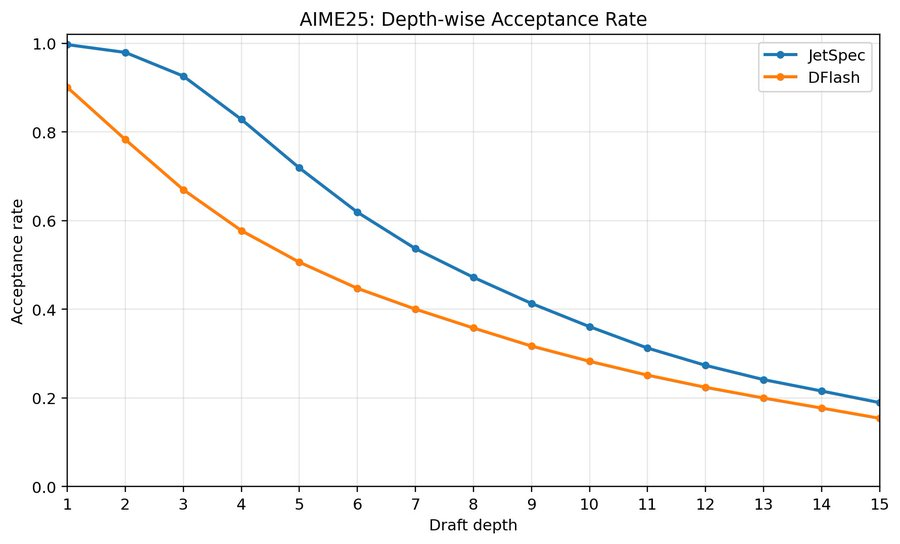
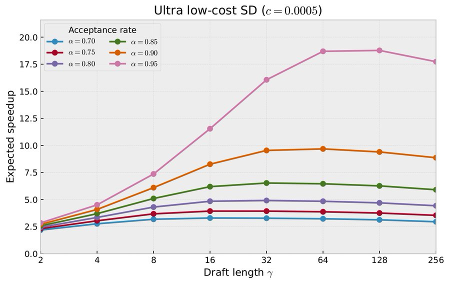

<strong style="font-size:16px;color:#1a6ba0;">要点速览</strong>

- <strong>同一个瓶颈</strong>：DSpark与JetSpec几乎同时出现，都瞄准「起草变便宜后，并行提议如何通过验证」这一因果一致性难题。  
- <strong>两端切入</strong>：DSpark面向高并发服务，用因果循环状态把接受长度从DFlash的4.07提到5.01；JetSpec面向低延迟，把草稿预算变成更长接受前缀，从7.23扩到9.82。  
- <strong>天然互补</strong>：JetSpec强化低延迟预算扩展的并行起草主干，DSpark补上高并发的串行置信度检查与预算控制，两者可以合进同一套动态服务框架。

---

## 推测解码的因果之争

推测解码（Speculative Decoding，SD）这两年突然扎堆出现。它的核心idea很简单：让一个轻量的草稿模型先提出未来的一串token，目标模型再并行验证它们，从而加速自回归生成。但方法一多，问题就来了：DSpark和JetSpec，到底哪个更好？或者更本质一点，它们其实是互补的？

DSpark与JetSpec：从吞吐量与延迟这两个互补侧面切入推测解码

## 1. 因果性成了关键杠杆

像EAGLE系列这样的传统草稿器，靠自回归生成来维持草稿质量，代价是更长的草稿需要更多串行步骤。DFlash改变了成本结构：用轻量的块并行（block-parallel）草稿器一次性预测多个未来位置，把起草成本压到很低。

但便宜的起草只是上半场。一旦起草便宜了，瓶颈就转移到并行提议能不能通过验证。当未来位置对更早的草稿token只是弱条件依赖时，它们在孤立看都很合理，串成序列后却会变得不一致。**这正是因果性（causality）变得重要的地方。**

DSpark保留了便宜的并行起草主干，同时加了一个轻量的串行头和置信度估计，用来判断哪些提议该送去验证，从而控制每个请求的算力预算。结果，相比MTP风格纯自回归起草（更长的草稿意味着更多串行步骤），DSpark持续拉高了吞吐量。

图1（来自DSpark论文）：高并发场景下DSpark吞吐量与TPS的关系，相对MTP-1基线改善了观测到的吞吐-延迟前沿

反过来，在低并发、延迟敏感的服务等级目标（SLO）下，系统手里有更充裕的FLOPs，目标变成最大化每一步验证的接受率。这时可以多砸算力在起草上来抬接受率，并在更深的位置保持高接受度。**这正是JetSpec式因果并行起草的用武之地**：草稿预算被用来生成路径条件化的树（path-conditioned tree），更可能产出长的接受前缀。

图2：低并发下JetSpec在Qwen3-8B、MATH-500、单张B200 GPU上的TPS/用户，在各类编程和数学任务上把接受长度推高到10-11倍

## 2. 因果性怎么帮忙

起草便宜之后，下一个问题是有限的算力该往哪花：高并发下榨更多吞吐量，还是每个请求有更多FLOPs时压低延迟？因果性就是这里的杠杆。

**推动吞吐量极限：DSpark做预算感知校正。** DSpark面向高并发、预算受限的场景，用一个轻量的类马尔可夫校正头和置信度头（或携带跨位置循环前缀状态的RNN头变体）。对每个草稿位置i，并行草稿器先产出基础logits z_i^0和草稿隐藏状态h_i，置信度头再估计前缀依赖的置信度分数c_i。马尔可夫头从前一个草稿token注入一个小的因果校正，验证预算则只保留预算B和阈值 ρ 下最长的置信前缀。这让草稿主干保持并行，校正路径只负责改善局部或前缀依赖的一致性。

**推动延迟极限：JetSpec把草稿预算变成更高接受率。** 低并发下现代AI加速器有更多闲置FLOPs，关键问题就变成如何把更高的计算预算转化为每一步更多的接受token。JetSpec用因果并行草稿头生成路径条件化的草稿树，更深的节点取决于同一分支上更早的token。按深度的接受度剖面（图4）显示，无论编程还是数学推理负载，JetSpec都持续压过DFlash。

图3：AIME25上DFlash与JetSpec按位置的逐深度接受率，JetSpec在深度8处仍保持约50%接受率

在AIME25上，JetSpec在草稿深度1时逐位置接受率接近完美（q_1约99%），到深度8仍维持约50%（q_8约50%），其中q_i表示至少前i个草稿token被接受的概率。经验接受长度定义为 τ_emp = 1 + Σ_{i=1}^{γ} q_i。在恒定每token接受率的假设下，理论接受长度 τ(α, γ) = 1 + α + α² + ⋯ + α^γ = (1 − α^{γ+1}) / (1 − α)。通过拟合理论与经验接受长度得到有效每token接受率约93%，显著高于DFlash。

**哪怕每token接受率只涨5%，在低成本、高接受的区间也会带来超比例的影响**：它显著抬升最大理论接受长度（图4），进而直接压低生成延迟。

图4：在不同每token起草成本和接受率下，预期SD加速随草稿长度变化的函数，0.85与0.95的接受率差距被显著放大

## 3. 两者互补，而非二选一

一个可以预见的方向，是构建动态服务框架，同时推动吞吐-延迟帕累托前沿的两端：低并发要更高每用户TPS，高并发要在紧验证预算下保住更高总体吞吐量。

在这个方向上，JetSpec与DSpark天然互补：JetSpec强化面向低延迟预算扩展的并行起草主干，DSpark则为高并发服务补上轻量的串行置信度检查和预算控制。**取舍的关键不是「谁更好」，而是「当前处在吞吐还是延迟的哪一端」。**

<strong style="font-size:15px;color:#8b6f4c;">结语</strong>

两项工作几乎同时收敛到「因果性」上，说明下一代推测解码的竞争焦点已经从「怎么把草稿写得更便宜」，转向「怎么让并行草稿在验证端活下来」。  
DSpark和JetSpec不是路线之争，而是同一前沿的两个侧面，一个吃高并发的吞吐红利，一个吃低延迟的预算红利。  
真正的下一站大概率是把两套机制合进一个能按负载动态切换的服务框架，让吞吐和延迟不再二选一。

---

【传送门】 
<a class="normal_text_link mp_article_text_link" href="https://mp.weixin.qq.com/s/iVe2e5xiOCTUOaEiqpnZyw" target="_blank" data-linktype="2">本周值得看的10篇AI论文：Agent编译让速度提升10倍；PAPO - 过程对齐策略优化</a> 
<a class="normal_text_link mp_article_text_link" href="https://mp.weixin.qq.com/s/Vn6IytoT8knZhQF-vLcGLg" target="_blank" data-linktype="2">Claude Code Workflow深度技术洞察：DAG不再由人画</a> 
<a class="normal_text_link mp_article_text_link" href="https://mp.weixin.qq.com/s/2OmwXVHkBKsN0nm0N6aAKA" target="_blank" data-linktype="2">深度拆解OpenAI ChatGPT记忆Dreaming：和你想的不一样</a> 
<a class="normal_text_link mp_article_text_link" href="https://mp.weixin.qq.com/s/lVZUh5t0nbY5ni1RaDOVAQ" target="_blank" data-linktype="2">AI Agent的钱都花在哪了？首篇Token消耗系统性研究深入解读</a> 
<a class="normal_text_link mp_article_text_link" href="https://mp.weixin.qq.com/s/pCRjhls1WFaiRglb2MtjBw" target="_blank" data-linktype="2">蚂蚁CausalMix: 将数据混合从超参搜索转换成因果推断</a> 
<a class="normal_text_link mp_article_text_link" href="https://mp.weixin.qq.com/s/0zKdjRmWg3TbL5Y3HGO3fA" target="_blank" data-linktype="2">从P/D分离到A/F分离：从学术原型变成行业标准</a> 
<a class="normal_text_link mp_article_text_link" href="https://mp.weixin.qq.com/s/crfkhSIuMZJxjNA0Md8dXw" target="_blank" data-linktype="2">李飞飞：世界模型的功能分类</a> 
<a class="normal_text_link mp_article_text_link" href="https://mp.weixin.qq.com/s/mqTab0qwrT95DVrxTllmcQ" target="_blank" data-linktype="2">Torch解析系列一：深入理解FX Graphs</a> 

---

参考：https://x.com/haoailab/status/2072472882014486610
