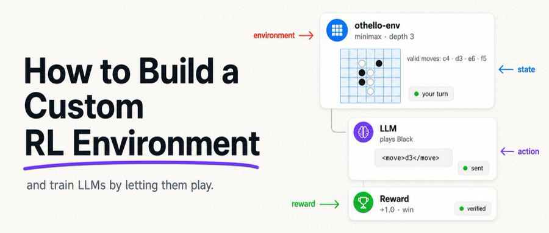
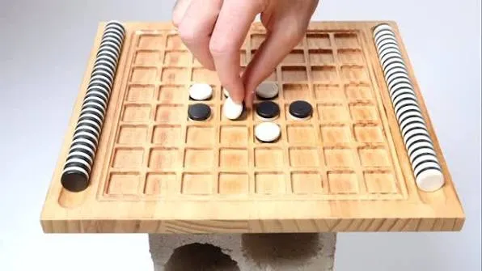
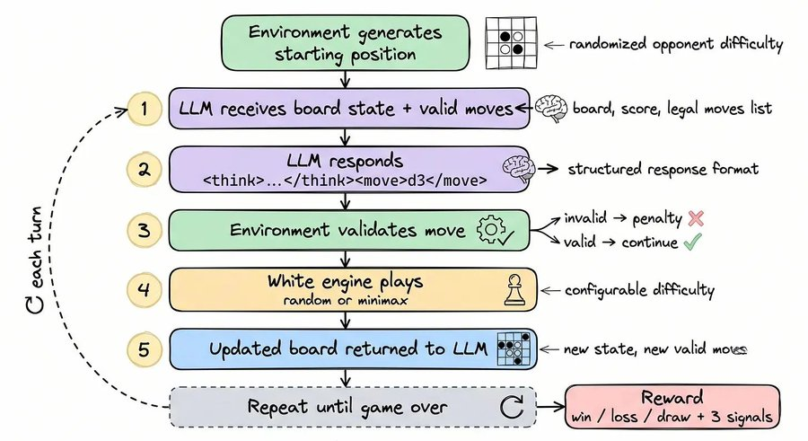
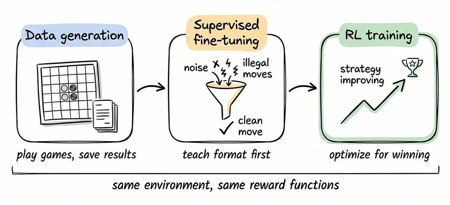
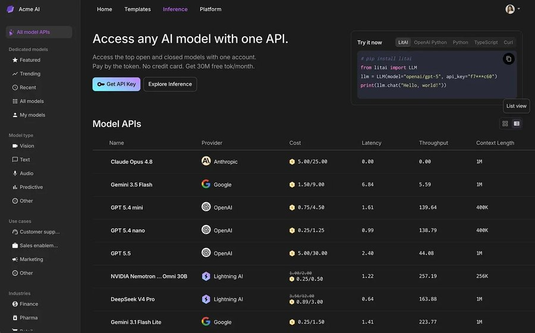

<div style="background:#e8f4fd;padding:14px 16px 10px 16px;border-radius:6px;margin-bottom:18px;">
<div style="text-align:center;margin-bottom:10px;">
<strong style="font-size:16px;color:#1a6ba0;">要点速览</strong>
</div>
<div style="font-size:14px;color:#3f3f3f;line-height:1.75;">
- <strong>把棋变成 MDP</strong>：教 LLM 下奥赛罗，本质是给它套上「状态、动作、奖励、环境」这套强化学习四件套，让每一步落子都能拿到一个分数。<br><br>
- <strong>框架是 Verifiers</strong>：它负责定义环境、跑回合循环、处理评估；推理端用 Lightning AI 的 OpenAI 兼容接口，本地权重则交给 vLLM 托管。<br><br>
- <strong>奖励是组合出来的</strong>：胜负结果、棋子优势（部分给分）、格式合规、非法走法惩罚四项相加，并给惩罚设上限，避免一局崩盘淹没全部正确决策。<br><br>
- <strong>同一套骨架能迁移</strong>：把状态渲染、动作解析、响应引擎、奖励函数换成你自己的领域逻辑，就能把这套 RL 环境改造成任何多轮任务训练器。
</div>
</div>


<span style="font-size:12px;color:rgb(153,153,153);">奥赛罗棋的 RL 环境：黑棋每落一子，环境判定合法性、推进棋盘、由对手引擎应招，再返回一个可量化的奖励</span>

用强化学习教一个大语言模型学会下棋，听起来很玄，其实拆开就四件事：模型在某一刻看到了什么、它基于这个看到的东西做了什么选择、这个选择有多好、以及那个「看到的东西和好坏反馈」到底由谁提供。把棋局装进这套结构，模型就能像学走路一样，在无数次试错里慢慢变强。

## 四个核心概念：状态、动作、奖励、环境

State 是模型此刻看到的局面。Action 是它基于这个局面做出的选择。Reward 是一个说明这个选择有多好的数字。Environment 则是那个持有状态、接收动作、并返回奖励的东西。


<span style="font-size:12px;color:rgb(153,153,153);">强化学习的 Markov 决策过程：状态经动作进入环境，环境返回新状态与奖励，闭环驱动模型学习</span>


<span style="font-size:12px;color:rgb(153,153,153);">把奥赛罗棋局映射为 MDP 的示意：棋盘即状态，落子即动作，胜负与盘面即奖励信号</span>

## 为什么选奥赛罗：一个干净的 RL 试验场

奥赛罗（黑白棋）是个理想的教学环境。规则简单、合法走法有限、胜负判定明确，却又足够深，能逼出模型对局面的判断。它不像真实业务那样充满噪声，所以特别适合先把 RL 的整条链路跑通。


<span style="font-size:12px;color:rgb(153,153,153);">奥赛罗棋盘的可视化：八乘八格、黑棋与白棋的攻防，状态空间紧凑但策略不浅</span>


<span style="font-size:12px;color:rgb(153,153,153);">用 Verifiers 框架把奥赛罗封装成可训练环境的整体结构</span>

## 技术栈：Verifiers + Lightning AI + vLLM

整套环境跑在三层之上。Verifiers 是 RL 框架，它定义环境、运行回合循环、并处理评估。Lightning AI 提供一个 OpenAI 兼容的推理接口，于是同一份代码可以调用 Claude 或 DeepSeek 这类托管模型，不需要为不同供应商重写。vLLM 则在那个同样的 OpenAI 兼容端点后面，于本地提供开放权重模型。三者通过统一接口咬合，换模型只是换一行配置。

## 游戏循环：环境如何响应模型

核心是一个多轮环境类。模型吐出一段文本，环境先解析出它想走的棋；如果这步不合法，就扣分并让它留在同一回合重试，而不是报错中断。合法落子后，若棋局未结束，内置对手引擎替白棋走一步，再把新棋盘渲染回去交给模型。


<span style="font-size:12px;color:rgb(153,153,153);">env_response 的回合执行流：解析动作→校验→应用→对手应招→渲染新状态</span>


<span style="font-size:12px;color:rgb(153,153,153);">多轮环境（MultiTurnEnv）在一次对话里反复调用模型，直到任务结束或触发上限</span>

```python
class OthelloEnv(MultiTurnEnv):
    def env_response(self, model_output, state):
        move = parse_move(model_output)

        if not is_valid(move, state.board):
            state.penalty += INVALID_MOVE_PENALTY
            return error_message(move), state          # 同一回合，重试

        state.board = apply_move(state.board, move, player="black")

        if not game_over(state.board):
            white_move = opponent_engine(state.board, state.difficulty)
            state.board = apply_move(state.board, white_move, player="white")

        return render_board(state.board), state
```

## 内置对手引擎：随机与极小化极大

内置对手有两种模式。随机模式从所有合法走法里随便选一个，训练早期很有用，因为模型只要做出合理决策就能赢。极小化极大（Minimax）则向前模拟未来的走法，依据角点控制、棋盘位置和可用走法给每个结果局面打分，选出最坏情况下结果最好的那一步。Depth-3 意味着它向前看三步，足以设下陷阱、躲开明显的昏招。


<span style="font-size:12px;color:rgb(153,153,153);">随机对手（左）与 Minimax 对手（右）对模型训练难度的影响对比</span>

```python
def opponent_engine(board, randomness, depth):
    if random.random() < randomness:               # 随机模式
        return random.choice(legal_moves(board))

    best_move = None                                 # minimax 模式：尝试每一步
    best_score = float("-inf")                       # 保留得分最高的那一步

    for move in legal_moves(board):
        score = minimax(apply_move(board, move), depth - 1, my_turn=False)
        if score > best_score:
            best_move, best_score = move, score

    return best_move
```

## 奖励函数：结果、部分给分、格式、惩罚

奖励是拼出来的。最直观的是胜负：模型执黑，赢了给 1.0，平局 0.5，输或没下完 0.0。但只靠终局胜负，模型在学会赢之前几乎拿不到任何梯度。


<span style="font-size:12px;color:rgb(153,153,153);">奖励函数的四项构成：胜负、棋子优势、格式合规、非法走法惩罚</span>

```python
def win_reward_func(state):
    result = state.get("result")
    if result == "black":   # 模型执黑
        return 1.0
    if result == "draw":
        return 0.5
    return 0.0              # 输，或棋局始终没结束
```

```python
def total_reward(state):
    return (
        win_loss_score(state)
        + piece_advantage(state)
        + format_compliance(state)
        - invalid_move_penalty(state)
    )
```

棋子优势能把一场惜败和一场溃败区分开，让模型在它开始赢棋之前就拿到梯度。格式合规占的权重很低，所以干净的格式永远压不过好的棋力。非法走法的惩罚是有上限的，这样一局崩掉的棋不会淹没掉模型做对的所有事情。

## 组装起来：加载环境

把前面这些零件接到一个加载函数里：生成棋局数据集、用 XMLParser 解析模型输出的「思考」和「落子」两个字段、再用一个带权重的 Rubric 把奖励函数组合起来。


<span style="font-size:12px;color:rgb(153,153,153);">load_environment 把数据集、解析器、奖励 Rubric 三者组装成一个可运行环境</span>

```python
def load_environment(min_random_move_prob, max_random_move_prob, parse_think):
    dataset = generate_games(min_random_move_prob, max_random_move_prob)
    parser = XMLParser(fields=["think", "move"])
    rubric = Rubric(funcs=[...], weights=[1.0, 1.0, 0.2, 1.0])
    return OthelloEnv(dataset, parser, rubric)
```

## 数据说了什么

用一个托管模型跑评估，先看它在不同时对手强度下的表现。下面是调用示例：用 openai/gpt-4.1，跑 100 局，对手完全走 Minimax 且深度为 3。


<span style="font-size:12px;color:rgb(153,153,153);">在固定 Minimax 深度对手下的胜率/平均得分等评估曲线</span>

```bash
prime eval run othello -m openai/gpt-4.1 -n 100 \
  -a '{"min_random_move_prob": 0.0, "max_random_move_prob": 0.0, "minimax_depth": 3}'
```

## 从评估到训练

评估跑通后，把对局数据存到 HuggingFace 数据集，就能进入真正的训练循环：对一批 prompt 各自做多次 rollout，用总奖励算相对这一组的优势，再据优势更新模型。这正是 GRPO 这类组相对策略优化的核心思路。


<span style="font-size:12px;color:rgb(153,153,153);">从单局评估扩展到批量 rollout 与组相对优势计算的训练流程</span>

```bash
prime eval run othello -m openai/gpt-4.1 -n 200 \
  --save-to-hf-hub --hf-hub-dataset-name your-username/othello-data
```

```python
for prompt in batch:
    rollouts = [play_game(model, prompt) for _ in range(group_size)]
    rewards = [total_reward(r.final_state) for r in rollouts]
    advantage = rewards - mean(rewards)     # 相对这一组
    update_model(model, rollouts, advantage)
```

## 把它适配到你自己的任务

奥赛罗只是个示范。真正有价值的是这套骨架：换成你自己的任务，只需改四样东西。状态渲染、动作解析、响应引擎、奖励函数，把领域逻辑替换掉，结构原样保留。

```python
class TaskEnv(MultiTurnEnv):
    def env_response(self, model_output, state):
        action = parse_action(model_output)          # 你任务的语法
        if not is_valid(action, state):
            return error_message(action), penalize(state)
        state = apply_action(state, action)          # 你任务的规则
        if not task_complete(state):
            state = environment_step(state)          # 工具、API 调用，或对手
        return render_state(state), state            # 你任务的展示
```

任务逻辑是你这个领域里什么算合法动作、状态如何变化的规则。响应引擎是模型所反应的对象，可以是一个基于规则的模拟器、一个实时 API，甚至另一个模型。奖励函数保留「结果信号、部分给分、格式、惩罚」这个套路，只替换领域逻辑。状态渲染则是模型需要看到的任何东西，无论那是一份文件 diff、一段对话转录，还是某个工具的返回。

## 自己动手试

整套代码已经开源，从环境定义到训练循环都能直接跑。想训练自己的「会下棋的 LLM」，或者把它改造成客服对话、代码生成、工具调用的 RL 训练器，都可以从这份骨架起步。


<span style="font-size:12px;color:rgb(153,153,153);">项目仓库与运行入口：从克隆到启动训练的最小可复现步骤</span>

<div style="background:#f5f0eb;padding:14px 16px 10px 16px;border-radius:6px;margin-bottom:16px;">
<div style="text-align:center;margin-bottom:8px;">
<strong style="font-size:15px;color:#8b6f4c;">结语</strong>
</div>
<div style="font-size:14px;color:#3f3f3f;line-height:1.75;">
- <strong>选奥赛罗不是凑巧，是刻意的降维。</strong>规则清晰、状态紧凑、胜负明确，却仍能逼出策略判断，这种「高信噪比」环境才是把 RL 链路先跑顺的关键。换到噪声更大的真实业务前，先在小棋盘上把循环、奖励、对手都验证一遍，性价比最高。<br><br>
- <strong>奖励设计比模型选择更决定天花板。</strong>胜负信号太稀疏，模型在赢之前学不到东西；加「棋子优势」这类稠密的部分给分，才把梯度提前喂进去。任何 RL 调环境，先问自己：我的奖励在每一步都说话了吗？<br><br>
- <strong>真正可复用的是骨架而非棋。</strong>状态渲染、动作解析、响应引擎、奖励函数四件套一旦抽象出来，奥赛罗和客服、代码生成之间只差领域逻辑。这份开源实现的价值，在于它把「怎么搭一个多轮 RL 环境」变成了填空，而不是从零造轮子。
</div>
</div>

---
<span style="font-size:12px;color:#888888;font-family:'Courier New',monospace;">参考：https://x.com/akshay_pachaar/status/2074200571834515574</span>
