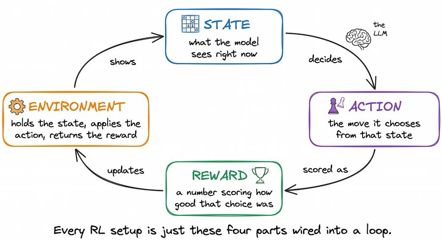
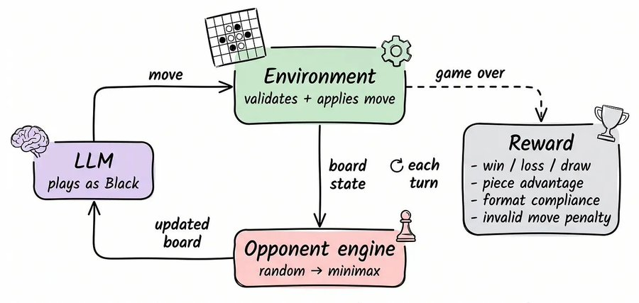
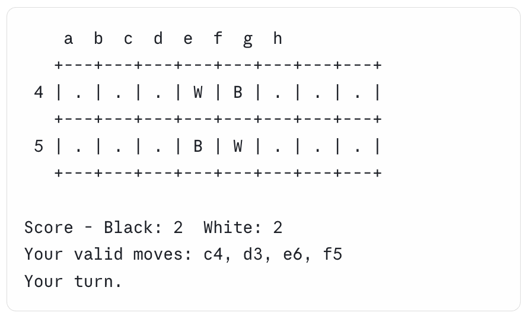
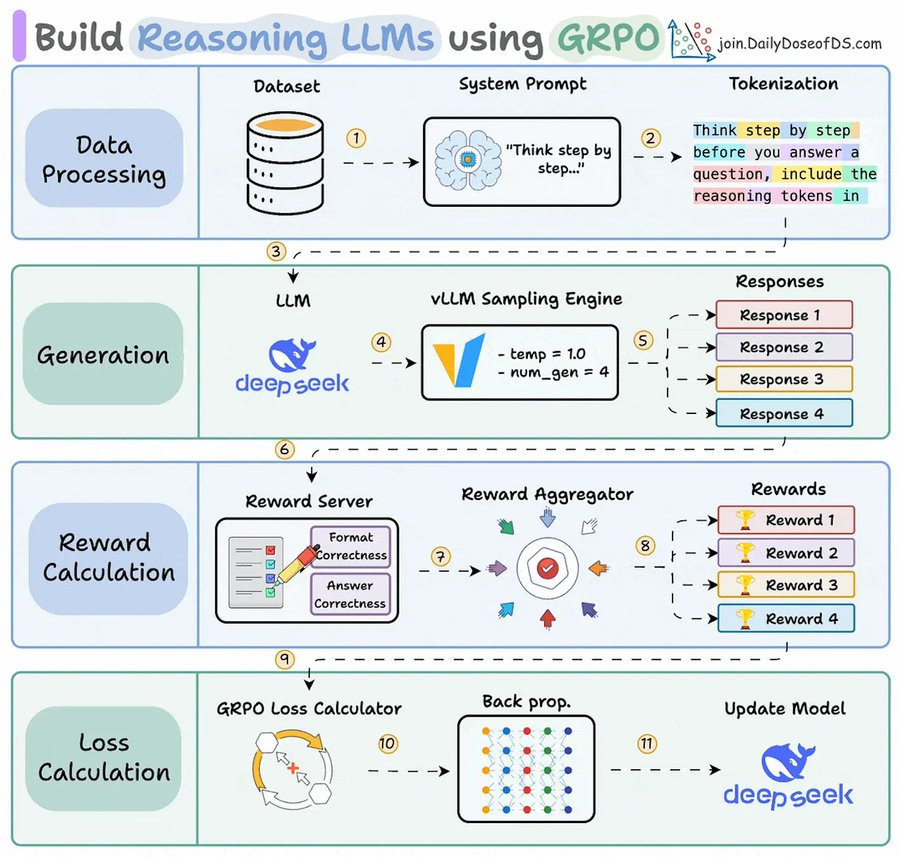
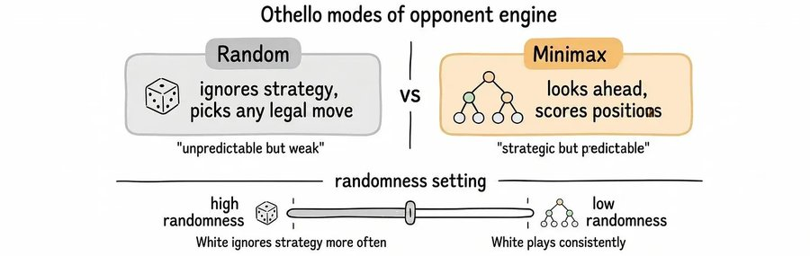
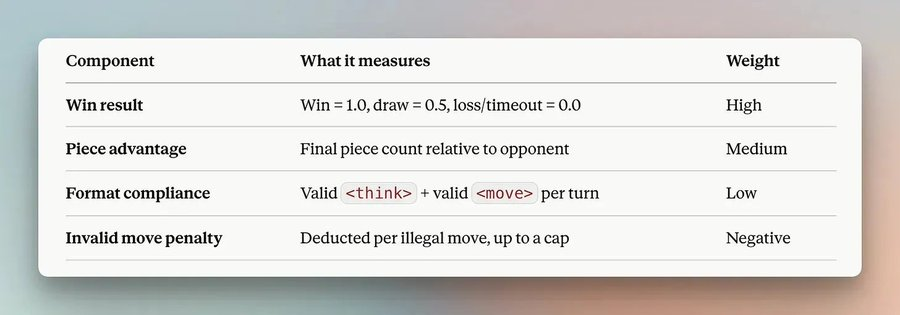
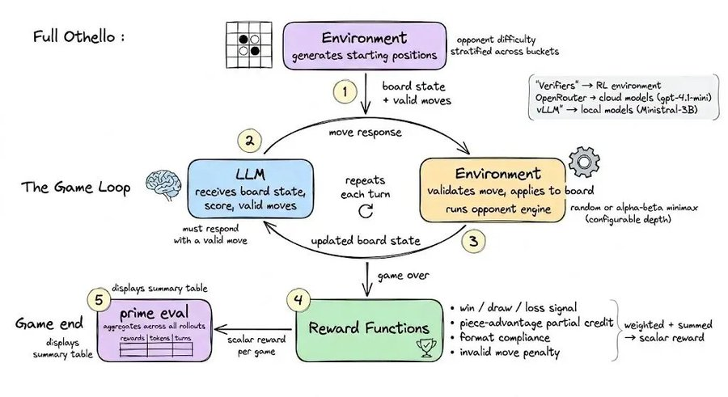
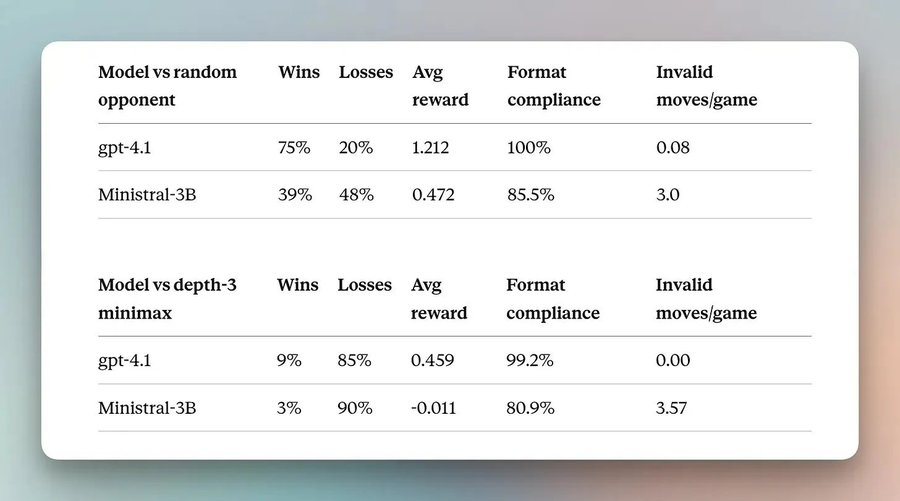

<div style="background:#e8f4fd;padding:14px 16px 10px 16px;border-radius:6px;margin-bottom:18px;">
<div style="text-align:center;margin-bottom:10px;">
<strong style="font-size:16px;color:#1a6ba0;">要点速览</strong>
</div>
<div style="font-size:14px;color:#3f3f3f;line-height:1.75;">
- <strong>环境已经是RL时代最稀缺的资产</strong>：Karpathy用文本、对话、环境三个名词概括LLM训练史，Anthropic一年为环境预算10亿美元。<br><br>
- <strong>DeepSeek-R1用一个Python函数替掉了奖励模型</strong>：GRPO让奖励函数取代人类偏好模型，环境成为最后一道壁垒。<br><br>
- <strong>Prime Intellect用Verifiers把这道壁垒也拆了</strong>：2500+ 个开源环境公开托管，配套框架让训练任何回合制任务共用同一套骨架。<br><br>
- <strong>用Othello从零手撕一个完整RL环境</strong>：MultiTurnEnv主循环、Random/Minimax双模式对手引擎、四项组合奖励，每一段都贴出代码。<br><br>
- <strong>换四个东西就能迁移到任何领域</strong>：任务逻辑、响应引擎、奖励函数、状态渲染，编码Agent、客服、研究任务全部通用。
</div>
</div>

---

Andrej Karpathy用三个名词总结了整部LLM训练史：**文本、对话、环境**。

预训练跑在互联网文本上，监督微调跑在精心策划的对话上，而当前这一波强化学习跑在环境上。OpenAI的o1用有可验证答案的数学和编程题证明了这个框架，DeepSeek-R1则把这套配方公开发布。


<span style="font-size:12px;color:rgb(153,153,153);">来源：Akshay Pachaar：LLM训练三阶段：预训练、SFT、RL</span>

**整个行业现在把环境当作稀缺资源。据报道Anthropic曾讨论一年在环境上花超过10亿美元。** 与此同时，有人在通过一个类似Hugging Face的中心免费提供2500多个开源环境。

今天，我们就用他们的框架从零构建一个自己的环境。

## 先搞清楚：一个RL环境到底由什么组成

在构建任何东西之前，先理解环境到底是什么。每个RL设置都是一个包含四个运动部件的循环，它们映射到模型所交互的任何事物：

- **State（状态）**：模型当前看到的内容
- **Action（动作）**：它从该状态做出的选择
- **Reward（奖励）**：一个表示这个选择有多好的数字
- **Environment（环境）**：持有状态、接受动作、返回奖励的东西


<span style="font-size:12px;color:rgb(153,153,153);">来源：Akshay Pachaar：RL循环示意图：state → action → reward → environment</span>

这个循环里最难的一环一直是奖励，传统上需要在人类偏好数据上再训练一个单独的模型。**DeepSeek-R1通过GRPO（Group Relative Policy Optimization）用一个普通的Python函数替掉了整个奖励模型。** 做法是对同一个提示的多个答案打分，然后把模型推向那些超过组平均值的答案。


<span style="font-size:12px;color:rgb(153,153,153);">来源：Akshay Pachaar：用GRPO构建推理型LLM</span>

## 环境是最后一道壁垒

奖励模型这道障碍被DeepSeek-R1拆掉之后，剩下的壁垒就是环境本身。奖励函数可以对最终状态打分，但必须有东西来呈现任务、接受模型的动作、执行规则，并首先把游戏推进到那个最终状态。

**前沿实验室把环境这一块当作专有资产严密保护，这就是为什么很少有从业者见过一个真正的环境从内部是什么样子。** 免费提供环境的团队叫 Prime Intellect，他们的库叫 Verifiers，就是我们要用的框架，100% 开源。设计与模型无关（model-agnostic），奖励完全可验证，同一套骨架适用于你想训练的任何回合制任务。


<span style="font-size:12px;color:rgb(153,153,153);">来源：Prime Intellect：Verifiers框架</span>

## 怎么读这篇文章

目标很简单：我们要构建一个完整的RL环境，即使这是你的第一次，也用一种容易消化的方式讲。

每个想法都配上实现它的代码，代码短到可以在文章的行文中直接读。完整、可运行的版本在最后分享。围绕的游戏只是一个工作示例。当你读完时，能够拿这个完全相同的结构去适配你自己的用例。

## Othello RL环境：为什么选一个棋盘游戏

Othello（黑白棋）是在8x8网格上进行的双人游戏。你放置一个棋子让它在直线上夹住对手的棋子，每一个被夹住的棋子都翻转为你的颜色，谁在棋盘填满时拥有更多棋子谁就赢。

**那个翻转规则就是为什么单次落子可以大幅改变分数，也是为什么角落如此重要**：一个角落棋子永远不能被翻回来。


<span style="font-size:12px;color:rgb(153,153,153);">来源：Akshay Pachaar：Othello棋盘</span>

每一个RL部件在这里都有归属。棋盘是State，落子是Action，最终结果喂给Reward，验证走法、翻转棋子、扮演另一方的游戏引擎是Environment。

LLM执黑，内置引擎执白。每次黑棋落子后，白棋回应，更新的棋盘回到模型，如此重复直到游戏结束。


<span style="font-size:12px;color:rgb(153,153,153);">来源：Akshay Pachaar：完整RL循环：LLM、Environment、Opponent、Reward</span>

## 技术栈

三个工具让这一切工作起来，每个处理一层：

- **Verifiers**：RL框架。它定义环境、运行回合循环、处理评估。
- **Lightning AI**：一个OpenAI兼容的推理API，同样的代码可以调用Claude、DeepSeek这些托管模型，无需针对特定提供商重写。
- **vLLM**：在同一个OpenAI兼容端点后本地服务开源权重模型。

共享的接口就是让环境与模型无关的原因。本地的Ministral-3B和托管的GPT-4.1一行代码切换：只改模型名，其他什么都不变。

## 游戏循环

模型在每个回合看到的就是棋盘、分数、有效走法列表，这就是全部状态。它对游戏的所有认知都来自这段文本。


<span style="font-size:12px;color:rgb(153,153,153);">来源：Akshay Pachaar：模型每回合看到的状态</span>

它必须以一个 `<think>` 段落回应，后跟一个 `<move>` 标签，**这迫使它在提交走法之前对局面进行推理**。

环境根据有效走法列表验证移动，将其应用到棋盘上，让白棋回应，然后把更新的棋盘发回。无效走法收到错误信息和重试机会，并对奖励施加惩罚。


<span style="font-size:12px;color:rgb(153,153,153);">来源：Akshay Pachaar：5步回合流程：起始局面 → LLM响应 → 校验 → 白棋走 → 更新棋盘</span>

所有这些都在一个方法里。OthelloEnv继承自Verifiers中的MultiTurnEnv，后者处理循环、回合追踪和终止，基类每次模型发送一步走法时都调用你的env_response：

```python
class OthelloEnv(MultiTurnEnv):
    def env_response(self, model_output, state):
        move = parse_move(model_output)

        if not is_valid(move, state.board):
            state.penalty += INVALID_MOVE_PENALTY
            return error_message(move), state          # same turn, retry

        state.board = apply_move(state.board, move, player="black")

        if not game_over(state.board):
            white_move = opponent_engine(state.board, state.difficulty)
            state.board = apply_move(state.board, white_move, player="white")

        return render_board(state.board), state
```

这是逻辑的形状；真实版本还处理片段跳过的棋盘解析和边缘情况。完整可运行的代码在文末给出。

## 内置对手引擎

内置引擎执白，有两种模式：

**Random**：任选合法走法。对早期训练有用，因为模型只要做出合理决定就能获胜。

**Minimax**：模拟未来走法，用角落控制、棋盘位置、可用走法给每个结果局面打分，选择最坏情况结果最好的走法。深度3意味着它向前看三步，足以设陷阱、避免明显失误。


<span style="font-size:12px;color:rgb(153,153,153);">来源：Akshay Pachaar：Random与Minimax对手模式</span>

一个随机性参数控制白棋多长时间忽略其策略而随机选择。**更低的随机性意味着更一致、更惩罚性的对弈。**

白棋的走法由当前棋盘状态和固定的游戏种子生成，同一个局面总是产生同一个响应。这种确定性就是允许你在相同条件下比较不同模型的原因。

```python
def opponent_engine(board, randomness, depth):
    if random.random() < randomness:               # random mode
        return random.choice(legal_moves(board))
    best_move = None                                 # minimax mode
    best_score = float("-inf")
    for move in legal_moves(board):
        score = minimax(apply_move(board, move), depth - 1, my_turn=False)
        if score > best_score:
            best_move, best_score = move, score
    return best_move
```

## 奖励函数

游戏结束时，四个信号合并成一个奖励。


<span style="font-size:12px;color:rgb(153,153,153);">来源：Akshay Pachaar：奖励组件表：每个组件测量什么，权重多少</span>

每一个都是一个函数，从最终状态读取某些东西，返回一个数字。胜负信号是最简单的：

```python
def win_reward_func(state):
    result = state.get("result")
    if result == "black":   # the model's color
        return 1.0
    if result == "draw":
        return 0.5
    return 0.0              # loss, or game never finished
```

其他三个遵循相同的形状，四个组合成一个分数：

```python
def total_reward(state):
    return (
        win_loss_score(state)
        + piece_advantage(state)
        + format_compliance(state)
        - invalid_move_penalty(state)
    )
```

**用四个信号而不是单一胜负位的原因是分辨率。** 训练早期大多数比赛都是失败，对纯胜负奖励它们看起来都相同，模型没有攀登的方向。

棋子优势把接近的失败和大败区分开，在模型开始获胜之前给它梯度。格式合规权重低，所以干净的格式永远不会盖过好的对弈。无效走法惩罚被封顶，所以一个坏局不能淹没模型做对的一切。

每个分数直接来自游戏状态和规则，没有裁判模型或LLM评估器参与，所以**奖励是完全确定性和可复现的**。

## 把整套东西串起来

环境跨不同的起始位置和对手难度生成游戏，模型通过上面的循环玩每一个，游戏结束时四个奖励被计算并合并。评估期间，奖励、token使用和回合数在所有游戏中汇总到一个结果表中。


<span style="font-size:12px;color:rgb(153,153,153);">来源：Akshay Pachaar：完整Othello系统图：游戏循环、奖励函数、prime eval</span>

一个函数把所有东西连接起来，这就是prime eval命令在后台调用的东西：

```python
def load_environment(min_random_move_prob, max_random_move_prob, parse_think):
    dataset = generate_games(min_random_move_prob, max_random_move_prob)
    parser = XMLParser(fields=["think", "move"])
    rubric = Rubric(funcs=[...], weights=[1.0, 1.0, 0.2, 1.0])
    return OthelloEnv(dataset, parser, rubric)
```

## 数字告诉我们什么

运行一次评估是一条命令，把对手设置作为参数传入：

```bash
prime eval run othello -m openai/gpt-4.1 -n 100 \
  -a '{"min_random_move_prob": 0.0, "max_random_move_prob": 0.0, "minimax_depth": 3}'
```

换一个模型名字来测试别的，无论它是通过Lightning AI托管的还是运行在本地vLLM服务器上。

## 从评估到训练

评估告诉你模型在哪里挣扎，训练分三个阶段来修复。**同一个环境支持所有阶段**：


<span style="font-size:12px;color:rgb(153,153,153);">来源：Akshay Pachaar：三阶段流水线：数据生成、SFT、RL训练共享同一个环境和奖励</span>

**数据生成**：让你最强的模型玩几百局并保存结果。同一个eval命令直接写入数据集：

```bash
prime eval run othello -m openai/gpt-4.1 -n 200 \
  --save-to-hf-hub --hf-hub-dataset-name your-username/othello-data
```

在训练之前把它筛到只剩获胜和平局，这样你就不会把最强对手的格式和它的错误一起教给模型。

**监督微调**：先教格式和有效走法。Ministral-3B的回合计数直接说明了这一点，因为**不可靠的格式和非法走法是RL无法训练穿透的噪声**。

**RL训练**：这是策略改进的地方。从同一个起始位置玩多局，每局用评估中相同的奖励函数打分，模型被更新朝向得分更高的rollout。

剥离到核心，这就是文章开头的GRPO循环：

```python
for prompt in batch:
    rollouts = [play_game(model, prompt) for _ in range(group_size)]
    rewards = [total_reward(r.final_state) for r in rollouts]
    advantage = rewards - mean(rewards)     # relative to the group
    update_model(model, rollouts, advantage)
```

每个rollout都被打分与其自己组的平均值比较，所以从给定位置赢10场中6场的走法比它旁边较弱的尝试得到更多奖励。

## 迁移到你自己的任务

一旦你去掉Othello特定的东西，同一个MultiTurnEnv给你一个适合任何回合制任务的骨架：

```python
class TaskEnv(MultiTurnEnv):
    def env_response(self, model_output, state):
        action = parse_action(model_output)          # your task's syntax
        if not is_valid(action, state):
            return error_message(action), penalize(state)
        state = apply_action(state, action)          # your task's rules
        if not task_complete(state):
            state = environment_step(state)          # tool, API call, or opponent
        return render_state(state), state            # your task's display
```

**这不是游戏专用的。** 一个编码Agent把apply_action换成对生成的代码运行测试套件，一个客服Agent换成检查工具调用是否检索了正确的记录，一个研究任务换成对照引用的来源验证声明。

适配它归结为四个替换：

- **任务逻辑**：你领域的规则，什么算有效动作，状态如何变化
- **响应引擎**：模型对什么做出反应，从基于规则的模拟器到实时API到另一个模型
- **奖励函数**：保留模式（结果信号、部分学分、格式、惩罚），替换领域逻辑
- **状态渲染**：模型需要看到什么，无论是文件diff、对话记录还是工具的响应

底层的结构在不同领域都保持相同：解析、验证、应用、响应、打分。**评分标准（rubric）就是设计，如果你把组件搞对了，训练信号会照顾好自己。**

<div style="background:#f5f0eb;padding:14px 16px 10px 16px;border-radius:6px;margin-bottom:16px;">
<div style="text-align:center;margin-bottom:8px;">
<strong style="font-size:15px;color:#8b6f4c;">结语</strong>
</div>
<div style="font-size:14px;color:#3f3f3f;line-height:1.75;">
去年最热的问题还是「奖励模型怎么训」，一年之后热点已经彻底移到了「环境怎么造」。GRPO让奖励塌缩成一个函数，也让所有的复杂度和护城河都跑到了环境那一侧。<br><br>
Anthropic把环境预算做到10亿美元一年，这不是浪费，是他们看清了下一轮竞争的形状：模型架构会趋同，数据配方会公开，但每一家能拿出多少种可验证、可打分、可跑通的任务，会决定它的Agent到底能不能落地。<br><br>
Prime Intellect用开源库把这层壁垒撕出一道口子，是这一波里对个人开发者最友好的一个信号。你不用再等前沿实验室开放它们的环境目录，可以用同一套MultiTurnEnv现在就动手，围绕自己领域造轮子。<br><br>
真正的问题不再是「有没有GPU训RL」，而是「你能不能想清楚，在你的任务里，什么才是那个可自动打分的终态」。这一步想不清，堆多少算力都是空转。
</div>
</div>

---

<span style="font-size:14px;color:#888888;font-family:'Courier New',monospace;">【传送门】<br>
<a class="normal_text_link mp_article_text_link" href="https://mp.weixin.qq.com/s/FkaboLbPXA36kHkDgv8aSQ" target="_blank" data-linktype="2">Interpreter Skills：当Agent Skill从说明书变成可执行代码</a><br>
<a class="normal_text_link mp_article_text_link" href="https://mp.weixin.qq.com/s/orPguOPILj08E329SHculw" target="_blank" data-linktype="2">Claude Code动态工作流Dynamic Workflows深入拆解：编排逻辑从对话变成代码</a><br>
<a class="normal_text_link mp_article_text_link" href="https://mp.weixin.qq.com/s/ngZTD0_FCP7N8m-nVAwv5Q" target="_blank" data-linktype="2">Claude Code记忆系统Memory架构剖析</a><br>
<a class="normal_text_link mp_article_text_link" href="https://mp.weixin.qq.com/s/R12IIHds4qEXBgi8dGXT_g" target="_blank" data-linktype="2">Hermes发布MoA (Mixture-of-Agents)多模型协同超过Claude Opus...</a><br>
<a class="normal_text_link mp_article_text_link" href="https://mp.weixin.qq.com/s/oDZJbvskv_ocNgPUH1DHVA" target="_blank" data-linktype="2">AI暗输出：为何AI价值在GDP统计中失效了</a><br>
<a class="normal_text_link mp_article_text_link" href="https://mp.weixin.qq.com/s/VZRcpl6vL7riJp77ZmtSIg" target="_blank" data-linktype="2">Hermes vs OpenClaw创始人隔空互怼：假星标，抄袭，死亡威胁各种瓜</a><br>
<a class="normal_text_link mp_article_text_link" href="https://mp.weixin.qq.com/s/rsNxbqxha4UBoYtvNzpfEw" target="_blank" data-linktype="2">kv-caching_diff_hero_video_full</a><br>
<a class="normal_text_link mp_article_text_link" href="https://mp.weixin.qq.com/s/4Iz5SjE4D240EL4MmKrWZQ" target="_blank" data-linktype="2">OpenAI Dreaming记忆系统：从记住你到理解你</a><br>
</span>

---

<span style="font-size:12px;color:#888888;font-family:'Courier New',monospace;">参考：https://x.com/akshay_pachaar/status/2074200571834515574</span>
