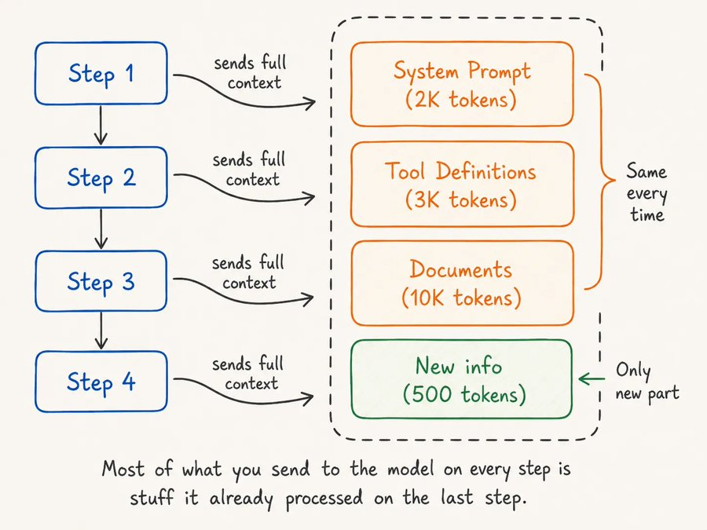
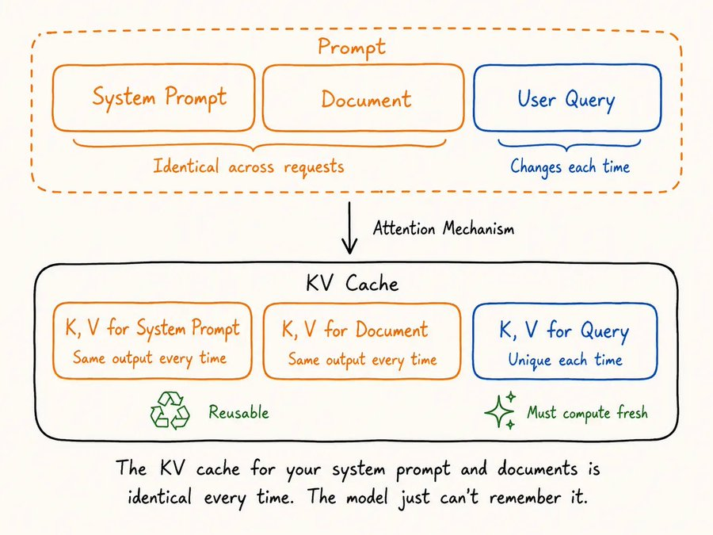
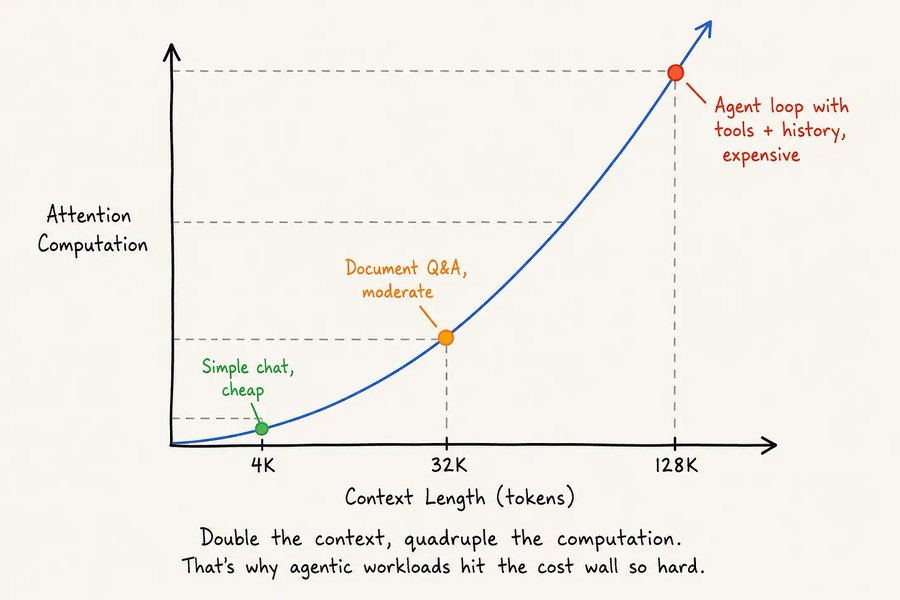
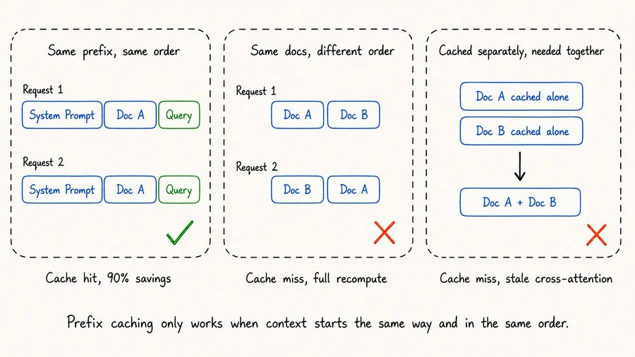
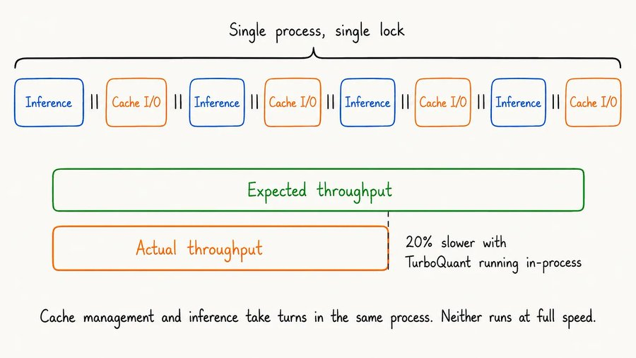
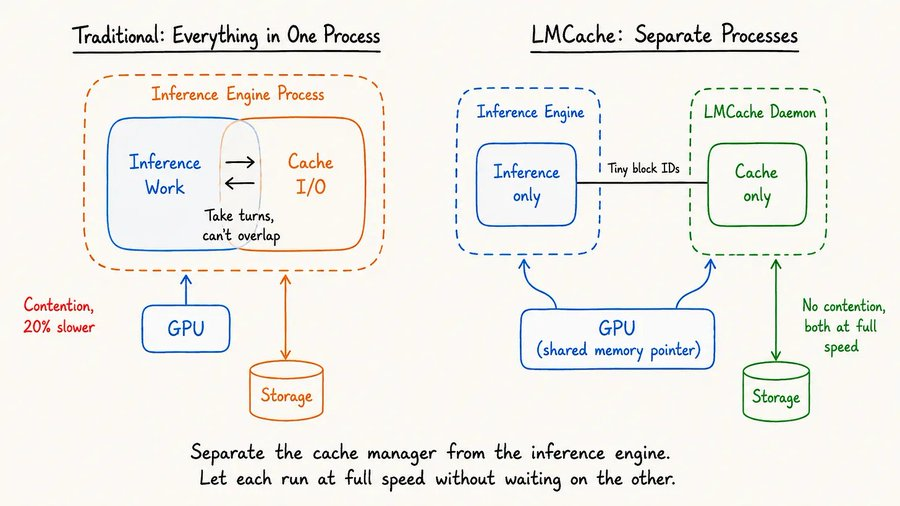
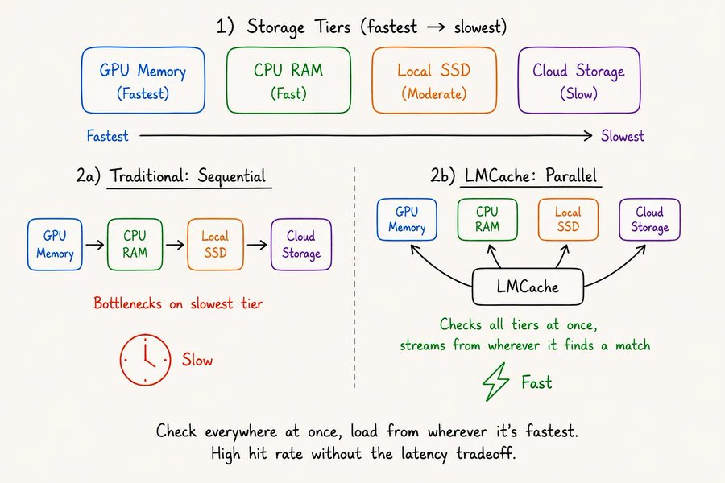
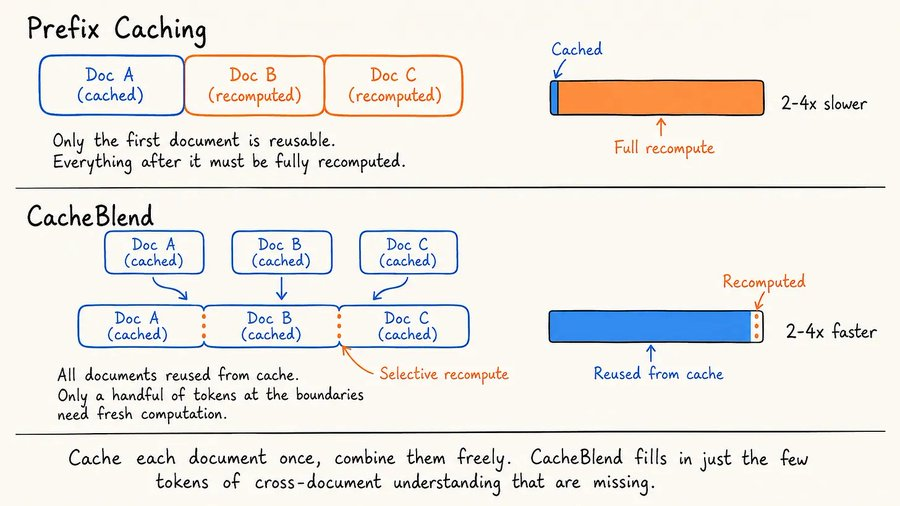

<strong style="font-size:16px;color:#1a6ba0;">要点速览</strong>

- <strong>62%的token是重复发送的</strong>：Agent每走一步都把系统提示词、工具定义、文档原样重发一遍，贵的不是推理，是AI反复重读同一份笔记。  
- <strong>前缀缓存有硬天花板</strong>：它要求被复用的内容必须是新请求的逐字节前缀，文档顺序一变、历史一增长，缓存就整段失效。  
- <strong>缓存和推理抢同一份资源</strong>：主流KV缓存库都跑在推理引擎进程内，缓存I/O和矩阵计算轮流占用，光是量化压缩就能拖慢推理20%以上。  
- <strong>LMCache把缓存管理拆成独立进程</strong>：解耦后缓存I/O不再阻塞推理，跨GPU零拷贝共享、多层并行加载，实测首token延迟快14倍。  
- <strong>CacheBlend补上了前缀的洞</strong>：只重算跨文档边界的少数token，把独立缓存的文档缝合成可联合理解的资产，多文档查询快2到4倍。

---

## 被浪费的62%：Agent推理预算的真相

斯坦福的研究人员追踪Agent推理预算：**每次调用发给Agent的内容里，大约62%只是重复内容**。

昂贵的从来不是思考或推理，而是AI一遍又一遍地重读同一份笔记。

2023到2026年，每token价格降了80%，GPT-4级模型从每百万token30美元跌到0.40美元。但Agentic工作流每个任务消耗的token是普通聊天的5到30倍。**价格降下来了，账单却涨上去了，因为用量跑赢了降价。**

Uber是吃了苦头才懂的：把Claude Code铺到整个工程组织，四个月烧光了2026全年AI预算。Gartner预测，到2027年会有40%的Agent项目单纯因为成本超支被砍掉。

行业在优化一个错误的变量。如果大多数token本就不该存在，让降token成本价值就大打折扣了。

下面要讲的开源架构，把缓存管理完全移出了推理引擎。首token延迟快了最高14倍。

LMCache工作原理示意图

## 当你发一个提示时发生了什么

每次你向模型丢一个提示，它都把每个token过一遍注意力机制。对每个token，模型在每一层注意力上算出一个Key向量和一个Value向量，这些K和V向量记录了模型"理解"每个token与上下文中其他token关系的方式。就是KV缓存。

注意力机制如何产生KV缓存

计算量随输入长度呈二次方增长。上下文翻倍，注意力计算大约变成四倍。4K token（一次简单聊天）时这很便宜；128K token（带工具、文档、历史的Agent循环）时，它就贵得离谱。

4K、32K、128K上下文下的二次计算成本曲线：上下文翻倍，成本变四倍

单张MI300X GPU每天大约产出15TB的KV缓存，其中大部分在请求结束后就被丢掉。你的系统提示词，你上传文档的KV缓存每次都一样，但模型每次都从头重新推导。

这就像有人问起第7章的后续，你非得从第1页重读整本教科书。第1到第6章你早理解了，却没有办法保存和复用那种理解，只能从头再来。

## 前缀缓存解决了什么，有哪些局限

行业注意到了这种浪费，造出了提示缓存（prompt caching）。如果两个连续请求共享相同的开头token（前缀），提供方就存下第一个请求的KV缓存，在第二个上复用，模型跳过重算、只处理新内容。

Anthropic对命中Cache的输入token成本消减90%，稳定负载下60%到85%的命中率。**对系统提示词和工具定义稳定的团队，这是杠杆率最高的优化。**

但前缀缓存有一道硬天花板：被缓存的部分必须是新请求的逐字节前缀，缓存区里改一个字符，就是全盘未命中。

三种常见场景会直接崩掉：

**多文档RAG**：你单独缓存了文档A和文档B，新查询要两者，但文档B的缓存KV是在"不知道A"的状态下算的，于是失效。

**文档顺序变化**：三个文档以不同顺序出现，每种排列都是一次未命中，哪怕文档本身一字未动。

**对话历史增长**：新对话轮次改写了前缀后的完整上下文，稳定前缀之外的早先缓存全部作废。

阿里云的生产数据印证了这点：10%的KV缓存块服务了77%的命中，绝大多数被缓存的内容因为僵化的前缀匹配规则从未被复用。前缀缓存只在有"长而不变的开头"时才管用，而真实负载往往不是这样。

## 缓存的隐形性能税

另一个问题，所有KV缓存库都跑在推理引擎的进程内部，缓存操作（存、取、搬张量）和实际推理共用一份资源，二者无法同时跑。

引擎忙缓存时就不做推理，做推理时缓存就得等。就像餐厅里厨师每道菜之间都得亲自跑储藏室取食材，厨房效率自然慢下来。

推理与缓存I/O在单一进程内轮流占用

Google的TurboQuant把KV缓存量化压缩到每值3比特、零精度损失，但当它跑在推理引擎内部时，却带来了20%以上的推理减速。**压缩本身完美，但和它和推理挤在同一个进程这件事，把收益都抵消了。**

缓存管理是I/O密集型（在GPU、CPU、存储间搬大张量），推理服务是计算密集型（GPU上矩阵乘法），二者本质是不同的负载。强行塞进同一进程，就像在一个线程里同时跑数据库和Web服务器，负载一大，就开始抢资源。

## LMCache与解耦架构

LMCache思路不同：它不把缓存管理放在推理引擎内部，而是作为一个完全独立的进程。回到餐厅类比，这等于给储藏室雇了专职跑腿，厨师再也不离厨房，取和存都由跑腿独立处理，两者全速互不等待。

传统单进程设计vs LMCache的解耦架构

实践中，LMCache通过共享GPU内存连到推理引擎，引擎只告诉它"我需要这些block ID"（极小的消息，几乎没有数据）。真正在GPU、CPU、存储间搬KV张量的重活，全在LMCache自己的进程里完成，推理引擎无需关注。

分离带来三个好处：

**无资源争抢**：缓存I/O和推理互不阻塞，引擎内跑优化技术带来的那20%吞吐损失直接消失。

**跨GPU零拷贝共享**：传统做法在两卡间共享缓存要多次内存拷贝，LMCache让两张卡直接读写同一块内存区，零拷贝。

**多层并行加载**：缓存数据分布在GPU内存、CPU内存、本地SSD、远程存储上，传统方案逐层检查、卡在最慢那层，LMCache同时查所有层，从任何命中处并行流式取数。

四层存储（GPU内存、CPU内存、本地SSD、云存储）的顺序检查vs LMCache跨层并行查找

性能差异显著。在H200上用Qwen3-235B、50个并发用户，LMCache相比进程内缓存，首token延迟快14倍、解码快4倍，启动时间从超3分钟降到约30秒。

一个缓存提示每周只需复用两三次（约1%命中率）就能回本；1000节点部署、10%命中率，三年节省约2900万美元。LMCache已接入vLLM、SGLang、TensorRT-LLM，同时支持NVIDIA和AMD GPU。

## CacheBlend：缝合被割裂的文档缓存

LMCache解决了性能侧，但前缀缓存的天花板还在：你单独缓存了文档A和B，现在查询要两者，文档B的缓存因隔离计算而失效。CacheBlend瞄准得则是这个限制。

问题归结为一句话：两个文档独立缓存时，谁都不"认识"对方，缝合它们的缓存状态时，模型无法联合理解，因为跨文档的连接从未被计算过。

但现代transformer里，大多数token主要只关注自己的局部上下文，只有少数token在文档边界上有强连接。CacheBlend只挑出那几个token，有选择地重算它们，其余一切原样复用。

前缀缓存重算首文档之后的一切vs CacheBlend复用所有已缓存文档

结果是多文档查询（RAG里最常见）快2到4倍且无质量损失。文档被组合时不再从头重算，CacheBlend只用一小部分成本，就把缺失的跨文档理解补回来。**对做RAG、多文档问答、或从多源积累上下文的Agent来说，这把知识库里每篇文档都变成了可复用资产，不管它以什么顺序出现。**

## 为生产而构建

LMCache具备生产及成熟度：Prometheus和OpenTelemetry集成追踪命中率与I/O性能，Kubernetes operator管部署，CLI做调试和基准测试。

容错设计值得一提：推理引擎崩了，LMCache在CPU和存储上保住所有缓存数据，恢复不必从冷状态起步；LMCache自己崩了，推理引擎进入降级模式，关掉缓存但推理照常，并在缓存进程恢复时自动重连。两种故障都不会拖垮整个系统。

## 更大的图景

AI应用如今每台GPU每天约产生15TB的KV缓存，大多被丢弃。管理、存储、复用这些KV缓存不是未来的优化，而是今天就在做的成本结构决策。

LMCache站在浪潮最前沿，且100%开源。

<strong style="font-size:15px;color:#8b6f4c;">结语</strong>

解耦把"缓存该不该和推理抢资源"这个被长期忽视的问题摆到了台面：它不是某个库的bug，而是行业把缓存默认塞进推理进程的结构性选择，LMCache只是第一个把它拆出来的主流实现。  
1%命中率就能回本的说法要加前提：它依赖内容真的会被稳定重复访问。对一次性、高度动态的负载，解耦能消除吞吐损失，却救不了"根本没有可复用缓存"这件事。  
CacheBlend的方向比LMCache本身更值得关注：当缓存单位从"前缀"变成"可缝合的文档块"，RAG的长期痛点才真正被撬动，而不只是推理快了一点。  
开源只是入场券。这类架构能否成为默认，取决于vLLM、SGLang等引擎是否把解耦缓存吸收进原生路径，而不是永远作为一个外接进程存在。

---

【传送门】 
<a class="normal_text_link mp_article_text_link" href="https://mp.weixin.qq.com/s/OoHu1yeuh1gzgCfEiPvDuQ" target="_blank" data-linktype="2">RL的下一个大突破：不是优化可验证问题而是把'不可验证'领域变</a> 
<a class="normal_text_link mp_article_text_link" href="https://mp.weixin.qq.com/s/OqtF6ZaWQNu3o-VAWLfqbg" target="_blank" data-linktype="2">榨干GPU性能：流水线解码消除GPU气泡，推理吞吐提升35%</a> 
<a class="normal_text_link mp_article_text_link" href="https://mp.weixin.qq.com/s/HnGKVp45C-GApBJ-LleP6g" target="_blank" data-linktype="2">小米MiMo罗福莉:8卡GPU让1T参数模型跑出1000 TPS , FP4+DFlash+TileRT全解</a> 
<a class="normal_text_link mp_article_text_link" href="https://mp.weixin.qq.com/s/s0Ovn3_tnbbl9jxfAC3WLg" target="_blank" data-linktype="2">阿里Sparse Attention on CXL替代RDMA做KV Cache解耦 推理2.1×吞吐, 9.7×TTFT</a> 
<a class="normal_text_link mp_article_text_link" href="https://mp.weixin.qq.com/s/3btXHAVd8_x5CM5CWETc2g" target="_blank" data-linktype="2">Agent卷向AI Infra: SGLang团队用硬核Agent优化框架和CUDA Kernal性能</a> 
<a class="normal_text_link mp_article_text_link" href="https://mp.weixin.qq.com/s/nVqW9acA7NN1zeALDwRAsw" target="_blank" data-linktype="2">Google新论文RubricEM: 评分标准引导的深度研究Agent训练框架</a> 
<a class="normal_text_link mp_article_text_link" href="https://mp.weixin.qq.com/s/2eWh5jZJPHsv0wi9km2nVg" target="_blank" data-linktype="2">NVIDIA TriAttention解读: KV Cache压缩最大的问题不是算法而是两个Infra</a> 
<a class="normal_text_link mp_article_text_link" href="https://mp.weixin.qq.com/s/FTsibdpbEjvoPWtxGqgxkQ" target="_blank" data-linktype="2">小米MiMo罗福莉后训练新范式MOPD: 多教师同策略蒸馏，多领域无损</a> 
<a class="normal_text_link mp_article_text_link" href="https://mp.weixin.qq.com/s/O0gzjbgy3IhB9TolXUIBzA" target="_blank" data-linktype="2">Code as Agent Harness：可执行、可验证、有状态的Agent系统新范式</a> 
<a class="normal_text_link mp_article_text_link" href="https://mp.weixin.qq.com/s/IZBsLB7ci7U8ZmrpkFuB0Q" target="_blank" data-linktype="2">梁文峰署名DeepSeek DSpark：半自回归推测解码，吞吐提升51% (附论文</a> 
<a class="normal_text_link mp_article_text_link" href="https://mp.weixin.qq.com/s/Kw3EbPyjX0ixI6OYRY-FbA" target="_blank" data-linktype="2">OpenClaw之父新作Crabbox：为Agent分配云端沙箱，AI Coding瓶颈从写代码</a> 

---

参考：https://x.com/akshay_pachaar/status/2074502882812952666
