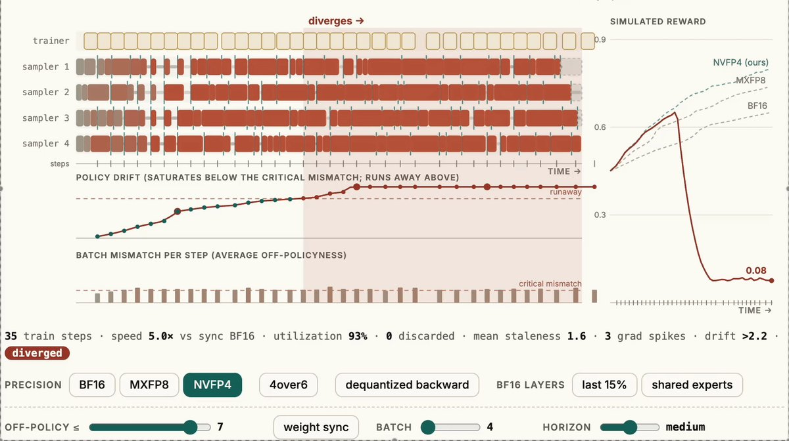

<strong style="font-size:16px;color:#1a6ba0;">要点速览</strong>

- <strong>训练理念</strong>：humans& 训练模型时，以它们与人的交互所产生的长期影响为出发点，而非只盯着短期指标  
- <strong>技术路线</strong>：这要求把长周期、多智能体（multi-agent）强化学习放在优先位置  
- <strong>新成果</strong>：开源了一套硬件原生的4-bit强化学习方案，可显著加速训练

---

## 从「长期影响」出发的训练观

在humans&，他们训练模型时看重的不只是某个单点任务的指标，而是**模型与人的每一次交互，会在长期产生怎样的影响**。顺着这个取向往下走，技术选择就清晰了：只盯眼前奖励，模型容易在短期数据上过拟合，放到和真实用户的长期相处里就会跑偏。

把「长期影响」放进训练目标，等于要求reward设计跳出即时反馈，去贴合人在一段时间尺度上的真实体验。长周期强化学习难做，原因也在这里。

## 为什么是长周期多智能体RL

原文把技术路线收敛到一句话：**优先长周期、多智能体（multi-agent）的强化学习**。

多智能体场景下，单个行为的后果会通过其他智能体的反应层层传导，反馈回路天然更长。传统短视的RL在这种环境里很难收敛到稳定策略，而长周期训练让模型有机会学会「先让步、后获益」这类跨步博弈行为。

对humans& 这类做人机交互的团队来说，多智能体RL不只是论文里的设定，而是真实产品在用户、模型、工具之间反复交互的缩影。

## 开源的硬件原生4-bit RL方案

这次他们放出的是一套**开源、硬件原生的4-bit强化学习方案**，主打显著加速训练。

4-bit量化的意义在于把训练和推理的算力门槛压下来。当RL这种本就吃算力的范式能被塞进更便宜的硬件，长周期、多智能体的实验就不再是少数大厂的专利。视频里展示的应该就是这套方案在真实训练任务上的加速效果。

humans& 开源的硬件原生4-bit强化学习方案演示

---

<strong style="font-size:15px;color:#8b6f4c;">结语</strong>

把RL量化到4-bit并做到硬件原生，等于把长周期多智能体训练从「烧钱游戏」拉到中小团队够得着的区间。门槛一降，这类人机交互研究的迭代速度会明显加快。  
「从长期影响出发」听着像句价值观宣言，落到工程上就是reward要超越即时指标：这恰好是多智能体RL里最难啃、也最该做对的那块。  
humans& 选了开源而不是闭源变现，相当于把多智能体RL的入场券直接发给社区，后面生态怎么长，值得盯着。

---

【传送门】 
<a class="normal_text_link mp_article_text_link" href="https://mp.weixin.qq.com/s/oq46CcmcBBTlfdCAzaOvhA" target="_blank" data-linktype="2">英伟达硬核4-bit量化: NVFP4将智能压缩到4比特</a> 
<a class="normal_text_link mp_article_text_link" href="https://mp.weixin.qq.com/s/NsdT63TplKvPOWDg15N3IQ" target="_blank" data-linktype="2">Anthropic教你怎么在Claude Code中设计并使用Loop工程</a> 
<a class="normal_text_link mp_article_text_link" href="https://mp.weixin.qq.com/s/VwQP-AZcHMYksmMLHOy_FQ" target="_blank" data-linktype="2">从Token流到Agent流：LangChain全新流式架构深度解读</a> 
<a class="normal_text_link mp_article_text_link" href="https://mp.weixin.qq.com/s/HnGKVp45C-GApBJ-LleP6g" target="_blank" data-linktype="2">小米MiMo罗福莉:8卡GPU让1T参数模型跑出1000 TPS , FP4+DFlash+TileRT全解读</a> 
<a class="normal_text_link mp_article_text_link" href="https://mp.weixin.qq.com/s/VZRcpl6vL7riJp77ZmtSIg" target="_blank" data-linktype="2">Hermes vs OpenClaw创始人隔空互怼：假星标，抄袭，死亡威胁各种瓜</a> 
<a class="normal_text_link mp_article_text_link" href="https://mp.weixin.qq.com/s/olxLm3almopaba6J2JeFrA" target="_blank" data-linktype="2">Anthropic：如何用Claude实现95%自动化数据化分析</a> 
<a class="normal_text_link mp_article_text_link" href="https://mp.weixin.qq.com/s/kJHYTWqIl2HwdUYNjG7_aw" target="_blank" data-linktype="2">Loop工程续篇：15个高赞Loop一次性拆解：每一条你都能直接用</a> 
<a class="normal_text_link mp_article_text_link" href="https://mp.weixin.qq.com/s/crfkhSIuMZJxjNA0Md8dXw" target="_blank" data-linktype="2">李飞飞：世界模型的功能分类</a> 

---

参考：https://x.com/humansand/status/2075618383631167692
