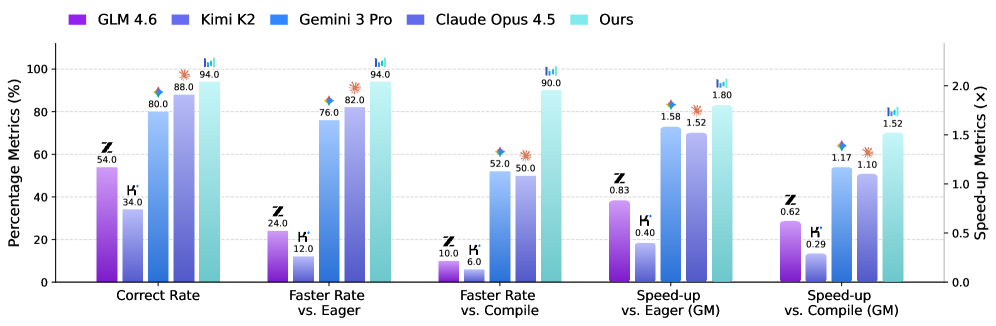
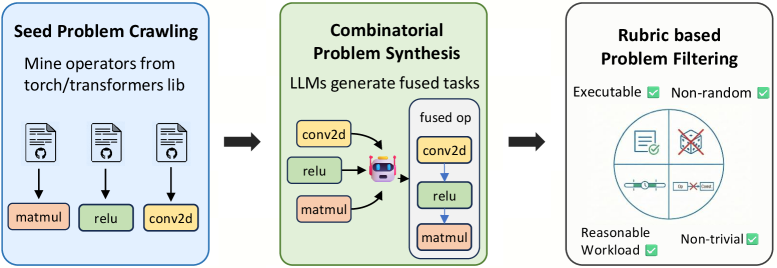
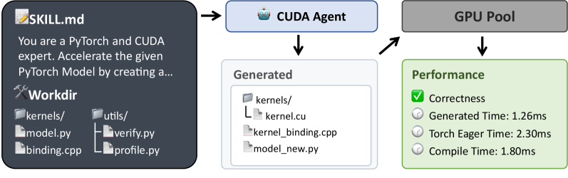
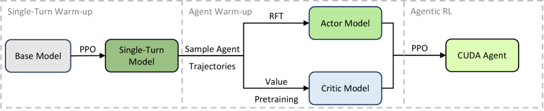
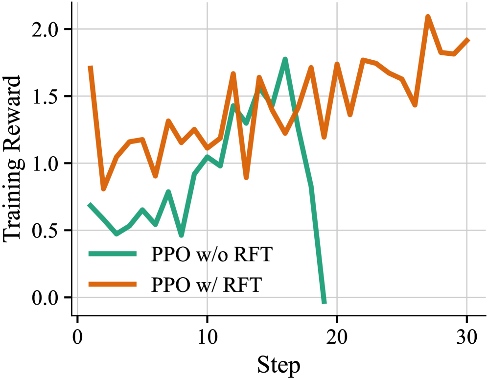
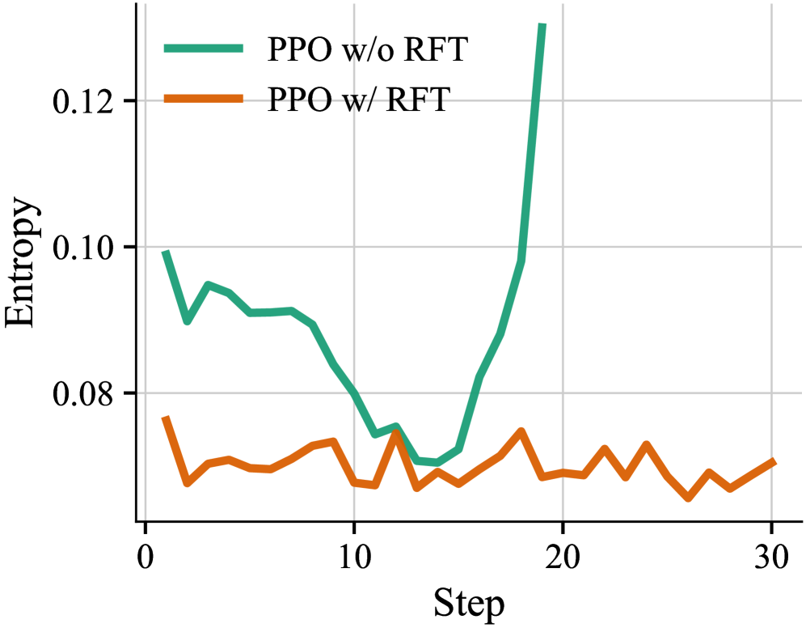
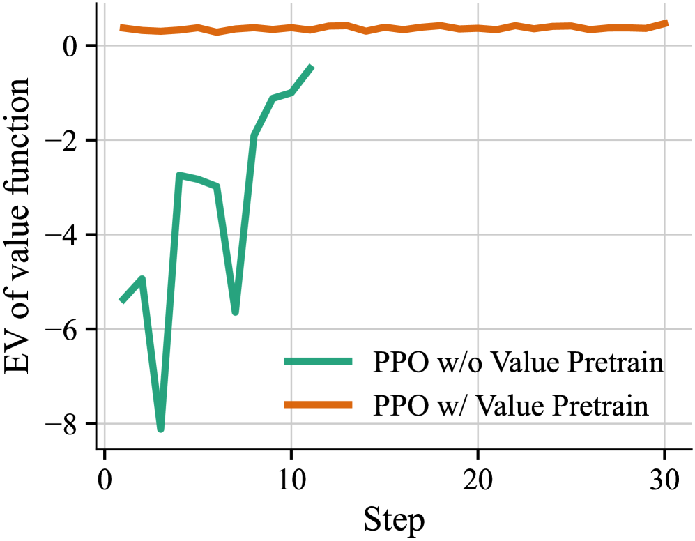
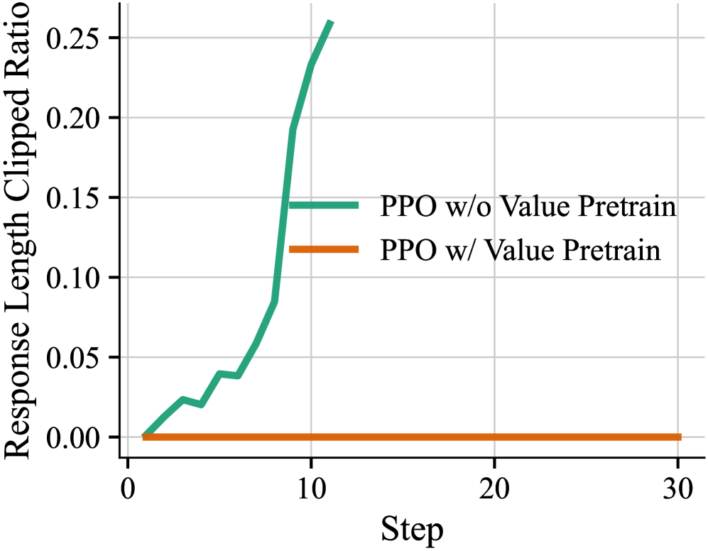

# CUDA Agent：大模型自己学会写更快的CUDA算子，优化策略胜过torch.compile

<strong style="font-size:16px;color:#1a6ba0;">要点速览</strong>

- <strong>CUDA Agent是什么</strong>：字节跳动与清华联合推出的大规模智能体强化学习系统，专攻CUDA算子自动生成与优化，把LLM从"会写代码"推向"懂硬件、会提速"  
- <strong>核心打法</strong>：可扩展数据合成流水线 + 技能集成的智能体循环（带自动验证与性能剖析）+ 多阶段预热稳定RL训练，三件套缺一不可  
- <strong>性能碾压</strong>：KernelBench上相较torch.compile在Level-1/2/3分别实现100%、100%、92% 加速率，Level-2几何平均加速达2.80×，在最难的Level-3上比Claude Opus 4.5、Gemini 3 Pro强约40%  
- <strong>关键洞见</strong>：通用大模型能写出"正确"的算子，却写不出"更快"的算子；学会的优化策略能持续胜过torch.compile这类静态编译器启发式，尤其在算子融合场景

---

## 背景：LLM写CUDA为什么一直打不过编译器

GPU算子是现代深度学习的基石，但高性能CUDA算子的开发高度依赖GPU微架构知识与专业性能剖析工具，门槛极高。尽管大语言模型在通用编程上已接近人类水平，现有的CUDA生成方法：无论是无需训练、靠执行反馈反复精炼的workflow，还是在固定多轮循环里微调：都仍难以竞争过torch.compile这类编译器，更别提人类专家。

两条老路线的天花板很清楚：训练-free的方法再怎么搜，也受限于基础模型本身就弱的CUDA编码能力；固定多轮微调则把所有历史解法塞进上下文，既浪费长度，又限制了智能体自己学调试、搜索和优化的空间。

**CUDA Agent的思路是：别只教模型"怎么写"，而是给它一套能跑、能测、能改的真实开发环境，再用强化学习把"写得更优"刻进模型本身。**

CUDA Agent系统总览：数据合成、技能集成智能体循环、稳定RL训练三大支柱

## 三大组件

CUDA Agent建立在三个互补的支柱上：可扩展数据合成流水线、不可作弊的技能集成训练环境、以及为稳定训练设计的RL算法技术。

### 数据合成：把算子"拼"出新难题

高性能CUDA算子太少，监督微调根本喂不饱。CUDA Agent改用强化学习，但RL需要海量多样、以PyTorch实现的参考算子当训练任务。作者搭了一条三阶段流水线来系统性扩展任务空间。

第一步**种子爬取**：从torch和transformers库里挖出维护良好的算子，每个算子是一个带初始化和forward的Python类。

第二步**组合构造**：让LLM从torch库采样最多5个算子类，把它们顺序堆叠成一个融合计算层。关键观察是：组合问题通常不等于"分别优化每个算子再串起来"：融合能避免中间全局内存的物化、用共享寄存器/共享内存耦合各阶段，从而重塑优化地形。

第三步**严格过滤**：每个算子要满足四条硬标准：Eager与Compile两种模式都能跑通、无固有随机性、不同输入输出不能是常数或数值不可区分、Eager执行时间限制在1ms–100ms之间，且与KernelBench测试用例相似度过高的一律排除。最终筛出6000个样本，构成CUDA-Agent-Ops-6K数据集。

图1：三阶段数据收集流水线。先爬取种子算子，再用LLM组合构造，最后经执行反馈严格过滤

### 技能集成的智能体循环

CUDA编码天然是编码智能体的子任务，所以智能体循环对齐OpenHands框架以保证通用性：LLM拿到标准的shell工具集（Bash、Glob、MultiEdit、TodoWrite），并能跑编译和测试。循环本身遵循ReAct范式，推理、执行、观察交错进行，实现迭代式编码、调试与优化。

关键设计是把CUDA专用指令和工具打包成Agent Skill（比如一个对比生成算子与torch.compile性能的剖析工具），并写了一份SKILL.md规定标准优化流程：先用profile.py找出瓶颈，再改写模型并手写CUDA算子与绑定，然后在沙箱里编译评估、反复精炼，直到相对torch.compile至少快5% 且数值正确。

**奖励设计上，作者没有用常见的"加速比"当奖励，而是设计了一套归一化的里程碑式奖励** r ∈ {−1, 1, 2, 3}：按相对基线是否显著提速（>5%）和正确性打分。这套鲁棒奖励在消融里显著优于原始加速奖励。

为防奖励作弊，系统做了五道保险：验证脚本用文件权限锁死防篡改；用上下文管理器禁止调用torch.nn.functional的回退实现（确保提速真来自生成的算子）；每个问题用5个随机输入验证正确性；剖析流水线带设备同步、预热和多次取平均以降低噪声；智能体不配任何联网搜索工具，所有解只能从本地执行环境得出。

图2：智能体循环。LLM在ReAct范式下交替推理与执行，借助CUDA编码技能与沙箱反复迭代

### 稳定RL训练：先预热，再长跑

最实际的工程贡献在这里。作者最初的RL试训只稳定训练了17步就崩溃。根因是严重的领域分布失配：CUDA编码数据在预训练里占比不到0.01%，导致大量低概率token；一旦训练/推理精度不同（BF16 vs FP16），这些低概率token的重要性采样比会剧烈波动甚至爆炸。

解法是多阶段预热：先用单轮RL（PPO）提升基础模型的CUDA生成能力；再用拒绝微调（RFT）初始化actor：只保留拿到正奖励、且行为高效的轨迹做监督微调；同时对critic做Value Pretraining，用轨迹的状态序列和结果奖励预训练价值网络。

**这一改，稳定训练步数从17步拉到了200步，奖励持续增长。** actor用PPO优化，重要性采样比的裁剪上下界取 ϵ_lower=0.2、ϵ_higher=0.28。

图3：训练流水线。单轮RL预热后，用采样轨迹初始化actor与critic，再进入多轮智能体RL

## 实验设置

基础模型用Seed1.6（MoE，23B活跃/230B总参数），全局批大小1024，actor/critic学习率分别为3e-6和6e-6，上下文窗口单轮RL为32768、智能体RL为131072，最多150（评测放宽到200）个智能体轮次，训练150步。

沙箱是CPU-GPU解耦架构：Docker终端沙箱跑编译等CPU任务，验证和剖析任务分派给128块NVIDIA H20组成的专用GPU沙箱池，进程级隔离保证延迟测量稳定。

评测在KernelBench的Level 1–3（共250个算子任务）上进行，基线包括Claude Opus 4.5、Gemini 3 Pro，以及开源的GLM 4.6、Kimi K2，且都在同一套智能体循环下公平对比。三个指标：通过率（Pass Rate）、加速率（Faster Rate，正确且比基线快的任务占比）、加速比（Speed-up，相对基线的几何平均，只对正确解算）。

## 主要结果

CUDA Agent在KernelBench上取得SOTA，三个核心结论很硬：

**第一，专有模型能写出"对"的算子，但写不出"快"的算子。** Claude Opus 4.5和Gemini 3 Pro通过率有91.2%–95.2%，但加速率只有66%–69%：通用LLM产出的往往是朴素算子，跑不过torch.compile。CUDA Agent拿到98.8% 通过率和96.8% 加速率，说明专门的RL训练带来的是"既正确又高度优化"的实现。

**第二，学会的优化策略能持续胜过静态编译器，尤其在算子融合上。** 这一点在Level 2（算子序列）最明显：CUDA Agent取得100% 加速率，相对torch.compile几何平均加速高达2.80×。传统编译器靠预定义、基于规则的融合模式，遇到非平凡算子组合经常束手无策；CUDA Agent靠迭代循环探索更大的设计空间，发现硬件特定的内存访问模式和分块策略。

下表是Overall总体与各Level上CUDA Agent与最强基线的关键对比：

| 子集 | 模型 | 通过率 | 加速率(vs Compile) | 加速比(vs Compile) |
|------|------|------|------|------|
| Overall | CUDA Agent | 98.8% | 96.8% | 2.11× |
| Overall | Claude Opus 4.5 | 95.2% | 66.4% | 1.46× |
| Overall | Gemini 3 Pro | 91.2% | 69.6% | 1.42× |
| Level 2 | CUDA Agent | 100% | 100% | 2.80× |
| Level 3 | CUDA Agent | 94.0% | 90.0% | 1.52× |

## 消融研究

### 技能集成智能体循环不可或缺

对比单轮模型（无执行反馈，一次性预测算子）和完整CUDA Agent：去掉智能体循环后，正确性和优化质量双双大跌，而且生成的算子不仅优化差，还常常性能回退。只有暴露在编译错误、运行时失败和剖析反馈里，智能体才能跨轮次迭代诊断、精炼转换。

### 奖励设计决定优化上限

把鲁棒奖励换成原始加速奖励（w/o Robust Reward），功能正确性差不多，但优化性能大幅走弱。归一化、基于里程碑的奖励更契合"持续更快"的目标：给清晰性能目标赋信，比直接对噪声运行时间比做回归更可靠。

### 多阶段训练是稳定的命根子

去掉RFT或Value Pretraining任一环，优化性能都大幅退化，而且两种变体都训练不稳定、最终崩溃。

**RFT是防策略崩溃的先验。** 看图4(a)：移除RFT后训练奖励快速灾难性崩塌；图4(b) 策略熵同时急剧飙升：分布变弥散，输出变得不连贯。RFT用强行为先验约束了熵增长，把优化轨迹锁在结构良好的分布内。

图4(a)：训练奖励。移除RFT后奖励快速崩溃

图4(b)：Actor熵。奖励崩溃同时熵急剧上升，策略分布弥散

**Value Pretraining对可靠优势估计必不可少。** 没有初始化的critic，模型抓不住多轮交互状态的价值地形（图5(a)），导致轨迹长度爆炸（图5(b)）：未初始化的critic无法惩罚徒劳的搜索路径。Value Pretraining让critic一上来就能给准反馈，把智能体引向高效优化路径。

图5(a)：价值函数解释方差。无Value Pretraining时价值估计失效

图5(b)：响应长度裁剪比。无Value Pretraining时轨迹长度爆炸

## 结语

<strong style="font-size:15px;color:#8b6f4c;">结语</strong>

这篇工作最值得记住的不是某个SOTA数字，而是它把"编译器vs手写算子"这个老问题，重新定义成了"让模型在真实执行环境里自己学会优化"。CUDA Agent证明：只要给LLM一个带自动验证、能防作弊、且有可靠奖励信号的开发环境，它就能从被动的代码生成器，变成主动的系统优化器。  
一个反直觉的点：通用大模型离"写对"很近，离"写快"却很远。加速率与通过率之间近30个百分点的落差，说明"正确性"和"性能"是两套完全不同的能力，单靠堆通用推理数据补不上这道鸿沟。  
工程上最实用的洞见是那套"先预热再长跑"：17步崩到200步稳，靠的不是更大模型，而是RFT给行为先验、Value Pretraining给价值先验。这给所有"RL一跑就崩"的多轮智能体训练提供了一个低成本、可复用的稳定化模板。

---

参考：https://arxiv.org/html/2602.24286v1
