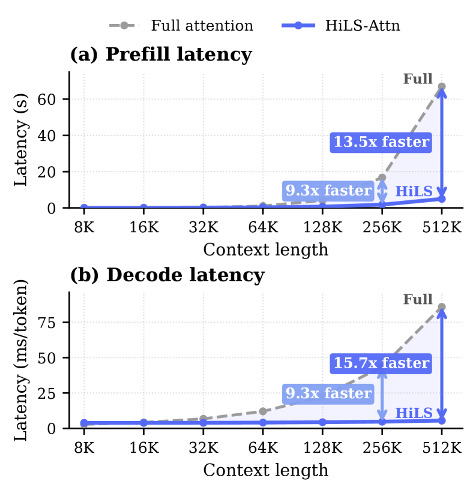
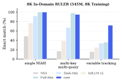
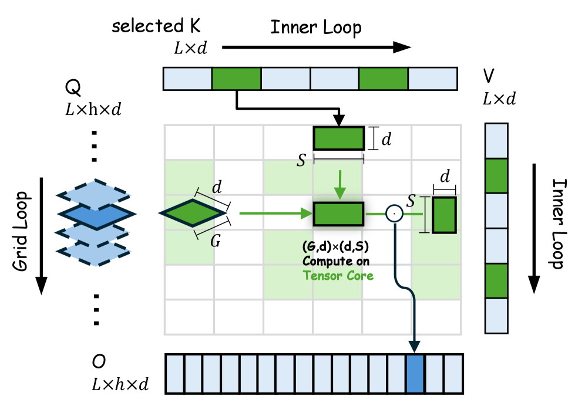
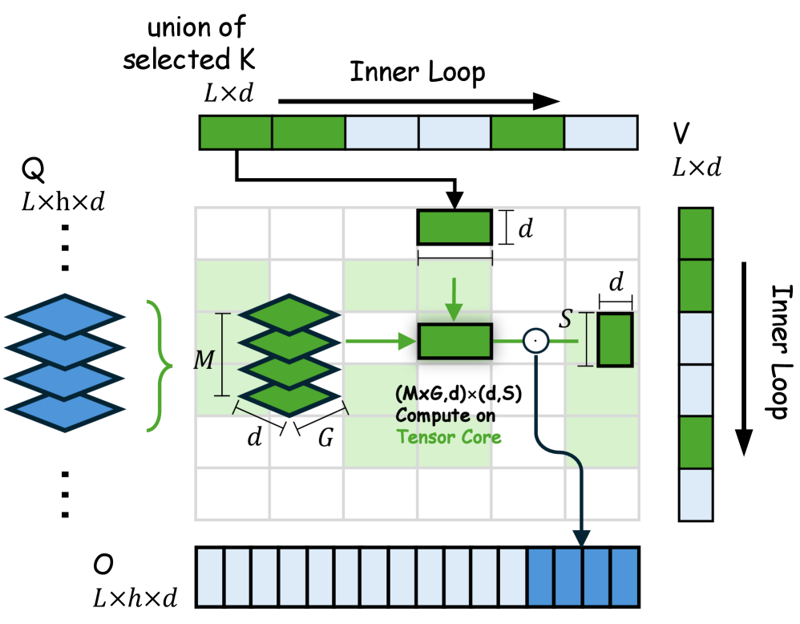

<strong style="font-size:16px;color:#1a6ba0;">要点速览</strong>

- <strong>核心痛点</strong>：块级稀疏注意力的性能始终追不上密集注意力，根因是「块选择不准」，而非稀疏本身不行。  
- <strong>HiLS-Attention</strong>：用层级softmax把检索分数直接纳入注意力前向计算，让块选择过程在语言模型损失下端到端可学。  
- <strong>两个技术支点</strong>：其一用landmark token学出可微的块质量代理（LogSumExp一阶泰勒展开）；其二用层级分解让LM损失直接监督这个代理。  
- <strong>打破取舍</strong>：8K训练长度外推到4M上下文（512×）仍保持90%+ 检索准确率，且长上下文推理比密集注意力更快。

---

## 问题：为什么现有稀疏注意力追不上全注意力

把长上下文按固定大小切成块（chunk），只让每个query关注少数几个被选中的远端块加一个局部滑动窗口，就能把注意力复杂度从平方降到常数。这条路线被称作块级稀疏注意力（chunk-wise sparse attention），NSA、MoBA、HSA等都在此列。

但所有方法在长上下文、尤其是需要精确「上下文内检索」（in-context retrieval）的场景下，都明显落后于全注意力。论文给出的诊断很直接：**瓶颈不在稀疏，而在块选择不准**。

根因有两个。一是块摘要（chunk summary）表达能力太弱：主流做法用块内key的均值池化（mean-pooling）当块代表，当块内logit分布不均匀时，均值既不代表「谁说了算」也不代表「有没有人说了算」。二是选择过程没有端到端优化：挑出top-K块后，摘要和分数就被丢弃了，LM损失根本无法反向传导去压低无关块、抬高有用块。

## 方法：HiLS-Attention的层级分解

HiLS的核心思路是：把注意力**层级化分解**：每个query先独立地对自己检索到的每一个块做注意力、抽出块内信息，再按块的检索分数把这些块的输出融合起来。关键在于第二步：检索分数不是选择完就扔，而是**直接作为前向注意力权重的一部分**参与计算。

图1：HiLS-Attention与全注意力、现有稀疏注意力在困惑度与长上下文检索上的对比概览

### 技术支点一：块质量的线性可微代理

要高效选块，就不该为了算一个块的「质量」而把块内所有token的注意力都算一遍（那是朴素BSA的做法，等于先算一遍全注意力，毫无收益）。论文证明了块质量（LogSumExp形式的注意力质量）可以被**一阶泰勒展开线性化**（Proposition 3.1）。

具体做法是给每个块末尾追加一个特殊的landmark token，用它的query向量作为「替身query」。这个替身query对块内所有key做一次注意力，得到两样东西：加权求和出来的**块摘要key**（k′_c），以及代表token级质量不确定性的**熵偏置**（b′_c）。二者合起来构成一个「熵校准的压缩键」，用于块级路由打分。

这个代理的计算成本对每个块是O(S)，整条序列是O(N)，**不再有平方项**。选定top-K块后，query只对这些常数个块做注意力，路由这一步是唯一的O(N²/S) 项。

### 技术支点二：层级softmax让选择端到端可学

有了可学代理还不够，得让它能被训练。HiLS把注意力质量分解成「块内归一化项」和「块间质量项」，后者直接用上面那个可学代理Ẑ 替换。于是代理分数进入了前向传播：模型先在选中块内聚合信息，再按学到的块质量融合。

**这一步是全文的胜负手**：因为Ẑ 直接影响了最终注意力权重，LM损失的反向梯度就能一路监督landmark表征的学习，自动让对预测更有用的块拿到更大质量。论文实测这个自监督代理甚至超过了朴素BSA本身，说明端到端学习比「先用全注意力算好再模仿」分配得更有效。

图2（原Figure 3）：HiLS-Attention整体架构总览，展示landmark token、层级softmax与块检索的衔接

## 工程落地：四个让它能跑赢的关键设计

### 位置编码换HoPE

实验发现，用标准RoPE在8K长度下训练时，HiLS的困惑度反而比全注意力基线差。换成 **HoPE**（保留旋转周期不超过预训练长度的RoPE维度，其余换成NoPE）后，困惑度反超全注意力。HoPE是支撑长程外推的位置编码关键。

### 低秩Query校准（Q-Cal）

块的摘要key是多个token的压缩，而原始token级query未必适合估块质量。论文加了一个极轻量的低秩适配器（W_up、W_down，秩r≪d）来校准块级打分，**显著提升困惑度和外推能力**，且参数量可忽略。

### GQA下的块选择适配

现代LLM多用GQA，同一组内多个query头共享KV。HiLS让组内每个头**分别计算归一化块权重，再取组内最大值聚合**，用组级分数选top-K。这样只要块对组内任一头重要就被选中，既保住头级灵活性，又能一次gather共享块做批处理。

### 硬件友好内核：一次加载、多次计算

稀疏注意力最大的工程坑是不同token选的块各不相同，朴素实现既慢又爆内存。NSA的做法是逐token加载其块、靠GQA组大小G≥16把Tensor Core喂满，这变相要求query/KV头比至少16，限制了适用范围。

HiLS改为**跨query token和query head一起批处理**：相邻query检索的块高度重叠（文献报告top-K重叠率高达80%），于是把M个相邻query成组，加载它们选中块的**并集**算一次，再让这M个query共享这份KV。Tensor Core维度只需M×G≥16而非G≥16，因此**不依赖大GQA组、在纯MHA上也能用**，还能顺带服务投机解码。

图3（原Figure 4a）：NSA内核，逐token加载选中块，依赖大GQA组喂满Tensor Core

图4（原Figure 4b）：HiLS-Attention内核，成组相邻query加载块并集后一次计算，对GQA组大小无强依赖

### 两种低成本继续训练策略

把已有全注意力模型转成HiLS，论文给了两条路：(1) **Landmark Token Tuning**，冻结基座、只训landmark嵌入和Q-Cal的两个投影矩阵（占总参 <1%），约5B token就能逼近原模型能力；(2) **Full-Parameter Tuning**，随机初始化新增参数、继承其余，配合HoPE时外推收益最大。

## 它能做到什么

在关键结论上，HiLS-Attention打破了「效率换性能」的惯常取舍：仅在8K上下文上预训练，就能外推到 **4M上下文（512×）** 且针检索（needle-in-a-haystack）准确率保持在90% 以上，远超全注意力；7B规模下用50B token继续训练即可把全注意力模型转成HiLS并超越YaRN扩展后的基线。推理侧，在约16K token处与全注意力延迟曲线交叉，之后差距随长度迅速拉大，512K上下文下prefill快13.5×、单步解码快15.7×。

<strong style="font-size:15px;color:#8b6f4c;">结语</strong>

这篇工作的真正价值不是「又一种稀疏注意力」，而是把「块选择」从不可导的硬编码后处理，变成了可由LM损失直接优化的第一公民。一旦选择能被端到端学习，稀疏注意力第一次在长上下文上既更快又更强，而非更快但更弱。  
landmark token + 层级softmax的组合思路，和此前Random-Access Infinite Context、NSA一脉相承，但它在「可学性」这一步补上了关键缺口。值得关注的是它对MHA友好的内核设计：不绑架大GQA组，意味着更多现有架构能低成本接入。  
一个待观察的点：论文用landmark token做块代理表现最好，而无landmark的「每层和共享可学query」变体外推明显退化。工程上要不要为这点外推红利承担landmark token的实现成本，是落地时具体的取舍。

---

【传送门】 
<a class="normal_text_link mp_article_text_link" href="https://mp.weixin.qq.com/s/orPguOPILj08E329SHculw" target="_blank" data-linktype="2">Claude Code 动态工作流Dynamic Workflows深入拆解：编排逻辑从对话变成代码</a> 
<a class="normal_text_link mp_article_text_link" href="https://mp.weixin.qq.com/s/kmOTUebNJRWDuDvnCvJOMA" target="_blank" data-linktype="2">Anthropic Claude Tag 的 Agent 身份革命：当 AI 不再代表你，而是代表自己</a> 
<a class="normal_text_link mp_article_text_link" href="https://mp.weixin.qq.com/s/nj70nxJzUiUETW3SLvpA9Q" target="_blank" data-linktype="2">Agent Loop工程兴起：从Prompter到Loop Designer</a> 
<a class="normal_text_link mp_article_text_link" href="https://mp.weixin.qq.com/s/OlR8uRuYBp8C7V5MnAVjzw" target="_blank" data-linktype="2">TorchTitan：Meta的PyTorch原生4D并行训练框架，训练加速30%</a> 
<a class="normal_text_link mp_article_text_link" href="https://mp.weixin.qq.com/s/M0qN4cXknU_CmZBQm5ChzA" target="_blank" data-linktype="2">你为什么离职？Top AI公司面试秘籍-一套框架从容应对15个套路问题</a> 
<a class="normal_text_link mp_article_text_link" href="https://mp.weixin.qq.com/s/_4vgKCTSir14mhtdvs7_HA" target="_blank" data-linktype="2">美团开源LongCat-2.0 (OpenRouter原Owl Alpha)解读：1.6T 参数，5万国产卡上</a> 
<a class="normal_text_link mp_article_text_link" href="https://mp.weixin.qq.com/s/pCRjhls1WFaiRglb2MtjBw" target="_blank" data-linktype="2">蚂蚁CausalMix: 将数据混合从超参搜索转换成因果推断</a> 
<a class="normal_text_link mp_article_text_link" href="https://mp.weixin.qq.com/s/0zKdjRmWg3TbL5Y3HGO3fA" target="_blank" data-linktype="2">从 P/D 分离到 A/F 分离：从学术原型变成行业标准</a> 

---

参考：https://arxiv.org/abs/2607.02980
