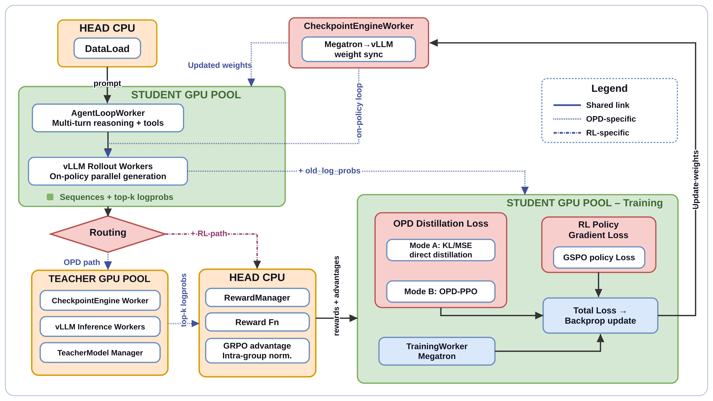
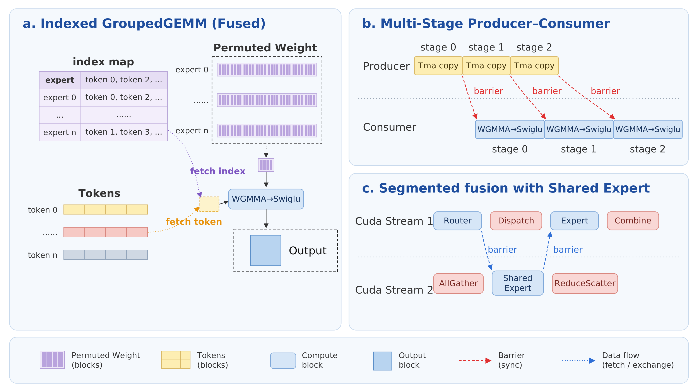
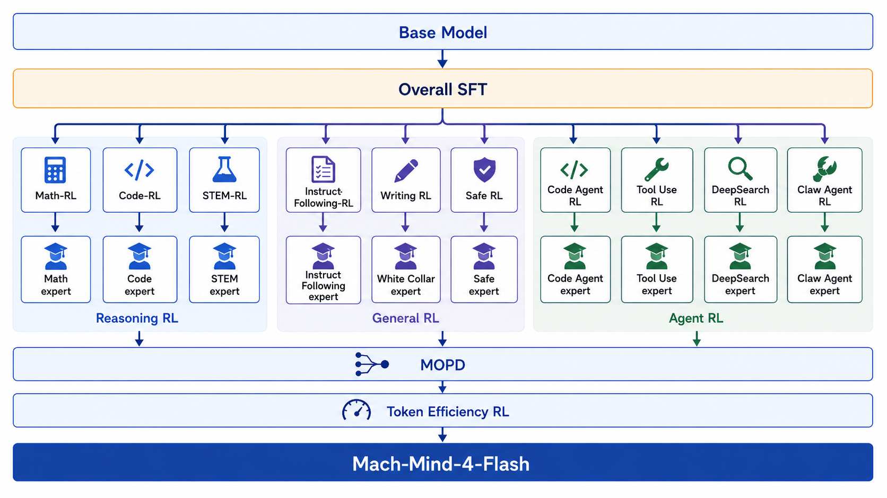
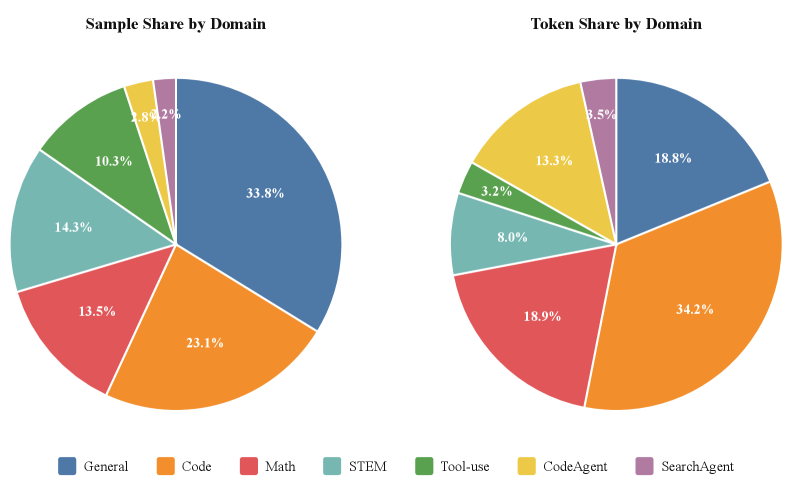
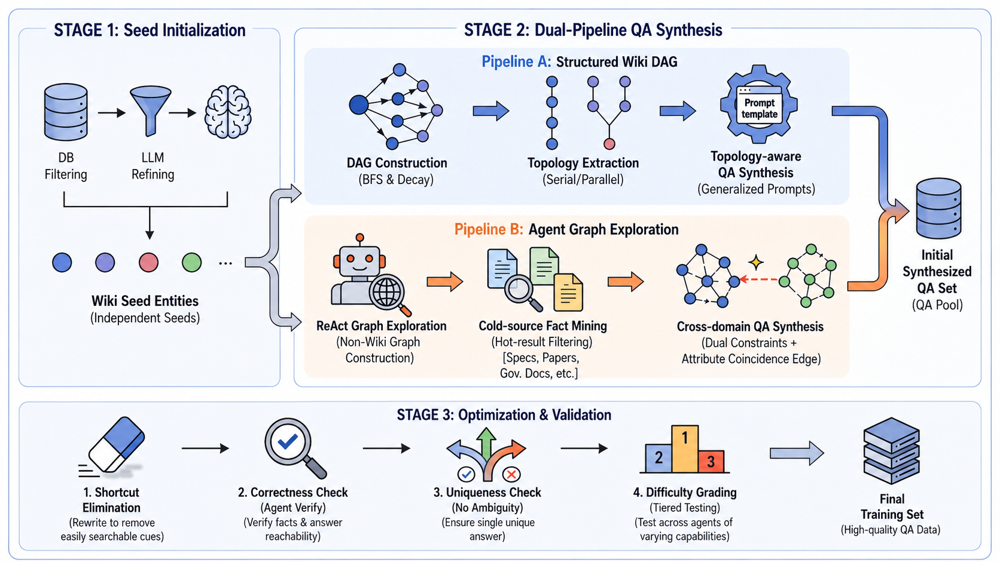
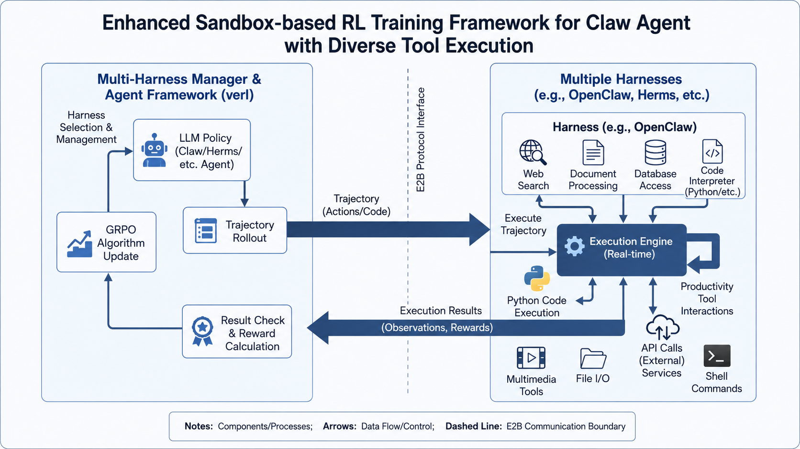
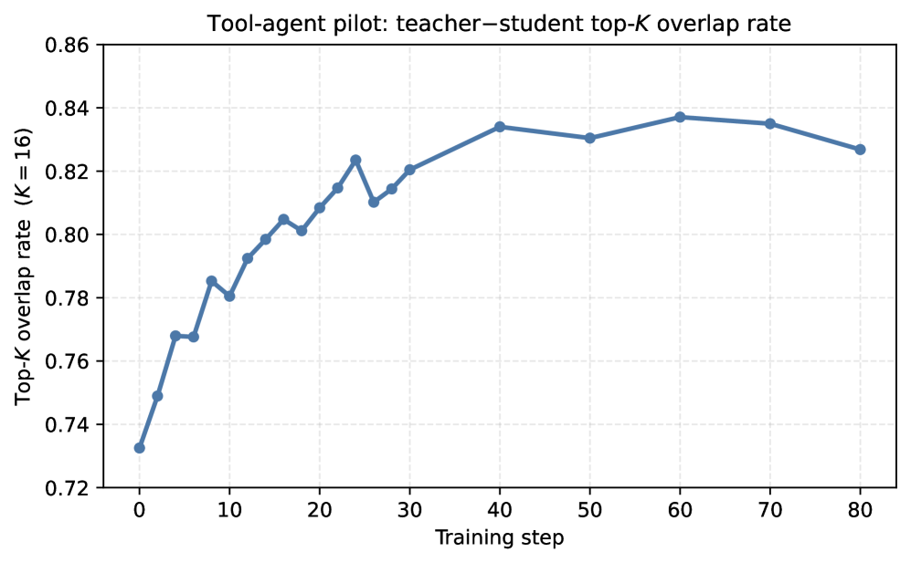
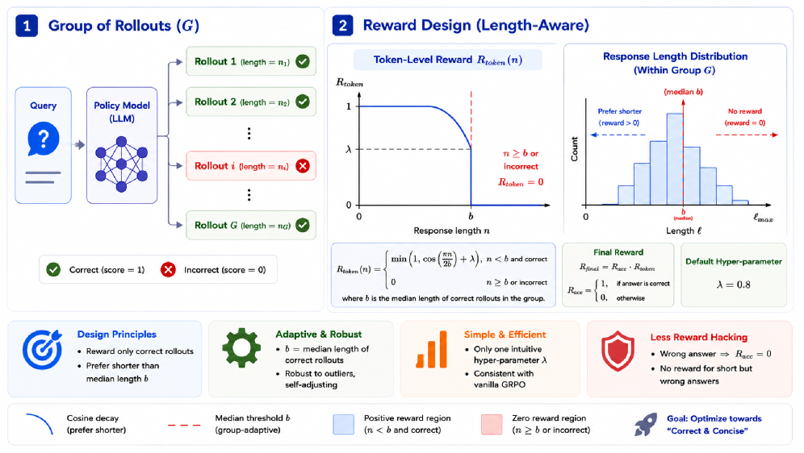
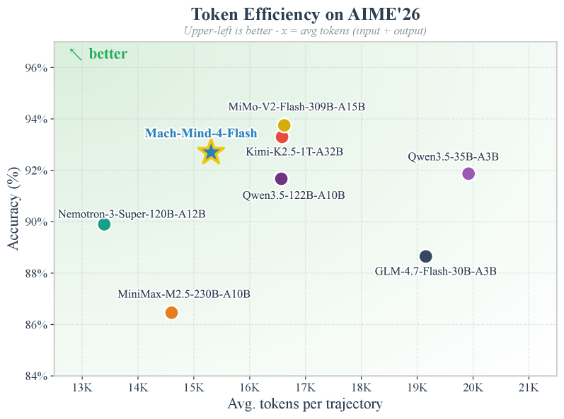
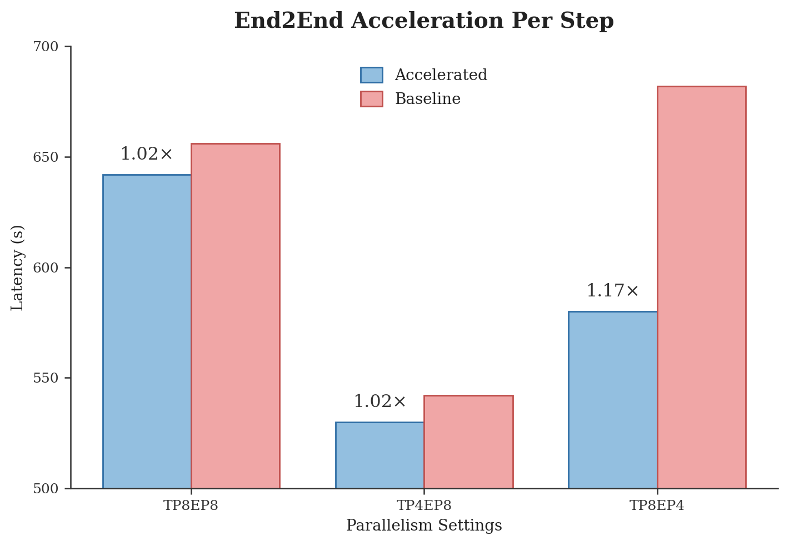

<strong style="font-size:16px;color:#1a6ba0;">要点速览</strong>

- <strong>3B激活干翻120B级</strong>：Mach-Mind-4-Flash是35B MoE模型，推理时仅激活3B参数，却在AIME'26（92.70）、IFBench（82.82）、ClawBench（84.20）等基准上匹配或超越1200亿参数模型，推理成本仅为零头。  
- <strong>三大支柱全是后训练</strong>：不扩预训练算力，靠统一RL/OPD基础设施（17% 端到端提速）、多教师同策略蒸馏MOPD（消除跷跷板退化）、混合中位数长度优化HMPO（推理链压缩19–46%，准确率损失 ≤0.7pp）。  
- <strong>先专业化后整合</strong>：三条RL轨道（推理/通用/智能体）并行训出多个专家，再用MOPD融为一个通用模型，融合后能力不稀释甚至跨域增益。  
- <strong>行为级安全是稀缺能力</strong>：Behavioral-SafetyBench 80.74，领先亚军Kimi-K2.5（67.75）约13分，多数基线仅20–35分。

---

· 标题：Mach-Mind-4-Flash Technical Report 
· 链接：https://arxiv.org/abs/2607.09375

## 一个3B激活参数的模型，凭什么追平120B

扩展模型参数是能力增长的老配方，但推理成本让万亿参数模型在延迟敏感场景根本不实用。Mach-Mind-4-Flash走的是另一条路：把紧凑基础模型通过后训练推向前沿，而不是堆预训练算力。它是35B MoE，推理时只激活3B参数，后训练栈却把它抬到了激活参数量多10–30倍的前沿模型层级。

支撑这个结果的是三件事：可扩展训练基础设施、先专业化后整合的蒸馏融合、不牺牲准确率的token效率。

Figure 1：Mach-Mind-4-Flash在多个能力轴上匹配或超越大得多的模型。仅3B激活参数，就在IFBench、Behavioral-SafetyBench、BrowseComp-zh上领先，在推理、工具使用、智能体编码上与大它3–30倍的模型竞争。

## 基础设施：统一的RL与蒸馏框架

传统知识蒸馏和RL训练流水线相互独立，难以复用RL框架在分布式调度、经验采样、策略优化上的系统优势。Mach-Mind-4-Flash把同策略蒸馏（OPD）深度集成进RL框架，用单一加权损失统一控制：蒸馏路径的 ℒ_OPD（除MSE外支持Forward_kl_TopK等目标）与策略梯度路径的 ℒ_RL，通过权重 α、β 在纯RL、纯OPD、联合三种模式间无缝切换。

**这一集成带来三个直接收益**：复用成熟分布式训练调度，继承异步奖励路由（支持20+ 类任务并行奖励计算），并在单一框架内闭环在线采样、奖励评估、策略优化与蒸馏监督。

Figure 2：RL与OPD统一的训练框架，通过加权损失灵活切换训练模式。

动态多教师架构的核心是「加教师对核心零侵入」：每个教师注册为配置树节点，Rollout后按路由标识异步分发样本，聚合计算蒸馏损失，与学生的训练更新完全解耦。数据层只需加一列路由标识就能绑定并切换任意教师，全程不改训练代码。底层依托Ray集群做透明多节点调度，多教师并行推理与学生训练通过异步机制解耦，教师数量增加不会成为吞吐瓶颈。

算子层acceleration是提速的关键落点。针对MoE MLP最密集的计算，深度集成SonicMoE到Megatron框架，利用Hopper GPU的TMA拷贝引擎、Warp专门化实现索引式分组GEMM及其Gate-Up融合变体，消除token重排、降低显存访问延迟；反向阶段用局部重计算加DeepEP替代All-to-All通信。共享专家采用分段融合（AllGather/专家计算/ReduceScatter与标准专家EP阶段交错），实现通信-计算重叠，并强制共享专家模块TP=1避免通信量激增。

Figure 3：底层算子框架，展示SonicMoE索引式分组GEMM与共享专家分段融合。

## 后训练流水线：先专业化，后整合

整条流水线基于Qwen3.5-35B-A3B：先做SFT打底，再分叉为三条并行RL轨道（推理 / 通用 / 智能体），各自产出多个专家检查点，然后用MOPD融合成一个通用模型，最后用HMPO压缩长度得到部署版。

Figure 4：Mach-Mind-4-Flash后训练流水线，从SFT到三轨道RL专家，经MOPD融合，再到HMPO长度压缩。

SFT语料覆盖七个域。数学与STEM用更强教师拒绝采样合成推理链，按难度过滤只保留挑战当前基础模型的样本；代码域用执行正确性验证过滤长代码与竞赛轨迹。

Figure 5：SFT语料各域样本数与token量分布。

## 多教师同策略蒸馏MOPD：消除跷跷板退化

混合奖励RL训练的典型毛病是能力跷跷板：训好一项就牺牲另一项。MOPD的做法是把每条训练样本路由到对应的冻结教师，学生在自身rollout上以教师分布为监督目标，用token级反向KL。这样既并行化了专家开发、消除了顺序依赖，又避免了混合奖励的退化。

两个从单教师试点沿用的设计选择很关键：教师参数量与学生匹配时重叠率明显高于大得多的教师且质量无损；在教师自身见过的prompt上训练能进一步提升重叠率。

Figure 6：不同奖励策略的对比。

智能体域的RL在真实可执行环境中训练。工具使用走多轮函数调用加迭代奖励校准；深度搜索训练带约束追踪的长周期网页浏览；代码智能体在仓库级环境（SWE-bench类）用交互式RL；Claw智能体训广义自主在线任务。

Figure 7：EnvScaling for Tool-Use的概览。

Figure 8：DeepSearch高精度问答的概览。

Figure 9：Code Agent数据流水线的概览。

Figure 10：Claw Agent训练框架。

## HMPO：把推理链压短，准确率不掉

MOPD融合继承了强CoT模型的老毛病：过度思考。融合模型产生的推理链远长于任务所需，白白抬升推理延迟和成本。HMPO（Hybrid Median-length Policy Optimization）作为最后一步，只做一件事：压缩生成长度，但不拿准确率换。

它构建于GRPO之上，唯一改动是把rollout奖励改成预算感知，由三个组件实现。

**自适应中位数预算**：把预算设为组内正确rollout的中位数长度，隔离失败轨迹的长度噪声，且随策略改进自我收紧，零调参。

**余弦衰减token奖励**：只奖励短于预算的正确轨迹，平滑着陆，避免朴素惩罚导致的奖励hacking。

**乘法式组合** R_final = R_acc · R_token：强制正确性第一、长度第二，错误或超预算轨迹拿零奖励，绝不向错误答案给效率梯度。单遍运行比多阶段基线少用1.5×–2.5× 的GPU小时。

值得注意的是，HMPO只在约6.5K数学问题上训练（组大小10，奖励偏移0.8），学到的长度控制却泛化到代码、科学问答、指令遵循，说明它灌输的是通用的「正确前提下尽量简洁」策略，而非数学专用的偷懒捷径。

Figure 11：工具智能体pilot study。

Figure 11：工具智能体pilot study（续）。

Figure 12：蒸馏训练动态。

Figure 13：HMPO概览。左：为每个正确rollout组推导中位数预算。

## 实验结果：小模型站上帕累托前沿

评估覆盖八个能力轴，所有模型用同一解码设置保证自洽。结果是Mach-Mind-4-Flash以3B激活参数，在多数轴上匹配120B级、竞争万亿级。

**推理与知识**：AIME'26 92.70、AIME'25 92.08，匹配约120B的Qwen3.5-122B-A10B（91.67），与万亿级Kimi-K2.5（93.30）差距不到1分；LiveCodeBench-V6 80.91领先所有同规模模型；GPQA-Diamond 83.08在激活参数少30倍下仍与120B级竞争。

**指令遵循**：模型最突出的强项，IFEval 94.64、IFBench 82.82、LexInstructEval 74.63三项全居首。IFBench领先尤其说明问题，很多基线在IFEval高分却在留出约束上骤降，表明是过拟合模板而非真理解约束。

**安全**：Content-SafetyBench 98.20、Behavioral-SafetyBench 80.74双双居首。行为级安全领先亚军约13分，多数基线仅20–35分，揭示智能体场景行为安全仍是未解难题。

**工具与代码智能体**：BFCL-v4 75.80超所有同规模35B模型、匹配SOTA MiMo-V2-Flash（76.30），并超越Qwen3.5-122B和Kimi-K2.5；τ2-bench 80.04大幅领先；SWE-bench Verified 70.60与120B级相当。

**深度搜索**：BrowseComp-zh 72.31居首，弱模型在此轴跌破45分，长周期约束追踪仍是瓶颈。

**Claw智能体**：ClawBench 84.20超越Kimi-K2.5和Step-3.5-Flash，仅逊Qwen3.5-122B。

## 融合消融：三种结果验证MOPD

三条轨道呈现三种融合结果。推理是能力锚定：移除推理专家导致推理基准掉2–4%，证明它是防退化的关键锚。通用是完全保留：融合模型IFEval 94.84、IFBench 82.92匹配或略超专家，无稀释。智能体是混合结果：SWE-bench保留大部分增益（71.10，差距2.7分），但ClawBench（83.20 vs 80.30）、ClawEval（70.35 vs 67.23）反而超越单个专家，归因于跨域迁移：工具、指令、推理专家的能力补充了Claw专家。

**这恰好印证MOPD相对混合RL的优势**：不是跷跷板退化，而是最小干扰、偶尔协同地整合多样能力。

Figure 14：AIME'26上token效率。Mach-Mind-4-Flash决定性超越Nemotron-3-Super-120B（89.90% @ 13.4K），与Kimi-K2.5-1T（93.30% @ 16.6K）高度竞争。

Figure 15：端到端加速效果。

## 局限与未来工作

把紧凑模型推向万亿级性能时仍有三道坎。MOPD融合在仓库级软件工程等极长周期任务上引入小而一致的差距，脚手架特定行为在蒸馏中被部分平滑。HMPO目前只针对单轮推理，把预算感知压缩扩展到多轮智能体轨迹仍是开放问题。持久多约束网页浏览与长上下文理解是紧凑模型最弱轴，说明仅扩展智能体周期不够，还要提升超长交互中的状态连贯能力。

<strong style="font-size:15px;color:#8b6f4c;">结语</strong>

「后训练压缩能不能替代预训练scaling」这个问题，Mach-Mind-4-Flash给出了一份偏乐观的答卷：3B激活参数在八个能力轴上逼平120B级，说明前沿能力的瓶颈未必全在参数规模，而在后训练系统的工程密度。  
MOPD真正解决的是「多目标如何不互相牺牲」这个老问题。混合奖励RL的跷跷板退化长期存在，路由式同策略蒸馏提供了一条可并行、可扩展、且能保留长周期专门行为的路径，这比单纯堆算力更有方法论价值。  
行为级安全和token效率是这份报告里两个被低估的信号。前者拉开竞品13分，后者把推理成本压到前沿的一小部分，两者共同指向同一个趋势：下一代Agent模型的竞争维度，会从「谁更聪明」转向「谁更便宜且更可控」。

---
参考：
https://arxiv.org/abs/2607.09375
