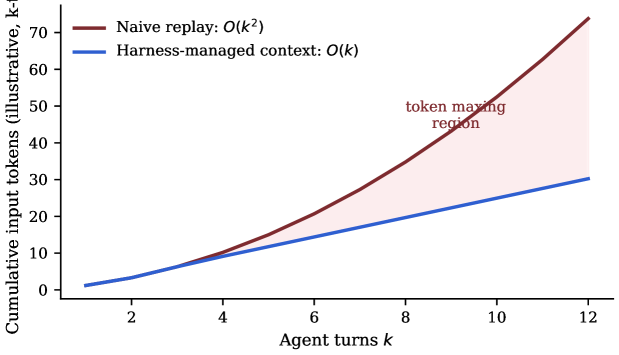

<strong style="font-size:16px;color:#1a6ba0;">要点速览</strong>

- <strong>换编排层，不换模型</strong>：同一组22个企业任务、6个基础模型，只把底层Agent编排（harness）从传统生产循环换成Writer Agent Harness，单任务成本降41%、耗时降44%、token降38%，质量持平（0.78→0.81）。  
- <strong>省线是模型无关的</strong>：6个模型无一例外都变便宜，降幅33%到61%；而质量提升是能力相关的，越强的大模型越能借编排层把结构转化成质量（harness leverage，相关性0.99）。  
- <strong>编排层是比选模型更大的成本杠杆</strong>：本工作负载下，换编排层省的钱超过在"最贵模型"和"最便宜模型"之间切换省的钱。它还是唯一一个效率能乘到企业未来每一代模型上的资产。

---

## 一个被忽视的事实：账单由模型之外的软件决定

一个Agent任务不是一次模型调用。一句"对一下这两份合同，起草批注备忘"，会展开成十几轮：系统提示、工具schema、检索payload、中间推理、工具输出，而朴素实现还会在每一轮把上面所有内容整段重放。任务的总token账单，就是这条循环上各项之和，而这条循环由模型周围的软件治理，不是模型本身。论文把这套软件叫做**harness（编排层）**：它决定什么进入上下文、哪些工具可见、何时检索、何时重试、何时委派、何时停止。

行业的默认反应是花更多token：推理模型每次回答吐出上千个思考token，Agent框架按轮数二次方重放历史，工具生态把每个schema都塞进每次调用。单token价格持续下降，反而资助了这种习惯：团队把token当成边际近乎免费的资源，用消耗量去追能力。这是教科书式的**杰文斯悖论**（效率提升降低单位价格、反而推高总消耗），论文把它命名为**token maxing**：用持续增长的token强度去购买质量，而每token的边际质量在下降。

## 受控实验：只换编排层这一项

这篇论文的核心是一个"自然实验"：任务锁死、模型锁死，只交换编排层。它在6个基础模型（Claude Sonnet 4.6、Gemini 3.1、Gemini Flash 3.5、Qwen 3.6、GLM 5.1、Palmyra X6）上跑同一组22个企业任务，对比两层：

- **基线（baseline）**：传统生产Agent循环，冻结于2026-06-07：约49KB的单体系统提示每轮重放、用正则从文本流里解析XML工具调用、上下文溢出时破坏性截断、按模型分别调提示、用轮询实现等待。
- **Writer Agent Harness（GA配置）**：统一执行路径、只用原生工具调用（删掉XML路径）、结构性压缩替代截断、流式早返回带实时工具状态、把取消和重试做成一等状态、以及子Agent委派能力（基线完全没有）。

两臂的每一个任务、提示、模型标识、评判员和价格表都完全相同，唯一变量就是编排代码。成本由trace埋点记录每轮的token数，再用一份固定的公开价格表在出报告时统一计算，两臂计价完全一致。

图1：token maxing从哪来。朴素全量重放使累计输入token随轮数二次方增长（Eq.3）；编排层管理的上下文（前缀缓存、历史压缩、工具输出卸载）近似线性增长。阴影区是花了钱但没买到质量的支出。

## 编排层怎么重写账单：六个机制族

论文把观察到的降幅映射到账单公式，归纳出六族机制，目标一句话：**让尽量多的token处于（a）被缓存、（b）与决策相关、（c）花在已提交、可恢复的工作里**，并且用结构而非靠模型行为来强制这三点。

**（1）缓存形态纪律：两段式提示。** 每次发出的提示有刻意物理结构：一个字节稳定的前缀（完整工具schema目录、稳定系统提示、只追加的持久转录），后面跟一个每轮重建的易变尾部（时钟、文件列表、计划状态、一次性提醒）。这个切分是作为正确性规则强制的：任何每轮会变的东西都被结构性禁止进入前缀，缓存断点逻辑拒绝在前缀里放断点。在harness仓库里实测，一次前缀相同的调用，7876/7886个提示token（99.9%）作为缓存读命中，按约0.1倍单价计费。因为Agent负载输入主导，缓存命中率是harness能控制的最高杠杆成本变量。

**（2）结构化、增量、缓存感知的压缩。** 在模型输入预算的80%处，旧历史折叠成一个带类型的检查点：持久记忆、可恢复的执行摘要、逐字保留的用户需求、技能引用。最近的4到12条消息（≤30%预算）永远逐字保留；每个检查点把上一个往前折叠，所以压缩成本保持增量；摘要跑在更便宜的辅助模型上、不占付费循环。压缩和缓存是协同设计的：一个每轮重写历史的摘要器会毁掉Eq.4定价的那个前缀稳定性。

**（3）上下文卸载：模型从不付费的token。** 子Agent充当上下文防火墙：子Agent在自己上下文里做广泛阅读或搜索，返回一个封顶8KB的摘要，引用走父模型从不读取的元数据边车；委派有深度上限且对重试幂等。技能用渐进式披露：提示里只带"名称+描述"表，完整技能文档装进沙箱、只在被调用时读。超大工具输出溢出到文件：超过20K字符的shell输出做头尾预览、完整输出写进工作区文件；网页抓取内联8K、溢出整页；文件系统才是无界记忆，上下文只放指针。

**（4）零token等待；持久化即经济。** 等待不是循环而是挂起：需要人工答复、审批或长后台任务时，以零token成本持久挂起，靠入口事件恢复，没有轮询轮。同一持久层还约束灾难性支出：每个事件先写预写日志再流式发出，崩溃或抢占的run在下一个序号处带生成栅栏恢复，工具结果在展示前先持久化。

**（5）失败支出治理。** 每个失败先分类（限流、停滞、超时、流损坏、厂商中断、永久），只有白名单类才落到路由的下一个厂商。中途失败变成被丢弃的尝试：部分草稿被清空，任何副作用都不能来自被丢弃的尝试。断路器在模型连续三次发出字节完全相同的失败工具调用时停止它，并带因果感知的转向。循环上限50次迭代、工具并行上限4。

**（6）模型无关的地板。** 跑哪个模型、走哪个厂商、什么回退顺序，是一份作为数据传入的类型化路由计划：循环永不按模型名分支；每个厂商的流在进入循环前归一化成统一的chunk契约。原生工具调用是唯一调用路径，并为弱模型做schema卫生。这正是第6.2节"模型无关性"和harness leverage现象的结构性解释：**harness定地板，模型定天花板。**

图2：两段式提示。字节稳定的前缀（工具schema目录、稳定系统提示、只追加的转录）携带最多4个厂商缓存断点[C1–C4]；每轮变化的一切被限制在结构性排除在缓存之外的易变尾部。实测相同前缀调用：99.9%提示token（7876/7886）作为缓存读命中。

## 主线结果：同样的活，少38% token

图3：跨6个模型、22个任务的混合效率。保持模型不变，用harness替换基线循环：单任务成本−41%、中位耗时−44%、单任务token−38%。

替换基线后，账单的三个维度同时大幅下降，而质量维持在持平线（n=22下视为持平，不是提升）：

| 维度 | 基线 | Harness | Δ | 判定 |
|------|------|------|------|------|
| 质量（任务完成） | 0.78 | 0.81 | +0.03 | 持平 |
| 单任务成本 | $0.21 | $0.12 | −41% | 决定性 |
| 单任务耗时（中位） | 48s | 27s | −44% | 决定性 |
| 单任务token | 14.2k | 8.8k | −38% | 决定性 |
| 每美元质量 | 3.71 | 6.75 | +82% | 派生 |
| 每百万token完成数（CPM） | 54.9 | 92.0 | +68% | 派生 |

这正是"逃出token maxing"的operational定义：token兑换率变好了，而不是变差了。

## 模型无关性：每个模型都变便宜

图4：编排层交换下的逐模型效率。每个模型的成本和耗时都下降；降幅区间成本33%到61%、耗时33%到55%。这是编排层的属性，不是任何模型的属性。

逐模型拆开有两个观察。第一是**均匀性**：6个模型、5个厂商、3个权重级别，没有一个例外：每个模型成本至少降三分之一。这是"层级别效应"的签名，如果是某个模型特定行为带来的节省，分布会露出马脚。第二是相对模型选择的**量级**：基线之下，从最贵模型（Palmyra X6，$0.25）切到最便宜（Qwen 3.6，$0.16）只省36%；而保持任意模型、换上harness能省33%到61%。**在这组工作负载上，编排层是比模型菜单更大的成本杠杆。**

降幅最大的落在fast tier：Flash 3.5成本降61%、耗时降55%。这符合Eq.2的分解：对小而便宜的模型，harness开销（重放历史、广播schema）占总账单比例更大，去掉它按比例省得更多。

| 模型 | 成本 基线→Harness | Δ | 耗时 基线→Harness | Δ |
|------|------|------|------|------|
| Claude Sonnet 4.6 | $0.24→$0.15 | −39% | 52s→31s | −41% |
| Gemini 3.1 | $0.19→$0.13 | −33% | 49s→29s | −40% |
| Gemini Flash 3.5 | $0.18→$0.07 | −61% | 60s→27s | −55% |
| Qwen 3.6 | $0.16→$0.09 | −44% | 44s→29s | −33% |
| GLM 5.1 | $0.21→$0.11 | −47% | 47s→29s | −38% |
| Palmyra X6 | $0.25→$0.12 | −52% | 50s→26s | −48% |

## 质量：聚合持平，边缘处随模型能力分化

图5：跨48个能力×模型单元的质持平。每个点是某模型某能力的分数，基线(x)对harness(y)。对角线以上的点表示在harness下改善：30个改善、11个持平（|Δ|≤0.02）、7个回退。所有回退都落在三个较小模型上，集中在最吃编排的能力（MCP、Playbooks、Presentations）。

全部48个能力×模型单元里，质量重心在对角线之上或之上：30个改善、11个持平、7个回退。回退不是随机的：全部发生在Flash 3.5、Qwen 3.6或GLM 5.1上，且7个里有6个落在最吃编排的能力（MCP工具调用、Playbooks、Presentations）。而前沿模型和Palmyra恰好在那些类别改善最多（MCP：Sonnet +0.10、Palmyra +0.10；GDR：Sonnet +0.10、Palmyra +0.12）。**同一个更丰富的harness，强模型把它转化成质量，弱模型感受到的是负载。**

## harness leverage：编排升级的回报随基线能力线性增长

把每个模型在八个能力上的平均分压成一个数：它从这次交换里榨出了多少质量：Palmyra X6 +0.079、Sonnet 4.6 +0.073、Gemini 3.1 +0.050、GLM 5.1 +0.028、Flash 3.5 +0.010、Qwen 3.6 −0.031。对基线强度画图，关系近乎线性（r=0.99，6个点，故为"提示性"而非定论）。论文把这条斜率叫做**harness leverage**：模型把编排结构转化成质量的速率。

图6：harness leverage随基线能力放大。采用harness带来的平均质量增益（八能力均值）对模型基线强度。越强模型从同一编排升级里榨出越多质量（r=0.99，n=6，提示性）。

经济含义是不对称的、且有用：**效率增益是无条件的，质量增益是靠能力赚来的。** 一个弱模型在harness下照样拿到44%到61%的成本削减，只是它不会同时变得更好。这就把"升级harness"的两个理由解耦，各自可以单独计价。

## 新能力及其地板：子Agent委派

harness唯一真正新增的能力：把工作委派给派生的子Agent：只有两个最强模型跨过了可用可靠性门槛（Palmyra X6 0.86、Sonnet 4.6 0.85），在Gemini 3.1（0.70）和GLM 5.1（0.58）上退化，在fast tier（0.42–0.45）还不可靠。这是harness leverage最尖锐的形式：一个编排特性自带能力地板，低于它去暴露这个特性，产生的是失败而非功能。

| 子Agent | Sonnet 4.6 | Gemini 3.1 | Flash 3.5 | Qwen 3.6 | GLM 5.1 | Palmyra X6 |
|------|------|------|------|------|------|------|
| 得分 | 0.85 | 0.70 | 0.45 | 0.42 | 0.58 | 0.86 |

委派还有独特的token经济画像：子Agent上下文是scope限定的，所以委派token花在一个有界的旁路循环里，而不是膨胀父上下文，这正是第4.3节的上下文防火墙契约：封顶摘要返回、引用走边车、父循环从不替子Agent的探索买单。

## 几个单任务样本：token去了哪、换回了什么

四个例子能看见聚合数字背后的分布：三轮Medicare检索对话从0.60升到0.90：全集里最大的单次质量跃升：背后是检索塑形送了更少但筛选更好的证据，与"长而噪的上下文削弱注意力"的发现一致。身份/拒答在0.90/0.90持平，而成本减半（$0.04→$0.02）：半价的安全行为。合同问答移动+0.07（0.75→0.82）。全集里最贵的多步研究综合，成本从$0.61降到$0.33（−46%）但质量回退（0.80→0.60）：这是聚合持平掩盖的唯一一处真实权衡，由较小模型驱动，也正是论文发布建议对候选模型先按住、等修复而非带病发布的原因。

## 为什么编排层的节省会复利

设一个机群每月跨模型跑N个任务。模型侧优化只改善某一个模型的单任务成本；路由策略改善模型mix；而一次harness改进**同时**把每个模型的单任务成本乘以一个(1−s)因子：并且当模型集合变化时继续乘，因为它实现在模型API之上。实测s∈[0.33, 0.61]对所有六个模型无一例外，这正是harness成为技术栈里罕见资产的原因：**它的回报对"哪家厂商赢下模型竞赛"无动于衷。**

图7：机群规模下的harness节省。混合单任务成本套用到月度任务量。每月一百万Agent任务时，harness比基线每月多值$90k（$1.08M/年）；缺口随量线性放大，并乘到mix里每一个模型上。

按这里测得的混合费率，一个每月跑一百万Agent任务的组织，基线循环下付$210k、harness下付$120k：**单是编排层的一次改动，一年就是$1.08M**。这个节省在AI优化里很不寻常：它模型可移植（实现在API之上，对尚不存在的模型也成立）、随量线性增长（正好长最快的那个量）、还能叠加（单token降价、路由、提示级压缩都乘在它之上而不是替代它）。

## 给工程团队的实操含义

论文在讨论里给出了几条可以直接落地的判断线。**改KPI才能逃出token maxing**：只报质量的团队会token-max，因为token是别人的账；报CPM（每百万token完成数）或每美元质量的团队不会。这一组交换把CPM从54.9推到92.0：方向和行业轨迹相反：而质量持平。论文主张CPM应该和quality一样，出现在每一个Agent发布门槛里，理由和芯片设计里performance-per-watt紧挨performance放一样：它是预测账单的那个数。

**按特性需求路由，而非只按难度**：会用到子Agent的请求，不管文本看起来多简单，都应该落在Palmyra X6或Sonnet 4.6上；而一个接地Q&A请求可以走便宜61%的fast tier且质量无损（图5的GDR行：每个模型都改善）。**发布姿态**：两个跨过子Agent地板的模型（Palmyra X6、Sonnet 4.6）可以GA；开放权重候选模型按住等multi-step-research修复；对外主打效率（均匀且决定性）而非质量（n=22下是方向性的）。论文坦言行业报告的诱惑是头条写"+0.03质量"，但站得住脚的头条是"−38% token、质量持平"。

<strong style="font-size:15px;color:#8b6f4c;">结语</strong>

这篇是Writer自家出的、带明显vendor立场的受控实验，作者明确披露了雇佣关系与CTO联合作者身份；但它设计上刻意可审计（冻结基线、锁死提示、两臂同评判同价表、候选模型失败计分而非剔除），结论的可信度高于一般厂商自卖自夸。  
最值得企业读者记住的一句：当团队在比"各家$/Mtok"时，比的是p；而账单是p×τ，τ（token强度）属于harness。把编排层租出去，等于把你自己最能控制的那个变量外包了。  
harness leverage（r=0.99）意味着"换编排层"和"换模型"不是替代关系而是乘法关系：今天省下的效率，会乘到你未来换的每一个更便宜或更强的模型上。这是它区别于一切单模型优化的根本。

---

【传送门】 
<a class="normal_text_link mp_article_text_link" href="https://mp.weixin.qq.com/s/OoHu1yeuh1gzgCfEiPvDuQ" target="_blank" data-linktype="2">RL的下一个大突破：不是优化可验证问题而是把'不可验证'领域变</a> 
<a class="normal_text_link mp_article_text_link" href="https://mp.weixin.qq.com/s/OqtF6ZaWQNu3o-VAWLfqbg" target="_blank" data-linktype="2">榨干GPU性能：流水线解码消除GPU气泡，推理吞吐提升35%</a> 
<a class="normal_text_link mp_article_text_link" href="https://mp.weixin.qq.com/s/2eWh5jZJPHsv0wi9km2nVg" target="_blank" data-linktype="2">NVIDIA TriAttention解读: KV Cache压缩最大的问题不是算法而是两个Infra</a> 
<a class="normal_text_link mp_article_text_link" href="https://mp.weixin.qq.com/s/nVqW9acA7NN1zeALDwRAsw" target="_blank" data-linktype="2">Google新论文RubricEM: 评分标准引导的深度研究Agent训练框架</a> 
<a class="normal_text_link mp_article_text_link" href="https://mp.weixin.qq.com/s/s0Ovn3_tnbbl9jxfAC3WLg" target="_blank" data-linktype="2">阿里Sparse Attention on CXL替代RDMA做KV Cache解耦 推理2.1×吞吐, 9.7×TTFT</a> 
<a class="normal_text_link mp_article_text_link" href="https://mp.weixin.qq.com/s/FTsibdpbEjvoPWtxGqgxkQ" target="_blank" data-linktype="2">小米MiMo罗福莉后训练新范式MOPD: 多教师同策略蒸馏，多领域无损</a> 
<a class="normal_text_link mp_article_text_link" href="https://mp.weixin.qq.com/s/HnGKVp45C-GApBJ-LleP6g" target="_blank" data-linktype="2">小米MiMo罗福莉:8卡GPU让1T参数模型跑出1000 TPS , FP4+DFlash+TileRT全解</a> 
<a class="normal_text_link mp_article_text_link" href="https://mp.weixin.qq.com/s/3btXHAVd8_x5CM5CWETc2g" target="_blank" data-linktype="2">Agent卷向AI Infra: SGLang团队用硬核Agent优化框架和CUDA Kernal性能</a> 
<a class="normal_text_link mp_article_text_link" href="https://mp.weixin.qq.com/s/FkaboLbPXA36kHkDgv8aSQ" target="_blank" data-linktype="2">Interpreter Skills：当Agent Skill从说明书变成可执行代码</a> 
<a class="normal_text_link mp_article_text_link" href="https://mp.weixin.qq.com/s/VwQP-AZcHMYksmMLHOy_FQ" target="_blank" data-linktype="2">从Token流到Agent流：LangChain全新流式架构深度解读</a> 
<a class="normal_text_link mp_article_text_link" href="https://mp.weixin.qq.com/s/a0ZppQR7VpVc_xEDqgYY9w" target="_blank" data-linktype="2">Prompt →Context→Harness演变背后的逻辑：认知逐步外化，为模型减</a> 

---

参考：https://arxiv.org/html/2607.06906v1
