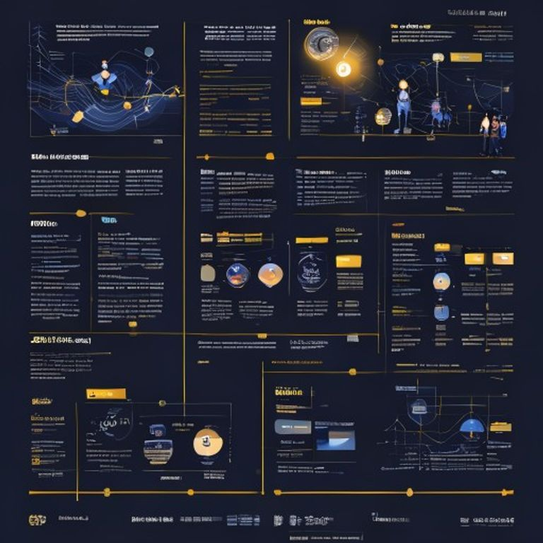
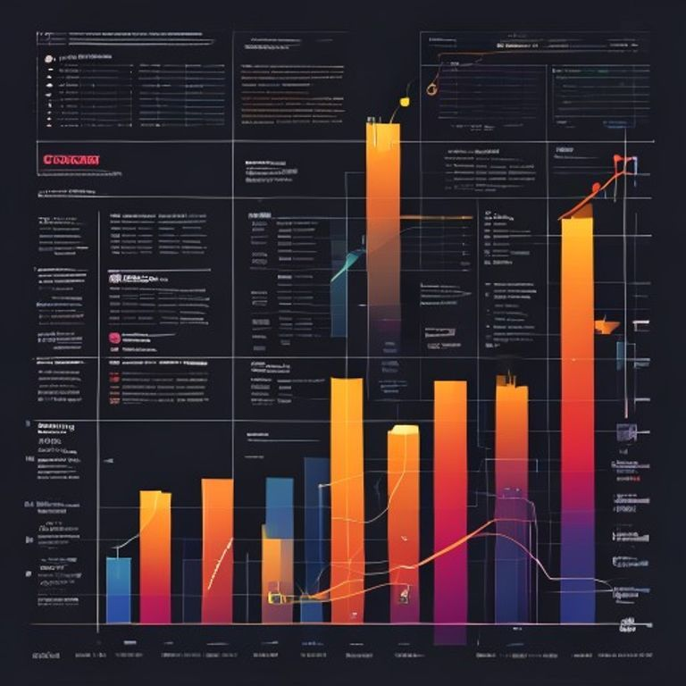
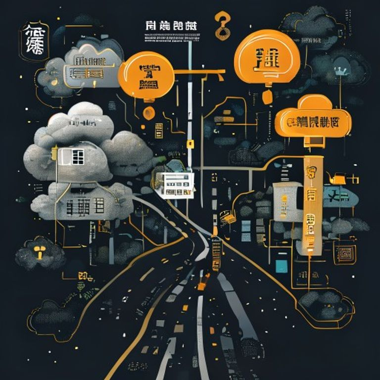

# 美国四巨头在8周内做出相同决定：All-in FDE

**起因：一个数字改变了游戏规则。**

MIT 的 NANDA 研究发现，**95% 的企业 AI 试点项目对利润没有可衡量的影响**。几乎每个企业 AI 项目都做出漂亮的演示，然后在触及损益表之前就夭折了。

模型本身不是问题。问题在于它周围的一切：

- 代理无法触及的遗留系统
- 混乱的数据
- 困在某人脑子里的知识
- 不愿交出访问权限的安全团队
- 没人针对代理构建的工作流程

有人得走进那个泥潭，让它运转起来。

那个人，就是 FDE。

## 什么是 FDE？

Forward Deployed Engineer，直译叫"前部署工程师"。

这个角色二十年前由 Palantir 创造。他们不光卖软件就走人，而是把自己的工程师进驻到客户内部。工程师坐在客户大楼里，搞清楚业务的混乱现实，**第一天就交付能运行的代码**，而不是一堆幻灯片。

行业当时叫它"昂贵的咨询服务"，置之不理。

然后 Palantir 的股价暴涨超过 500%（三年涨 789%，市值达 3249 亿美元）。人们不再笑话了。

## 土地争夺战：四巨头在八周内的集体决策

然后，在短短不到两个月内，四家科技巨头做出了完全相同的决定——

### Anthropic · 5月

与 Blackstone、高盛和 Hellman & Friedman 合作，成立**15 亿美元的 AI 企业服务合资公司**。将 Claude 的 Applied AI Engineer（他们自己的 FDE 叫法）嵌入中型企业内部。

### OpenAI · 5月

成立 **OpenAI Deployment Company**，主要由 OpenAI 拥有，TPG 领投，**超过 40 亿美元** 资金支持。他们还收购了伦敦 AI 咨询公司 Tomoro，带来约 150 名已培训的 FDE 直接上阵。

### Amazon (AWS) · 6月30日

AWS 宣布投资 **10 亿美元**，成立专门的 Forward Deployed Engineering 部门。副总裁 Francessca Vasquez 表示将配备"数千名"FDE，首批合作客户包括 NBA、NFL、Allen Institute 等。

### Microsoft · 7月2日

微软宣布成立 **Microsoft Frontier Company**，投入 **25 亿美元和 6000 名工程师**，已进驻 LSEG、Unilever 和 Novo Nordisk。

一个细节说明一切：Microsoft 拒绝用 FDE 这个标签，叫它"超越"那个。**当一家巨头改了你的 idea 的名字，你的 idea 就赢了。**

Gartner 预计，到今年底，**85% 的科技供应商将建立 FDE 计划**作为核心 AI 交付模式。

## 瓶颈转移了

不是"谁的模型最聪明"，而是"谁能真正部署它并驱动成果"。

整个行业在八周内围绕这一点重新定价。

FDE 职位招聘量一年内涨了 **800%**。薪资从 **30 万美元起步**，到超过 **百万美元** 不等。Anthropic 和 OpenAI 的资深 FDE 总包轻松突破 **78.5 万美元**，Principal 级别超过 **120 万美元**。

## 没人说出口的那部分

FDE 会给你带来成果。这是真的。

但问个更难的问题：**参与结束后，谁保留了智能？**

价值必须存在于某个地方：

- 在供应商拥有的微调权重中
- 在包装了你记忆和上下文层的通用模型中
- 在你自己的应用逻辑和数据中

猜猜每个供应商会悄悄把重点放在哪里？

不会是你保留的那部分。

同样角色，却相反结果——**架构决定你得到哪个**。

## 但这里有个反转

这些都不必强迫你的数据通过别人的模型。那是个选择，不是物理定律。

**开源权重模型**如 Llama、Mistral 和 Qwen，现在已足够胜任大多数企业工作，而且能在你拥有的硬件上运行。你的服务器，甚至完全隔离的盒子。提示、文档、上下文，全都不用离开你的大楼。

FDE 也能部署这个。同样工程师，同样第一天交付，只是智能坐在你控制的基础设施上，而不是租来的。

银行、医院和国防部门已经在这么干——因为法规逼的。对其他人来说，这选项摆在桌上。大多数人只是没问。

这不是免费的。你得拥有硬件和维护成本，开源权重在最难任务上仍落后于前沿。但在真正规模化时，经济性会向你倾斜，而且护城河归你所有。

德勤数据显示，**86% 的企业计划将 AI 基础设施预算增加 3 倍以上**，到 2028 年多数将在本地或边缘扩展。

## 所以，对任何进门的供应商来说

真正的问题不是"哪个模型"。

而是——

**"结束后，智能是活在我硬件上，还是你那里？"**

用 FDE。他们管用。

只是让他们进门前就决定：你是在租智能，还是拥有它。

因为这个抉择，就是整个游戏。

---

你会坚持把哪件事留在内部？欢迎评论区聊聊。
