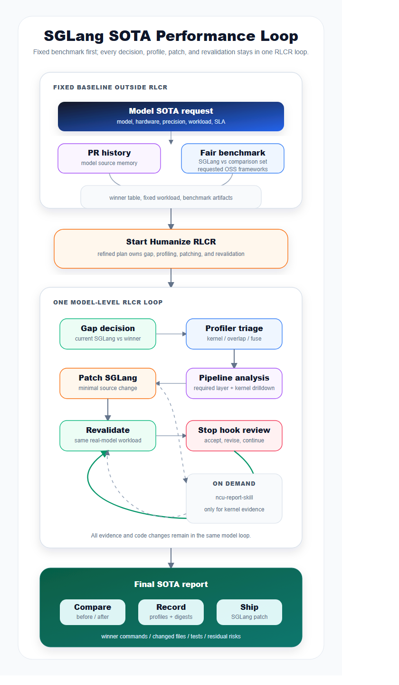
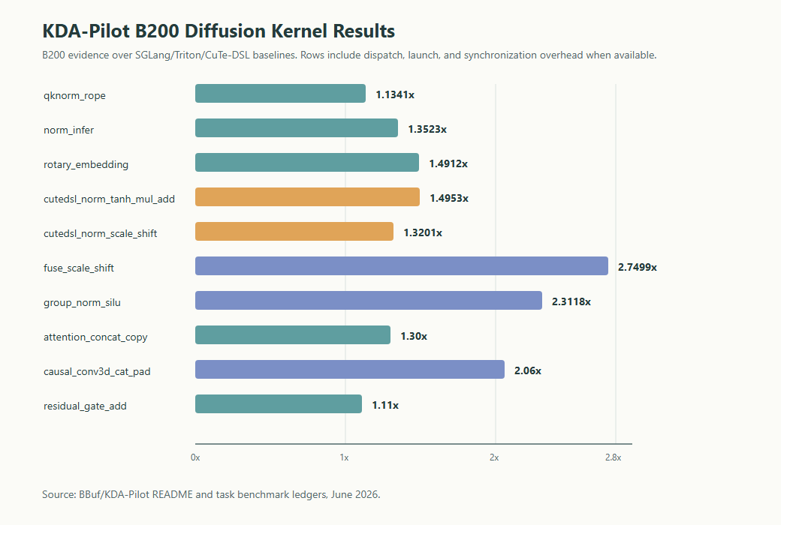

<strong style="font-size:16px;color:#1a6ba0;">要点速览</strong>

- <strong>Agent的价值不在于自动写代码，而在于将工程经验编码为可执行的Skill</strong>：LMSYS团队围绕SGLang推理框架构建了约15个agent skill，覆盖CUDA crash调试、LLM基准测试、容量规划、trace分类、diffusion模型添加等全链路开发场景  
- <strong>SGLang SOTA Performance Loop</strong>：这是基于Humanize/RLCR的系统化性能优化工作流：固定公平基准 → 差距判断 → profiling → 流水线分析 → 打补丁 → 重新验证，每轮都有Codex Review审查证据和风险  
- <strong>KDA-Pilot内核优化方法论</strong>：将CUDA kernel优化拆解为10个独立任务，在固定生产行上获得1.11x-2.75x的加速比，已有3个优化合入SGLang上游。其核心原则是用证据包（固定生产行、正确性门槛、同ABI对比、profiler attribution）替代猜测式优化  
- <strong>四条实践铁律</strong>：启动agent前定义清晰任务边界、读profile前固定基准测试、按kernel计算特性解读NCU结果、信任profile前检查后端和回退条件

---

SGLang的开发已经远远超出了「修一个bug、改一行代码」的阶段。同一个仓库里跑着LLM服务、分布式运行时、GPU内核、扩散模型管线、模型特化路径和生产事件处理。过去，这些经验都存在开发者的脑子里：「怎么启动那个模型来着」「CUDA crash了先看哪个log」「performance PR到底要跑哪些benchmark」。

LMSYS团队最近写了一篇很扎实的博客，讲他们怎么把这些「脑子里的经验」变成了可执行的 `SKILL.md` 文件：让agent替你跑重复的活，把判断力留给人。

**Agent不是代码生成器，是工程流程执行器。**

<strong style="font-size:17px;color:#1a6ba0;">SGLang为什么适合Agent辅助开发</strong>

SGLang是一个面向LLM和多模态模型的高性能推理框架。随着模型家族和硬件路径的扩展，开发中反复出现的问题：启动服务、修复工作负载、收集trace、分类profile行、添加测试：都有清晰的输入输出，天然适合脚本化和重复执行。

关键在于定义边界：相同的基准测试设置、相同的profile解读规则、相同的精度门槛，以及agent应该停止改代码的条件。

本文讨论的agent是一个受工程工作流约束的执行器。重复的开发流程被捕获为skill，让agent处理重复执行、证据收集和状态追踪。开发者负责定义目标、评判证据、审查变更。

<strong style="font-size:17px;color:#1a6ba0;">从Prompt工程到Skill：协议与示例</strong>

一个有用的SGLang skill至少需要回答五个问题：何时用、怎么开始、怎么验证、怎么决策、怎么交付。围绕这些原则，LMSYS构建了当前约15个agent skill的栈：

| 层次 | 代表性 Skill | 解决的问题 |
|------|------------|----------|
| CUDA crash | debug-cuda-crash | 将临时崩溃转化为可离线分析的样本 |
| LLM 基准测试 | llm-serving-auto-benchmark | 在 SGLang 和其他框架之间运行公平、有界、可恢复的基准测试搜索 |
| 容量规划 | llm-serving-capacity-planner | 解析启动日志，解释权重内存、KV cache 预算、CUDA graph 开销、OOM 压力 |
| Trace 分类 | llm-torch-profiler-analysis | 生成 kernel、overlap 机会、融合模式三张表 |
| 流水线/层分析 | llm-pipeline-analysis | 将 trace 切片为前向传递、层和 kernel 流 |
| 模型计算模拟 | model-compute-simulation | 算子级计算模板，估算 FLOPs、MFU、并行化假设 |
| Diffusion 基准/profile | sglang-diffusion-benchmark-profile | 捕获去噪延迟，检查是否使用原生 diffusion 后端 |
| 添加 diffusion 模型 | sglang-diffusion-add-model | 从 Diffusers 管线添加新模型 |
| Diffusion 性能调优 | sglang-diffusion-performance | 选择 torch.compile、预热、并行化、offload 等设置 |
| 生产事件分类 | sglang-prod-incident-triage | 收集 live-server 数据、回放、路由到针对性工具 |
| SGLang 审查/PR 历史 | sglang-humanize-review | 对照维护者讨论模式审查 patch |
| SGLang SOTA 性能循环 | sglang-sota-humanize-loop | 公平对比→差距判断→profile→patch→revalidate 的完整闭环 |

最近合并的几个PR展示了这个流程的实际效果。Router long-context tokenization去重让DeepSeek-V4-Flash上60k token请求的idle TTFT下降了约29%-41%。Qwen3-Next FlashInfer allreduce融合在H100 TP=4上让吞吐从5.49 req/s提升到9.41 req/s，+71.4%。Cohere2Moe NVFP4 fused-MoE路径在1x B300上chat吞吐 +26%，summarization +21%。Kimi Delta Attention CuteDSL prefill kernel在B200上比Triton快1.08x-1.52x。

<strong style="font-size:17px;color:#1a6ba0;">Profiling、Review和Loop Engineering</strong>

SGLang性能工作中最常见的错误就是只看总运行时间：或者打开Perfetto随便看几分钟，凭直觉觉得「这个kernel该被融合」。对agent来说风险更大，因为它很容易把一个视觉上最「热」的kernel误认为真正的瓶颈。

LMSYS的做法是用两步profile分析：先用 `llm-torch-profiler-analysis` 把全局profile转化成三张固定表：Kernel Table（哪些kernel占多少GPU时间）、Overlap Opportunity Table（有没有overlap机会）、Fuse Pattern Table（有没有可参考的融合模式）。然后 `llm-pipeline-analysis` 把热点定位到具体的前向传递、层类型和kernel流。

Figure 1：SGLang SOTA Performance Loop流程图。固定公平基准测试首先建立可复现的基线，后续的差距判断、profiling、流水线分析、补丁和重新验证由Humanize/RLCR循环驱动。

**Humanize/RLCR** 是这个流程的执行和审查基础。Claude Code负责实际干活：跑benchmark、读profile、改代码、重新验证，Codex Review在每轮结束时检查证据、状态和风险。核心命令顺序被明确编码：写任务草稿 → 生成plan.md → 启动rlcr循环 → 所有决策保存在本地workspace。

**Codex Goal** 提供了一个更低成本的实现。去掉双角色设置，把「公平基准测试 → 差距判断 → profile → patch → revalidate → artifact ledger」写入一个持久化的Goal，让单个Goal连续执行、自我检查和重新验证。

<strong style="font-size:17px;color:#1a6ba0;">KDA-Pilot：CUDA Kernel优化的模块化路径</strong>

模型级优化之外，内核优化有更严峻的扩展问题。没有独立于硬件和工作负载的「最佳kernel」。同一算子需要H100、H200、B200、B300上不同的实现。不同模型架构暴露不同的tensor形状和布局约束。搜索空间是硬件×模型×工作负载的笛卡尔积。

KDA-Pilot的策略是把内核优化拆成独立任务：而不是让agent在整个SGLang仓库里自由发挥。目前B200 diffusion上追踪了10个kernel任务，在提取的生产行上wall-geomean加速比从1.11x到2.75x不等。

Figure 2：KDA-Pilot B200 diffusion kernel加速比汇总。wall时间包含Python分发、wrapper开销、kernel launch和同步开销，比纯kernel device时间更接近真实调用路径。

| 内核任务 | B200 加速比 | 主要优化方向 |
|---------|-----------|------------|
| qknorm_rope | 1.13x | 共享 RoPE staging、Q/K 复用 |
| norm_infer | 1.35x | Warp-row RMS、8B/16B vector 路径 |
| rotary_embedding | 1.49x | 128-bit 向量 I/O、cos/sin hoisting |
| cutedsl_norm_tanh_mul_add | 1.50x | Row-invariant 数学 hoisting |
| cutedsl_norm_scale_shift | 1.32x | Operand-class 分派、16B/32B 向量 |
| fuse_scale_shift | 2.75x | rowgrid/flatvec/exact-C 多路径 |
| group_norm_silu | 2.31x | Split-group stats、channels-last 路径 |
| attention_concat_copy | 1.30x | Single-launch 区域拷贝 |
| causal_conv3d_cat_pad | 2.06x | Flat chunking、16B 向量化 store |
| residual_gate_add | 1.11x | One-pass CUDA 融合（已合入 PR #29361） |

截至2026年6月27日，已有三个KDA-Pilot衍生优化合入SGLang上游：Qwen-Image norm-scale-shift CUDA fast path、Cosmos3 VAE causal Conv3D cat/pad路径、LTX-2.3 residual-gate update路径。

<strong style="font-size:17px;color:#1a6ba0;">四条实践铁律</strong>

博客最后给出了四条在真实开发中打磨出来的规则，每一条背后都有踩过的坑：

**1. 启动agent之前定义任务边界。**
「优化SGLang」太宽泛。一个可执行的目标应该像这样：「让SGLang在Qwen/Qwen3-Next-80B-A3B-Instruct-FP8的2x B200上，在固定1000→1000和8000→1000工作负载下，匹配另一开源推理框架的当前最佳结果。」

**2. 读profile之前固定基准测试。**
如果工作负载在结果已知后还能改，agent会「意外地」优化了一个更容易的问题：不是因为它聪明，是因为你没锁住变量。

**3. 根据kernel的计算特性解读NCU结果。**
单张trace截图不够。下一个代码变更必须由具体指标支持。内存密集看DRAM/L2吞吐和load/store效率，计算密集看Tensor Core利用率和SM busy，延迟敏感看launch数量和同步点。

**4. 信任profile之前检查后端和回退条件。**
一个LLM运行可能悄悄切换了attention后端、禁用了CUDA graph、或者走了跟基准测试不同的wrapper路径：这时候profile trace描述的根本不是目标serving路径。同样的规则适用于diffusion：如果日志显示回退到了diffusers后端，那这个trace就不能当作原生SGLang diffusion的证据。

<strong style="font-size:15px;color:#8b6f4c;">结语</strong>

LMSYS这篇博客最吸引人的地方不是他们写了多少skill，而是他们把「工程知识程序化」这件事本身当作一种值得持续投资的基础设施。这跟把prompt写进Slack频道里的做法有本质区别：后者是经验分享，前者是经验封装。  
值得注意的一点是，博客反复强调agent不会取代开发者，而是会加速「重复执行→证据收集→人的判断」这个循环。但从KDA-Pilot的10个kernel任务中已有3个合入上游来看，agent的有效产出正在从「帮助审查」转向「直接贡献代码」。这中间的边界怎么划：哪些优化交给agent跑、哪些必须人亲自写：可能是未来一年每个高性能系统团队都要面对的决策。  
另外，四条实践铁律中的第三条和第四条其实指向同一个问题：agent很容易收集到错误的数据，然后基于错误数据做出表面合理的决策。固定基准测试、检查回退路径、按计算特性解读NCU：这些规则本质上都是在给agent上「紧箍咒」，保证它在正确的边界内干活。这套方法论对任何尝试用agent做系统优化的团队都有参考价值。

---

【传送门】 
<a class="normal_text_link mp_article_text_link" href="https://mp.weixin.qq.com/s/qcIFzXsBalSGpca5fzJKxg" target="_blank" data-linktype="2">Claude Code动态Workflow Vs. SubAgent Vs. Skill</a> 
<a class="normal_text_link mp_article_text_link" href="https://mp.weixin.qq.com/s/aiJs5CC8Gb6qa_xDRNEjTA" target="_blank" data-linktype="2">Dynamic Subagents：用代码编排Agents，告别逐轮工具调用</a> 
<a class="normal_text_link mp_article_text_link" href="https://mp.weixin.qq.com/s/mFuUJ79DRodIK6shVWOgpw" target="_blank" data-linktype="2">OpenAI GPT-5.6: 安全之外新增Prompt Cache断点+两种推理模式; 放弃版本号</a> 
<a class="normal_text_link mp_article_text_link" href="https://mp.weixin.qq.com/s/xP1cEoO_plRpWItxhqeQnQ" target="_blank" data-linktype="2">Agent Harness Engineering：为什么Agent可靠性的天花板不是模型，而是基...</a> 
<a class="normal_text_link mp_article_text_link" href="https://mp.weixin.qq.com/s/o6pnSWW01pahFQelJSbSPA" target="_blank" data-linktype="2">华为「韬定律」全解析：从 τ 常数到4GHz麒麟，一张时间表看清未来十年芯片路线</a> 
<a class="normal_text_link mp_article_text_link" href="https://mp.weixin.qq.com/s/PLNx54PxO1A0oYc47hz99g" target="_blank" data-linktype="2">Anthropic三连：Claude Opus 4.8-更聪明+诚实；CC动态工作流+算力控制</a> 
<a class="normal_text_link mp_article_text_link" href="https://mp.weixin.qq.com/s/Pdjz39WG9SS6IpWWAJ6pPw" target="_blank" data-linktype="2">Claude Opus 4.8击败Opus 4.7、GPT-5.5和Gemini 3.1 Pro</a> 
<a class="normal_text_link mp_article_text_link" href="https://mp.weixin.qq.com/s/oDZJbvskv_ocNgPUH1DHVA" target="_blank" data-linktype="2">AI暗输出：为何AI价值在GDP统计中失效了</a> 

---

---
【传送门】 
<a class="normal_text_link mp_article_text_link" href="https://mp.weixin.qq.com/s/qcIFzXsBalSGpca5fzJKxg" target="_blank" data-linktype="2">Claude Code动态Workflow Vs. SubAgent Vs. Skill</a> 
<a class="normal_text_link mp_article_text_link" href="https://mp.weixin.qq.com/s/aiJs5CC8Gb6qa_xDRNEjTA" target="_blank" data-linktype="2">Dynamic Subagents：用代码编排Agents，告别逐轮工具调用</a> 
<a class="normal_text_link mp_article_text_link" href="https://mp.weixin.qq.com/s/mFuUJ79DRodIK6shVWOgpw" target="_blank" data-linktype="2">OpenAI GPT-5.6: 安全之外新增Prompt Cache断点+两种推理模式; 放弃版本号</a> 
<a class="normal_text_link mp_article_text_link" href="https://mp.weixin.qq.com/s/xP1cEoO_plRpWItxhqeQnQ" target="_blank" data-linktype="2">Agent Harness Engineering：为什么Agent可靠性的天花板不是模型，而是基础</a> 
<a class="normal_text_link mp_article_text_link" href="https://mp.weixin.qq.com/s/o6pnSWW01pahFQelJSbSPA" target="_blank" data-linktype="2">华为「韬定律」全解析：从 τ 常数到4GHz麒麟，一张时间表看清未来十年芯片路线</a> 
<a class="normal_text_link mp_article_text_link" href="https://mp.weixin.qq.com/s/PLNx54PxO1A0oYc47hz99g" target="_blank" data-linktype="2">Anthropic三连：Claude Opus 4.8-更聪明+诚实；CC动态工作流+算力控制</a> 
<a class="normal_text_link mp_article_text_link" href="https://mp.weixin.qq.com/s/Pdjz39WG9SS6IpWWAJ6pPw" target="_blank" data-linktype="2">Claude Opus 4.8击败Opus 4.7、GPT-5.5和Gemini 3.1 P</a> 
<a class="normal_text_link mp_article_text_link" href="https://mp.weixin.qq.com/s/oDZJbvskv_ocNgPUH1DHVA" target="_blank" data-linktype="2">AI暗输出：为何AI价值在GDP统计中失效了</a>

---

参考：https://www.lmsys.org/blog/2026-07-02-agent-assisted-sglang-development
