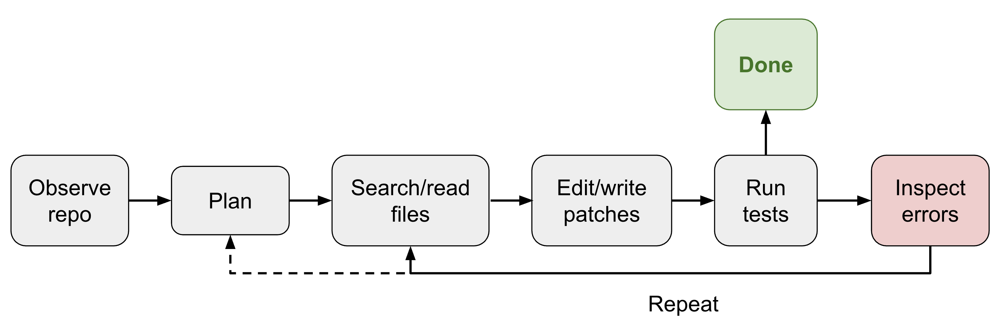
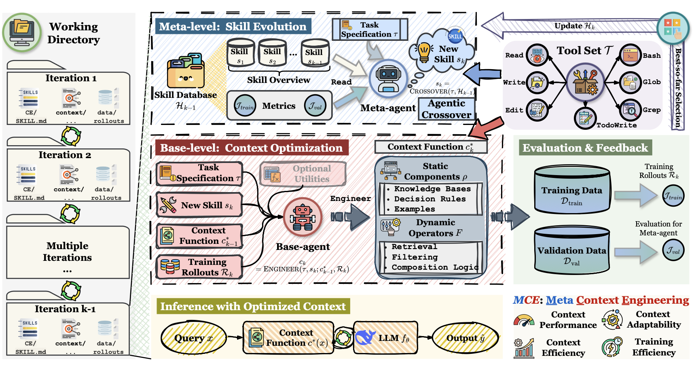
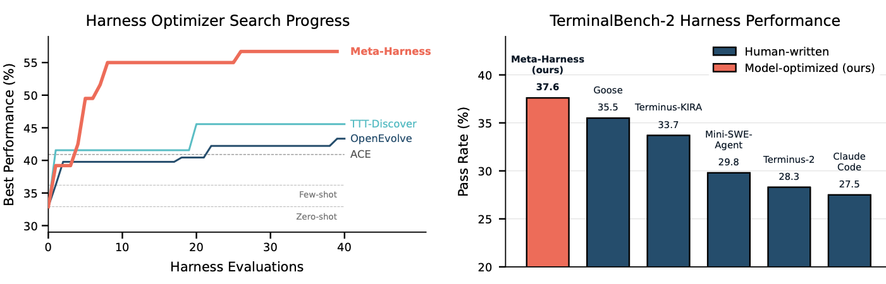
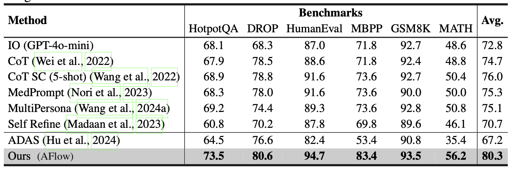
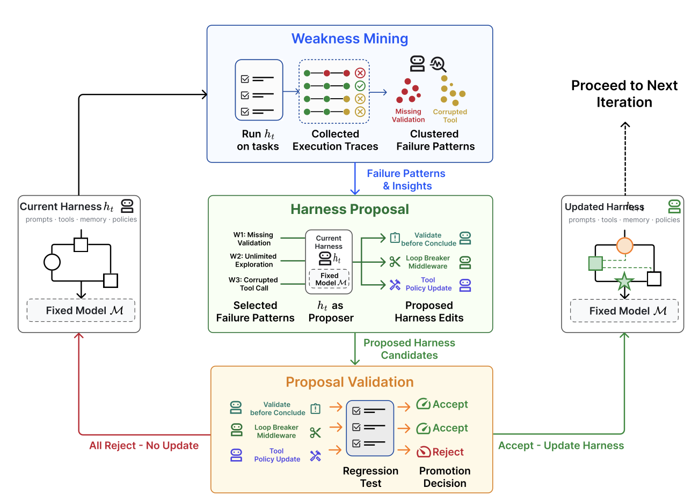
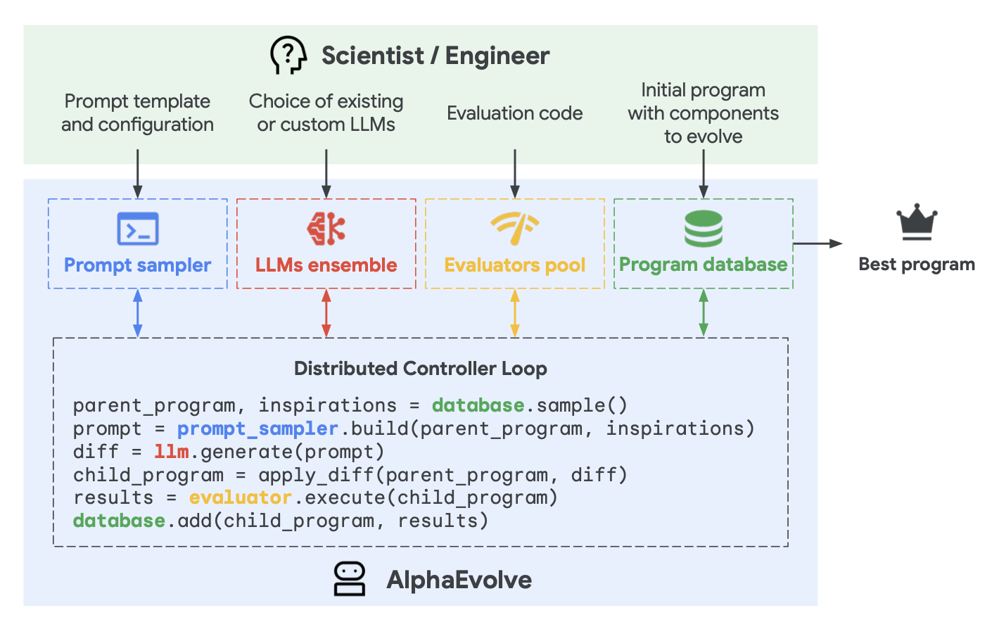
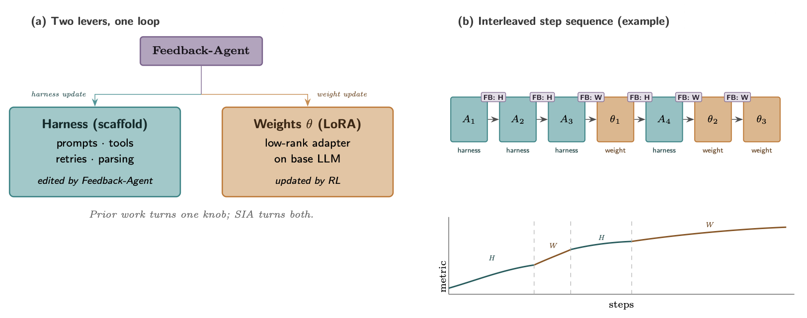

<strong style="font-size:16px;color:#1a6ba0;">要点速览</strong>

- <strong>Harness是AI部署的核心层</strong>：在基座模型与真实世界之间，那一套编排执行、调用工具、管理记忆与评测的系统，正在成为RSI（递归自我改进）的主战场，而不是模型权重本身。  
- <strong>优化对象逐级上移</strong>：从提示词到结构化上下文，再到工作流、Harness代码，最后到优化器代码。代码成了定义和改进Agent的通用语言。  
- <strong>三套自我改进范式</strong>：上下文工程（ACE/MCE）、工作流搜索（ADAS/AFlow）、进化式搜索（AlphaEvolve/DGM）都在把Harness设计变成可自动搜索的空间。  
- <strong>智能仍是天花板</strong>：STOP在GPT-4上随迭代进步，在弱模型上却退化。递归结构本身不够，基座模型必须足够强才能改进机制。  
- <strong>七道未跨过的坎</strong>：模糊的评测器、记忆生命周期、负面结果、多样性坍缩、奖励黑客、长期成功、人类角色，每一道都需要人在循环之外把关。

---

## 递归自我改进：从权重到Harness

递归自我改进（RSI）的概念可以追溯到1965年I. J. Good提出的"超智能机器"，以及2008年Yudkowsky描述的那个特定反馈循环：AI用当前智能去改进产生其智能的认知机制。今天这个循环不一定意味着模型直接重写权重，更可能是模型改进训练流水线和部署系统，从而催生出更强的后继模型。

一个被很多人忽略的事实是：**原始模型和真实世界上下文之间的那一层（deployment system），和模型原始智能一样重要。** Harness正是这一层的核心组成。Claude Code、Codex这类编码Agent的成功已经证明了它的分量。所谓Harness，就是包围基座模型的一套系统，它负责编排执行、决定模型如何思考与规划、如何调用工具和行动、如何感知和管理上下文、如何存储产物、以及如何评估结果。

本文聚焦的，正是围绕Harness工程的研究，以及它如何贡献于RSI。

## Harness设计模式

相比早期"Agent = LLM + 记忆 + 工具 + 规划 + 行动"的框架，Harness工程还多了工作流设计（循环工程）、评测、权限控制和持久化状态管理。它不再是提示词模板，而更接近运行时和软件系统设计。

设计应当刻意保持简单和通用，以便泛化，并参考已有的软件工程实践。Harness与操作系统之间有一个强烈类比：和OS一样，它应当封装复杂逻辑、保持接口简单，而配置、工具接口和协议则会逐渐在整个行业标准化。

## 模式一：工作流自动化

定义一个模型可以在其中操作、测试、迭代的工作流，是自动化的关键。Karpathy的autoresearch仓库就是一个清晰的例子。一个常见的工作流是目标导向的循环：规划、执行、观察/测试、改进，然后再次执行，直到达成目标。

一个简化的Codex Agent循环展示了核心机制：Agent调用工具，工具的响应影响模型的下一步生成。

OpenAI Agent循环示意：Agent调用工具，工具响应影响模型下一步生成（图片来源：OpenAI codex agent博文）

工作流图还强调让模型分析自身的轨迹和失败案例，再通过"Agent运行时"迭代推进，而不是依赖一个静态提示模板。

## 模式二：文件系统作为持久记忆

在长期任务（long-horizon）的Agent系统中，一个反复出现的模式是对丰富状态和产物做简单控制。Harness不应把整个工作流和所有日志都塞进上下文，而应当把持久状态保存在文件里。因为实验日志、代码diff、论文摘要、错误追踪、过去的展开轨迹，往往会增长得比模型训练时适应的上下文窗口长得多。

学习读写和编辑文件系统（通常通过bash）是LLM的基础技能，因此以文件这种简单形式管理持久记忆，会自然受益于核心模型能力的提升。

## 模式三：子Agent与后台任务

一个Harness可以生成多个子Agent并行执行，并监控后台任务。当主Agent需要搜索多个假设、并发跑实验、或把孤立子任务委派出去而不污染主上下文时，这很有用。父Agent于是需要一个小型进程管理器：启动任务、检查日志、取消失败运行、把结果合并回主线程。

**关键设计是让并行显式化且可检查。** 如果子Agent的输出只活在短暂的聊天上下文里，它们很快会过时和隐蔽；如果存成文件、日志和状态记录，模型就能在中断后恢复，并基于自己的执行历史推理。

## 案例研究：编码Agent的Harness

主流编码Agent的核心接口，在Claude Code、Codex、OpenCode和Cursor风格Agent之间已经趋于稳定。它们通常使用类似的循环：借助一组工具，编码Agent能在给定仓库中开发和调试问题，就像人类开发者用IDE一样。

编码Agent的Harness结构：模型 + 工具循环（图片来源：Lil'Log）

它们共享的工具集大致如下：

| 分组 | 工具定义 |
|------|----------|
| 文件系统 | 文件发现：glob、grep、ls；文件读取：read、read_many；文件修改：write、edit、multi_edit、apply_patch |
| Shell 执行 | 运行命令：bash、PowerShell |
| IO | lsp、git 工具如 git_status、git_diff、git_commit |
| 外部上下文 | MCP 工具、Skills |
| 网络搜索 | web_search、web_fetch、浏览器工具 |
| 产物 | 读取文档、图片；生成 HTML、图片 |
| 后台进程 | 如 CronCreate、CronDelete、CronList |
| Agent 委派 | 如 spawn_agent、resume_agent、wait_agent、list_agents、close_agent、interrupt_agent 等 |

## Harness层vs核心智能？

很难预测未来RSI会在多大程度上依赖Harness工程，但近期路径不太可能是一个模型直接重写自己的权重。本文作者给出的务实预测是：**Harness工程会朝元方法论方向演进，也就是改进"获得更好答案的机制"，而不只是改进答案本身。** Harness系统本身成为一个优化目标，启发式规则更少，通用机制更多。

反过来，成熟的Harness支撑起模型自我改进的自动研究循环，而更聪明的模型又防止Harness过度工程化，让系统可持续。最终，许多Harness改进有可能被内化进核心模型行为，但与外部上下文和工具的接口应当保留。这已经在提示工程上发生过温和版本：随着指令微调和推理能力提升，手工提示技巧不再核心，但"指定目标、约束、上下文和评测"的需求没有消失。

## Harness优化

被优化对象的演进大致是：指令提示词 → 结构化上下文 → 工作流 → Harness代码 → 优化器代码。模型越强，我们越能处理更复杂的优化目标和更通用的方法。

### 上下文工程

简单把所有工具响应和模型生成追加进上下文，随任务跨度拉长会很快失控。上下文管理用于为LLM构建更结构化、更简洁的上下文并管理持久状态。

Agentic Context Engineering（ACE；Zhang等人2025）把上下文当作一个演进中的操作手册，而不是越来越长的提示词。它有三个组件维护一份由要点组成的上下文手册：

生成器（Generator）：参考要点产生任务轨迹。

反思器（Reflector）：从成功和失败的轨迹中提炼洞见。

策展器（Curator）：用增量的、逐项的方式更新结构化上下文。

ACE框架：把上下文当作演进中的操作手册（图片来源：Zhang等人2025）

为防止迭代重写中的上下文坍缩和简短偏见，ACE的策展器不重写整个提示词块，而是输出结构化的逐项要点（标识符，描述），以确定性逻辑合并进日志，并定期细化和去重。

ACE从展开中学习洞见，帮我们走向自我管理记忆，但更新规则和整体工作流仍是手工设计的。Meta Context Engineering（MCE；Ye等人2026）进一步把机制（如何管理上下文）与产物内容（上下文中是什么）分离：元优化层面跑技能进化，基础层面跑上下文优化。

MCE框架：元级技能进化搜索上下文管理机制，基础级优化任务上下文（图片来源：Ye等人2026）

MCE不强制规定如何结构化上下文，而是用自由形式的技能存储最重要的任务知识，并迭代地共同进化技能和上下文。一个上下文函数被实例化为专用目录中的一组文件，包含静态的skill.md和动态的上下文/数据展开，都在标准工具集（Read、Write、Edit、Bash、Glob、Grep、TodoWrite）下执行。

### Meta-Harness

Meta-Harness（Lee等人2026）又深了一层：被优化的对象是"决定并优化应当存储、检索和呈现给模型哪些信息的代码"。名字里的Meta意味着它是一个用于优化Harness的Harness。

Meta-Harness外层循环优化算法（图片来源：Lee等人2026）

它的提议者本身就是一个编码Agent，最终输出是帕累托前沿上的一组Harness候选。整个执行历史通过文件系统可访问，因此编码Agent用grep或cat通读历史，而不是把所有内容铲进单一上下文。被提议的Harness是一个文件系统中的字典，包含自己的源代码、分数、展开轨迹和状态更新。循环迭代创建新Harness，只保留合格的那些。

Meta-Harness在文本分类与TerminalBench-2上的表现（图片来源：Lee等人2026）

重要的一课很清楚：**一旦Harness设计变成可执行的搜索空间，强大的编码Agent就能利用人类工程师所用的同一套设计空间。**

## 工作流设计

工作流设计可由领域专家手工完成。以自动研究为例，AI Scientist（Lu等人2026）构建了一条流水线，用于提出研究想法、写代码、跑实验、分析结果、写论文并做同行评审。Meng等人（2026）在ScientistOne中把"可验证性"作为中心约束，每个主张都必须追溯到证据来源并由Chain-of-Evidence检查审计。

AI Scientist流水线：想法生成、实验、论文撰写与评审（图片来源：Lu等人2026）

Autodata（Kulikov等人2026）则被设计成数据科学家，用于生成训练和评测数据。主Agent管理挑战者、弱解算器、强解算器和验证者，目标是合成出"难度恰好合适"的数据（强解算器成功、弱解算器失败）。

Autodata围绕挑战者、解算器、验证者生成合成数据的工作流（图片来源：Kulikov等人2026）

由于设计空间极大，工作流设计本身成了一个搜索问题。ADAS（Hu等人2025）把Agent设计形式化为"元Agent搜索"：用简单Agent初始化档案库，元Agent参考已有解写出新Agent的代码，经过两次self-refine检查新颖性，再把成功候选加回档案库。

ADAS的元Agent搜索示意（图片来源：Hu等人2025）

AFlow（Zhang等人2025）把工作流表示为一张图，节点是调用LLM的动作，边用代码实现逻辑，优化依赖蒙特卡洛树搜索（MCTS）：初始化、选择、扩展、执行评测、加回树中，直到top-k平均分数趋于平稳。

AFlow在工作流候选树上的优化过程（图片来源：Zhang等人2025）

AFlow相比手工方法与ADAS的对比实验（图片来源：Zhang等人2025）

## 自我改进的Harness

上下文工程和工作流设计都只是Harness的一部分。我们需要搜索整个设计空间，把上下文管理、工作流、权限和其他组件一起优化。正如Meta-Harness、ADAS、AFlow所展示的：**代码是定义和改进系统的通用语言。一个Harness就是一段代码，编排了提示词、工具调用、子Agent、控制流、记忆和工作流逻辑的协同。**

Self-Taught Optimizer（STOP；Zelikman等人2023）是递归脚手架改进的早期例子。它的目标不是直接改进解，而是改进"改进器"本身，通过元效用定义的自我改进更新递归得到新版本的改进器。

STOP算法示意（图片来源：Zelikman等人2023）

实验中，改进后的改进器发现了遗传算法、分解改进、多臂提示词赌博机、模拟退火、改变温度、束/树搜索等策略。但一个有警示意味的结果是：**STOP在GPT-4上随迭代提升了下游平均表现，在更弱的GPT-3.5和Mixtral上却退化了。** 仅靠递归结构不够，基座模型必须足够强才能改进机制。这说明Harness改进能实现更好的部署，但智能仍是核心。

STOP发现的自我改进策略示例（图片来源：Zelikman等人2023）

更近期的Self-Harness（Zhang等人2026）让LLM Agent通过"提议-评估-接受"循环改进自己的Harness，分三阶段：弱点挖掘（把失败聚类成以验证器为根据的失败模式）、有界Harness提议、提议验证（用held-in/held-out回归测试，只有无回归的候选才被合并）。

Self-Harness的弱点挖掘、有界提议、验证循环（图片来源：Zhang等人2026）

在Terminal-Bench-2上跑MiniMax M2.5、Qwen3.5-35B-A3B和GLM-5时，Self-Harness学到了针对不同基座模型弱点、模型特定的Harness指令，提升了held-out通过率。但作者也表达了担忧：如果一个程序被允许编辑操作系统，抽象边界就被打破，可编辑面需要恰当设计，权限控制和安全层必须在这个循环之外，围绕奖励黑客的所有挑战仍在。

## 进化式搜索

进化式搜索受自然选择启发，通过变异进化一组解、只保留高适应度的。当搜索空间大或形状古怪、且难用梯度优化却易评测算力时，它正合适，Harness搜索恰好契合。

Promptbreeder（2023）用丰富变异操作优化任务提示词，且变异指令本身也通过进化被改进；GEPA（2025）把反思式提示词与进化搜索结合。AlphaEvolve（Novikov等人2025）是一个编码Agent的进化搜索系统，存储候选程序和提示词，冻结LLM生成改进用的diff，随反复评测保留成功解。

AlphaEvolve工作机制（图片来源：Novikov等人2025）

其设计中几个细节很关键：提示词包含父程序、结果、指令和元信息；用于改进的代码区域用 # EVOLVE-BLOCK-START/END显式标记；元提示词随指令和上下文共同进化。消融实验显示进化过程、上下文、元提示词、全文件进化、使用更强LLM都有价值。

AlphaEvolve的消融实验（图片来源：Novikov等人2025）

变体ThetaEvolve结合进化搜索与RL；ShinkaEvolve引入更省样本的父代采样、基于嵌入的代码新颖性拒绝采样、以及元记事本中的好模式引导。与这些聚焦"解改进"的方法不同，Darwin Gödel Machine（DGM；2025）明确把"可编辑的Harness代码仓库"进化作为目标，Agent被允许修改自己的Harness。后续Hyperagents（2026）引入元Agent控制如何修改现有任务Agent以创造新Agent。

DGM的Harness进化循环（图片来源：Zhang等人2025）

DGM在固定模型（Claude 3.5 Sonnet）下实验，发现的Agent在SWE-bench Verified（20% 到50%）和Polyglot（14.2% 到30.7%）上可媲美甚至超越手工Agent。这类方法在候选解可自动评测、适应度易量化时表现好（矩阵乘法、GPU核优化、算法竞赛、数据中心调度），在评测缓慢、模糊或靠启发式的领域会遇阻。

## 与模型权重的联合优化

Harness进化改变模型周围的非参数化系统。为实现完整自我改进，完全可以同时允许模型更新自己的权重（通过改进训练流水线或测试时持续学习）。

SIA（Hebbar等人2026）是早期尝试，在同一个循环中结合Harness改进和模型参数更新，含三个组件：元Agent提出初始Harness、任务特定Agent执行、反馈Agent根据近期轨迹决定更新Harness还是权重。但实验中有些混淆（任务Agent远弱于元/反馈Agent、基线太弱），作者认为方向有趣、证据初步，而训练稳定性和古德哈特效应等挑战仍悬而未决。

## 未来的挑战

AI Scientist系列工作证明，专家设计的Harness能协调很大一部分自动研究循环（以写论文的形式）。但论文产出不等于科学发现。一个系统可以写出可信手稿，却带着捏造引用、实现漂移或薄弱实验。

Trehan & Chopra（2026）测试LLM能否在极少脚手架下从想法走到论文，观察到六种反复出现的失败模式：偏向训练数据默认值、执行压力下的实现漂移、记忆与上下文退化、过度乐观（"数值胶带"式宣告胜利）、领域智能不足、科学品味薄弱。

通往完整RSI，仍有七道瓶颈：

1. 薄弱而模糊的评测器。自我改进循环在指标可度量、客观的任务上最好用，但研究品味、新颖性、长期科学价值更难度量。
2. 上下文与记忆生命周期。记忆随Agent自主化而增长，上下文工程应当成为智能的核心部分，而不只是软件系统层。
3. 负面结果。LLM在成功/失败样本不平衡的数据上训练，可能不擅长何时放弃假设、报告负面结果。研究Harness应让失败尝试易于保存。
4. 多样性坍缩。进化和RL循环倾向于利用已知高奖励模式，需要机制防止种群坍缩。
5. 奖励黑客。循环会优化任何给定信号，评测器和权限控制应位于演化循环之外，配held-out测试、轨迹审计和人工审查。
6. 长期成功。编码Agent提升了日常生产力，但很少捕捉可维护性、所有权边界、迁移成本、向后兼容性等长期健康。
7. 人类的角色。人类应向上移动到技术栈上层提供监督，系统设计要考虑何时、如何建立接触点。

<strong style="font-size:15px;color:#8b6f4c;">结语</strong>

这篇文章最值得记住的一句话是：RSI的主战场不在权重，而在Harness。当行业盯着"下一个更强模型"时，Lilian把镜头拉到模型与世界的那层胶水上，证明优化这层胶水同样是递归改进的真实路径。  
但"智能仍是核心"不是客套话。STOP在弱模型上退化、DGM要依赖Claude 3.5 Sonnet才跑出好结果，都说明：没有足够强的基座，再精巧的元循环也只是空转。Harness工程放大智能，却造不出智能。  
七道挑战里，最容易被工程化忽略的是"负面结果"和"人类角色"。一个会自我改进的循环天然偏好正样本，而真正能收窄搜索空间的，恰恰是从失败里学。把评测和权限留在循环之外、把人放在对的抽象层级，才是这套系统不失控的前提。  
对个人开发者而言，务实的落点很清晰：先把文件系统当记忆、把工作流跑成闭环、把并行显式化，这三件事今天就能做，不必等元优化器成熟。

---

【传送门】 
<a class="normal_text_link mp_article_text_link" href="https://mp.weixin.qq.com/s/2kSChMJR6gYdGxXIlCgmhw" target="_blank" data-linktype="2">GitHub Copilot突破Agent不确定性验证难题:基于编译理论的PTA完胜LLM-as-...</a> 
<a class="normal_text_link mp_article_text_link" href="https://mp.weixin.qq.com/s/lIoX1-iyYAVYfnB6jaENPA" target="_blank" data-linktype="2">用Hermes Agent搭建Eval Loop，拒绝输出AI垃圾</a> 
<a class="normal_text_link mp_article_text_link" href="https://mp.weixin.qq.com/s/k0cAijThQd4KBftkcEpz6A" target="_blank" data-linktype="2">Cursor的反攻：Coding牛马Composer 2.5诞生，价格只需Opus4的5%</a> 
<a class="normal_text_link mp_article_text_link" href="https://mp.weixin.qq.com/s/a0ZppQR7VpVc_xEDqgYY9w" target="_blank" data-linktype="2">Prompt →Context→Harness演变背后的逻辑：认知逐步外化，为模型减负</a> 
<a class="normal_text_link mp_article_text_link" href="https://mp.weixin.qq.com/s/4Iz5SjE4D240EL4MmKrWZQ" target="_blank" data-linktype="2">OpenAI Dreaming记忆系统：从记住你到理解你</a> 
<a class="normal_text_link mp_article_text_link" href="https://mp.weixin.qq.com/s/0zKdjRmWg3TbL5Y3HGO3fA" target="_blank" data-linktype="2">从P/D分离到A/F分离：从学术原型变成行业标准</a> 
<a class="normal_text_link mp_article_text_link" href="https://mp.weixin.qq.com/s/_4vgKCTSir14mhtdvs7_HA" target="_blank" data-linktype="2">美团开源LongCat-2.0 (OpenRouter原Owl Alpha)解读：1.6T参数，...</a> 
<a class="normal_text_link mp_article_text_link" href="https://mp.weixin.qq.com/s/0dQ7pBJ0NmFt-bOwUCQ5ew" target="_blank" data-linktype="2">Torch解析系列二：Dynamo字节码级的计算图捕获</a> 

---

参考：https://lilianweng.github.io/posts/2026-07-04-harness/
