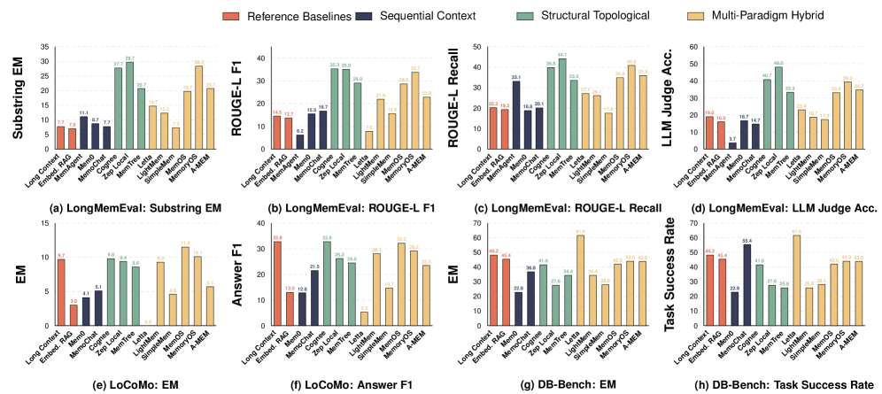
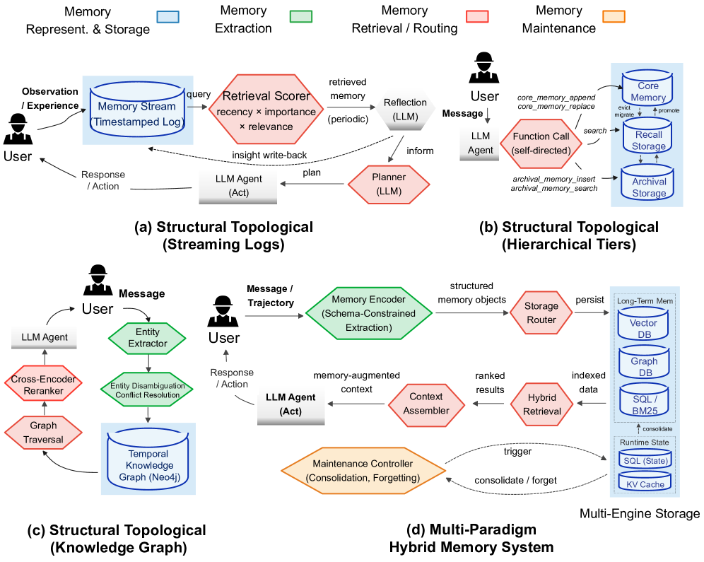
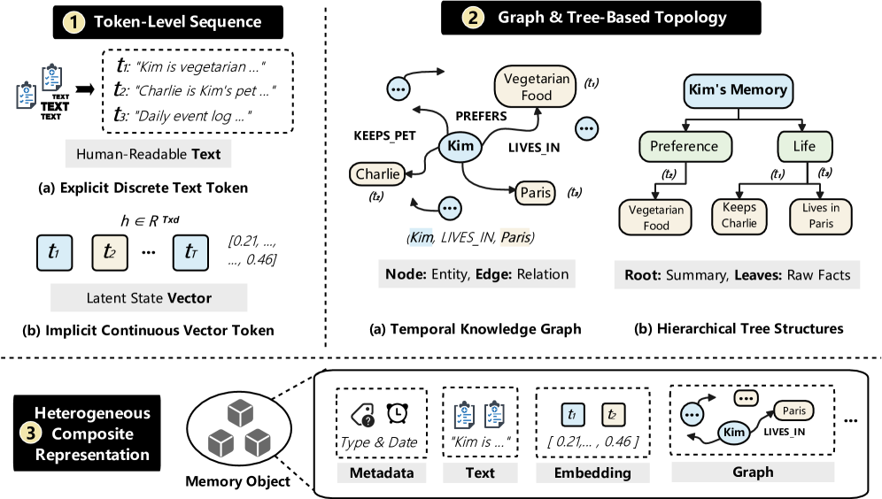
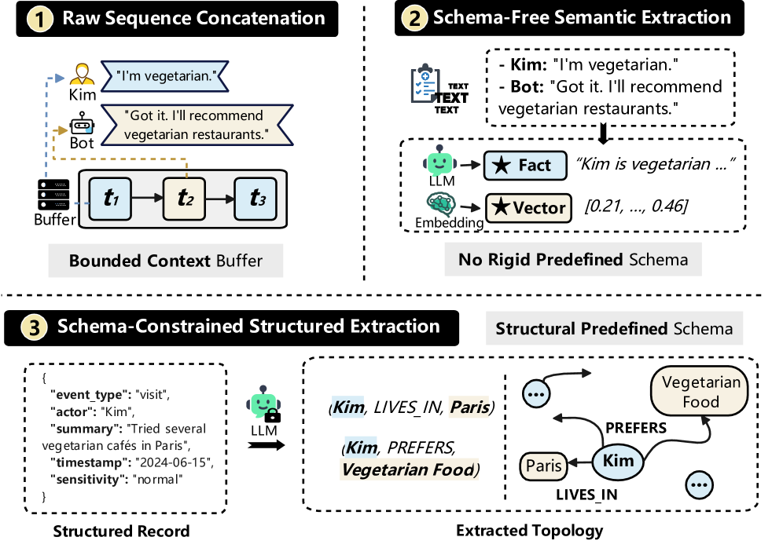
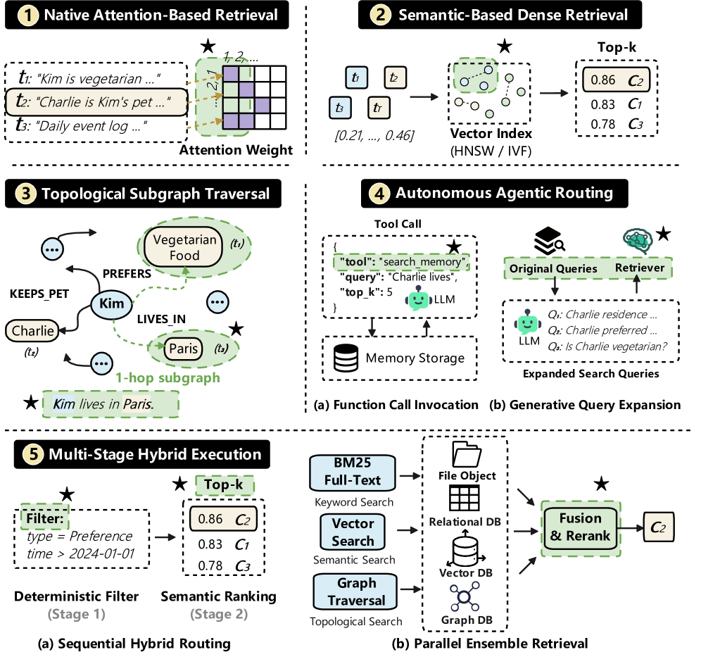
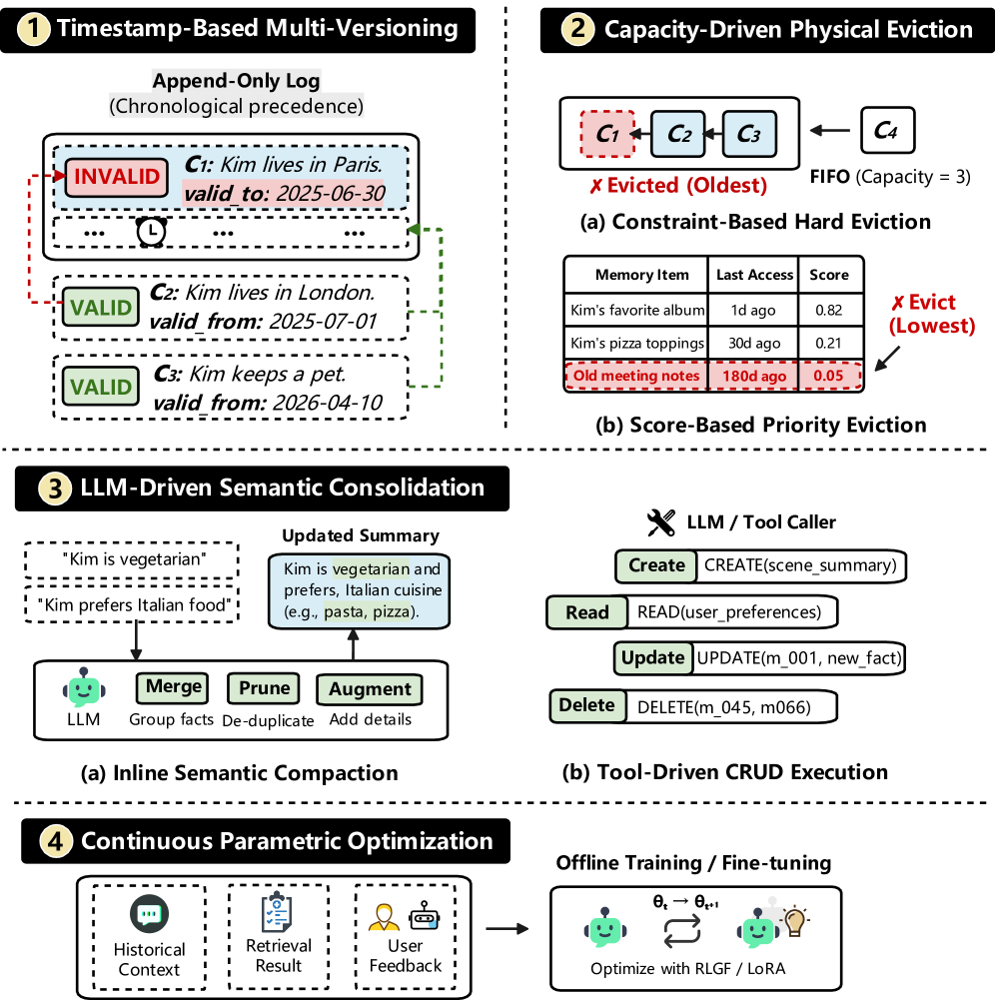
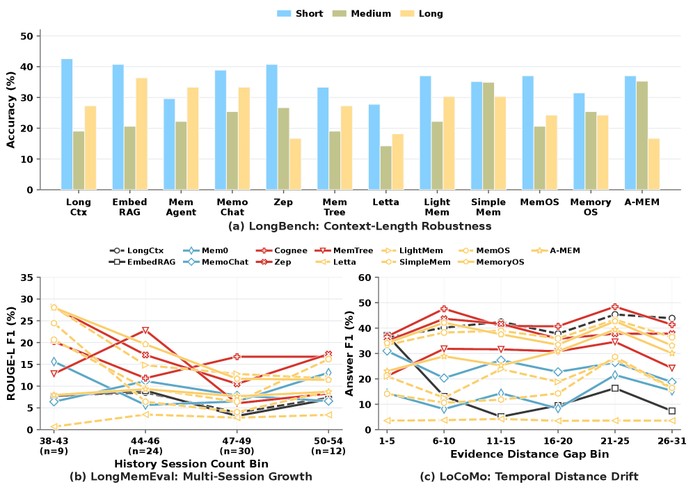
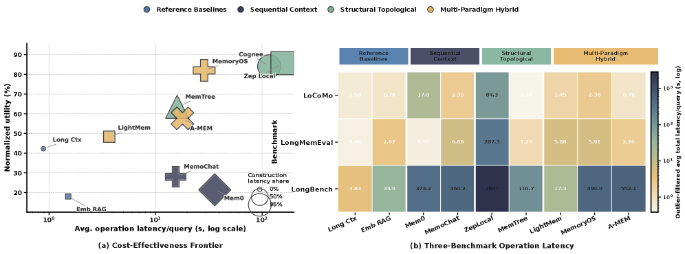
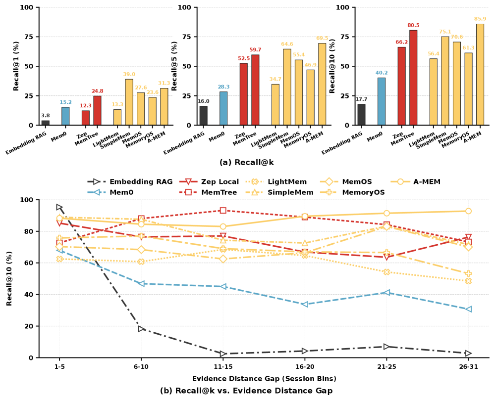

<strong style="font-size:16px;color:#1a6ba0;">要点速览</strong>

- <strong>没有万能架构</strong>：12个记忆系统在5种工作负载上各有优劣，选择取决于任务瓶颈而非抽象优劣  
- <strong>图记忆最优更新</strong>：Zep和Cognee基于图/时间感知的记忆在知识更新和时间推理上表现最佳  
- <strong>灾难性遗忘是真实问题</strong>：平面密集检索和append-only系统在证据距离拉大时性能骤降，而图/整合系统保持稳定  
- <strong>局部维护性价比高</strong>：LightMem和MemTree用局部操作获得最佳性价比，全局重组的系统（如Cognee）效用虽高但延迟高出数量级  
- <strong>保守策略最佳</strong>：写时保留原始内容（不过度提取）、查询时适度融合、维护时保守整合：这个组合最稳健

---

Agent的记忆系统正在从简单的检索增强工具演变为完整的数据管理基础设施。但问题来了：我们真的准备好构建"Agent原生"的记忆系统了吗？

上海交通大学、清华和MemTensor的研究团队在arXiv上发表了一篇系统性的实验研究。他们没有提出新的记忆架构，而是从数据管理的角度，把现有的12个Agent记忆系统拆成四个模块：表示与存储、提取、检索与路由、维护：逐一做横向对比和细粒度消融。

结果是50多页的详尽数据，但核心信息非常清晰：**不存在通用的万能架构，选择取决于工作负载的瓶颈在哪里。**

这篇论文把12个记忆系统（外加Long Context和Embedding RAG两个基线）放到5种工作负载共11个数据集上跑了一遍。先看看全景对比。

图7：三个端到端基准上的记忆系统有效性对比（LoCoMo、LongMemEval、DB-Bench）。

在LongMemEval（跨会话事实回忆）上，Zep以48.0的LLM Judge Accuracy领先，Cognee拿到35.3的ROUGE-L F1。在LoCoMo（长对话准确事实定位）上，MemOS的Exact Match达到11.5。在DB-Bench（有状态数据库操作）上，Long Context以48.20 EM领先，而MemoChat的Task Success Rate最高（55.40）。

**没有一个系统能三榜全优。**

研究者将这12个系统拆成四个模块逐一分析。先看第一个模块：记忆的表示与存储。

图1：Agent记忆系统的典型执行工作流。

## 记忆表示：从Token串到异构复合体

记忆如何被表示和存储，决定了它的容量上限和检索粒度。

**Token级序列**是最简单的形式：把记忆写成纯文本字符串（Mem0）或JSON块（MemoChat），或者更极端的，直接塞进LLM的上下文窗口里（MemAgent控制在1024 Token以内）。优点是简单，缺点是没有结构：要找一个半年前提到的细节，只能硬扫。

**图/树拓扑**走另一个极端：把记忆组织成实体-关系图（Zep的时间知识图谱、Mem0^g的有向标注图）或分层树（MemTree）。实体之间有显式的边，时间和关系都可以查询。代价是构建和维护开销更大。

**异构复合体**则把两者结合起来。MemOS的MemCube分成纯文本、激活和参数三个负载；A-MEM的原子笔记同时携带文本内容、嵌入向量和JSON属性；LightMem的三部分模式用关系型数据库管理结构化字段。

图2：记忆表示方法分类。

存储层面同样有不同选择。有的系统把记忆留在上下文窗口中（临时上下文寄存器），零外部I/O；有的用单一专用引擎（向量DB、图DB、SQL或文件存储）；还有的用异构多引擎组合：SimpleMem同时维护密集嵌入、稀疏BM25索引和SQL谓词。

**关键发现：保留原始内容比增加抽象层级更重要。**

LightMem的消融实验给出了直观的证据：**原始文本（User-Only Raw）在所有四个指标上全面领先**，EM 24.2、Answer F1 38.9。轻量压缩（User-Only Compressed）在LoCoMo上接近（38.6 vs 38.9），但在LongMemEval上骤降（Substring EM 10.7 vs 26.0）。而LLM生成的摘要总结（User-Only Summary）在两个基准上都显著弱于原始文本。更深的分层树也无法恢复已经被摘要移除的信息。

## 记忆提取：写时保留比预过滤更重要

记忆提取决定了原始交互轨迹如何被转化为可存储的记忆原语。

图4：记忆提取方法分类。

最简单的方式是**原始拼接**：对话记录原封不动地拼接起来。**无模式语义提取**则用LLM提取独立的事实语句（Mem0的"User is vegetarian and dairy-free"）。最精细的是**模式约束结构化提取**：LLM填充预定义结构，产生类型化的实体-关系三元组。

消融实验揭示了一个反直觉的结论：**覆盖范围更广、选择性更低的提取方案，对下游性能更好。**

MemOS的Fast Memorize（轻量记忆化）在LoCoMo上的EM达到25.5，而Fine Memorize（精细提取）只有2.5：后者虽然LongMemEval的Substring EM略高（22.3 vs 20.7），但在需要组合推理的任务上几乎崩溃。类似地，MemoChat的启发式主题分组（Heuristic Topic）优于LLM驱动的主题分割（LLM Topic）。

道理很直观：**你不知道未来会问什么。** 写时过滤得越狠，被去掉的细节可能恰好是后续推理需要的线索。保守写时提取、检索时再精确过滤，比反过来的方案更可靠。

## 检索与路由：查询规划比花哨融合更管用

记忆检索决定了如何从已存储的记忆中找到当前查询需要的内容。

图5：记忆检索方法分类。

五种检索方式各有适用场景：
- **原生注意力**：直接在KV cache里扫，零外部开销（MEM1、MemAgent）
- **语义密集检索**：KNN搜向量空间，速度快但精度有限（Mem0、LightMem）
- **拓扑子图遍历**：沿知识图谱的边跳转，适合关系推理（Mem0^g、A-MEM）
- **自主Agentic路由**：LLM自己当查询规划器，生成函数调用（Letta）或搜索条件（SimpleMem）
- **多阶段混合**：顺序过滤或并行查询后融合（Zep、MemoryOS、MemOS）

消融实验显示：**明确的查询规划始终优于直接检索**。SimpleMem加上Planning Only后，Substring EM从17.0提升到21.7，ROUGE-L F1从22.9提升到27.9。但加一层反思（Planning + Reflect）并没有继续提升：一旦路由路径确定了，额外推理带来的收益有限，主要添的是延迟。

在融合策略上，A-MEM的对比显示：**适度密集-稀疏融合优于稀疏偏向融合**（Hybrid-Balanced的24.6 Answer F1 vs Hybrid Sparse-Leaning的23.0）。

## 记忆维护：保守整合是最优默认策略

记忆维护是管理记忆生命周期：如何处理矛盾信息、如何控制记忆增长、何时整合压缩。

图6：记忆维护方法分类。

六种策略中，**时间戳多版本**是最常见的方式：用时间戳和append-only日志标记过期事实，不做物理删除。Zep和Mem0^g通过有效标志位和逻辑无效化来保持历史连续性。

**LLM驱动的语义整合**则让LLM在写时或查询前动态去重和压缩。SimpleMem在事务提交前在线合成语义上相似的断言；MemTree递归触发父节点的语义总结；Mem0通过LLM tool-calling执行显式的CRUD操作。

MemoryOS的消融实验给出了关键数据：**保守合并（Conservative-Merge）提升Answer F1从23.2到23.5**，而延迟刷新（Delayed-Flush）把同一系统降到20.6，强制单主题总结的MemoChat也不如默认设置。

**延迟刷新的隐患在于**：把更新积攒在缓冲区里再一批写回，会让近期证据在查询时处于"半成品"状态：活动信息被分割在多个轮次中，检索到的内容不完整。而**过渡粗粒度的总结**则可能在压缩过程中丢弃了那些当前看起来无关、但后续推理需要的关键线索。

## 长视野稳定性：结构比容量更重要

一个记忆系统的好坏，往往不是用短对话测试出来的，而是看它跑了几十轮之后还能不能找到两周前埋下的一个细节。

图10：(a) LongBench上下文长度鲁棒性；(b) LongMemEval会话历史增长；(c) LoCoMo时间证据距离漂移。

结果很有说服力。**SimpleMem** 在LongBench上从Short到Medium几乎不变（35.2→34.9 Accuracy），而 **Long Context** 从42.6跌到19.0：更大的prompt本身并不能维持答案质量，一旦积累了足够多的干扰内容，性能就断崖式下降。在LoCoMo上差距更尖锐：**Embedding RAG从37.1跌到7.4** Answer F1，而图/整合系统（Cognee、MemOS、MemoryOS）在整个证据距离区间内保持较高水平。

结论很清楚：**长视野下的主要挑战不是"存储更多历史"，而是在合适的抽象层次上组织历史，让远距离的证据仍然可检索、可关联。**

## 运营成本：局部维护的性价比碾压全局重组

Paper在运营成本上的发现同样重要：实用性不仅取决于精度，还取决于在真实场景中能不能跑得动。

图11：记忆系统的运营成本对比。

**LightMem** 和 **MemTree** 处于效率前沿：LightMem以3.67秒的延迟达到48.3 Normalized Utility，MemTree以15.9秒达到63.5。高效的记忆系统不是因为它"更有结构"，而是因为它**把维护操作限制在有界的子集上**。LightMem的分段压缩和有界混合检索让它处于低成本区间；MemTree的路径局部树聚合避免了全局刷新。

对比之下，**Cognee和Zep超过84 Utility需要116.5秒和155.1秒**。高效的记忆系统不是因为它"更有结构"，而是因为它把维护操作限制在有界的子集上。全局图整合、多存储同步或全量记忆重写，在记忆规模增长时很快变成瓶颈。

## 更新鲁棒性：图记忆擅长"打补丁"，混合过滤擅长"查最新"

当知识更新发生时，记忆系统需要可靠地吸收修正后的信息，同时维持正确的时间状态。

图8：LoCoMo上记忆系统的检索结果。

**表2的数据有很强的区分度：**

在 **Knowledge Update**（直接事实修正）上，Zep以44.4 Substring EM和36.8 ROUGE-L F1全面领先：图结构能让新事实精确地绑定到已有实体上，而不是被追加为一团无差别的文本。在 **Temporal Reasoning**（跨时间推理）上，Cognee以18.7 Substring EM和35.8 ROUGE-L F1领先。

反面的极端是Letta（MemGPT）：Knowledge Update的Substring EM只有17.8，Temporal Reasoning只有12.0，在LoCoMo Temporal上甚至0.0 Exact Match。**Append-only存储无法区分"旧版本"和"新事实"，最终返回的全是过期信息：论文称之为"对过去的幻觉"。**

骨干鲁棒性测试（图9）给出了一个令人安心的结论：**更新行为的稳定性主要取决于记忆管道本身，而不是LLM骨干**。MemOS在四种LLM骨干（GPT-5.4-mini、GPT-5.4、GPT-5.4-coder、GPT-5.4-long）上维持32-41的Answer F1区间，而Embedding RAG在所有骨干上都表现不佳。这意味看：**更强的LLM能更好地表达定位到的证据，但不能弥补记忆管道本身的缺陷。**

## 细粒度消融：把记忆系统拆开看

论文最有价值的部分可能是第5节的细粒度组件消融：不是简单地比较"系统A vs系统B"，而是固定其他模块只改一个变量，精确衡量每个模块的具体贡献。

**表示与存储（M1）**：原始文本 > 轻量压缩 > LLM摘要。Raw保留最完整的细节；压缩在LoCoMo上接近但在LongMemEval上大幅落后；LLM摘要两类都弱。

**记忆提取（M2）**：覆盖优先 > 精度优先。粗粒度主题分组优于细粒度LLM分割；轻量记忆化优于精细提取；同时保留用户和助手轮次比只保留用户轮次好。

**检索与路由（M3）**：适度融合 + 查询规划 > 极端融合或无规划。平衡的密集-稀疏融合优于偏向稀疏；明确规划优于直接检索；规划之后再加反思没有明显收益。

**记忆维护（M4）**：保守整合 > 延迟刷新 > 粗粒度总结。保守合并保留跨轮次关联；延迟刷新让近期证据在查询时仍然碎片化；粗粒度总结掩盖稀疏但有价值的线索。

---

<strong style="font-size:15px;color:#8b6f4c;">结语</strong>

这篇论文的可贵之处在于，它在Agent记忆这个"百家争鸣"的话题里，用数据给出了系统化的选择框架：而不是又一个"我们提出了一种新架构"的文章。50多页跑下来的核心结论可以浓缩成一句话：<strong>Agent记忆架构的选择取决于你的任务瓶颈在哪里，而不在于哪一种抽象形式更"先进"。  当前主流的Agent SDK（LangChain、LlamaIndex、CrewAI）基本上都在用向量相似性检索作为默认记忆方案。这篇论文的数据说明了一个不安的结论：平面密集检索在证据距离拉大时性能断崖式下降，从37.1跌到7.4。如果你的Agent需要在长期运行中可靠地工作，默认的向量检索可能是一个被低估的隐患。  另一个值得关注的信号是维护成本的现实约束。Cognee和Zep的效用最高，但延迟也最高：全局图整合在高频操作场景下可能不实用。这和实际工程中的选择很一致：很多产品最终用的不是最准的方案，而是在延迟、成本和精度之间找到可接受的折中点。</strong>这篇论文给出了量化的对比数据来做这个决策，而不是凭感觉选。

---

参考：

https://arxiv.org/html/2606.24775v1
