**Agentic RL 训练指南：8 个框架、6 条原则，帮你搭建靠谱的 Agent 训练系统**

<div style="background:#e8f4fd;padding:14px 16px 10px 16px;border-radius:6px;margin-bottom:18px;">
<div style="text-align:center;margin-bottom:10px;">
<strong style="font-size:16px;color:#1a6ba0;">要点速览</strong>
</div>
<div style="font-size:14px;color:#3f3f3f;line-height:1.75;">
- <strong>Agentic RL ≠ 普通 RL</strong>：多轮轨迹、环境交互、异步 rollout，每一步都比单轮 RL 复杂一个数量级<br><br>
- <strong>模块化是前提</strong>：统一的环境接口（HTTP/gRPC/函数调用）是框架可扩展的基石，AgentGym-RL、Agent-R1、AgentRL 都用这一思路<br><br>
- <strong>长周期用课程学习</strong>：ScalingInter-RL 从短交互预算（8 轮）逐步增加到长预算（15 轮），比一开始给大预算更稳定<br><br>
- <strong>优势归一化不能只按问题组做</strong>：任务级或环境级优势归一化（AgentRL 的 TAN、AutoForge 的 ERPO）比标准 GRPO 组内归一化更稳定<br><br>
- <strong>回声陷阱 & 模板崩溃是新坑</strong>：Agent 在自生成轨迹上 RL 时，推理多样性会快速丧失。高方差数据筛选（RAGEN 的 SNR 过滤）比 KL 正则化更管用
</div>
</div>

AI 圈都在说 Agent，但怎么训练 Agent 是个新问题。单轮 RL 的路数——给个 prompt 生成一段回复就完事——已经不够用了。现在的 Agent 要在长时间跨度上推理、调工具、跟人交互、随时根据反馈调整。这一变，RL 训练的复杂度也跟着翻倍了。

这篇文章系统梳理了 Agentic RL 的最新研究。先拆解 Agent 的基础组件和 MDP 公式，再逐一考察 ToRL、AgentGym-RL、ScalingInter-RL、Agent-R1、AgentRL、AutoForge、RAGEN 和 RAGEN-2 等 8 个框架，最后归纳出 6 条设计原则。

**从 Agent 的基础组件说起**

Agent 不只是 LLM——但定义可以很简单。在最简层面，Agent 就是在 Agent 循环中运行的 LLM，利用工具和自身的推理能力来解决复杂问题。下图展示了一个 Agent 系统的高层结构：LLM 骨干网络、指令、工具、环境，这些组件在 Agent 循环中协同工作——生成输出、执行工具调用、吸收环境反馈、重复，直到满足终止条件。

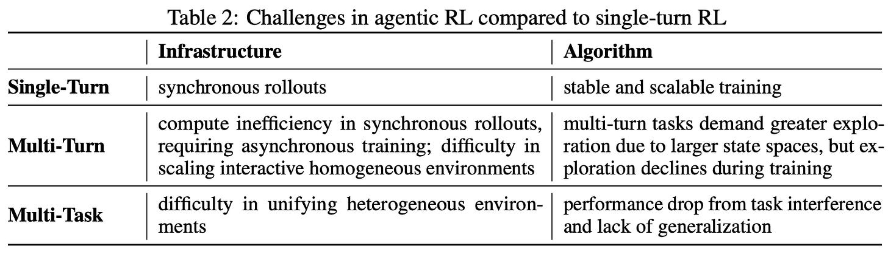

这些组件构成了 Agent 框架（harness），它控制着 LLM 的编排和集成细节。

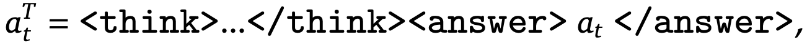

**LLM 骨干网络**是经过训练的普通 LLM，但要能在 Agent 上下文中运行好，需要高级的指令遵循、工具调用和推理能力。推理模型（能产生思考轨迹的模型）在这里特别有用。Agent 需要把复杂问题分解成小部分逐一解决，还得能自我反思、从错误中恢复。

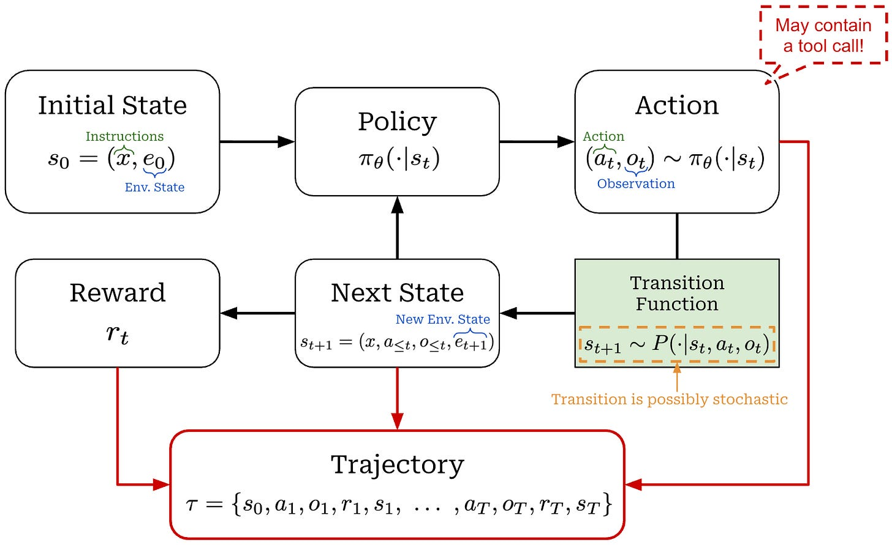

> Agent 倾向于一次做太多事情……本质上就是试图一次性完成整个应用。我们让 Agent 逐步地、逐个功能地工作，每一步做增量推进，并在结束时保持环境干净。

**指令**提供解决问题的信息和上下文——可以包括领域知识（来自政策文件或指南）以及问题解决策略指导（如要求 Agent 分解问题、维护已完成子任务的待办列表、双检查每一步等）。好的指令应在简洁性和特异性间取得平衡，既详细到能可靠引导行为，又不至于过于脆弱难以维护。

**工具与环境**是 Agent 与外部世界交互的接口。工具调用可以通过特殊 token 直接在 LLM 的 token 流中表示。例如 Qwen3 使用 XML 风格的分隔符——`<tools>` 封装工具定义，`<tool_call>` 封装调用（含参数），`<tool_response>` 封装结果。工具调用触发生成暂停，解析执行后再继续。

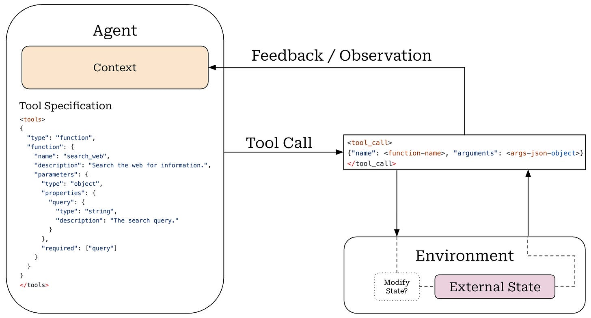

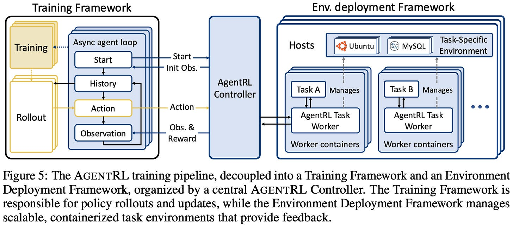

工具中介了 Agent 对环境的有状态访问——环境是有状态的，工具调用可能改变环境状态，环境动态通常编码在工具调用逻辑中。在 Agent 循环的每一步，Agent 先生成 token，当产生工具调用时暂停生成、执行调用、把结果追加回上下文。每一步之后检查终止条件——可以是最大步数、测试套件是否通过、或 LLM 提供表示解答完成的输出。

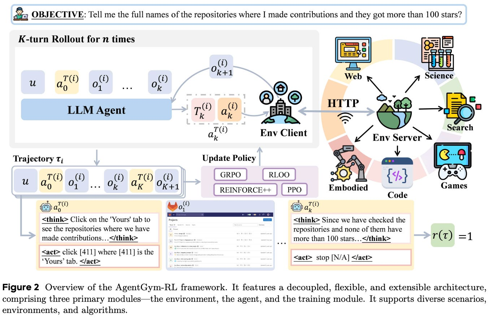

除了核心组件，Agent 框架还包括**上下文管理**——长期任务用压缩汇总先前的步骤或截断环境反馈（如错误消息）来控制上下文长度——和**记忆系统**，使 Agent 能跨任务和会话持久化有用上下文。记忆系统本质上是环境的另一面：有状态，可通过工具调用访问。

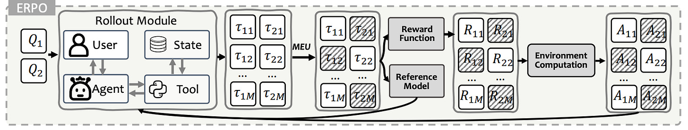

**RL 训练的组成部分**

近期工作已开始将 Agent 轨迹纳入预训练或中期训练，但大多数文献集中在后训练的 RL 上。RL 训练在两个关键操作间交替：**Rollout**（给定提示词，用当前模型采样多个补全并计算奖励）和**策略更新**（用采样的 rollout 和给定目标函数更新权重）。策略更新常用的优化器包括 GRPO、PPO 和 REINFORCE。GRPO 最常用，但长周期任务中 PPO 正重新获得青睐——因为超长轨迹被压缩分割后，同一提示词下的 rollout 产生长度高度可变的训练片段，基于群体的 GRPO 不如基于评论家的 PPO 稳定。

> 长周期任务产生非常长的执行轨迹……我们从群体优化转向基于评论家的 PPO 公式，依靠评论家来估计 token 级优势而非群体相对比较。

**Agentic Rollout**的核心差异在 rollout 阶段：标准 LLM 是单轮采样文本，Agent 是多轮环境交互——模型跨多个环境步骤生成多个输出，每一步通过工具调用与环境交互。这导致采样 rollout 成了一个困难的基础设施问题——某些 rollout 因交互轮数多或环境慢而耗时更长。因此，大多数训练采用异步 RL 和分离式架构（推理和训练各自有专用资源）。

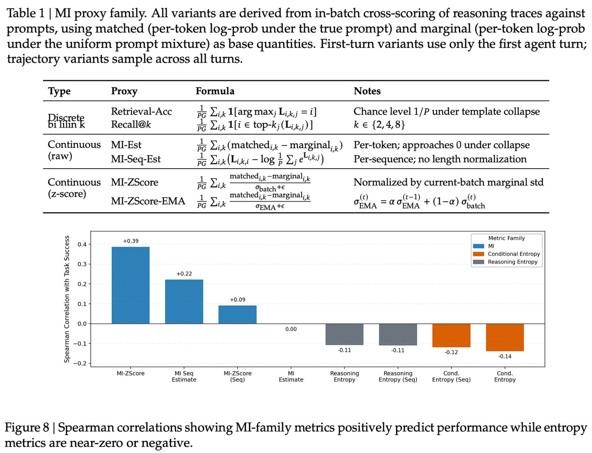

**MDP 公式：从单轮到多轮的质变**

为了严谨理解差异，用 MDP 公式来描述。**单轮 RL**的 MDP 很简单：状态是当前的 token 上下文（提示词 token 和已生成 token），动作是下一个 token，转移函数确定性地追加选中 token，奖励是环境分配给完成后的 rollout 的终局奖励，轨迹就是生成 token 序列。生成中每个 token 自成一个动作，选中后追加到状态再预测下一个，直到预测停止 token 时终止。

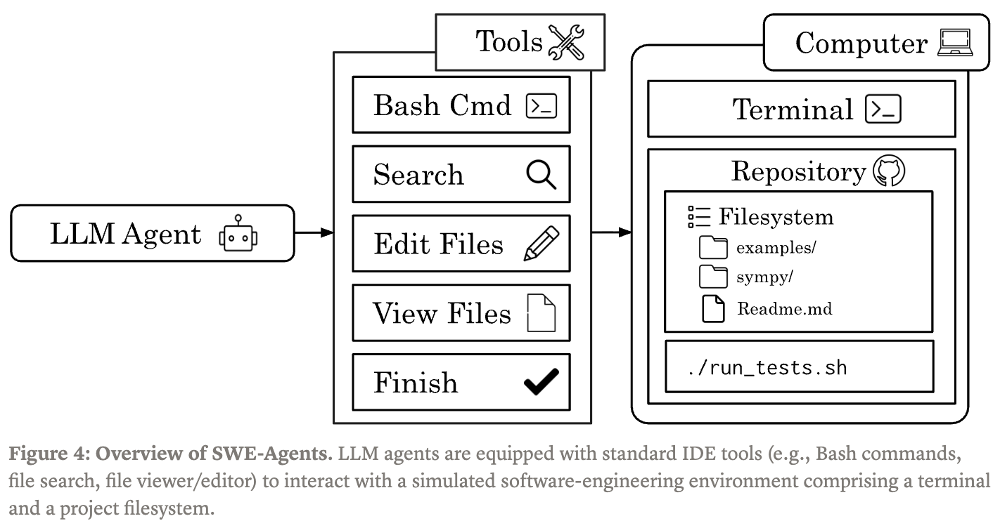

**多轮 Agentic RL**的 MDP 复杂得多。状态不再是单纯的 token 上下文，而是 LLM 可见的文本上下文（提示词+生成 token+工具调用+观察）与环境外部状态的联合。Agent 动作可以是文本或结构化的工具调用序列。转移函数不再确定——工具行为和环境反馈都可能有随机性。奖励既有终局结果奖励也有中间步骤奖励。

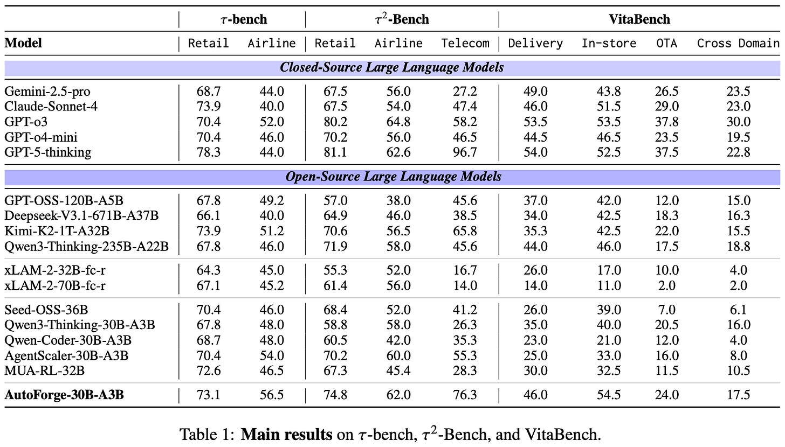

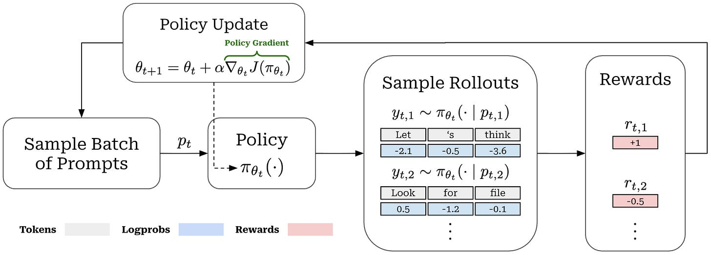

与单轮类似，每次训练迭代生成一批轨迹，每条轨迹包含多轮 Agent 动作和环境交互，用于计算策略更新。Agentic RL 常用结果奖励和中级过程奖励的组合，在更长轨迹上提供细粒度监督。

另一个关键差异是环境隔离。Agent 动作可能修改状态（编辑文件、改数据库等），如果多个 rollout 共享同一环境会产生干扰。因此每个 rollout 需要独立的环境实例——通常通过 Docker 容器或类似沙箱机制处理。「每个 rollout 接收一个干净的环境实例以防止轨迹间干扰」。

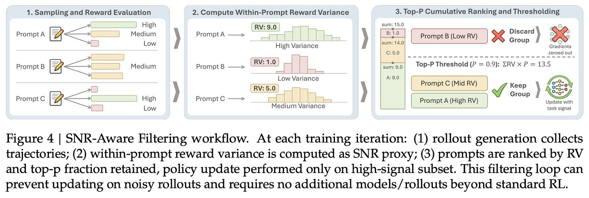

> 每次 RL 迭代会同时生成 512 个 Docker 容器……使 Docker 的 API 服务器过载，最终导致 Docker 守护进程崩溃。为了消除瓶颈，将 Kubernetes 支持集成到 R2E-Gym 中，让编排器跨节点池调度容器。

扩展环境规模是一个系统挑战。朴素实现在每个 rollout worker 节点的本地 Docker 守护进程中启动容器，但大量 worker 同时创建/销毁容器时会成为瓶颈。更大规模系统用集群编排层（如 Kubernetes）在资源池中调度环境实例。

**ToRL：工具集成推理的 RL 训练**

让 LLM 自己写代码来解题，这是 ToRL 的核心想法。它从预训练基座模型开始（RL-Zero 模式），直接给模型配一个代码解释器工具，让它通过奖励驱动的探索学会在推理中写代码。TIR（工具集成推理）在解题中交织文本推理和代码推理。

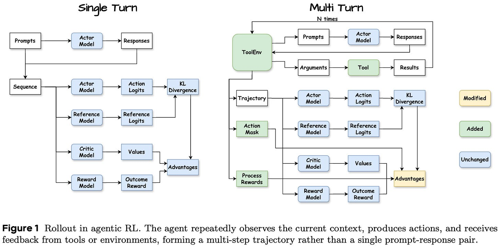

> 大多数研究从更强模型提取轨迹并执行 SFT，限制了探索。ToRL 用 RL 训练突破这一限制。

ToRL 给 LLM 一个引导提示词，鼓励用自然语言+代码块的融合来回答问题。

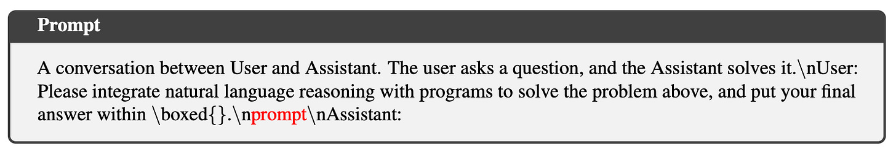

生成时，代码用 ```python 包裹，然后产出 ```output 标签——触发生成暂停、执行代码、追加结果、继续生成。模型可以多次交织代码块，但每个问题限 C 次工具调用（大多实验设 C=1）。

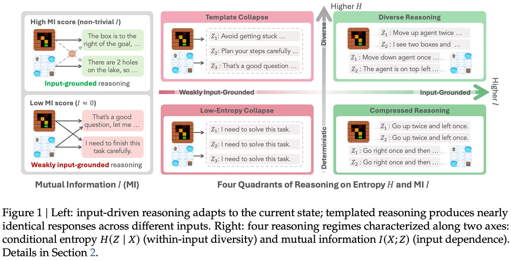

代码执行错误返回给 LLM 但只保留最后一行（防止上下文过载）。代码输出从 RL 损失函数中屏蔽（不训练模型预测外部结果）。所有代码在沙箱中执行，确保问题不影响训练进程。奖励很简单：正确 +1，错误 -1，不可执行代码 -0.5。但惩罚不可执行代码不帮忙——纯结果奖励的表现等于或超过带错误惩罚的方案。这个惩罚让模型写代码时变得过于保守，反而不好。

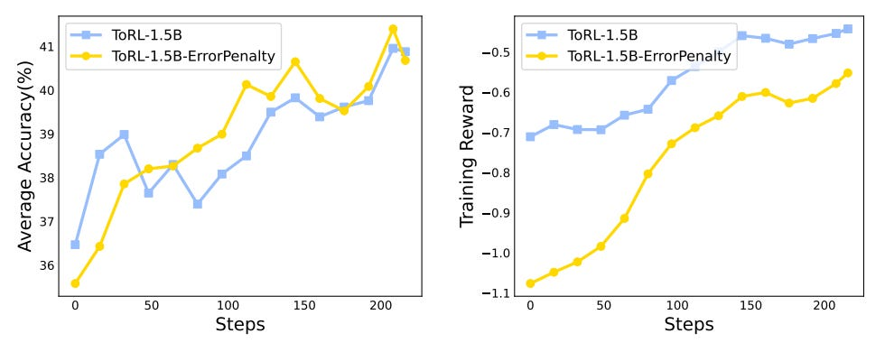

ToRL 在 29K 道数学竞赛题上用 GRPO 训练，用 LIMR 技术筛选可学样本（追踪每轮奖励，选与学习轨迹匹配的题目，不选简单的也不选过难的）。在 Qwen2.5-Math-7B 上实现 14.7% 绝对准确率提升。

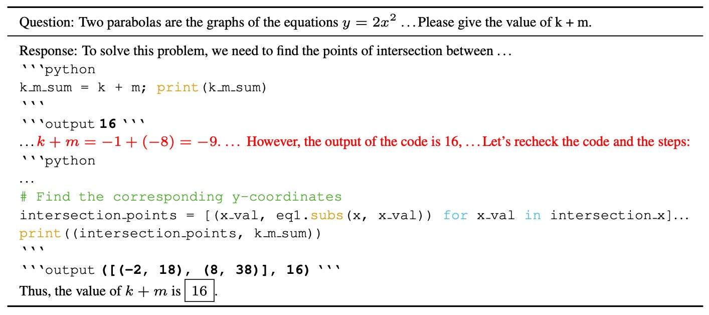

训练中模型用代码解决问题的比例从 40% 稳步上升到 80%（100 步后），成功执行率也不断提升。模型学会从错误消息中反思代码、用代码+自然语言验证结果等高级行为。

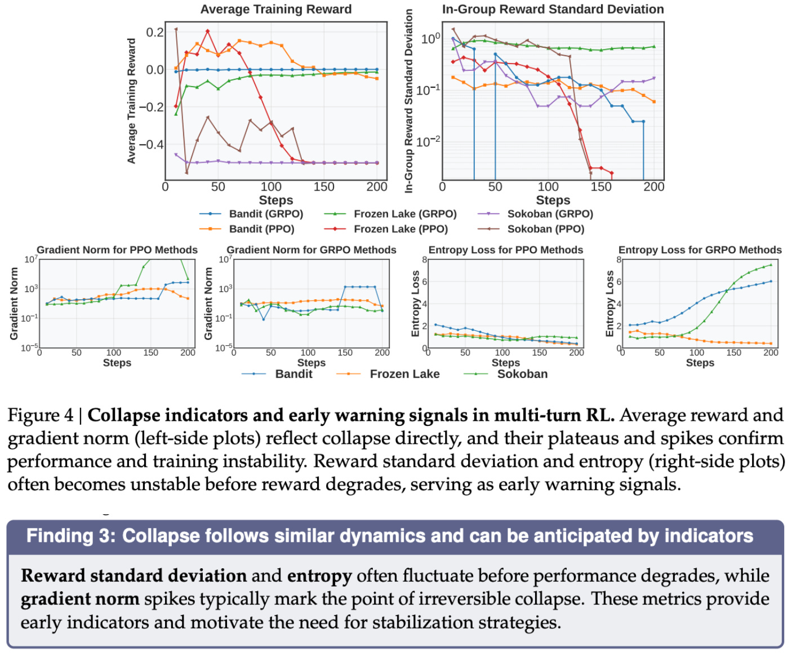

**AgentGym-RL：模块化的多环境训练框架**

随着 LLM 从对话式转向自主系统，训练基础设施也得演进。AgentGym-RL 是解决这个问题的开源框架。三个组件：环境（真实任务场景）、Agent（LLM 驱动的智能层）、训练（模块化 RL 流水线）。

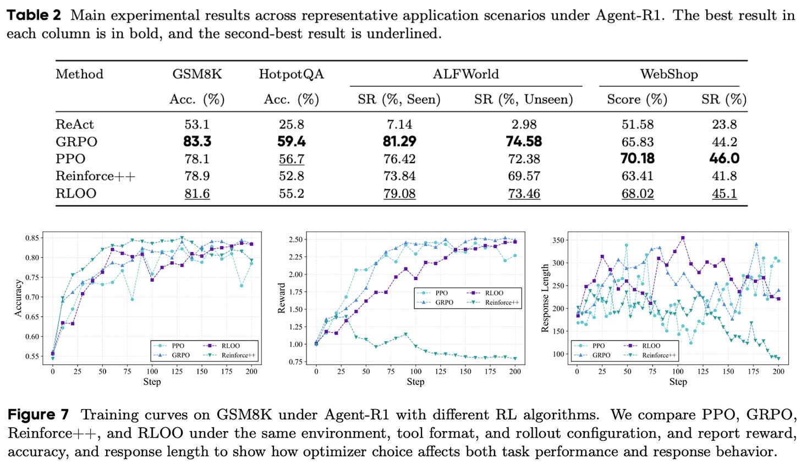

环境覆盖网页导航、具身任务、科学实验等多个领域，每个环境以独立服务运行，暴露统一 HTTP 接口——这种标准化结构使不同环境可以"即插即用"。

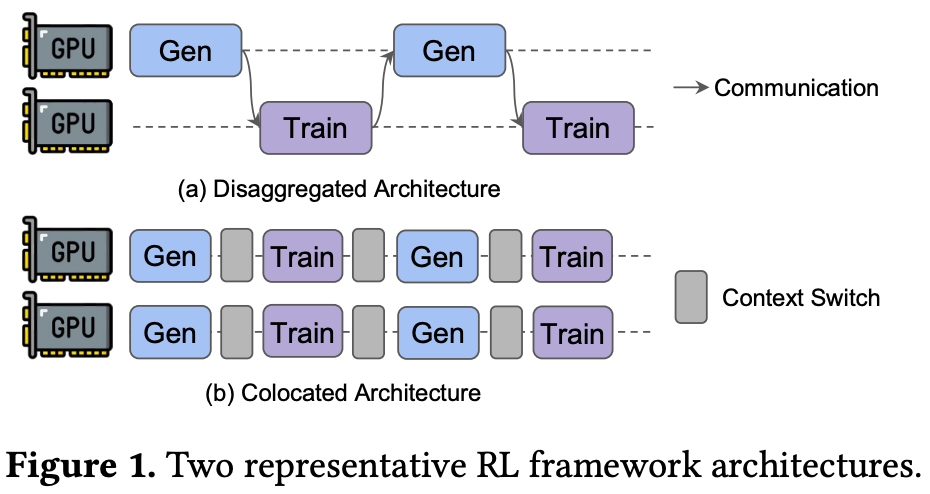

训练时，先并行初始化环境，每个 Agent（当前策略副本）在自己的环境中互不干扰运行。循环中每一步：采样响应→发送到环境→获取观察和奖励→记录轨迹。完成所有交互轮或解决问题后，完整轨迹被收集。

AgentGym-RL 做了系列工程优化：将 WebArena 的单浏览器进进程改为子进程架构（单服务器管理多个 Chromium 实例）、修改 SciWorld 的初始化/重置例程支持并行创建、WebArena 增加全重置接口（每个 episode 后恢复初始状态）。verl 库被扩展到支持多轮轨迹，RolloutHandler 构造注意力和损失掩码区分 Agent 和环境的 token。

**ScalingInter-RL：用课程学习驯服长周期任务**

早期训练中，Agent 难以产生有意义的长交互——常陷入冗余推理或做不必要的动作。ScalingInter-RL 的直觉：先让 Agent 在短任务上建立基础技能，再逐步增加交互预算。

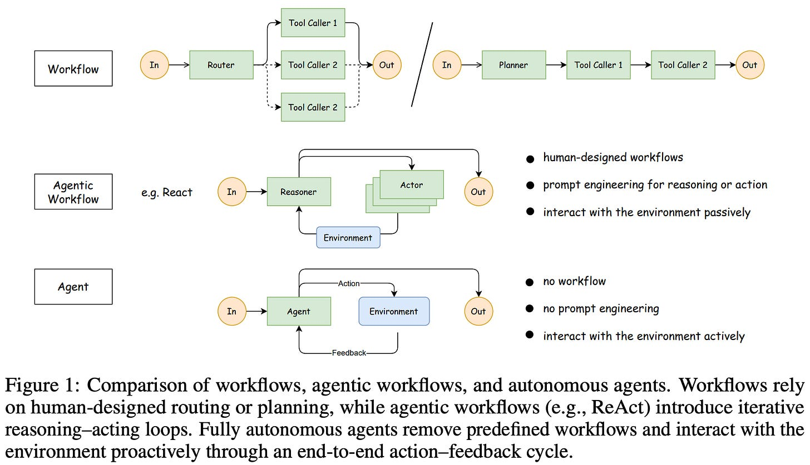

实现方式：将训练分成 N 个阶段（用 N=3，每 80 步一个阶段），交互预算从 8 轮到 12 轮到 15 轮。达到上限时终止交互让 Agent 给出答案。训练目标还是最大化累积奖励，但约束条件随阶段放松。

> 随着交互周期增加，Agent 被激励探索更长的决策路径，促进规划、反思和战略回溯等高阶认知行为出现。这种分阶段扩展将交互深度与 Agent 演化的策略能力对齐。

7B 模型在搜索和深度研究任务上分别达到 26% 和 38.25% 成功率，超过 GPT-4o 和 10 倍参数量的 Llama-3.1-70B。RL 在结构化任务上最有效（TextCraft、SciWorld），在嘈杂的 WebArena 上提升不太明显。训练早期过度探索并不好——短轮数限制早期探索但提供更稳定的学习信号。

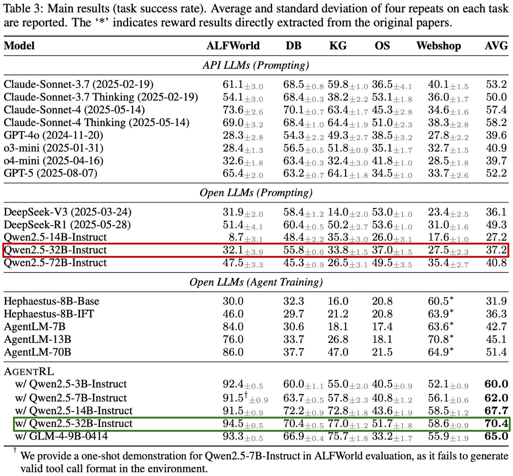

固定大预算（10 轮）初始效果好但训练很快崩溃。限制早期预算提供稳定信号，逐步递增让模型迁移已学模式解决更难任务。RL 训练的 Agent 还自然拥有更强的测试时扩展能力——增加交互轮数或并行采样都能显著提升性能。优化器选择也有影响——用 GRPO 的 3B 模型实际上优于用 REINFORCE 的 7B 模型。

**Agent-R1：结构化轨迹格式**

Agent-R1 在 AgentGym-RL 基础上做简化——只使用基于结果奖励——但扩展了结构化轨迹格式以更可靠收集多轮数据。

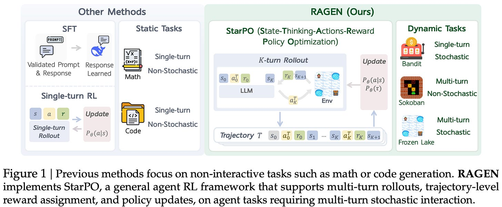

关键创新在轨迹格式：步级块结构存储，每一步包含观察（环境文本输入）、推理（Agent 分析思考）、动作（文本响应或工具调用）、工具调用详情（名称、参数、返回值）、奖励（过程或结果）。先前步数据静态不参与训练计算图——通过精确 token 恢复避免 token 化漂移。

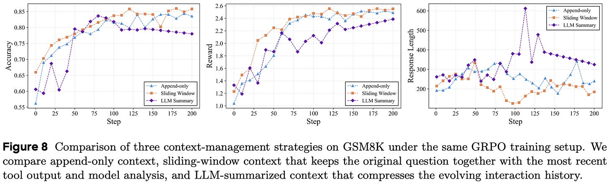

训练中 Agent 在循环中交互直到任务完成或达最大步数。只使用结果奖励，目标函数只在 Agent 生成动作上计算。轨迹动态批量化。实验在 ALFWorld、WebArena、WebShop、SciWorld、Mind2Web 等环境上进行。Agent-R1-7B 是第一个通过 RL 训练的 7B 模型，在多个基准上达到或超过 GPT-4o。

> ALFWorld（+62.4%）、数据库（+43.2%）、知识图谱（+14.6%）、操作系统（+31.1%）和 WebShop（+62.4%）。Agent-R1-7B 在 WebArena-Lite 上超过了 GPT-4o 和 GPT-4.1。

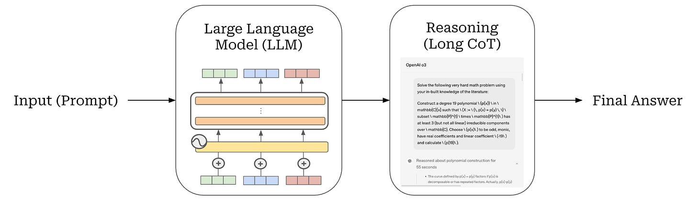

Agent-R1 展示了跨领域泛化——用与训练时不同的评判模型和提示词评估，性能保持稳定。训练中响应长度增加、更长的思考时间与更好性能关联。Agent 还获得了新兴技能：未使用高级反馈训练的个别领域信号的泛化。

> 在四个不同领域用 RL 训练的 Agent 可以在未见的领域上泛化，展示了类似涌现的能力。基于结果的奖励作为足够的训练信号，鼓励跨多样性泛化。

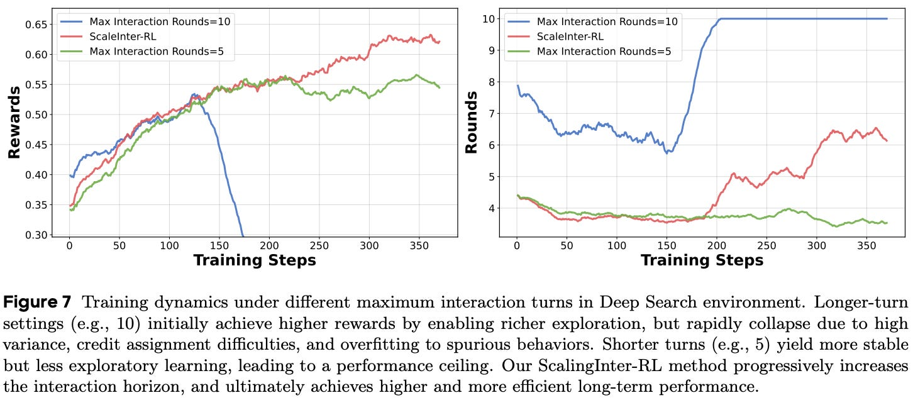

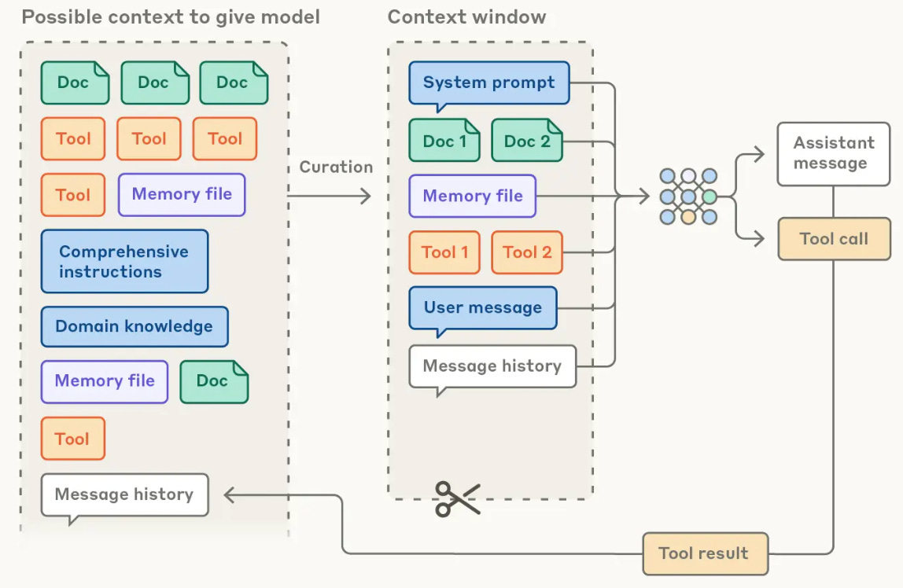

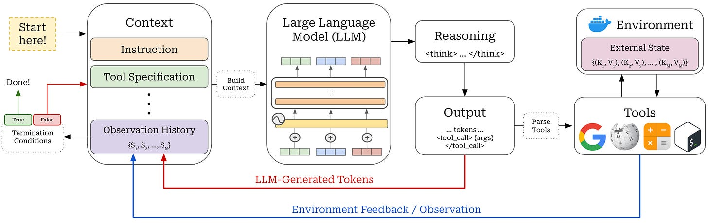

**AgentRL：多任务、多轮的异步 RL**

大多数框架为单一环境设计。AgentRL 支持跨多种高度多样化环境（文本、具身、网页）的多任务训练，任务复杂性从 5 轮到 25 轮不等。所有环境用二元奖励（成功 +1 或 0），加入步骤效率奖励——步数少获得更高的正面结果奖励。「成功末尾每步后 +0.005，成功终端 +0.995，错误终端 0」。Agent 使用基于函数调用的工具调用格式。

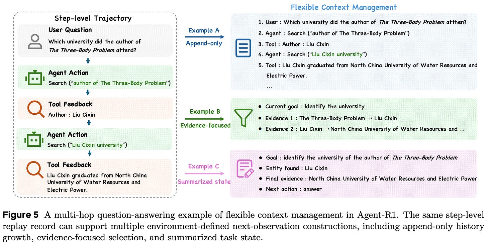

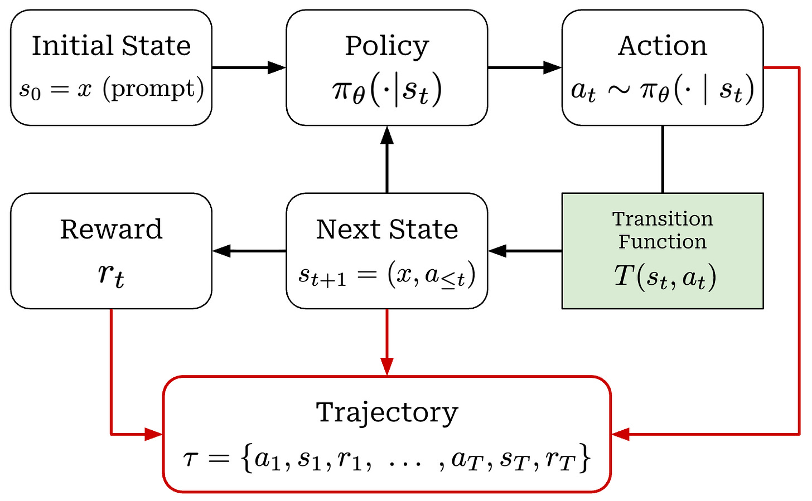

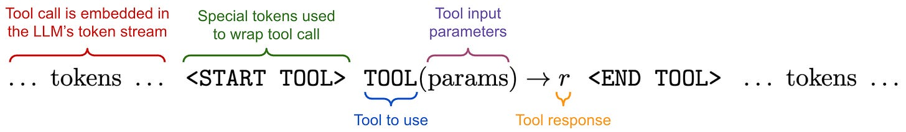

AgentRL 面临的主要挑战来自异步训练：旧策略 rollout 可能是离策略的，不同环境轨迹长度差异大，每步的 rollout 数量不均衡。

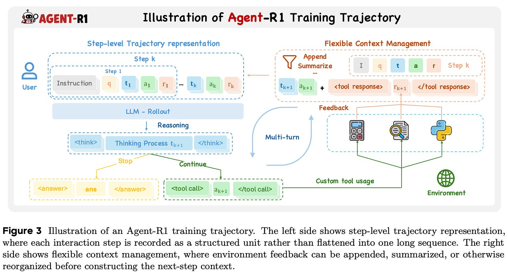

三个关键设计解决了这些问题：

**跨策略采样**：用重放缓冲区存储轨迹及其收集时的策略版本。训练时计算当前策略与收集时策略的 KL 散度，太大则丢弃。代价是更新频率略低，但比重生成 rollout 快得多。

**任务级优势归一化**：标准 GRPO 在组内归一化，困难任务的低成功率会占用过多梯度带宽。AgentRL 在所有任务样本上全局归一化 token 级优势，所有任务获得更平均权重。

**陈旧控制**：结合重放缓冲区和 KL 门控，限制过时数据影响。

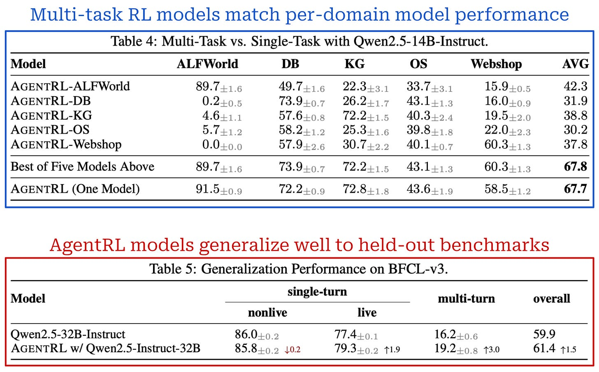

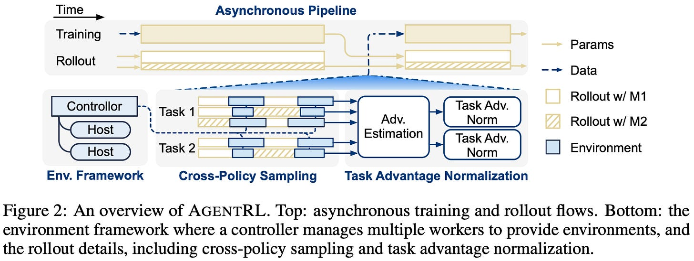

跨策略采样是表现最好的单独策略，紧随其后是任务级优势归一化（TAN）和陈旧控制（SC）。全部组件一起使用时，同时利用 GRPO（带任务级归一化）获得最佳性能。

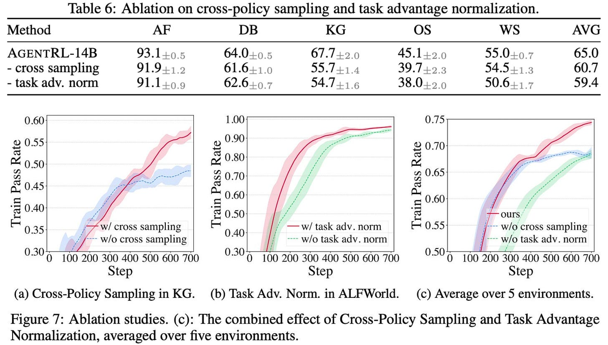

多任务训练表现优秀：GAIA 难度 3 成功率从 0% 到 20%，SWE-Bench 从 15.5% 到 33.5%。在未见过的 SWE-Bench 验证集上表现良好，说明 Agent 学会了可泛化技能而非过拟合训练分布。

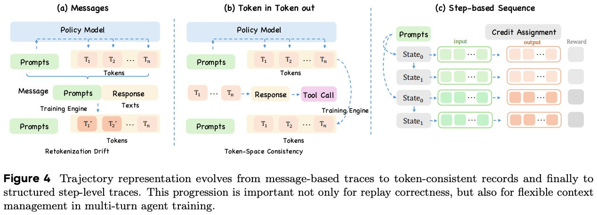

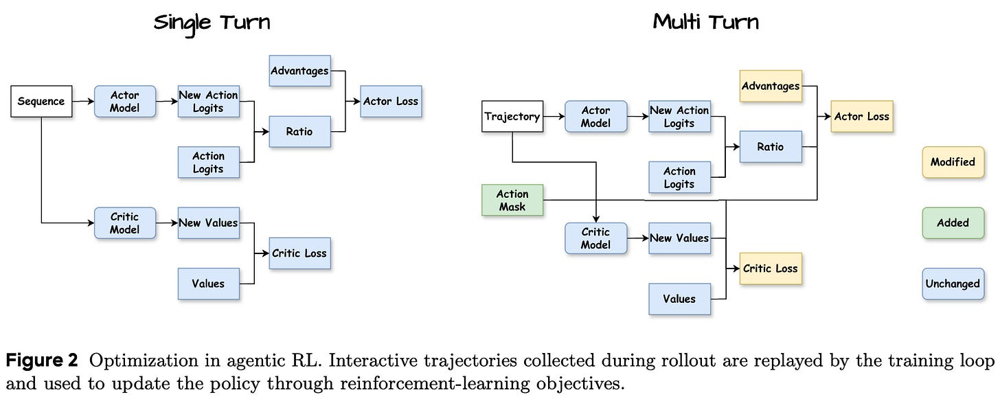

**AutoForge：从工具文档自动合成训练环境**

真实世界的 Agent 训练数据很难获得。AutoForge 用 LLM 从工具文档（OpenAPI 规范、Markdown 教程）自动生成合成环境——分两步：环境构造（创建 API 定义、环境规范和数据），然后用模拟用户 Agent（Sonnet）生成训练样本。

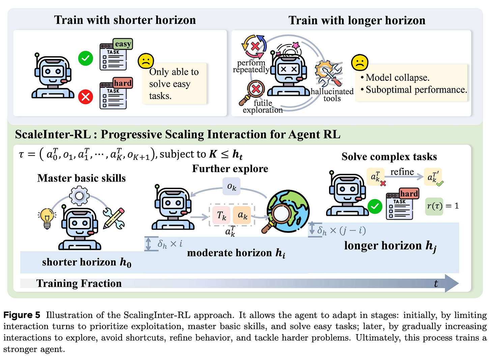

训练流程分两步：先用基座模型与合成环境交互收集有效轨迹做 SFT 冷启动，再用基于结果的 RL 优化。奖励很简单：最终状态完美匹配 +1，否则 0。

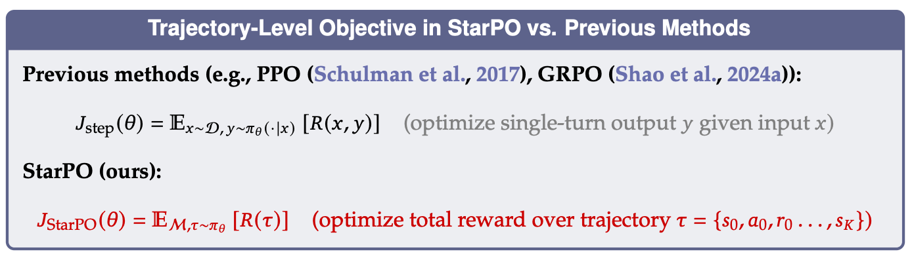

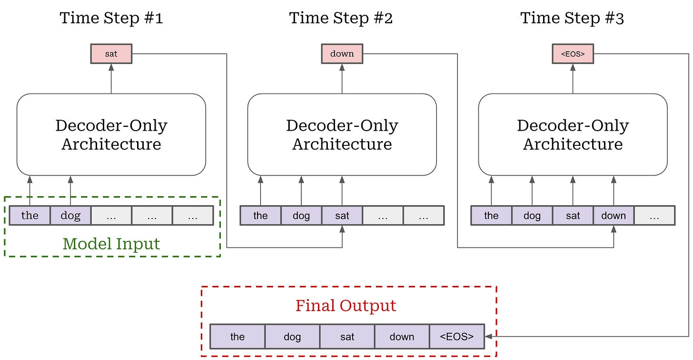

**ERPO**（环境相对策略优化）是 AutoForge 提出的 GRPO 变体，三处改动：

1）**交织思考**：保留每一步的推理轨迹，不丢弃。保留先前思考 token 对于保持步骤间有用的任务分析和规划信息是必要的；

2）**屏蔽错误用户行为**：用 LLM 评判模拟用户是否有错，检测到用户错误导致任务失败时，从优势/损失计算中排除该轨迹——通过简单从组中移除来实现；

3）**环境级优势估计**：GRPO 在问题组内归一化。ERPO 修改为计算共享同一环境的所有问题在所有有效轨迹上的标准差——分母汇集跨环境奖励，提高对异常值鲁棒性。

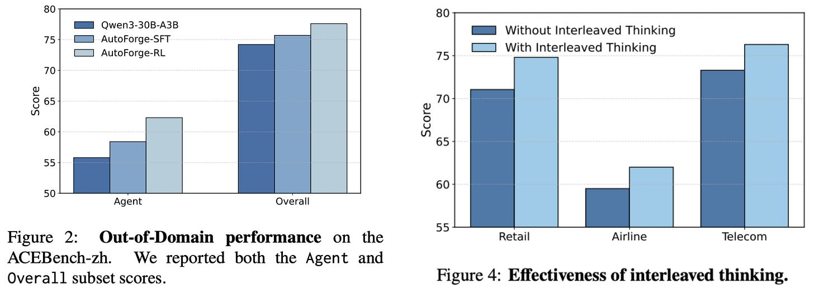

用 Qwen3-235B 合成 10 个环境（1,078 个任务），微调 Qwen3-30B。AutoForge 在域内基准（τ-Bench、VitaBench）上超越更大开源模型，接近 Gemini-2.5-Pro。

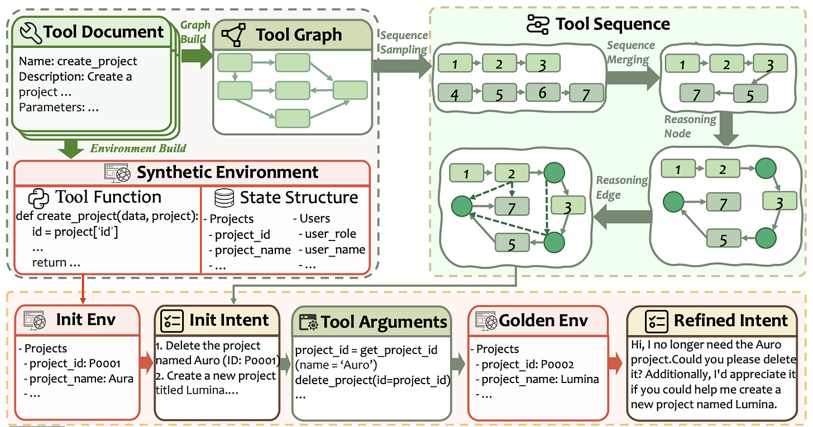

域外评估特别严苛——AceBench-zh 使用不同提示词格式、新工具集、跨语言（英文训练中文评估），Agent 仍有性能提升。

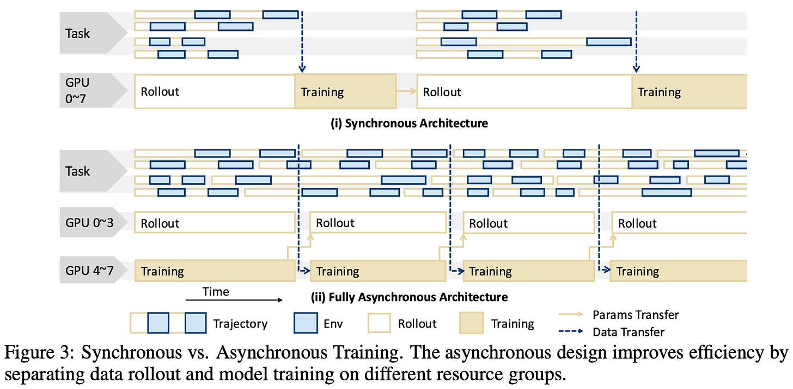

消融实验确认：交织思考提升能力（尽管增加上下文消耗）、更强模拟用户有益、错误屏蔽有效、环境级优势估计对稳定性至关重要。

**RAGEN & StarPO：轨迹级优化与回声陷阱**

RAGEN 框架聚焦基于规则的 RL 训练多步交互 Agent，提出 StarPO——专为交互式 Agent 设计的轨迹级学习算法。

> 与将每个动作独立处理的静态任务方法不同，StarPO 将整个轨迹——包括观察、推理轨迹、动作和反馈——视为 rollouts 和模型优化的一个连贯单元。

Agent 每一步生成结构化输出：文本推理轨迹 + 一个或多个可执行动作（工具调用）。整个多轮轨迹作为优化单元。

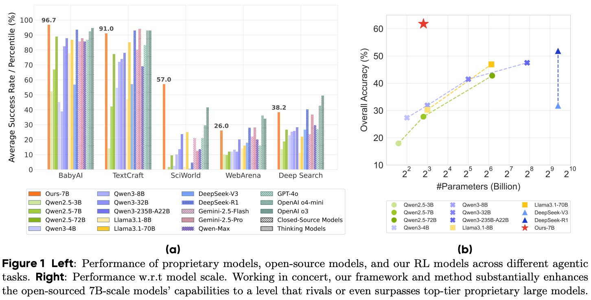

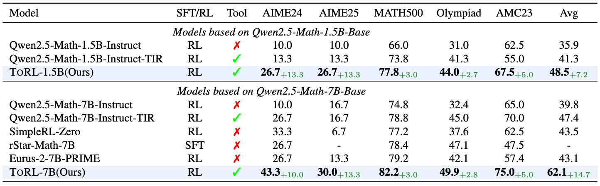

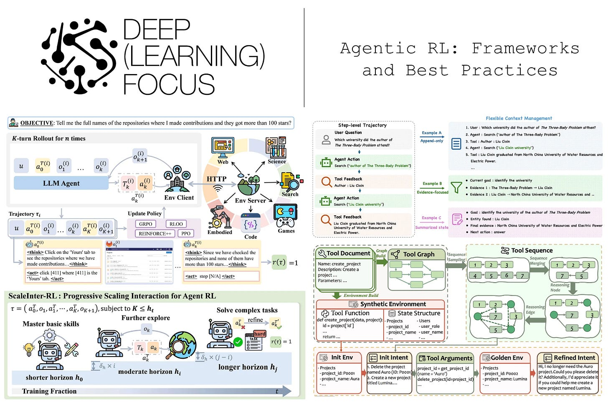

与 AutoForge 类似，StarPO 保留中间推理轨迹，但不屏蔽环境 token——这与其他方法不同（附录中测试响应屏蔽并发现有益）。StarPO 是高层优化方法而非特定算法，可用 PPO 或 GRPO 实现。训练在三个符号环境和一个真实环境（WebShop）上进行。

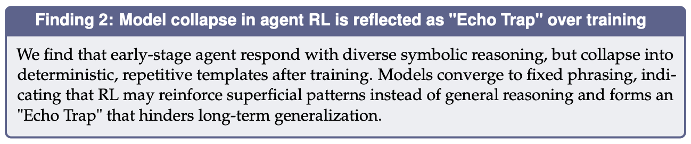

**回声陷阱（Echo Trap）**是关键发现：Agent 在 RL 中过拟合自身生成的推理模式，行为崩溃。表现为训练奖励停滞或下降、组内奖励变异性和输出熵急剧下降、梯度范数飙升。

> 早期轨迹展现出关于符号意义和预期奖励的多样化推理，而后期响应变得重复和确定。模型在自生成轨迹上训练时反复重用记忆化的推理路径，多样性崩溃。

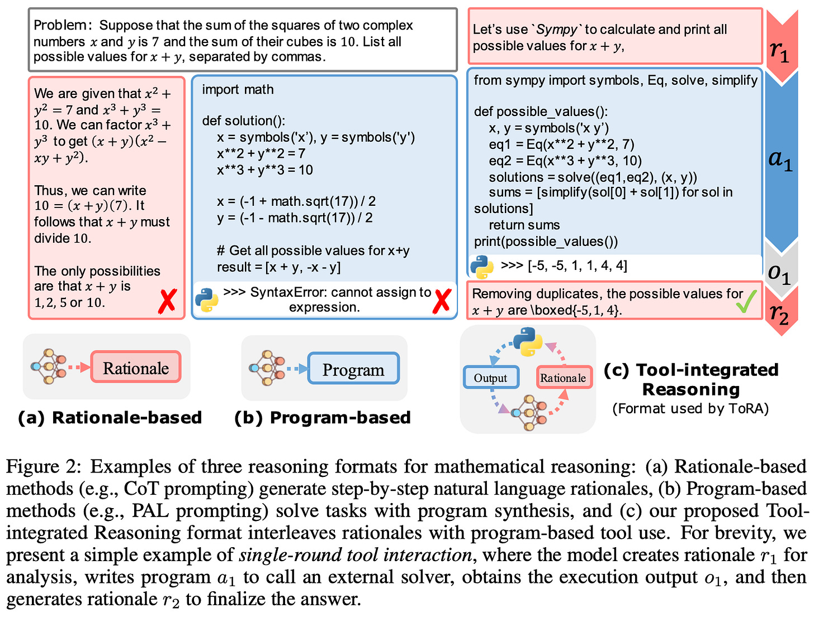

**StarPO-S**（稳定变体）通过三招解决：去除 KL 正则化项鼓励探索（KL 正则化让模型不肯偏离参考策略）、用 Clip-Higher 防止熵崩溃（来自 DAPO）、用高方差任务选择——按奖励标准差排序任务只留高信号部分。这些改动延迟崩溃并增强性能。

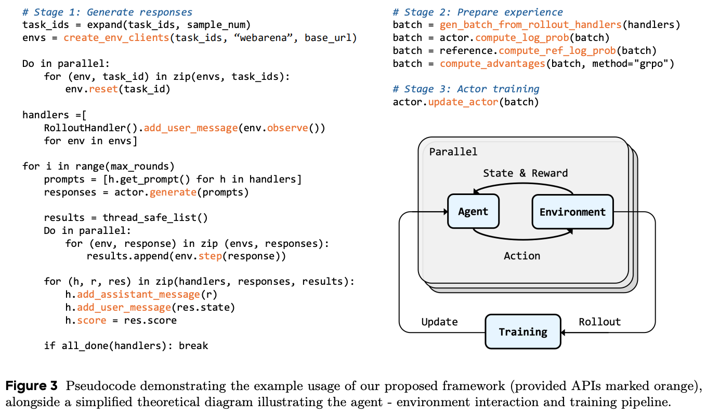

深入分析得出更多发现：增加批次多样性（更多任务、每任务略少 rollouts）有利泛化；中等的交互预算最佳（太大性能下降）；在线 RL 最优，过时 rollout 持续降级性能；推理轨迹在训练中缩短——轨迹级结果奖励单独不鼓励长交互中保留有用推理。

**模板崩溃（Template Collapse）**是 RAGEN-2 的更隐蔽问题。Agent 可能对每个输入保持高熵，但生成的内容与输入无关——套用固定模板。识别需要互信息（而非熵）来度量跨输入推理深度。

> 即使熵是稳定的，模型也可能依赖看起来多样化但与输入无关的固定模板。我们称这种为模板崩溃。

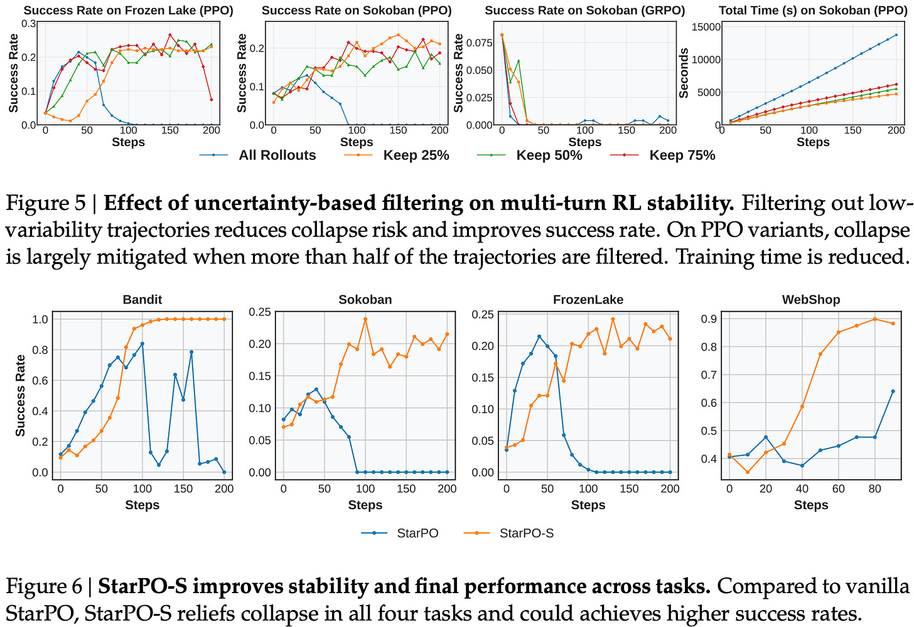

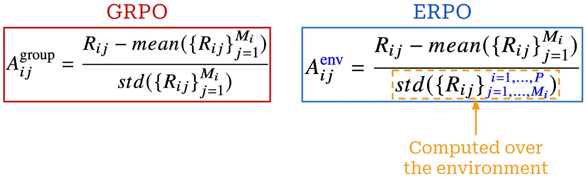

解决方法是动态信噪比（SNR）过滤：为每个任务采样多轨迹→计算任务组奖励方差→按方差排序只留高信号比例（p=0.9）。移除低信号提示词对策略梯度的贡献，避免模板崩溃，改善性能、泛化性、效率和稳定性。

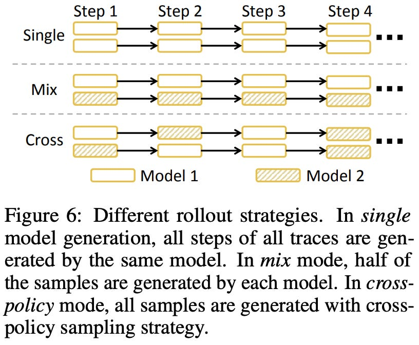

**6 条实用设计原则**

综合 8 个框架的经验，可以提炼出 6 条设计原则：

**模块化接口**：统一的环境抽象（AgentGym-RL 的 HTTP 接口、Agent-R1 的 Tool/ToolEnv 抽象、AgentRL 的函数调用 API）让框架能轻松添加新任务、切换环境、测试不同优化器，无需每次重写基础设施，可扩展到任意训练环境。

**轨迹结构**：Agentic 轨迹包含指令、token、工具调用、观察、奖励和环境状态，远比单轮 rollout 复杂。用结构化步级格式存储而非扁平 token 序列——Agent-R1 存储步级轨迹保留步骤边界和精确 token，避免 retokenization 漂移。轨迹格式决定上下文构建和奖励分配方式。

**动作掩码**：大多数框架让只有 Agent 生成的 token 贡献策略梯度——这是最一致的实现细节之一。但完全排除非 Agent token 可能非最优：新趋势是对 Agent token 用 RL 目标，对环境 token 用 SFT 目标（通过 SFT 从环境反馈学习世界模型），参见 Echo 和 PaW 论文。

**过程奖励**：长周期任务受益于更丰富信用分配机制，但非总是有益——ToRL 加不可执行代码惩罚反而降性能。要谨慎设计。

**优势归一化**：跨环境或任务归一化比 GRPO 组内归一化更稳定。AgentRL 的任务级归一化和 AutoForge 的环境级 ERPO 都解决了多任务中困难任务主导更新的问题——确保不会单一任务支配策略更新。

**稳定性与探索**：Agentic RL 的新失败模式——熵崩溃（大动作空间导致）、多任务不稳定、离策略数据问题、回声陷阱和模板崩溃——都比单轮 RL 更严重。应对手段：AgentRL 的跨策略采样+任务级归一化+陈旧控制，AutoForge 的修改优势归一化，RAGEN 的数据过滤。任务选择和课程学习也重要——ScalingInter-RL 递增交互预算，RAGEN 优先高方差任务，AutoForge 从工具文档合成数据。让 Agent 暴露于多样且可在当前时刻学习的任务，避免强化确定性行为。

<div style="background:#f5f0eb;padding:14px 16px 10px 16px;border-radius:6px;margin-bottom:16px;">
<div style="text-align:center;margin-bottom:8px;">
<strong style="font-size:15px;color:#8b6f4c;">结语</strong>
</div>
<div style="font-size:14px;color:#3f3f3f;line-height:1.75;">
这是一篇密度极高的综述，几乎把 2025-2026 年 Agentic RL 领域所有重要工作都串了起来。最打动我的不是某个框架的技术细节，而是整个领域正在从"把单轮 RL 硬套到 Agent 上"进化为"承认多轮交互才是新常态"——ToRL 的代码交织、ScalingInter-RL 的课程学习、StarPO 的轨迹级目标、ERPO 的环境级归一化，本质上都是在适应一个基本事实：Agent 不是在生成文本，而是在与环境共同演化。
<br><br>
回声陷阱和模板崩溃的发现尤其值得关注。这说明 Agentic RL 不仅仅需要更强的模型，还需要更聪明的数据筛选和更稳定的优化算法——高方差任务优先于确定性模板，这听起来像是反直觉的，但恰恰是 RAGEN 系列最核心的洞见。
<br><br>
如果只看一篇论文了解 Agentic RL 的全景，这篇综述是最佳选择之一。
</div>
</div>

---

<span style="font-size:12px;color:#888888;">参考：https://cameronrwolfe.substack.com/p/agentic-rl</span>
