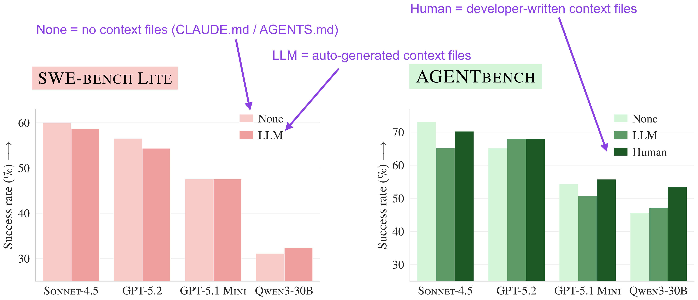

AGENTS.md 和 CLAUDE.md 这类仓库级指令文件，真的对编码 Agent 有帮助吗？Sebastian Raschka 关注到一篇论文，结果出乎意料。

论文在两种设置下评估。首先是 SWE-bench Lite——因为原始仓库不一定有开发者写的上下文文件，作者自动生成了。其次是新推出的 **AGENTBENCH**——138 个 Python 任务，来自 12 个已有开发者编写上下文文件的仓库。Agent 在三种条件下评估：无上下文文件、LLM 生成的上下文文件、开发者编写的上下文文件（如果有）。

---

## 1 引言

关注 Agent 相关研究文献，一篇论文引起了 Sebastian Raschka 的注意——*Evaluating AGENTS.md: Are Repository-Level Context Files Helpful for Coding Agents?* 研究给代码仓库添加 AGENTS.md 或 CLAUDE.md 这类指令文件是否真的对编码 Agent 有帮助。

论文在两种设置下评估。首先用 SWE-bench Lite——原始仓库不一定有开发者写的上下文文件，作者自动生成了。其次是新推出的 **AGENTBENCH**——138 个 Python 任务，来自 12 个已有开发者编写上下文文件的仓库。Agent 在三种条件下评估：无上下文文件、LLM 生成的上下文文件、开发者编写的上下文文件（如果有）。

---

## 2 结果

**图 1：论文主要结果**

与不使用上下文文件相比，LLM 生成的上下文文件平均略微降低了任务成功率，或者没有太大区别。这个结果可能令人惊讶，但也合理——Agent 框架在运行时动态生成所需上下文信息。上下文文件更多是在不同独立会话之间提高效率的工具。

开发者编写的上下文文件优于 LLM 生成的，这符合预期——领域专业知识在这里发挥作用。

---

## 3 效率数据

最让人意外的是：**不用上下文文件反而更便宜、更高效。**

**图 2：效率结果**

不用上下文文件反而效率更高——这个事实一开始让人费解。Raschka 最初猜测原因可能是 Agent 在处理冗余信息——它们读了上下文文件，但不管怎样还是从代码仓库中解析额外信息，就像没读过一样。

---

## 4 追踪分析

研究人员做了追踪分析，结果显示 Agent 通常会遵循上下文文件中的指令，但会运行更多测试、搜索更多文件、读取更多文件、使用更多仓库特定工具（当这些工具被提及时）。所以负面或微弱的效果似乎不是来自 Agent 忽略文件。

更可能的原因是：上下文文件往往添加了额外的需求和探索步骤，使任务更难或更彻底，但如图 1 所示，这并不一定带来更高的成功率。

---

## 5 建议

Raschka 的结论是：仓库级上下文文件应该更短、更具体，理想情况下应该采用层级结构——例如"如果你要做 x，查看这个上下文文件 y.md，否则忽略它"。

当然，论文中使用的 LLM 和框架现在已经有些过时，用最新的框架和模型重新做这个研究会很有趣。

---

## 6 一点观察

**论文链接：** https://arxiv.org/abs/2510.13664

**实验设计值得关注。** AGENTBENCH 用真实仓库中开发者实际编写的上下文文件作为对照，比纯合成 benchmark 更有说服力。12 个仓库、138 个任务，规模不大但够用。

**"不加上下文文件成功率更高"这个结果其实不反直觉。** Agent 在运行时已经能通过代码解析获取全部上下文。上下文文件的作用不在单次任务中，而在跨会话——让下次打开同一个仓库的 Agent 不用重新理解。论文的 SWE-bench 设置是单次任务，天然测不出这个优势。

**开发者写的上下文文件优于 LLM 生成的，这一点很重要但容易被忽略。** 它说明上下文文件的核心价值是"团队知识沉淀"，不是"告诉 Agent 怎么写代码"。最佳实践可能是在 README/CONTRIBUTING 中写给人看的指南，同时让 LLM 从代码本身提取运行时上下文——两者分工而非替代。

---

参考：Do AGENTS.md Files Actually Help Coding Agents?
