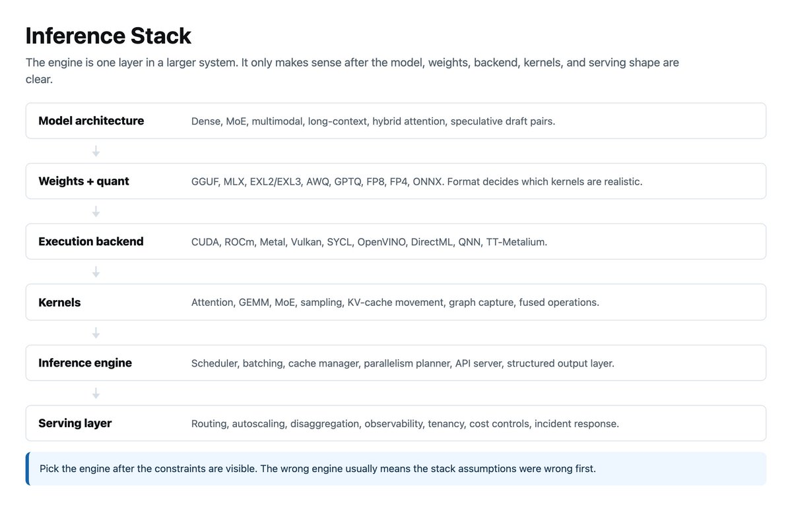
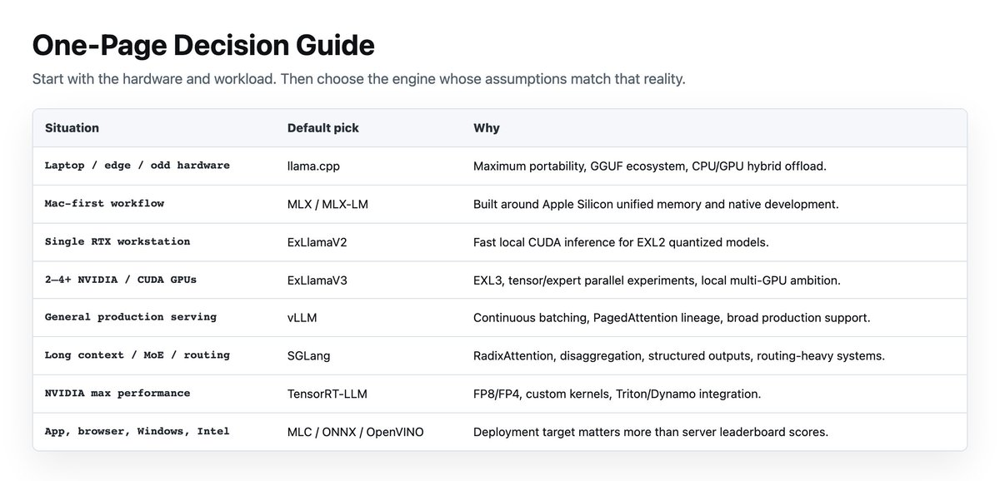
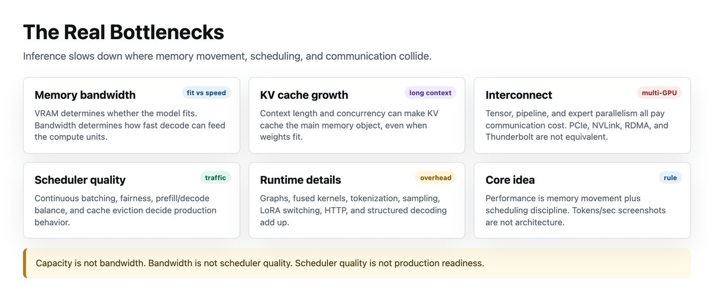
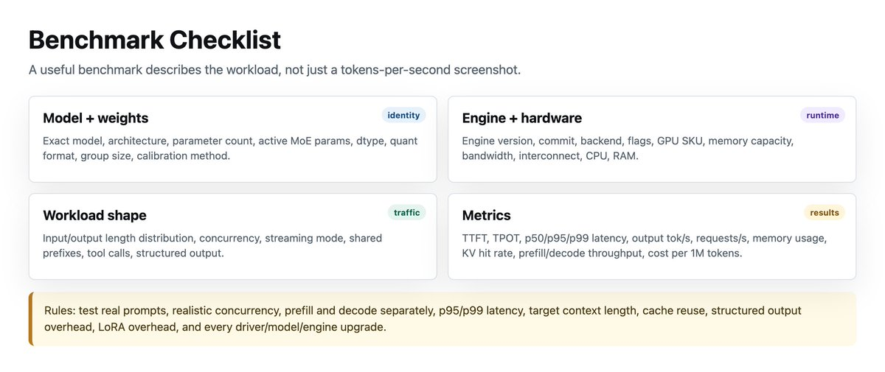
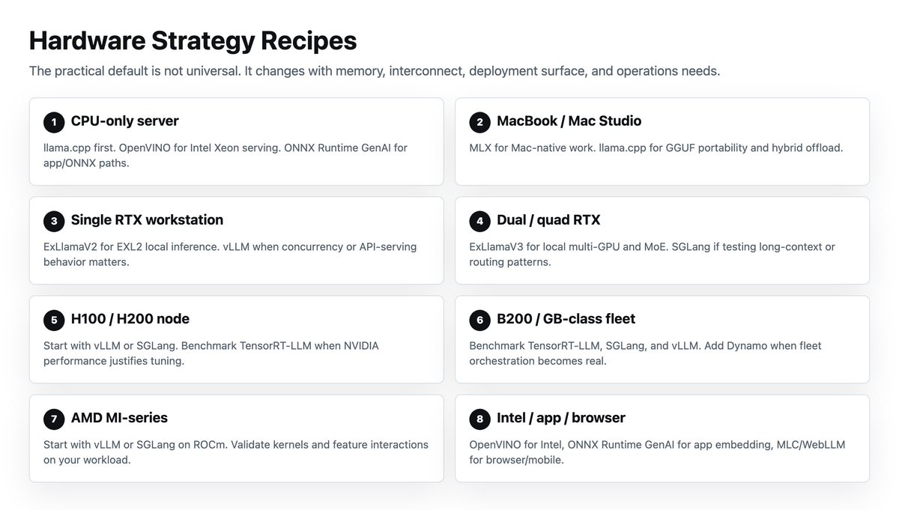
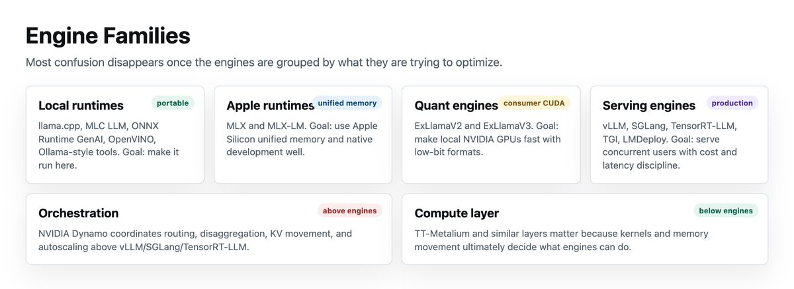

**系列说明：** 本文是该系列的第三部分。**第一部分：GPU Memory Math for LLMs (2026 Edition)**。**第二部分：Memory Bandwidth for Local AI Hardware (2026 Edition)**。前两篇解释了硬件容量和带宽的计算逻辑。**本文解释的是将硬件转化为可用推理能力的软件层。**

---

**推理引擎的四大类别**

**这些工具服务于不同的目的，处于不同的抽象层：**

- **本地便携性**：让你在任何设备上跑起来
- **消费级 CUDA**：让游戏显卡发挥推理性能
- **Apple 统一内存工作流**：利用大容量共享内存
- **量化推理**：用低精度权重换取速度
- **生产级服务**：支撑多用户并发
- **分布式编排**：跨节点协调推理任务
- **厂商优化数据中心执行**：NVIDIA 等专有栈的极致性能

**一个有用的思维模型：推理引擎不是「模型本身」。它是交通警察、内存管理员、内核调度器、缓存会计、并行规划师、API 表面层，有时还是部署框架。** 最好的引擎匹配你的内存层级、互连拓扑、量化格式、延迟和吞吐目标、模型架构以及运维成熟度。

---

**一页决策指南**

**以下是一份快速选型对照表：**

- **笔记本 / 边缘设备 / 非标硬件 → llama.cpp**
- **Mac 优先的工作流 → MLX / MLX-LM**
- **单卡 RTX 本地推理 → ExLlamaV2**
- **2-4+ 张 NVIDIA / CUDA 显卡 → ExLlamaV3**
- **通用生产级服务 → vLLM**
- **长上下文 / MoE / 复杂路由 → SGLang**
- **NVIDIA 极致性能 → TensorRT-LLM**
- **集群编排 → NVIDIA Dynamo**

**指南的剩余部分将解释为什么。**

---

**推理引擎到底在做什么**

**推理引擎加载权重、对输入进行分词、执行前向传播、采样 Token、维护 KV 缓存、以及流式输出结果。** 严肃的引擎还要处理批处理、调度、前缀缓存、量化、并行执行、API 服务、指标监控和分布式执行。

**负载有两个阶段：**

- **Preill（预填充）：** 读取提示词，构建初始 KV 缓存。**计算密集型。**
- **Decode（解码）：** 逐 Token 生成，反复读取权重和 KV 缓存。**内存带宽瓶颈型。** 解码速度更多取决于内存带宽而非峰值算力。

**这个区别解释了几乎所有事情：**

- **短提示、长回答：** 解码占主导 → 内存带宽和批处理能力至关重要
- **长提示、短回答：** 预填充占主导 → Attention 内核和分块预填充至关重要
- **多用户场景：** 调度器质量至关重要 → 连续批处理、缓存分页、公平调度
- **长上下文：** KV 缓存占主导 → 分页 Attention、KV 量化、卸载
- **MoE（混合专家）：** 专家路由占主导 → 专家并行、互连带宽、分组 GEMM
- **多节点：** 互连占主导 → NVLink、RDMA、流水线并行、分离式架构

**PagedAttention 解决了 KV 缓存碎片问题。FlashAttention 使用 IO 感知分片来减少 HBM 流量。推测解码先草拟廉价 Token 再并行验证。** 反复出现的主题是：推理性能 = 内存搬运 + 调度质量。

---

**真正的瓶颈**

**1. 内存带宽，而不只是显存容量。** 显存决定模型能否放得下，带宽决定解码速度。Apple M3 Ultra 提供高达 819 GB/s 的统一内存带宽，NVIDIA H100 SXM 的 GPU 内存带宽为 3.35 TB/s。统一内存能放下消费级显存放不下的模型，HBM 则在模型装得下时服务更快。**装得下不等于跑得快，容量不等于带宽。**

**2. KV 缓存增长。** KV 缓存随批次大小和上下文长度增长。长上下文负载可能在权重装得下的情况下耗尽内存。PagedAttention 将 KV 缓存划分为块，提高利用率，支持更大的批次。

**3. 互连带宽。** 一旦模型跨 GPU 边界（多 GPU），就需要支付通信成本。Tensor 并行需要频繁的全规约通信，流水线并行在阶段边界通信，专家并行需要 MoE 的全交换通信。vLLM 的文档指出，没有 NVLink 时，流水线并行可能优于 Tensor 并行。

**4. 调度器质量。** 好的调度器决定哪些请求进入批次、预填充和解码如何共享加速器、长提示是否会阻塞短解码、以及如何避免饥饿。**支持批处理和拥有生产级调度器是两回事。**

**5. 运行时开销。** CUDA Graphs、内核融合、采样开销、分词开销、HTTP 开销、LoRA 切换、结构化解码……在大规模场景下，零散的 2% 开销会汇聚成不容忽视的负担。

---

**各引擎深度解读**

**llama.cpp：便携性之王**

**llama.cpp 是硬件怪异、资源受限、离线、CPU 为主、边缘场景或无整齐 NVIDIA 数据中心节点时的答案。** 它支持 Apple Silicon（ARM NEON、Accelerate、Metal）、x86（AVX/AVX2/AVX512/AMX）、RISC-V、低位量化、CUDA、AMD（HIP）、MUSA、Vulkan、SYCL 以及 CPU+GPU 混合卸载。这就是 llama.cpp 牢牢占据「让它跑起来」赛道的原因。

它的 HTTP 服务器远不止是「玩具本地运行器」。llama-server 提供 OpenAI 兼容路由、Anthropic Messages API 兼容、重排序、连续批处理、多模态支持、JSON Schema 约束、函数调用、推测解码和 Web UI。

**关键限制：** llama.cpp 不适合严肃的多节点生产服务。其 RPC 后端明确标记为概念验证、脆弱且不安全。

**结论：便携性、离线运行、GGUF 或混合卸载比集群级服务更重要时，使用 llama.cpp。不要在多 GPU 场景下使用。**

> 参考：https://www.ahmadosman.com/blog/do-not-use-llama-cpp-or-ollama-on-multi-gpus-setups-use-vllm-or-exllamav2/

---

**MLX 和 MLX-LM：Apple Silicon 的杀手锏**

**MLX 是 Apple 为 Apple Silicon 打造的阵列框架，MLX-LM 是构建于其上的 LLM 套件。这是一个 Mac 优先的机器学习栈。** 关键的硬件事实是统一内存：Apple Silicon 让 CPU 和 GPU 直接访问同一内存池，MLX 阵列活在统一内存中，你在运行操作时选择设备，无需在独立内存空间之间搬运数组。

**这改变了本地推理的权衡逻辑。** 在独立 GPU 系统上，问题是「显存放得下吗？」在拥有大容量统一内存的 M 系列 Mac 上，问题变成「内存装得下吗？内存系统喂 GPU 的速度够快吗？」大量化的模型可以在消费级 24 GB 显存放不下的机器上运行。**但它的速度也更慢。**

MLX-LM 增加了 Hugging Face Hub 集成、量化、LoRA 和全参数微调、分布式推理以及庞大的 MLX Community 模型生态。MLX 现已不再局限于 Mac：它提供了 Linux 的 CUDA 和纯 CPU 包。分布式通信支持 MPI、基于 TCP 的 Ring、基于 Thunderbolt 的 RDMA（JACCL）以及 CUDA 的 NCCL。

MLX-LM 的服务器自身警告说，**它不推荐用于生产环境，因为只实现了基本的安全检查。**

**结论：在 Mac 优先的机器学习和 LLM 工作流中使用 MLX。对于高并发公共推理服务，请使用真正的生产级服务栈。**

---

**ExLlamaV2 和 V3：消费级 CUDA，精准且快速**

**ExLlamaV2 是面向消费级 NVIDIA GPU 的本地量化引擎，让你的游戏显卡超常发挥。** 它支持分页 Attention、动态批处理、提示缓存、KV 缓存去重、批量生成、流式输出和推测解码。关键词是**本地**。它让量化模型在现代 CUDA GPU（尤其是消费级显卡）上跑得飞快。

**最佳场景：** 单张 RTX 3090/4090/5090 机器、本地编码助手、本地聊天、EXL2 量化模型、专业工作站。

**ExLlamaV3 将这一理念扩展到多 GPU 和本地 MoE 推理。** 它新增了基于 QTIP 的 EXL3 量化格式、消费级硬件上灵活的 Tensor 并行和专家并行、通过 TabbyAPI 提供的 OpenAI 兼容服务、连续动态批处理和多模态支持。

**V3 的亮点：** 有 2-4+ 张消费级 NVIDIA 显卡或需要本地 MoE 时，ExLlamaV3 是首选。需注意：部分模型在 ExLlamaV3 中不支持 Tensor 或专家并行。

**结论：ExLlamaV2 是发烧友的本地 CUDA 引擎。ExLlamaV3 是多 GPU（2-4 张）本地部署的前沿选择。更强的能力伴随着更粗糙的边缘。**

---

**vLLM：默认的开源生产级服务引擎**

**vLLM 是大多数团队评估严肃开源 LLM 服务时应当首先考察的引擎。** 它提供基于 PagedAttention 的 KV 内存管理、连续批处理、分块预填充、前缀缓存、CUDA/HIP Graphs、丰富的量化支持（FP8、MXFP8/MXFP4、NVFP4、INT8、INT4、GPTQ、AWQ、GGUF）、优化的 Attention 和 GEMM/MoE 内核、推测解码、torch.compile 以及分离式预填充/解码/编码。

**它还非常灵活：** Tensor/流水线/数据/专家/上下文并行、流式输出、结构化输出、工具调用、OpenAI 兼容和 Anthropic Messages API、gRPC、Multi-LoRA，以及 NVIDIA、AMD、x86/ARM/PowerPC CPU 支持，外加 TPU、Gaudi、Ascend、Apple Silicon 等插件。

**vLLM 的文档指出，多节点部署通常使用 Ray，没有 NVLink 时流水线并行可能优于 Tensor 并行。** 陷阱在于认为 vLLM 消除了系统设计的必要性。你仍然需要调整批处理、上下文长度、GPU 内存利用率、并行布局和路由。vLLM 给了你一台很好的引擎，但它仍然需要优秀的系统设计。

**结论：如果有人说「我们需要在生产中服务开源模型」，vLLM 是默认的起点。**

---

**SGLang：vLLM 的「系统架构师」表亲**

**SGLang 是面对丑陋的服务负载时的选择：结构化输出、长上下文、MoE、分离式架构和复杂路由。** 它提供 RadixAttention 前缀缓存、预填充-解码分离、推测解码、连续批处理、分页 Attention、Tensor/流水线/专家/数据并行、结构化输出、分块预填充和多 LoRA 批处理。支持 NVIDIA、AMD、Intel Xeon、Google TPU、Ascend NPU 等。

**SGLang 的差异化优势在于服务架构。** 其预填充-解码分离将计算密集的预填充与内存密集的解码分配到专门的实例，并在它们之间传输 KV 缓存。这防止了长预填充批次打断解码、导致 Token 延迟飙升。

**结论：SGLang 适用于瓶颈不再是「能不能跑模型？」而是「能不能在恶劣流量下跑而不炸掉延迟、内存和成本？」的团队。**

---

**TensorRT-LLM：NVIDIA 极致性能栈**

**TensorRT-LLM 是 NVIDIA 的极致性能栈。它经过优化、高度专业化、性能强大，并且不假装自己是可移植的。** 它提供 Python API 来构建经过最先进优化的 TensorRT 引擎，外加 Python 和 C++ 运行时。包含 Attention、GEMM 和 MoE 的自定义内核、预填充-解码分离、Wide Expert Parallelism、推测解码，以及集成 NVIDIA Dynamo 和 Triton Inference Server 的高层 Python API。

B200 GPU 可以使用 FP4 权重配合优化内核。H100 及更新型号支持 FP8 量化，相比 16 位可翻倍性能并减半内存消耗，精度损失极小。

**它的舞台：** H100/H200/B200/GB200/GB300 级集群、纯 NVIDIA 数据中心、FP8/FP4 部署、多节点服务和大规模 MoE。**它的尴尬：** AMD、Apple 或 Intel 可移植性；快速迭代的实验性模型；小型本地部署；需要「通吃一切」的团队。

**结论：如果你坚定不移地使用 NVIDIA 并追求绝对性能，TensorRT-LLM 值得纳入比选。你以可移植性换取性能。高度特化的优化，但功能覆盖面较窄。**

---

**其他值得关注的引擎**

**TGI：** Hugging Face 的生产级服务引擎，带追踪、指标、Tensor 并行和连续批处理。适合需要 Hugging Face 集成和简洁性的场景。

**MLC LLM：** 编译器优先的通用部署引擎，通过 REST、Python、JavaScript、iOS 和 Android 提供 OpenAI 兼容 API。最适合「把 LLM 部署到任何地方」，尤其是浏览器、移动端和原生应用。

**ONNX Runtime GenAI：** 在 ONNX Runtime 上实现完整的生成循环，驱动 Foundry Local、Windows ML 和 VS Code AI Toolkit。支持 CPU、CUDA、DirectML、TensorRT-RTX、OpenVINO、QNN、WebGPU 和 AMD GPU。适合应用部署和 ONNX 工作流。

**OpenVINO GenAI：** Intel 优化栈，面向 Xeon CPU、Arc GPU、Core Ultra 和 NPU。提供带连续批处理和分页 Attention 的 OpenAI 兼容服务。最适合 Intel 硬件。

**LMDeploy：** CUDA 优先的工具包，TurboMind 提供高性能，PyTorch 提供易用性。适合想要 vLLM/SGLang/TensorRT-LLM 之外选择的 CUDA 用户。

**NVIDIA Dynamo：** 位于 vLLM、SGLang 和 TensorRT-LLM 等引擎之上的分布式编排层，支持分离式架构、智能路由和多层 KV 缓存。单引擎服务不够用时可以上这个。

**注意：不要用 Ollama。**

---

**硬件策略处方**

**纯 CPU 服务器：** llama.cpp 首选。Intel Xeon 用 OpenVINO。应用/ONNX 部署用 ONNX Runtime GenAI。

**MacBook / Mac Studio：** Mac 原生工作流用 MLX/MLX-LM。GGUF 可移植性用 llama.cpp。

**单张 RTX 3090/4090/5090：** EXL2 本地推理用 ExLlamaV2。GGUF 或可移植性用 llama.cpp。多用户服务用 vLLM。

**双卡或四卡消费级 RTX 机箱：** 多 GPU 量化推理或 MoE 用 ExLlamaV3。关注服务行为用 vLLM。测试路由或长上下文模式用 SGLang。

**8×H100/H200 节点：** 从 vLLM 或 SGLang 开始。如果是纯 NVIDIA 且性能值得调优，可与 TensorRT-LLM 做比选。多节点编排必要时加 Dynamo。

**B200/GB200/GB300 级基础设施：** 比选 TensorRT-LLM、SGLang 和 vLLM。加 Dynamo 实现集群级编排、KV 感知路由和自动扩缩容。

**AMD MI300/MI325/MI350/MI355：** 从 vLLM 或 SGLang on ROCm 开始。别假设 NVIDIA 的基准测试结果可以直接迁移。

**Intel Xeon/Core Ultra/Arc：** OpenVINO GenAI 或 OpenVINO Model Server。需要应用嵌入时用 ONNX Runtime GenAI。

**浏览器、移动端、应用内嵌：** MLC LLM / WebLLM 或 ONNX Runtime GenAI。

---

**基准测试：衡量什么**

**糟糕的基准测试：「我跑到了 180 tok/s。」**

**好的基准测试包括：**

- **模型：** 精确的模型名称、架构、参数数量、MoE 活跃参数
- **权重：** 数据类型、量化格式、Group Size、校准方法
- **引擎：** 版本、提交号、后端、启动参数
- **硬件：** GPU SKU、内存容量和带宽、互连类型、CPU、RAM
- **负载：** 输入/输出长度分布、并发数、是否流式、共享前缀、结构化输出
- **指标：** TTFT、TPOT、端到端延迟、p50/p95/p99、每秒 Token 数、每秒请求数、GPU 内存使用率、KV 缓存命中率、预填充吞吐量、解码吞吐量、每百万 Token 成本

**基准测试规则：**

1. 永远不要只用单用户每秒 Token 数比较引擎。
2. 使用你实际的提示词和输出分布来测试。
3. 使用实际的并发数来测试。
4. 将预填充和解码分开衡量。
5. 追踪 p95 和 p99，不只是平均值。
6. 在目标上下文长度下测量内存余量。
7. 如果你的应用有重复前缀，测试缓存复用。
8. 单独测试结构化输出——语法约束会增加开销。
9. 单独测试 LoRA 和多 LoRA。
10. 驱动程序、CUDA、ROCm、模型或引擎升级后重新测试。

---

**常见错误**

**仅凭显存容量选型。** 显存决定能否装得下，带宽和调度器决定速度。大统一内存机器能装下大模型，但 H100 在模型装得下时因 HBM 带宽高得多而解码更快。

**在弱互连上使用 Tensor 并行。** 没有 NVLink 或 NVSwitch 时，先测试流水线并行。vLLM 的文档在 L40S 类配置中明确指出了这一点。

**忽视 KV 缓存。** 长上下文和并发可能使 KV 缓存成为瓶颈。PagedAttention、前缀缓存、KV 量化和分离式架构在大规模场景下不是可选项，而是必需品。

**把本地引擎当生产服务器用。** llama.cpp 的服务器很有能力，MLX-LM 的服务器很方便，Ollama 很宜人但**不应该被用于生产**。生产意味着安全、可观测性、背压、路由、自动扩缩容和 SLA 行为。MLX-LM 自身警告其服务器不推荐用于生产。

**假设所有量化格式都可移植。** GGUF、EXL2、EXL3、AWQ、GPTQ、FP8、FP4、MLX 格式和 ONNX 不可互换。正确的格式是你的引擎有优化内核的格式。

**忽视模型架构。** Dense 模型、MoE、混合 Attention、多模态模型和长上下文变体对引擎不同部分产生不同的压力。广泛支持不意味着每个优化都同等有效。

**不看负载形状就相信基准测试图表。** 一张 Llama 3.1 8B 在 1K 输入/128 输出下的图表，说明不了在 Qwen 3.6 27B 或 Gemma 4 26B-A4B 上跑 80K 上下文的编码 Agent，也说明不了服务 500 个并发用户的 RAG 系统。

---

**最终选型地图**

**本地 AI 用户：** 追求便利用 LM Studio 或 Harbor。追求控制用 llama.cpp。Mac 上用 MLX。CUDA 本地性能用 ExLlamaV2/V3。

**构建本地 Agent：** 基本上哪个都行。考虑到大多数人的选择：可移植性用 llama.cpp。Apple Silicon 用户用 MLX。本地模拟生产服务用 vLLM。

**服务内部团队：** 从 vLLM 开始。如果结构化输出、长上下文、多 LoRA、MoE 或路由重要，用 SGLang。

**大规模服务客户：** 比选 vLLM、SGLang 和 TensorRT-LLM。如果路由和分离式架构重要，关注 SGLang 和 Dynamo。

**NVIDIA 数据中心：** 极致性能用 TensorRT-LLM。灵活性用 vLLM。复杂服务用 SGLang。集群编排用 Dynamo。

**Apple Silicon：** 原生开发用 MLX。GGUF 用 llama.cpp。统一内存是容量超能力但带宽有取舍，不是 HBM。

**边缘设备、App、浏览器或 Windows 原生：** 根据技术栈选择 llama.cpp、MLC LLM、ONNX Runtime GenAI 或 OpenVINO。

---

**最终原则**

**推理引擎有后果。** 先回答以下问题再选引擎：

1. 我实际拥有什么硬件？
2. 模型能放在快速内存中，还是只能放在系统/统一内存中？
3. 瓶颈是解码还是预填充？
4. 需要什么上下文长度和并发数？
5. 提示词是否足够共享，能利用前缀缓存？
6. 模型是 Dense、MoE、多模态还是混合架构？
7. 我需要本地便利、生产服务还是集群编排？
8. 目标引擎上有优化内核的量化格式是什么？
9. 互连是 PCIe、NVLink、NVSwitch、以太网、RDMA 还是 Thunderbolt？
10. 我在优化延迟、吞吐量、成本、隐私、可移植性还是开发速度？

**引擎跟着答案走。**

*直到下次见。*

*-Ahmad*

---

<strong style="font-size:15px;color:#8b6f4c;">结语</strong>

本文翻译整理自 Ahmad (@TheAhmadOsman) 于 2026 年 5 月 20 日发布的 X 长文《Inference Engines for LLMs & Local AI Hardware (2026 Edition)》。原文系统性梳理了从消费级到数据中心的推理引擎生态，从 llama.cpp 到 TensorRT-LLM 逐一拆解适用场景与核心权衡。  
在 AI 基础设施快速迭代的当下，选对推理引擎可能比选对模型本身更重要——因为引擎决定了你的硬件能否被充分释放。  
如果你在搭建本地 AI 服务或管理 GPU 集群，这份指南值得收藏反复翻阅。

---

参考：https://x.com/TheAhmadOsman/status/2057183854444843202
