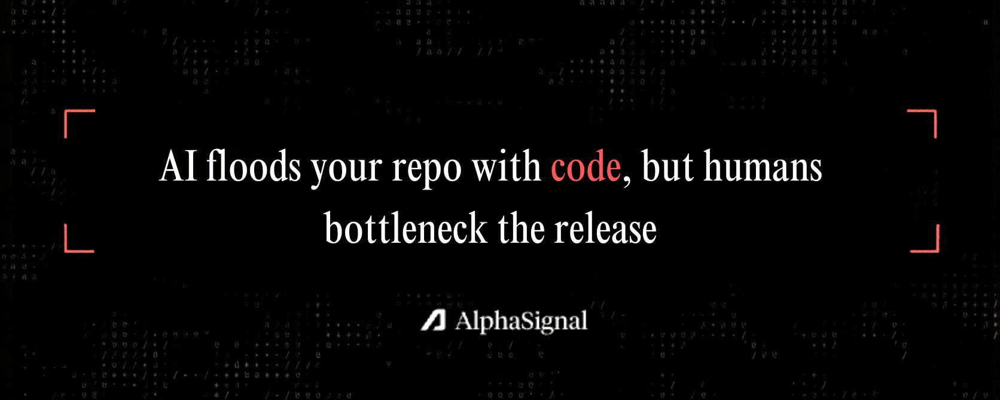

编码量暴涨 17 倍但发布量仅增 20%——MIT 和沃顿商学院联合发现 AI Coding 的衰减效应

生成式 AI 在软件开发中的角色引发了大量讨论和炒作。很多报告和实证研究显示，开发者正在以前所未有的速度产出代码，暗示着开发产出将出现爆炸式增长，每个开发者都能成为 10x 工程师。

但 MIT 和沃顿商学院的一项严谨研究发现，尽管开发者正以创纪录的速度生成代码，最终交付软件的速度却相对平稳。瓶颈已经从**语法创建转移到了下游验证**。

AI 极大加速了生产过程的早期、精细化阶段——比如编写单个函数或组件。但这在其他环节创造了新的积压：代码审查、测试、部署仍然需要人工监督。整个流水线的速度，取决于最慢的人工审阅者。

## 1. 方法论：数据解析

为了衡量 AI 对软件交付的真实影响，研究人员分析了一个追踪超过 10 万名活跃 GitHub 开发者的巨型数据集。他们结合了公开仓库数据和微软内部遥测数据，建立了一个全面的开发者产出视图。

为了排除活动偏差，研究人员将采用新 AI 工具的用户，与一年前同一日历周内同等活跃的开发者对照组进行了匹配。

研究人员追踪了三代 AI 工具：

- **自动补全模型（Autocomplete）**：在 VS Code 中运行的传统 GitHub Copilot，提示代码块
- **同步 Agent（Sync agents）**：与开发者交互式工作，如运行在本机设备上的 Claude Code
- **异步 Agent（Async agents）**：自主运行以解决更大问题的 Agent，如在云端运行的 GitHub Agents

他们将这些工具映射到整个生产生命周期，追踪从原始代码行到 PR 再到最终发布的完整链路。为了验证真实世界的用户影响，研究还汇总了月度面板数据，追踪了 Apple App Store、Google Play Store、Chrome Web Store 和 SourceForge 上的应用部署和使用情况。

## 2. 衰减效应与市场悖论

在漏斗顶端，AI 带来了不可否认的增长。正如社交媒体上流传的观点，AI 辅助下的代码产出大幅提升，异步 Agent 的代码量甚至达到人类开发者的 17 倍之多。

但问题是：这些上游的巨大收益，在接近发布时被严重削弱。

### 衰减效应

| 工具类型 | 代码行数增幅 | 提交增幅 | PR 创建增幅 |
|----------|-------------|---------|------------|
| 自动补全 | — | +40% | — |
| 同步 Agent | **+741%** | +140% | +65% |
| 异步 Agent | 最高 **17 倍** | +180% | **+71.8%**（自主完成） |

同步 Agent 带来了 741% 的代码行数增长，但最终转化为软件发布的增量只有 20%。异步 Agent 的编码产出最高，但无法自主发布代码——人类必须介入审查和合并。**人类是绝对的瓶颈。**

> 「这些大规模的上游收益在接近发布时被严重削弱。」

### 市场悖论

研究还发现了一个有趣的现象：iOS/Android 平台上新应用发布量激增——但应用商店的用户消费数据（下载量、评分）在前三个月内持平。

降低编码成本并不能解决下游的挑战：发现产品与市场匹配（Product-Market Fit）和找到分发渠道。这印证了社交媒体上的一句调侃——「搞了一堆零用户的 App」。

## 3. 平衡生成与软件生命周期

### DORA 2025 报告的核心洞察

DORA 2025 年 AI 辅助编码状态报告给出了一个关键判断：

> **「AI 是组织现有能力的严格乘数。」**

如果测试、CI、代码审查本身已经缓慢，往流水线里灌入更多 AI 生成代码只会让问题恶化。对于缺乏扎实基础的团队来说，更高的吞吐量意味着更高的部署不稳定性。**AI 放大了已有的管线脆弱性。**

### 信任悖论

- 90% 的技术专业人士使用 AI 工具
- 30% 仍然不信任生成代码
- 必须采用「信任但验证」的策略

### 向 Agentic Development Lifecycle (ADLC) 转型

开发者正从**亲手创作的键盘创作者**转变为**高级编排者**。他们的时间花在：

- 验证架构设计
- 定义测试用例
- 确定风险容忍度
- 为自主工具设定严格的护栏

### 可行的建议

1. **安全与 QA 左移**——事后扫描已无法跟上机器速度的代码产出
2. **部署内部测试 Agent**——在人工审查之前验证输出、生成边缘用例
3. **决定哪些代码需要你真正过目（哪些应该在更上游就丢弃）**——知道哪些代码**不需要写**并直接丢弃，正在成为一项高价值技能

---

## 一点观察

**「衰减效应」不是 AI 带来的新问题。** 在 Copilot 出现之前，代码审查和部署就是瓶颈，只是当时没有人注意到，因为代码生产端本身就慢。AI 把矛盾从暗处翻到了明处——这不是坏事，但别把这当成新技术独有的现象。

**市场悖论说穿了就是 PMF 没变。** App 发布量 x3 但下载量持平，不是因为「AI 生成的应用质量不高」，而是因为做产品最难的部分从来不是写代码——是搞清楚用户到底要什么、怎么让他们发现你。编码成本的下降让这个事实更扎眼了，但没有改变它。

**DORA「严格乘数效应」是全文最被低估的结论。** 差的团队用 AI 会更快地变差——不是因为 AI 不好，而是因为管线脆弱性被放大了。一个 5 分钟的单测跑 30 分钟的团队，AI 让他们多产生 7 倍代码意味着什么？意味着 CI 队列从 2 小时变成 14 小时。**提升交付速度之前，先修管线。**

**ADLC 这个词新，故事不新。** 把开发者从「键盘创作者」升级为「编排者」听起来像范式革命，但很多资深开发者早在 AI 之前就在做架构评审和代码编排。AI 只是让那些不这么做的人不得不面对这个转型。区别在于：之前可以靠手写速度掩盖，现在不行了。

---

参考：https://papers.ssrn.com/sol3/papers.cfm?abstract_id=6843118

---

参考：https://dora.dev/research/2025/dora-report
