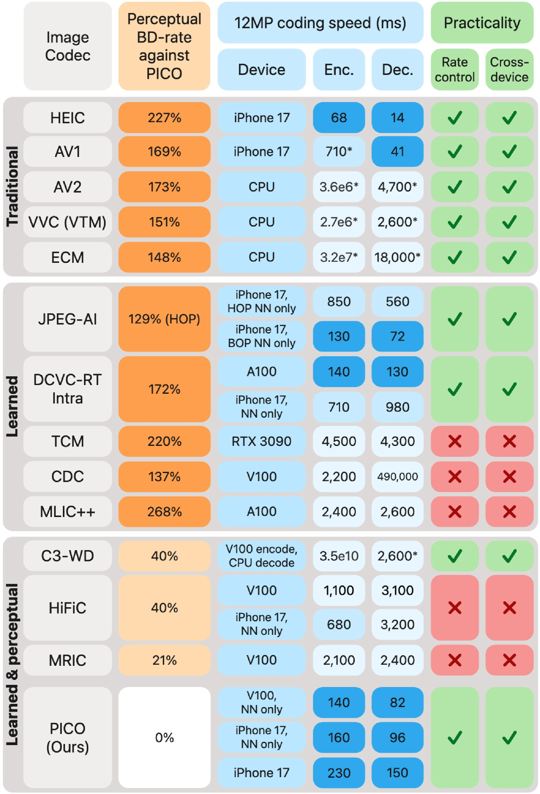
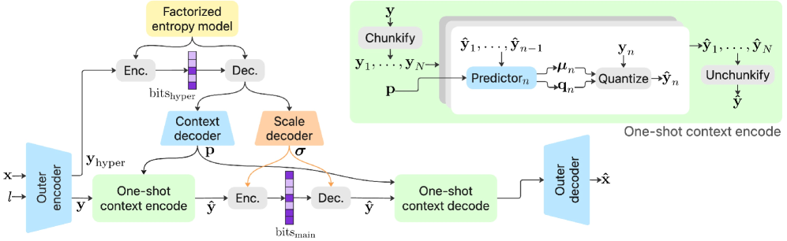
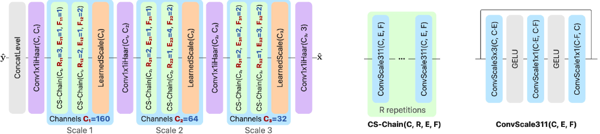
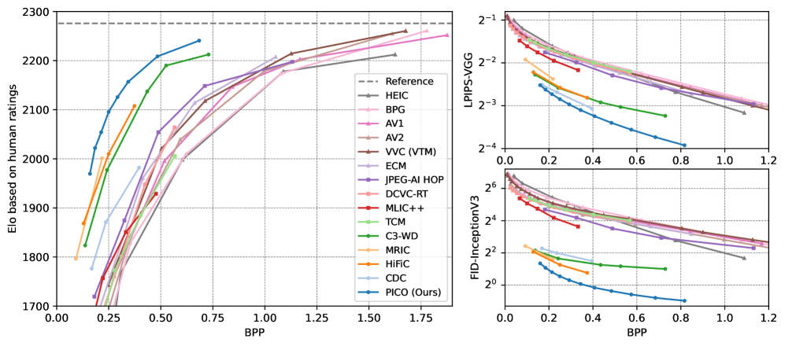
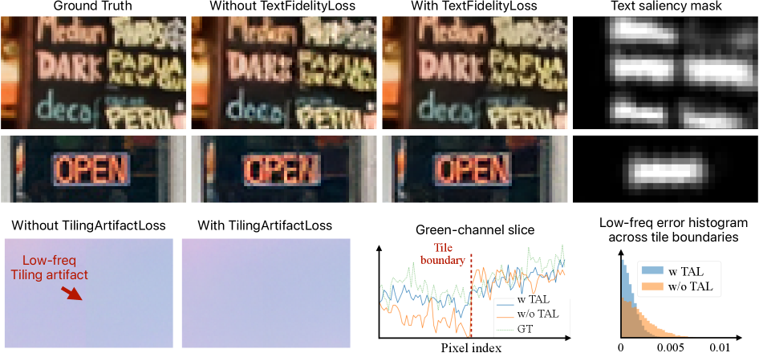
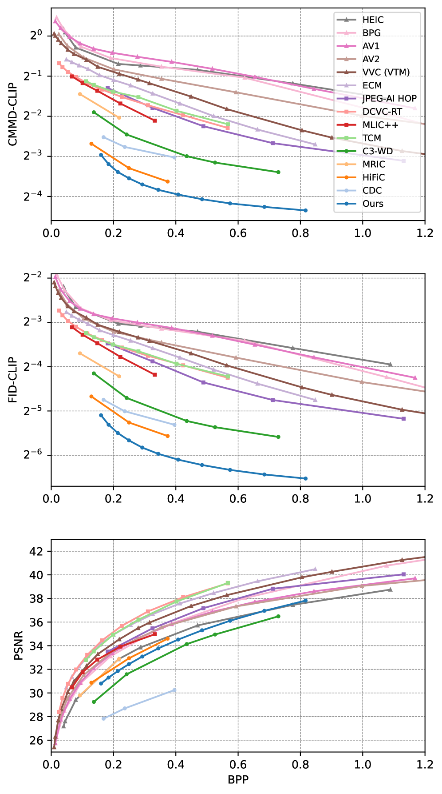

# 苹果Apple感知压缩新突破PICO：图像画质不降低，体积只有1/3

Apple 在 arXiv 上发表了一篇系统性的图像压缩研究，核心成果是一个名为 PICO 的感知优化学习编解码器。**它不仅在主观画质上碾压 AV1、VVC、ECM、JPEG-AI 等传统标准 2.3–3 倍，还在 iPhone 17 Pro Max 上实现了 230ms 编码 12MP 照片——比大多数学习编解码器在 V100 GPU 上还快。**

## 1 核心数据：压缩率与速度

**PICO 的核心指标极其突出。** 基于大规模主观用户研究（盲测配对对比），PICO 在同等感知质量下实现了以下码率节省：

- 对比 AV1、AV2、VVC、ECM、JPEG-AI：**2.3–3× 码率节省**
- 对比最强学习编解码器（HiFiC、CDC 等）：**20–40% 码率节省**
- iPhone 17 Pro Max 编码 12MP 照片：**最快 230ms**
- 解码：**最快 150ms**

**这组数据的意义在于：PICO 是第一个同时做到「感知质量最优」和「手机端实时」的学习编解码器。** 此前所有感知优化的学习编解码器（HiFiC、CDC、扩散模型方案）的推理速度都比 PICO 慢一个数量级以上。

*图 1：PICO 与各编解码器的全面对比。纵轴为基于主观用户研究的感知 BD-rate，横轴为 iPhone 17 Pro Max 上的解码速度。PICO 独占左上角区域。*

## 2 为什么感知优化如此困难

**传统编解码器（AV1、VVC、ECM）的核心问题是：它们的结构是手工设计的，无法直接针对人类视觉系统进行优化。** 你可以微调一些参数让 PSNR 好看一点，但本质上无法让模型「学会」什么是人眼看着舒服的画面。

学习编解码器理论上可以解决这个问题——通过端到端训练直接优化感知损失。**但此前所有尝试都倒在了一个问题上：太慢。** 扩散模型方案、HiFiC 的 GAN 方案、C3 的测试时优化方案——它们的推理速度离实用部署差了一个数量级。而且大部分缺乏实用编解码器必需的跨平台支持和码率控制。

**PICO 的核心贡献就是填补了这个空白：** 在数百万个模型配置中做性能感知的神经架构搜索（NAS），找到在目标手机运行时间内最大化感知压缩效率的模型。

## 3 编解码器框架设计

PICO 基于经典的 hyperprior 架构，但做了几个关键改动：

**第一，将 hyper-decoder 拆分为 scale decoder 和 context decoder 两个子网络。** 其中 scale decoder 负责输出熵编码所需的 scale 参数，**必须保证编码和解码过程输出完全一致**——任何微小差异都会导致解码失败。为此，Apple 将 scale decoder 量化为 UINT8，并在 CPU 上运行以遵循 IEEE FP 标准，确保跨平台确定性。

**第二，将 hyper-encoder 合并到 encoder 网络中。** 这样 encoder 可以作为一个单一网络编译和执行，简化部署。

**第三，使用单一模型覆盖整个码率范围。** 通过一个标量 quality level 参数来调节码率，而不是为每个码率训练独立模型。

*图 3：PICO 整体架构。关键设计是将 scale decoder 分离为独立子网络，量化到 UINT8 并在 CPU 上运行。*

## 4 模型架构创新

**论文在模型架构上做了多项创新，其中三个最值得关注：**

### 4.1 ConvScale：带可学习缩放的卷积

**标准卷积的权重是固定的，但 PICO 的 ConvScale 层为每个卷积核引入了一组可学习的缩放因子。** 这相当于给卷积增加了额外的表达能力，但计算开销几乎为零——因为缩放因子是在训练中学到的，推理时直接融合到卷积权重中。

### 4.2 One-Shot Context Model

**传统学习编解码器常用自回归熵模型来提升压缩效率，但自回归模型是串行的——每个像素的编码依赖之前的结果，无法并行。** PICO 提出的 One-Shot Context Model 通过一次前向传播即可生成完整的上下文信息，避免了串行瓶颈，大幅提升解码速度。

### 4.3 Conv + Haar 重采样

**PICO 使用 Haar 小波进行所有上/下采样操作。** 关键技巧是将 Haar 变换和 1×1 卷积合并为单个卷积操作——通过一个重参数化技巧，在不增加任何计算量的前提下完成了空间下采样和通道数变换。

*图 4：外解码器架构及 NAS 搜索空间。红色标注了可搜索的超参数，蓝色为最终选择。*

## 5 神经架构搜索：从 140 万候选到最终模型

**这是论文最工程化的部分。** Apple 定义了一个包含通道数、重复次数、扩展因子等超参数的搜索空间，生成了约 140 万个候选模型配置。

搜索流程分两步：
1. **第一阶段：** 所有候选模型只训练 MSE 损失（计算量小），用感知指标排序
2. **第二阶段：** 前 20 个模型训练完整感知损失（含 GAN），最终选出最优

**一个有趣的发现：在相同运行时间预算下，给低分辨率层分配更多通道、牺牲高分辨率层的通道数，通常比调整重复次数或扩展因子更有效。**

*图 5：NAS 搜索流程。从 140 万候选开始，逐步过滤到 20 个训练完成的模型。*

## 6 训练损失设计

PICO 的训练分为两个阶段：

- **第一阶段：** 纯 MSE 损失训练，学习率 0.0008，在 70% 和 90% 训练进度时衰减
- **第二阶段：** 引入感知损失（LPIPS）和 GAN 对抗损失，学习率在 30%/60%/80% 时衰减

**GAN 训练是关键。** 论文设计了专门的判别器架构，并提出了针对文本和分块伪影的专项损失——这两个是感知编解码器最容易翻车的地方。**HiFiC 等早期方案在文本区域经常模糊不清，PICO 通过专项损失基本解决了这个问题。**

## 7 实验结果

**主观用户研究是论文最有力的证据。** Apple 使用盲测配对对比（类似 CLIC 竞赛的协议），通过最大信息增益策略选择最有价值的比较对，最终用贝叶斯 ELO 评分计算排名。

*图 6：消融实验。每个组件对最终性能的贡献被逐一剥离验证。*

**PSNR 的局限性再次被证实。** PICO 和 HiFiC、CDC 等感知编解码器在 PSNR 指标上表现不佳，但在人类评分和感知导向的客观指标上大幅领先。**反过来，PSNR 最高的编解码器（DCVC-RT、TCM、ECM、VVC）在感知质量上需要 2–3 倍码率才能达到同等水平。**

*图 8：多指标 R-D 曲线。PSNR 和感知质量之间存在根本性矛盾。*

---
参考：https://arxiv.org/html/2605.05148v1

## 一点观察

**PICO 的真正意义不是又一个编解码器，而是「感知优化」从实验室到产品的最后一步。** 此前 HiFiC 证明了 GAN 可以提升压缩感知质量，CDC 证明了扩散模型可以做到更好，但它们的推理速度决定了只能在论文里看看。PICO 在 iPhone 上 230ms 编码 12MP 照片——这意味着它可以被塞进手机相册、即时通讯、云存储的后处理管线。

**Apple 做这件事有天然优势。** 他们控制着从芯片（A/M 系列）到系统（iOS/macOS）到应用（照片、iCloud）的整条链路。PICO 的跨平台确定性设计（UINT8 + CPU scale decoder）表明他们从一开始就在考虑大规模部署，而不是发一篇论文就结束。JPEG-AI 标准化已经证明了学习编解码器的行业认可度，Apple 在这个时间点推出 PICO，很可能是在为 iOS 下一代照片格式铺路。

**一个值得关注的方向：PICO 对卡通/合成内容效率反而低于传统编解码器。** 这意味着未来可能需要内容感知的编解码器选择——照片用 PICO，截图/UI 用传统方案。这种混合策略已经在视频编码领域被验证（如 Apple 的 HEIF + HEVC 双格式），在图像领域可能也会成为标配。
