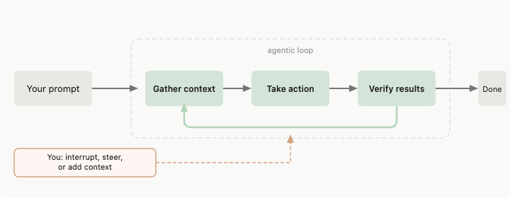
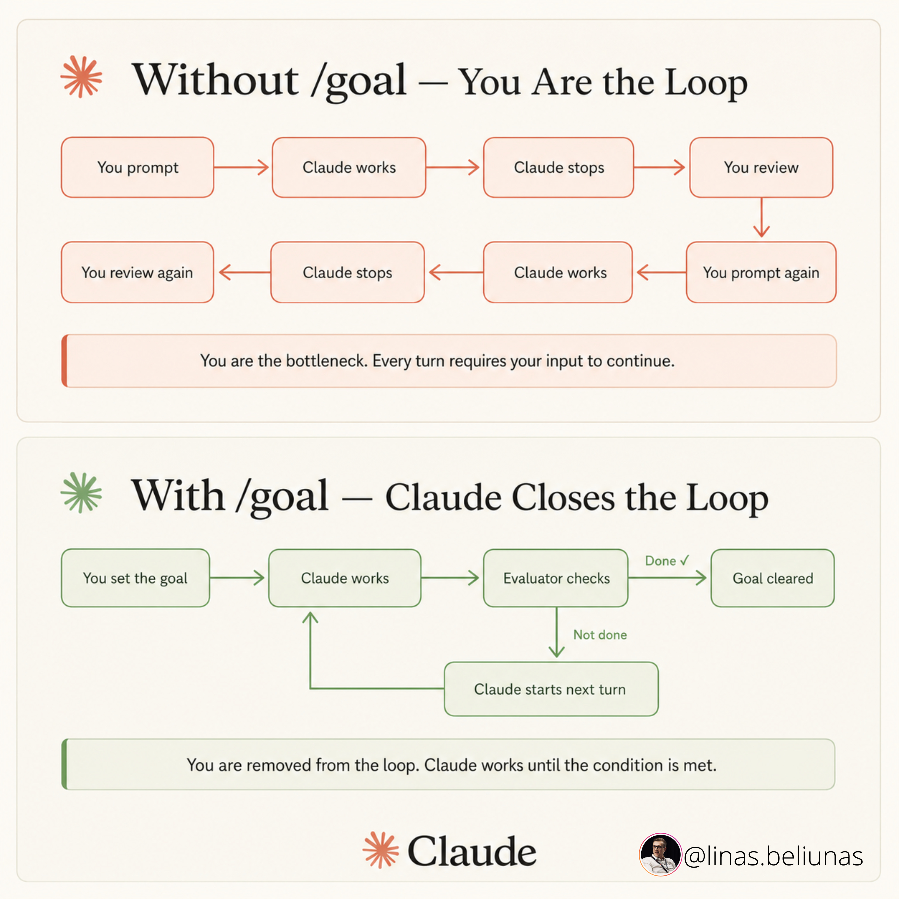

**Loop Engineering：从提示工到循环设计师的 14 步路线图**

> 大多数开发者还在手动给编码 Agent 写提示词。输入，等待，看 diff，再输入。10 个开发者里有 9 个从未写过一条让 Agent 自己给自己发提示的循环。没有自动化，没有状态文件，没有验证器，没有调度。杠杆点已经转移了——从写提示词，到设计自动发提示的系统。

**Part 1 · 为什么做 & 测试**

**01. Loop Engineering 就是用循环替代你自己作为提示者**

过去两年，你从编码 Agent 那里得到结果的方式是：写提示词，分享上下文，看返回结果，再写下一条提示词。Agent 是一个工具，你全程握着它。这个阶段正在结束。

Loop Engineering 是构建一个小系统：它自己找到任务，交给 Agent，检查结果，记录发生了什么，决定下一步——自主完成。你设计这个系统一次。之后，系统替你来提示 Agent。

Addy Osmani 将其拆解为六个部分。Anthropic 的工程师现在每天合并的代码量是 2024 年的 8 倍——Anthropic 自己称这个数字"几乎肯定夸大了真实的生产力提升"。数字有争议，但机制没有争议：**杠杆点已经从写提示词转移到了设计发提示的循环。**

**02. 构建之前先跑 4 条件测试**

循环在四个条件下才值得投入成本。缺一个，循环的成本就超过回报。这是 AlphaSignal 分析中诚实的部分，也是大多数 X 帖子跳过的部分：

**任务重复发生。** 循环通过多次运行分摊搭建成本。一次性任务，一个好提示词更快更便宜。如果工作不是每周重复，你有的不是循环——你只是跑了一次的脚本。

**验证可以自动化。** 循环需要能在你不在场时判定工作失败的东西。测试套件、类型检查器、linter、构建。没有自动化检查，意味着你又要坐回椅子上读每个 diff——这正是循环本应替你省掉的工作。

**你的 token 预算能承受浪费。** 循环会重读上下文、重试、探索。不管这次运行是否产出东西，都会消耗 token。**这个技术随预算扩展，这就是为什么它对有无限 token 的人来说是显而易见的，对按量计费的人来说是鲁莽的。**

**Agent 拥有高级工程师的工具。** 日志、可复现环境、运行自己写的代码并看到什么会坏的能力。没有这些，循环就是盲迭代。

**03. 谁赢，谁输——循环偏爱能花钱的人**

经济学不是普适的。说 Loop Engineering 显而易见的人，通常有无限 token。说它鲁莽的人，通常是在 $20 的消费者套餐上试图跑重验证循环，不想撞到限额或意外账单。

**实际受益者：** 有重复性、可机器检查的工作且有预算的团队——持续测试分类、依赖升级、lint-and-fix 流程、在有强测试覆盖的代码库上从 issue 到 PR 草稿。有强现有测试套件的代码库。已经使用多 Agent 模式的异步优先团队。

**应该跳过的人：** 消费者套餐上的独立开发者——token 账单在生产力提升到来之前就到了。代码没有自动化验证的人——没有真正检查的循环就是 Agent 在重复自我认同。真正的瓶颈是审查能力而非打字速度的团队——循环产生更多代码，如果审查已经是瓶颈，它只会让队列更长。

**一次性任务、探索性工作、或任何"完成"需要判断力的工作，一条精准的提示词仍然赢。** 这篇文章的诚实版本是：Loop Engineering 是真实的，但大多数开发者还不需要它。

**04. 30 秒循环检查清单**

4 条件测试是战略决策。这个是战术性的——在把一个具体任务变成循环之前跑一遍。缺一项就保持手动提示：

1. 任务至少每周发生（少于每周 → 搭建成本永远无法摊销）
2. 测试、类型检查、构建或 linter 可以拒绝坏输出（没有自动化闸门 → Agent 给自己批作业）
3. Agent 可以运行它修改的代码（没有可复现环境 → 迭代是盲目的）
4. 循环有硬停止（token 预算、迭代次数或时间限制——没有它，循环会跑到有人注意到账单为止）
5. 人类在合并、部署或依赖变更前审查

**好的首次循环：** CI 失败分类、依赖升级 PR、lint-and-fix 流程、不稳定测试复现、有强测试的代码库上的 issue 到 PR 草稿。

**坏的首次循环（需要人类在椅子上）：** 架构重写、认证或支付代码、生产部署、模糊的产品工作、任何"完成"需要判断力的事。

**Part 2 · 5 个构建模块**

**05. 自动化：心跳**

自动化让循环成为真正的循环，而不是一次性的运行。它们按调度、按事件或按触发条件启动。**它们是心跳——循环中的一切其他东西都挂在它们上面。**

在两种工具中的样子：
- **Codex：** Automations 标签页——选项目、设提示词、设节奏、选本地 checkout 或后台 worktree。有发现的运行进入 Triage 收件箱；无发现的自动归档。
- **Claude Code：** 三个原语：`/loop`（会话级节奏）、Desktop scheduled tasks（重启后存活）、Routines（笔记本关闭后的云端运行）。配合 hooks 做生命周期事件。

自动化内部有两个原语区分有效循环和昂贵循环：`/loop` 按节奏重复运行；`/goal` 持续运行直到你写的条件为真——一个独立的小模型检查完成状态，所以写代码的 Agent 不是给它评分的那个人。**这是 maker-vs-checker 分离在停止条件上的应用。**

**06. Worktrees：无混乱的并行**

一旦运行超过一个 Agent，文件就开始冲突。两个 Agent 写同一个文件，就像两个工程师不沟通就提交到同一行。

Git worktree 解决了这个问题——一个独立的、在自己分支上的工作目录，共享同一个仓库历史，所以一个 Agent 的编辑物理上不可能碰到另一个的 checkout。

Codex 内置了 worktree 支持。Claude Code 通过 `--worktree` 标志暴露 git worktree，以及 subagent 的 `isolation: worktree` 设置，让每个助手获得一个独立的 checkout，完成后自动清理。

**Worktrees 消除了机械冲突，但你仍然是天花板。** 你的审查带宽决定你能实际运行多少个并行 Agent——不是工具。

**07. Skills：项目知识写一次，每次运行读**

Skill 就是你不再每次会话都像金鱼一样重新解释同一个项目上下文的方式。两种工具使用相同格式：一个包含 SKILL.md 的文件夹，里面是指令和元数据，加上可选的脚本、参考和资源。

**这对循环特别重要：没有 skills 的循环每次都会从零重新推导整个项目上下文。有了 skills，意图会叠加。** 约定、构建步骤、"我们不这么做因为那次事故"——在外部写一次，每次运行都读到。

**08. Connectors：循环通过 MCP 触及你的真实工具**

只能看到文件系统的循环是一个很小的循环。Connectors，基于 Model Context Protocol（MCP），让 Agent 读取你的 issue 追踪器、查询数据库、访问 staging API、在 Slack 发消息。

**这就是说"这是修复方案"的 Agent 和实际打开 PR、链接 Linear ticket、CI 通过后通知频道的循环之间的区别。** Connectors 是循环能在你的真实环境中行动的原因，而不只是告诉你如果可以它会做什么。

对循环工作回报最快的 connectors：GitHub（创建分支、开 PR、评论 issue、响应 webhook）、Linear/Jira（更新 ticket、链接 PR、自动关闭）、Slack（发布分类结果、升级通知）、Sentry/错误追踪器（调查实时告警、为高频问题起草修复）。

**09. Sub-agents：让 maker 远离 checker**

循环中最有用的结构，远超过其他一切，是把写代码的 Agent 和检查代码的 Agent 分开。

**Osmani 的表述很精确：写代码的模型"给自己批作业时太客气了"。** 第二个 Agent，使用不同的指令，有时是不同的模型，能抓住第一个 Agent 说服自己通过的东西。

这就是 Anthropic 2024 年 12 月工程文章中记录的 evaluator-optimizer 模式换了个名字。一个模型生成，另一个批评，重复。2026 年走红的词汇，18 个月前就已经被记录了。

在 Codex 中，你在 `.codex/agents/` 中定义自己的 Agent（TOML 文件），你的安全审查员可以是一个高 effort 的强模型，而你的探索者是一个快速的只读 Agent。Claude Code 用 `.claude/agents/` 做同样的事，Agent teams 在它们之间传递工作。

**它之所以在循环中特别重要：循环在你不在场时运行，所以你真正信任的验证器是你唯一能走开的理由。** Sub-agents 消耗更多 token（每个都做自己的模型和工具工作）——把 token 花在值得第二意见的地方。

**Part 3 · 正确构建，否则别构建**

**10. 状态文件——Agent 会忘记，文件不会**

这是听起来太简单不值得重视、实际上是每个工作循环的脊柱的东西。一个 markdown 文件、一个 Linear board、一个 JSON 状态——任何存在于单次对话之外、记录已完成和下一步的东西。

**Agent 默认记忆很短。** 它们这次会话学到的东西明天就没了，除非你写下来。Osmani 的规则：Agent 会忘记，仓库不会。没有持久化状态的循环每次重新开始；有状态的循环从中断处继续。

状态文件的两种模式：仓库中的 markdown（STATE.md 或 .claude/ 内），版本控制，diff 可读，适合个人或小团队。外部系统（Linear、GitHub Issues、数据库），跨仓库存活，可查询，支持团队可见性，适合生产循环。

**对于可能偏离目标的长时间循环，将状态文件与一个高级规格文件（VISION.md 或 AGENTS.md）配对，Agent 每次运行重新读取。** 状态告诉 Agent 它在哪，规格告诉它去哪。

**11. 最小可行循环**

如果你通过了第 2 步的 4 条件测试，在搞花哨之前先构建能工作的最小循环。四个部分，没有 swarm：

**一个自动化。** 按节奏触发并在明确条件上停止的调度运行。用 Claude Code 的 `/loop` 或 Codex 的 automation。配合 `/goal` 让它运行到指定条件满足。

**一个 skill。** 一个 SKILL.md，存储 Agent 否则每次从零重新推导的项目上下文。

**一个状态文件。** 记录已完成和下一步的 markdown 文件或 Linear board。明天的运行从中断处恢复，而不是重新开始。

**一个闸门。** 自动拒绝坏工作的测试、类型检查或构建。这是决定循环是帮助还是纯粹花钱的部分。

**顺序很重要：先让一次手动运行可靠。把它变成 skill。包进循环。然后调度。** 跳步前进就是循环在生产中失败的方式。

**关键的指标是每次接受的变更的成本——不是消耗的 token，不是尝试的任务，不是调度的循环。** 如果你的接受率低于 50%，你在做循环本该替你省掉的审查工作，循环在亏钱。

**12. Ralph Wiggum 循环——静默失败的循环**

工程师 Geoffrey Huntley 记录并命名了这个失败模式。一个本应在完成时才发出完成 token 的 Agent 过早发出了它，循环在一个半成品上退出。没有硬闸门，循环静默失败并持续花钱。

Ralph Wiggum 循环的发生条件：
- **没有真正的验证器。** 只是让第二个 Agent "审查"，没有客观信号。两个乐观主义者互相认同。
- **软完成条件。** "完成"由 Agent 的判断定义，而不是测试、构建或类型检查。
- **没有硬停止。** 循环持续直到外部因素杀死它（速率限制、你注意到），而不是直到成功被验证。

修复方法是第 11 步的闸门——能客观判定工作失败的东西。一个通过或不通过的测试。一个编译或不编译的构建。一个返回零或非零的 linter。**不是有意见的验证器。**

其他已知失败模式：长时间会话中的目标漂移（每次摘要都有损失，"不要做 X"的约束在第 47 轮消失）；自我偏好偏差（写代码的 Agent 给自己批作业太客气）；Agent 懒惰（循环在部分完成时宣称"够好了"）。

**13. 理解债务与认知投降**

这是循环越好反而越尖锐的失败模式。两个命名风险，都来自 Osmani 的文章：

**理解债务。** 循环越快交付不是你写的代码，仓库包含的内容和你理解的内容之间的差距就越大。**真正疼的账单不是 token 账单。而是有一天你必须调试一个团队里没人读过的系统。**

**认知投降。** 停止形成自己的意见、接受循环返回的任何东西的冲动。设计循环，当你带着判断力做时是解药；当你为了避免思考而做时是加速器。同样的动作，相反的结果。

缓解措施不是技术性的：
- **读 diff。** 如果你不读循环交付了什么，你就是在以复利租借理解债务。
- **抽查闸门。** 挑几个循环开的 PR，验证批准它们的测试确实能抓住你关心的失败模式。闸门会腐烂。
- **阻止循环碰架构工作。** 让它做小的、可机器检查的变更。一旦让它碰需要判断力的工作，理解债务就会加速。
- **和队友一起配对设计循环。** 设计时的第二双眼睛能发现循环以后会永远利用的盲点。

**14. 安全税——无人值守的循环就是无人值守的攻击面**

无人值守运行的循环也是一个无人值守的攻击面。循环必须防御的威胁模型：

**生成的代码未经审查就上线。** 循环开 PR 的速度快过人类阅读。没有包含安全检查（SAST、依赖审计、密钥扫描）的闸门，不安全的代码会自动合并。

**Skills 作为注入向量。** 自动安装 skills 的循环会继承其描述中的每个提示注入。安装前审计 skill 来源。

**日志中的凭证。** 长时间运行循环期间的调试日志会把密钥散布在你不会监控的日志中。在生产循环中禁用详细日志；清理确实被记录的内容。

**权限范围蔓延。** 用只读权限测试的循环，为了便利加了"就一个"写权限，然后从未重新审计。每 30 天重新审计一次权限。

**§ 把循环变成烧钱机的错误**

- 不跑 4 条件测试就构建循环
- 没有客观闸门（第二个 Agent "审查"而没有测试/类型检查/构建 = 第二个乐观主义者）
- 一个 Agent 同时做编写和验证（自我偏好偏差）
- 没有状态文件（明天的运行从零开始而不是恢复）
- 模糊的停止条件（"看起来好了就停"永远不成立）
- 没有 token 预算上限（循环重读上下文和重试，没有上限的雄心勃勃的循环消耗你预期的 5-10 倍 token）
- 在消费者套餐上跑重验证循环
- 自动安装社区 skills（17,022 个审计过的 skills 中有 520 个泄露凭证）
- 在需要判断力的工作上跑循环
- 不读 diff（复利理解债务）

**结论：杠杆转移了。你的工作也是。**

过去两年，与编码 Agent 合作的杠杆在提示词上。更好的提示词，更好的上下文，更好的一次性输出。那个阶段正在结束。Agent 已经足够好，下一个杠杆点高了一层：决定它们做什么、什么时候做、用什么闸门、什么状态在运行之间存活的系统。

**但这个故事的诚实版本不是每个人都应该急着构建循环。** 大多数开发者还不需要——直到任务重复、验证自动化、预算能承受浪费、Agent 拥有高级工程师的工具。缺一个条件，循环的成本就超过回报。

如果你通过了测试，从小开始。一个自动化。一个 skill。一个状态文件。一个闸门。让一次手动运行可靠。把它变成 skill。包进循环。然后调度。顺序很重要。跳步前进，你就在为一个没人理解的系统付钱。

Cherny 的观点不是工作变容易了。**是杠杆点转移了。构建循环。保持做工程师。**

---

**一点观察**

1. 这篇文章是典型的"信息聚合型"技术写作——融合了 Anthropic 工程文档、Addy Osmani 的 loop engineering 长文、AlphaSignal 的分析、Geoffrey Huntley 的失败模式命名，加上作者自己的实践经验。这类文章的价值不在于原创性，而在于把分散的信息整合成一个可操作的 14 步框架。

2. 第 2 步的 4 条件测试是全文最有价值的部分。大多数 loop engineering 的鼓吹者只讲"多爽"，不讲"什么时候不该用"。4 条件测试（任务重复、验证自动化、预算能承受浪费、Agent 有高级工具）直接划出了适用边界——这个边界比大多数人以为的要窄。

3. 有趣的是，这篇文章本身就在示范它讲的内容：作者用"从 prompter 到 loop designer"的叙事框架，把读者从一个被动接收信息的人（prompter）变成了一个能设计系统的工程师（loop designer）。文章结构本身就是一条循环。

4. 第 13 节的"理解债务"是全文最被低估的警告。循环越高效，你理解自己代码库的能力就越弱。这个问题的严重性会随着时间非线性增长——你跳过的 diff 越多，将来调试时付出的代价就越大。这不是 token 问题，是认知问题。

---

参考：Loop engineering: the 14-step roadmap from prompter to loop designer
