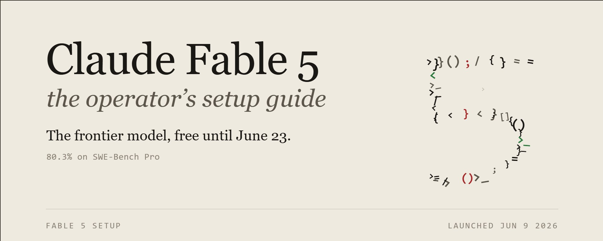
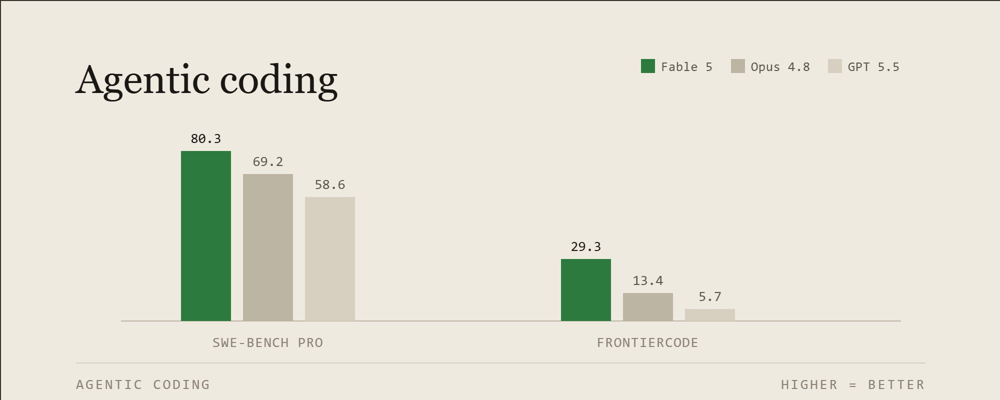
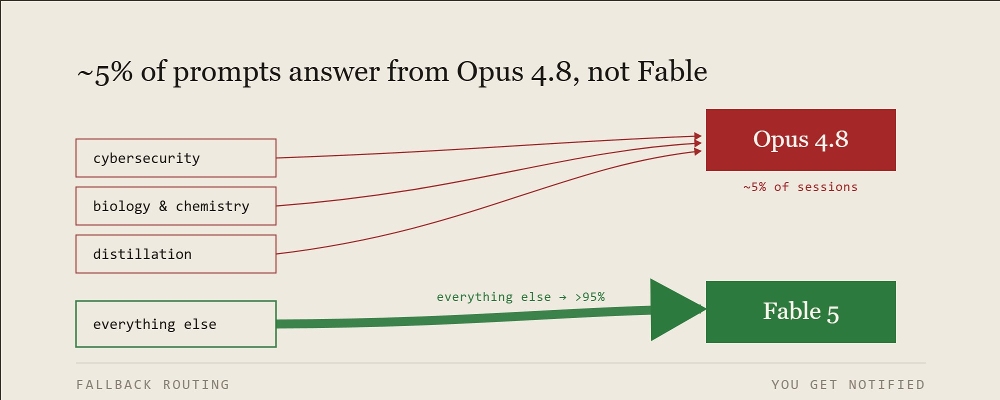
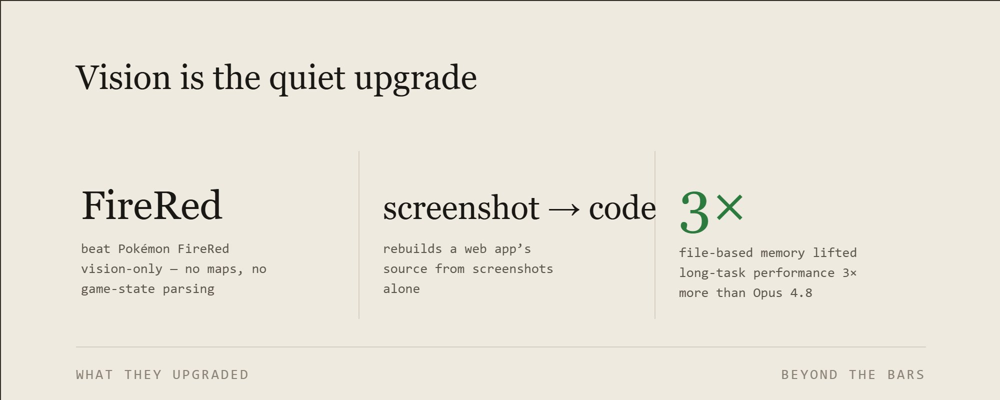
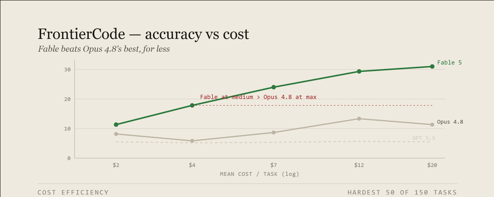
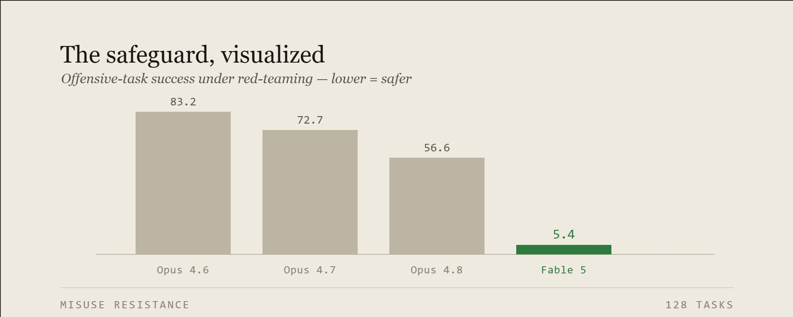
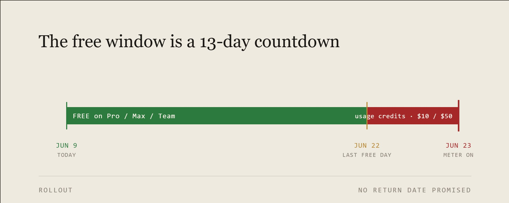

**Claude Fable 5 免费窗口仅剩 13 天：完整配置指南与你不该忽略的降级陷阱**

> Anthropic 发布了新一代旗舰模型 Claude Fable 5，在 Pro/Max/Team 计划上免费开放至 6 月 22 日。SWE-Bench Pro 80.3%、Terminal-Bench 2.1 88.0%、Stripe 用它在一天内完成了一个 5000 万行 Ruby 代码库的迁移。但有一个细节没人会在公告里告诉你：大约每 20 次请求中，有 1 次你实际上在和 Opus 4.8 对话。

**到底发了什么——两个模型，一个大脑**

Fable 5 是 Anthropic 的新旗舰模型，对所有用户开放。Mythos 5 是同一个底层模型，但移除了网络安全防护，仅限 Project Glasswing 合作伙伴和即将推出的可信访问计划。两者唯一的区别就是安全防护。

名字本身就在暗示：fable 来自拉丁语 fabula，意为"被讲述的故事"，与希腊语 mythos 同源。**这是 Anthropic 有史以来放在公众面前的最强模型。**

SWE-Bench Pro 上，Fable 5 得分 80.3%，Opus 4.8 为 69.2%，GPT 5.5 为 58.6%，Gemini 3.1 Pro 为 54.2%。Terminal-Bench 2.1 上 88.0%。GDPval-AA 知识工作评测中 1932 分，Opus 4.8 为 1890。

**比任何一个单一数字都重要的规律是：任务越长越复杂，领先幅度越大。** 这不是靠一句俏皮话取胜的模型。它赢在你一直不敢交出去的那些工作上。

价格是每百万输入 token 10 美元，每百万输出 token 50 美元，不到 Mythos Preview 的一半。

**这个优势在大任务上会叠加。** 早期测试中，Stripe 用它在一天内完成了一个 5000 万行 Ruby 代码库的全库迁移——这项工作如果人工做，需要一个团队两个多月。

**沉默的降级——约 5% 的请求你其实不在和 Fable 对话**

这是公告里没人会读的部分，**但它会改变你路由任务的方式。**

Fable 内置了一组分发器：独立的系统监控每个提示词。当请求涉及网络安全、生物与化学、或蒸馏（distillation）时，响应由 Claude Opus 4.8 处理，而不是 Fable，并且你会收到通知。

超过 95% 的会话从未触发降级。对这些会话来说，Fable 5 和 Mythos 5 几乎没有区别。旗舰模型就是默认体验。

**但如果你的工作属于那三个类别，你经常得到的是 Opus 4.8，而不是你选择的旗舰。** 三件事需要记住：

安全类工作会被降级，这是设计使然。网络安全分发器的作用就是阻止 Fable 在攻击性任务上取得进展。在自动化红队测试中，Fable 的攻击性任务成功率为 5.4%，而 Opus 4.8 为 56.6%，Opus 4.6 为 83.2%。**这不是 Fable 在安全方面更差，而是安全防护在尽职尽责。** 如果你做渗透测试、漏洞利用或红队工作，预期会触发降级，不要浪费回合去对抗它。

生物和化学的触发范围目前很宽。Anthropic 为了安全快速地发布，调得比较保守，这意味着即使是良性的化学或生物学问题也可能触发降级。他们表示会逐步收窄。在此之前，**任何生命科学相关的提示都按"可能走 Opus"处理。**

蒸馏类提示也会触发降级。任何看起来像试图提取模型能力以训练竞争对手的请求，都会被路由到 Opus 4.8。

判断方法很简单：触发时你会收到通知。如果你在预期之外的领域看到这个通知，那就是误报，Anthropic 公开承认目前的范围很宽。重新措辞，或者接受这一轮用 Opus 4.8。

**不要把这理解为开关后面藏了一个更弱的模型。把它理解为路由信息：** 被标记的工作交给 Opus，其他所有工作趁免费窗口交给 Fable。

**真正升级了什么——三个对日常工作更重要的改进**

**Vision 才是真正的头条。** Fable 可以仅凭截图重建一个 Web 应用的源代码。证明它的演示是：它用纯视觉驱动，从零开始通关了 Pokémon FireRed——没有地图、没有游戏状态解析、没有导航辅助，只有原始的屏幕像素。早期的 Claude 模型需要一套辅助工具才能玩起来。**如果你的工作涉及截图转代码、科学图表转数字、或 UI 转规格，这才是为模型买单的飞跃。**

**记忆能力现在会叠加了。** Fable 在数百万 token 范围内保持连贯，并能通过自己的笔记改进输出。在 Slay the Spire 的长程游戏中，使用基于文件的记忆后，它的提升幅度是 Opus 4.8 使用相同记忆时的 3 倍，到达最终关卡的概率也提高了 3 倍。**持久化记忆文件以前只是一个小优化，在 Fable 上成了乘数放大器。** 任何长程任务都该开启。

**它在较低 effort 下也更省 token。** 在 Cognition 的 FrontierCode 基准测试中，Fable 即使在中 etc 模式下也领先于所有前沿模型。你不需要把它开到最大才能超越 Opus。**Fable 在中等 effort 下已经超过了 Opus 4.8 的最高设置，而且每个任务花费更少。**

**完整配置（可直接复制）**

1. **设置模型。** Claude Code 中 Pro/Max/Team 已可用。用 `/model` 切换，选择 Claude Fable 5，按 d 设为默认。要持久化配置，编辑 `~/.claude/settings.json`：`{"model": "claude-fable-5", "effortLevel": "xhigh"}`。API 上模型 ID 为 `claude-fable-5`。在 xhigh 或 max 模式下给它足够的思考空间和子 Agent 运行空间：`max_tokens` 从 64k 起步，向下调整。

2. **有意识地选择 effort——它比模型本身更关键。** Fable 有五个级别：low、medium、high、xhigh、max。Anthropic 自己的建议是：真正编码和 Agent 运行时用 xhigh。成本曲线显示你通常不需要更高：FrontierCode 最难的任务上，Fable 在 medium 下已经超过了 Opus 4.8 在 max 下的表现，每个任务只花几美元。**规则：xhigh 用于长期任务，medium 用于日常编辑，max 基本是边际收益递减。** 注意 max 和 ultracode 是会话级别的，用 `/effort` 设置。

3. **长程任务开启持久化记忆。** 3 倍提升就在这里。一个带文件化记忆的长期迁移或多会话重构，和没有记忆的同一个任务完全是两个模型。

4. **知道什么时候不该用 Fable。** 两种情况。第一，简短、廉价、确定性的提示词，Opus 4.8 或 Sonnet 用更少的钱返回同样的答案，$10/$50 的溢价买不到任何东西。第二，任何属于网络安全、生物/化学或蒸馏类别的工作——反正你也会得到 Opus 4.8，不如直接调用 Opus，跳过降级通知。

5. **注意数据保留。** 每个 Fable 请求现在会保留 30 天并在后台分析，专门用于捕获越狱和蒸馏尝试，并减少误报。它不会用于训练新模型，30 天后删除。**对敏感客户数据要保持警惕，不要尝试越狱或提取——保留期的存在就是为了捕获这些行为。**

**值得用 vs 过度杀伤**

**真正的优势领域：**
- **长周期编码。** 全库迁移、多文件重构，任何任务时间长到让领先幅度叠加的场景。这是这个模型的主场。
- **Vision。** 截图到可工作代码、密集的科学图表到提取的数字、UI 到规格文档。最先进水平，对 Opus 是真正的飞跃。
- **高级分析。** 金融、研究、根因排查。一位物理学研究合作伙伴报告说，Fable 在 36 小时内达到了 GPT-5.5 四天后的水平，只用了三分之一的推理 token。Hebbia 将其评为他们测试过的最强金融模型。

**过度杀伤的场景：**
- 简短、廉价、确定性的任务。如果 Opus 4.8 或 Sonnet 给出同样的答案，溢价买不到任何东西。**不要为了格式化 JSON 而开旗舰。**
- 被标记主题的工作。反正你也会得到 Opus 4.8，直接用 Opus。

一个值得直说的信任说明——因为安全故事会吓跑人：Fable 和 Mythos 5 是同一个模型，在 Anthropic 的对齐评估中，Mythos 5 的失调行为与 Opus 4.8 持平，低于早期模型。**更强的能力并没有带来可衡量的对齐退化。**

**思维模型**

你不是在升级一个聊天机器人。**你得到的是一个 13 天的免费试用期，试用一位高级操作员，它有三个特质：任务跑得越久越强，现在能像读文字一样读屏幕，在三个标记领域会自动让位给初级操作员。**

所以，把试用期花在你一直觉得太大、太慢、不敢交出去的工作上。**不是那些你给任何模型都能做的快活。** 迁移、审计、重构、你一直推到下个季度的分析。这些才是 6 月 23 日关闭的东西。

**它在我的项目里发现了什么**

作者不想在基准测试上评测 Fable。他想看它在自己已经烂熟于心的代码上表现如何。

发布当天，他开了四个 Claude Code 会话，每个对应一个活跃项目，给了同样的指令。不是"加个功能"，而是：像一个第一次看到这个代码库的高级工程师那样审查它。

**结果：它发现了数月来 Opus 在同一代码库上从未发现的 bug。** 在钱包解析器上，9 个。在另一个还不能公开的项目上，又 4 个。

令人印象深刻的不是数量，而是类别：**不是 Opus 已经能发现的那类问题，而是那些需要把整个文件同时放在工作记忆中才能注意到的 bug**——藏在函数之间缝隙里的那种。这就是长上下文和 Vision 升级在真实工作中的体现，而不是在排行榜上。

**关键：这是一个 13 天的免费窗口，不是礼物**

从今天到 6 月 22 日，Fable 5 在 Pro、Max、Team 和基于座位的 Enterprise 计划上免费。6 月 23 日，它将被从这些计划中移除。之后使用需要消耗使用积分，按 API 费率计费：输入 $10，输出 $50。Anthropic 表示"当容量允许时"会将其重新纳入订阅计划。**这是一个意图，不是一个日期。**

**所以你有 13 天的时间，用你已经付费的计划使用一个前沿模型。** 操作员的动作很明显：把你最高价值、最高 effort 的工作前置到 Fable 上。你一直推迟的迁移、横跨 40 个文件的重构、对一个正常会话来说太大的审计。不是"总结这封邮件"。

**结尾**

你有 13 天时间，用你已经付费的计划，使用 Anthropic 有史以来向所有人发布的最强模型。

无论你一直在"等有时间了"才做的那个又大又慢又吓人的任务是什么——**这就是那个窗口。**

今晚就把 Fable 5 设为你的模型，在 6 月 23 日之前运行你最大的任务。

---

**一点观察**

1. Fable 5 的定价策略非常聪明。$10/$50 的 API 定价不到 Mythos Preview 的一半，配合 13 天免费窗口，本质上是一次大规模的用户习惯养成实验。Anthropic 赌的是：13 天后，已经习惯用 Fable 做长周期编码的用户会愿意为它额外付费。

2. 5% 的降级率是一个精心设计的数字。高到足以让安全团队安心，低到绝大多数用户永远不会注意到。但如果你做网络安全或生命科学方向的工作，这个比例可能接近 100%。Anthropic 公开承认"范围很宽"——这不是 bug，是发布策略。

3. 这篇文章本身也是一次精彩的"亲历者视角+产品定位"写作。作者以"发布当天开了四个项目实测"建立可信度，然后自然过渡到 Fable 5 的能力展示。和很多技术 thought leadership 文章一样，诊断（"你一直不敢交出去的工作"）和开药方（"用 Fable 5"）之间的逻辑链条需要读者自己保持审视。

4. Pokémon FireRed 纯视觉通关的 demo 是整篇文章最有说服力的部分。不是因为它展示了某个基准测试分数，而是因为它用一个具体、可验证的场景证明了"Vision 能力真的到了那个程度"。一个 demo 胜过十张排行榜。

---

参考：Claude Fable 5: the exact setup to get maximum quality before the free window closes
