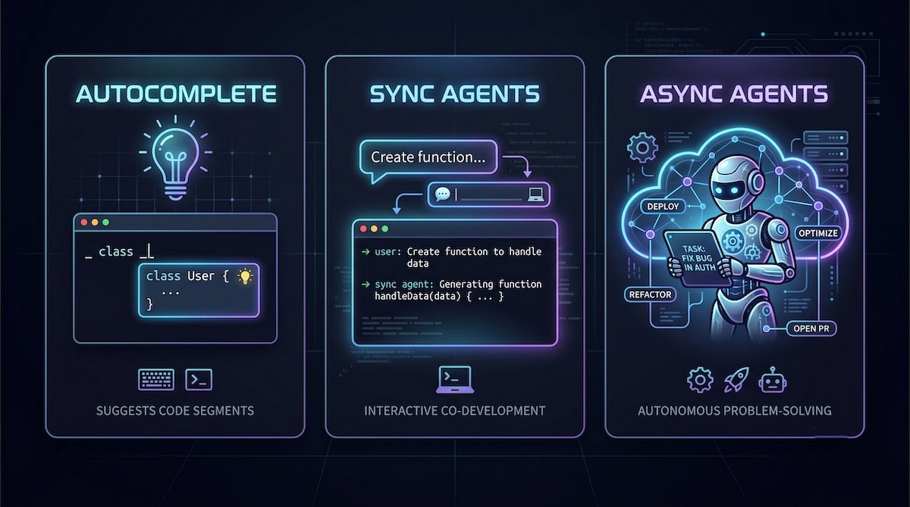
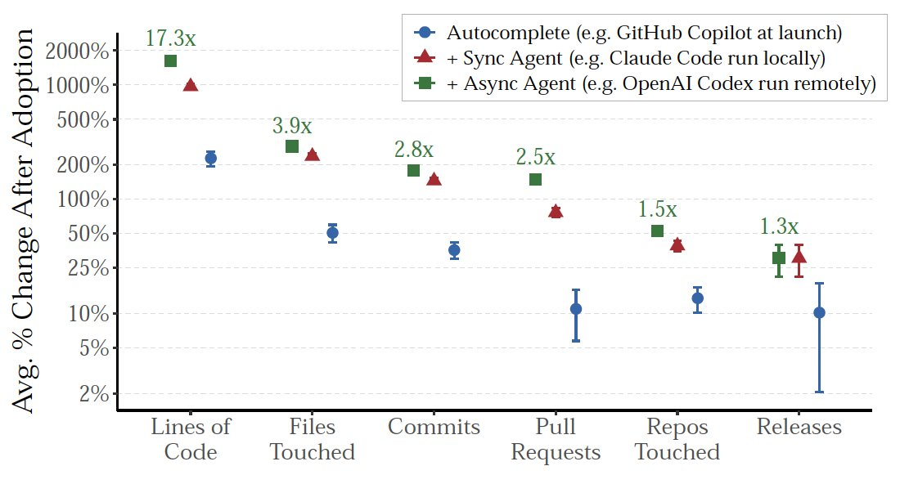

AI生成代码的速度在飙升，但实际交付的软件数量却纹丝不动。

这就是 MIT 与沃顿商学院联合研究最反直觉的发现——开发者生成代码的速度创了新高，但软件发布的速率几乎不变。瓶颈已经从语法编写转移到了下游验证。

为了衡量 AI 对软件交付的真实影响，研究者分析了一个庞大的数据集，追踪了超过 **10万名** 活跃的 GitHub 开发者。他们将公开仓库数据与微软内部遥测数据相结合，构建了全面的开发者产出视图。

为了消除活跃度偏差，研究者将采用新 AI 工具的用户与一年前同周同样活跃的开发者的对照组进行了匹配。

**研究者追踪了多代 AI 工具的生产力：**

**自动补全模型**：建议代码块，如经典的 VS Code 中运行的 GitHub Copilot

**同步 Agent**：与开发者交互式工作，如在你本地设备上运行的 Claude Code

**异步 Agent**：自主运行以解决更复杂的问题，如在云端运行的 GitHub Agents

这些工具被映射到整个生产生命周期，从原始代码行数追踪到拉取请求和最终发布。为了验证现实世界的消费者影响，研究还聚合了月度面板数据，追踪了 Apple App Store、Google Play、Chrome Web Store 和 SourceForge 上的应用部署和使用情况。

---

在漏斗的顶端，AI 产生了不可否认的收益。如社交媒体上经常分享的轶事所说，我们看到用 AI 辅助生成的代码行数大幅增加，异步 Agent 产生的代码甚至高达人类开发者的 **17 倍**。

同一种效应也体现在软件生命周期的其他阶段。自动补全将编码提交量提升了 **40%**，交互式同步 Agent 将该数字推至 **140%**，而自主异步 Agent 则将累计提交增益提升至惊人的 **180%**。

这些研究指标证实了 GitHub 平台上整体活动激增的公开报告，包括新仓库和拉取请求量（以至于有些公司因为无法处理 AI 生成代码的体量而停止了公开拉取请求）。

然而，随着代码向生产层级推进，一种"衰减效应"开始显现。上游的巨大收益在接近发布时急剧减弱。

以同步 Agent 为例，生成了惊人的 **741%** 原始代码行数增量和 **65%** 的拉取请求增量。然而，这种产出爆炸仅转化为实际软件发布量 **20%** 的增长。

异步 Agent 提供了一个更清晰的现实检验——它们提供了最高的编码产出放大能力，自主将拉取请求创建量提升了 **71.8%**。但这些 Agent 无法直接发布仓库。一位人类工程师必须始终介入审查和合并代码，确立了人类作为"绝对瓶颈"的地位。

---

这种动态也渗透到产品成功中，造成了一个应用市场悖论。AI 成功松动了上游约束，在 iOS 和 Android 等平台上引发了新应用发布的可见激增。

尽管新软件泛滥成灾，用户总消费量（以下载量和评分衡量）在发布后的前三个月内保持平稳。

降低编写代码的成本并不能解决下游发现产品市场契合度和分发渠道的挑战。这也解释了社交媒体上开发者经常吐槽的现象——他们用 AI 创建了大量应用，但用户数为零。

**AI 放大了现有管道系统的脆弱性。** 根据 2025 年 DORA 关于 AI 辅助编码的报告中，AI 是一个组织现有能力的严格乘数。如果测试、持续集成和代码审查流程本来就慢，用 AI 生成的代码淹没管道只会加剧问题。对于基础薄弱的团队，更高的吞吐量与部署不稳定性高度相关。

这就产生了一个信任悖论——尽管 **90%** 的技术专业人士使用 AI 工具，仍有 **30%** 的人对生成的代码缺乏信任。开发者必须采取"信任但验证"策略来安全地处理大量新代码。

---

**为了适应这一变化，行业正从传统的软件开发生命周期（SDLC）向 Agent 开发生命周期（ADLC）过渡。**

在这种模型下，开发者从"键盘上的创作者"转变为"高级协调者"。他们花时间验证架构、定义测试、确定风险偏好，并为自主工具设定严格的护栏。

**安全与质量保证必须向左移。** 自主 Agent 以机器速度编写代码，意味着传统的提交后漏洞扫描已不再充分。高绩效团队现在部署内部测试 Agent，在代码到达人工审查之前，快速循环验证输出并生成边界用例。

你仍然需要审查代码。关键是要确定哪些代码需要你的关注，哪些应该在管道上游就被丢弃。随着编写代码的成本降低，知道不写哪些代码并将其丢弃正在成为一种高价值技能。

---

**一点观察**

1. **17 倍代码 vs 20% 发布增长——这个衰减比比大多数人想象的要残酷。** AI 在写函数层面的效率提升是真实的，但一旦进入 code review、测试、部署的环节，增益几乎被完全吞噬。这意味着组织现有的 CI/CD 和审查流程才是真正的瓶颈，不是代码写得不够快。

2. **ADLC 的概念框架很有前瞻性，但对普通开发者来说太远了。** 目前大多数团队连 SDLC 都没跑顺，就迎来了 Agent 时代。在审查流程、测试自动化、安全扫描这些基础建设到位之前，盲目引入自主 Agent 只会制造混乱。

3. **"知道不写什么代码"比"知道怎么写代码"更值钱**——这个判断有道理，但也过于乐观。现实中，决定"写不写"的往往不是开发者的技术判断，而是产品经理的需求优先级和公司的商业节奏。真正的问题可能不是"该 discard 哪些代码"，而是"为什么我们需要这么多代码"。

---

参考：AlphaSignal Sunday Deep Dive - https://papers.ssrn.com/sol3/papers.cfm?abstract_id=6843118
