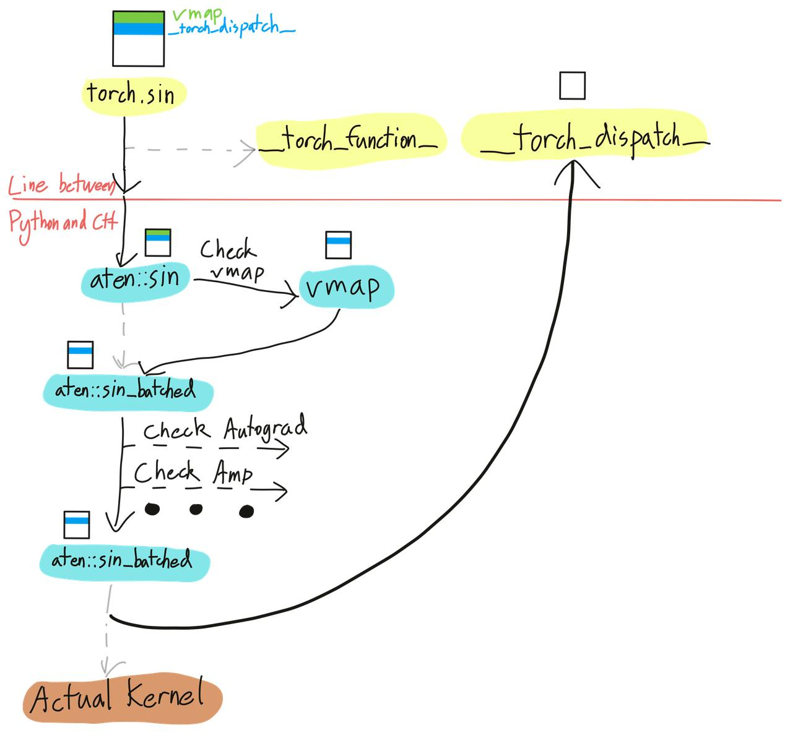
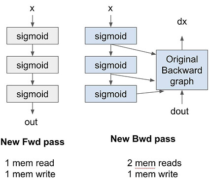

<div style="background:#e8f4fd;padding:14px 16px 10px 16px;border-radius:6px;margin-bottom:18px;">
<div style="text-align:center;margin-bottom:10px;">
<strong style="font-size:16px;color:#1a6ba0;">要点速览</strong>
</div>
<div style="font-size:14px;color:#3f3f3f;line-height:1.75;">
- <strong>torch.compile之前</strong>：fx和TorchDynamo都只抓前向图，后向由autograd引擎动态生成，编译器看不到完整图，无法跨前向/后向边界优化。<br><br>
- <strong>AOTAutograd的核心</strong>：用 __torch_dispatch__ 把前向和后向都在执行前追踪成一张joint graph，再切分成独立的前向/后向图，编译器得以对整个图统一优化。<br><br>
- <strong>关键机制torch dispatcher</strong>：每次算子调用都经dispatcher路由到对应kernel，__torch_dispatch__ 钩子在最终kernel前触发，给你拦截、检查、改写算子的机会：make_fx正是靠它拿到底层ATen算子。<br><br>
- <strong>min-cut切分</strong>：默认切分把每个中间张量都存下来，访存付两次代价；min_cut_rematerialization_partition用最大流/最小割决定「存还是重算」，只存输入、后向重算中间值，把activation checkpointing一般化了。
</div>
</div>

## 为什么需要AOTAutograd

在前两篇文章里，我们看到了torch.fx如何用符号追踪（symbolic tracing）把Python代码变成一张图，以及TorchDynamo如何在字节码层面捕获图。但两者都只捕获了前向传播。**后向传播呢？**

在torch.compile生态出现之前，用户可以用torch.fx追踪捕获前向图，但后向仍然由autograd引擎动态生成，编译器只能看到前向图。这意味着你无法把前向和后向计算图合并成一张图、跨这个边界做优化。

**AOTAutograd解决的正是这个。** 它把前向和后向都在执行之前追踪好，编译器现在就能把整个图当作一个整体来优化。

## aot_function：最小例子

我们从functorch.compile里aot_function最简单的例子开始。定义一个把两个张量相乘的函数，然后用一个只打印图的编译器把它包起来：

```python
import torch
from functorch.compile import aot_function, make_boxed_func

def fn(a, b):
    return a * b

def compiler_fn(fx_module, _):
    print(fx_module.code)
    return make_boxed_func(fx_module.forward)

a, b = [torch.randn(2, 4, requires_grad=True, device="cuda")
        for _ in range(2)]

aot_fn = aot_function(fn, fw_compiler=compiler_fn,
                      bw_compiler=compiler_fn)
res = aot_fn(a, b)
loss = res.sum()
loss.backward()
```

这会打印两张图：前向和后向。我们仔细读一下。

```python
def forward(self, primals_1, primals_2):
    mul = torch.ops.aten.mul.Tensor(primals_1, primals_2)
    return (mul, primals_1, primals_2)
```

什么是 **primal**？primals就是函数的原始输入，或者按autograd的术语，primals是你对其施加运算的张量。这里primals_1 = a，primals_2 = b。

前向返回 `(mul, primals_1, primals_2)`。**为什么返回三个值？** 第一个是真正输出（a * b），另外两个张量是为后向保存的。

现在看后向图：

```python
def forward(self, primals_1, primals_2, tangents_1):
    mul_1 = torch.ops.aten.mul.Tensor(tangents_1, primals_1)
    mul_2 = torch.ops.aten.mul.Tensor(tangents_1, primals_2)
    return (mul_2, mul_1)
```

前两个参数primals_1, primals_2是来自前向传播的已保存张量。**tangents** 就是你在后向传播中计算得到的传入梯度。

后向返回 `(mul_2, mul_1)`，梯度的顺序和前向原始输入 (a, b) 相同。这个顺序约定就是autograd知道哪个梯度属于哪个参数的方式。

## 为什么叫AOT？

通常，PyTorch的autograd在前向传播期间动态构建后向图，后向图只有等前向结束后才最终确定。这很灵活，但在执行之前你永远看不到整张图。

**AOTAutograd的做法不同。** 它把前向和后向传播都在真正执行函数之前、提前（Ahead-of-Time）追踪好，这就把两张计算图都提前给了你。

一般工作流如下：

- **AOT Dispatch** 追踪前向和后向，生成一张联合图（joint graph），本质上是一张包含前向和后向Aten/Prim算子的FX图。
- **Partition** 用partition_fn把联合图分成独立的前向和后向图。
- 可选**分解（decomposition）**：把高层算子拆成更小粒度的算子。
- 独立的图被编译并整合成一个 `torch.autograd.Function`。

## torch dispatcher：一切的关键

PyTorch有一个你可以理解为「路由器」的dispatcher。每次你调用像 `a * b` 这样的算子，dispatcher都会根据输入张量的属性决定运行哪个kernel。CUDA张量？跑CUDA kernel。需要梯度？用autograd包一层。一个算子通常要经过多个dispatch层才到达最终的kernel。

`__torch_dispatch__` 是在最终kernel执行之前触发的一个钩子（hook）。它让你能访问原始的ATen算子和它的输入，于是你可以在算子层面拦截、检查或修改行为。


<span style="font-size:12px;color:rgb(153,153,153);">图：torch dispatcher像路由器，每次算子调用都经多层dispatch才能到达最终kernel</span>

## make_fx：靠dispatcher拿到底层算子

torch.fx有个叫make_fx的东西，和普通symbolic_trace不同，它是通过 `__torch_dispatch__` 实现的。这让它能访问底层ATen算子。

```python
import torch
from torch.fx.experimental.proxy_tensor import make_fx

def f(x, y):
    return x + y

x = torch.randn(8)
y = torch.randn(8)

g = make_fx(f)(x, y)
print(g.code)
```

make_fx通过dispatcher追踪，捕获到底层ATen算子 `torch.ops.aten.add.Tensor`：

```python
def forward(self, x_1, y_1):
    add = torch.ops.aten.add.Tensor(x_1, y_1)
    return add
```

而符号追踪要高层得多：

```python
from torch.fx import symbolic_trace
h = symbolic_trace(f)
print(h.code)

def forward(self, x, y):
    add = x + y
    return add
```

既然已经看到torch dispatcher为什么重要，就可以进入联合图以及怎么创建它了。

## 联合图（The Joint Graph）

用一张覆盖前向和后向的FX图，给了我们跨整个边界做优化的可能，而不是分开看前向和后向。

用伪代码表示这个想法：

```python
def joint_forward_backward(*inputs):
    outputs = forward_fn(*inputs)
    grads = torch.autograd.grad(
        outputs, inputs, grad_outputs=...
    )
    return outputs, grads
```

在追踪期间，每个算子都被 `__torch_dispatch__` 拦截，对每个算子，AOTAutograd会：

- 从张量取回FX proxy；
- 用该ATen算子作为target，在FX图里创建一个 `call_function` 节点；
- 用实际张量运行这个算子；
- 把结果张量绑定到该proxy。

如此重复，直到AOTAutograd追踪完前向和后向传播里的所有算子，产出一张完整的联合图。

## 切分联合图（Partitioning the Joint Graph）

一旦有了联合图，我们需要把它切回独立的前向和后向图。AOTAutograd的partition_fn做这件事，有两个内建策略。我们用一个具体例子比较它们：

```python
def fn(a, b, c, d):
    x = a + b + c + d
    return x.cos().cos()
```

### default_partition

这就是第一个例子里看到的默认行为，它找出从输入到前向输出的所有算子输出。后向需要用到的张量也作为前向输出被包含进来，所有中间结果都被保留。

```python
def forward(self, primals_1, primals_2, primals_3, primals_4):
    add   = torch.ops.aten.add.Tensor(primals_1, primals_2)
    add_1 = torch.ops.aten.add.Tensor(add, primals_3)
    add_2 = torch.ops.aten.add.Tensor(add_1, primals_4)
    cos   = torch.ops.aten.cos.default(add_2)
    cos_1 = torch.ops.aten.cos.default(cos)
    return (cos_1, add_2, cos)    # 为后向保存 add_2 和 cos
```

后向把这些已保存的张量作为输入接收：

```python
def forward(self, add_2, cos, tangents_1):
    sin   = torch.ops.aten.sin.default(cos)
    neg   = torch.ops.aten.neg.default(sin)
    mul   = torch.ops.aten.mul.Tensor(tangents_1, neg)
    sin_1 = torch.ops.aten.sin.default(add_2)
    neg_1 = torch.ops.aten.neg.default(sin_1)
    mul_1 = torch.ops.aten.mul.Tensor(mul, neg_1)
    return (mul_1, mul_1, mul_1, mul_1)
```

## 背景：访存受限（memory bound）算子

这是一段背景，用来解释下一个技巧以及它为什么这么有效。

如果你记得GPU上的情况，一个算子花的大部分时间不是算术，而是实际的内存读写。对逐点（pointwise）算子（add、mul、cos、sin、relu等）尤其如此，它们每个元素的计算量极少。

### 所以融合多个逐点算子可能根本没帮助

因为瓶颈是内存访问而不是浮点运算量（flops）。

那么在训练时，如果你的图是一条逐点算子的链，前向和后向都完全是逐点的，运行时间和你读写的内存量成正比。由于默认切分保存了每一个中间张量，你本质上付了两次内存代价（前向里写、后向里读）。

如果你改成只保存输入、在后向里重算中间结果呢？这意味着：

- 前向和后向之间保存的张量更少；
- 内存访问减少，因为我们既不用写中间结果来保存、也不用读回来加载它们。

重算本身基本免费，因为这些逐点算子本来就是访存受限的，多出来的浮点运算会藏在内存延迟后面。这正是activation checkpointing（激活重计算）能工作的原因，而AOTAutograd用min-cut公式把它一般化了。


<span style="font-size:12px;color:rgb(153,153,153);">图：融合多个逐点算子帮不上忙，因为瓶颈在内存访问而非计算量</span>

## min_cut_rematerialization_partition

既然已经说明不需要保存所有中间张量，那怎么决定保存什么、重算什么？这被框定成一个最大流/最小割（max-flow/min-cut）问题。

用同样的代码看min-cut切分器：

```python
from functorch.compile import min_cut_rematerialization_partition

aot_fn = aot_function(fn, fw_compiler=compiler_fn,
                      bw_compiler=compiler_fn,
                      partition_fn=min_cut_rematerialization_partition)
```

看前向图，注意cos不再被保存：

```python
def forward(self, primals_1, primals_2, primals_3, primals_4):
    add   = torch.ops.aten.add.Tensor(primals_1, primals_2)
    add_1 = torch.ops.aten.add.Tensor(add, primals_3)
    add_2 = torch.ops.aten.add.Tensor(add_1, primals_4)
    cos   = torch.ops.aten.cos.default(add_2)
    cos_1 = torch.ops.aten.cos.default(cos)
    return (cos_1, add_2)    # 只保存 add_2，不保存 cos
```

现在后向里cos是从add_2重算出来的，而不是被保存的：

```python
def forward(self, add_2, tangents_1):
    cos   = torch.ops.aten.cos.default(add_2)  # 重算！
    sin   = torch.ops.aten.sin.default(cos)
    neg   = torch.ops.aten.neg.default(sin)
    mul   = torch.ops.aten.mul.Tensor(tangents_1, neg)
    sin_1 = torch.ops.aten.sin.default(add_2)
    neg_1 = torch.ops.aten.neg.default(sin_1)
    mul_1 = torch.ops.aten.mul.Tensor(mul, neg_1)
    return (mul_1, mul_1, mul_1, mul_1)
```


<span style="font-size:12px;color:rgb(153,153,153);">图：min-cut切分下前向和后向之间保存的张量更少，内存访问随之减少</span>

## 收尾

如果你读到了这里，干得漂亮！在下一篇文章里，我们会看整个技术栈最后一块拼图：TorchInductor，看看捕获到的图是怎么被lowering成高效的triton代码的。

<div style="background:#f5f0eb;padding:14px 16px 10px 16px;border-radius:6px;margin-bottom:16px;">
<div style="text-align:center;margin-bottom:8px;">
<strong style="font-size:15px;color:#8b6f4c;">结语</strong>
</div>
<div style="font-size:14px;color:#3f3f3f;line-height:1.75;">
AOTAutograd的真正价值，是把「后向图」从运行时动态构造，变成和前向图一样可以提前静态分析的产物。一旦前向、后向在同一张joint graph里，编译器就能跨边界做整体优化：这正是torch.compile能做fusion、checkpointing的前提。<br><br>
而这一切的支点其实是torch dispatcher的 __torch_dispatch__ 钩子：它把「每次算子调用」变成一个可拦截的观测点，AOTAutograd才能在不真正执行、却能跑真实张量的前提下把整张图trace出来。<br><br>
min-cut切分最值得记住的一点：默认保存所有中间张量在逐点算子链上是浪费的（内存读写付两次），而activation checkpointing的本质就是「只存输入、后向重算」，min-cut把它形式化成最大流/最小割的优化问题，自动决定每个张量存还是重算。
</div>
</div>

---

<span style="font-size:14px;color:#888888;font-family:'Courier New',monospace;">【传送门】<br>
<a class="normal_text_link mp_article_text_link" href="https://mp.weixin.qq.com/s/2h0NULN9kXjdxoxphZx0Ew" target="_blank" data-linktype="2">OpenClaw之父&Claude Code之父都在用的Loop到底是什么？答案藏在Loop之下</a><br>
<a class="normal_text_link mp_article_text_link" href="https://mp.weixin.qq.com/s/f05wnBex0ECquqLadXgwAg" target="_blank" data-linktype="2">Agent自进化/持续学习的三个层次：Model、Harness、Context</a><br>
<a class="normal_text_link mp_article_text_link" href="https://mp.weixin.qq.com/s/lcs_gT9vfs0eaW001g2dfg" target="_blank" data-linktype="2">SGLang用Waterfill+LPLB解决DeepEP MoE负载不均，吞吐提升7.3%</a><br>
<a class="normal_text_link mp_article_text_link" href="https://mp.weixin.qq.com/s/1Sgdxx2WfDwlhc-tf2V1MQ" target="_blank" data-linktype="2">深度拆解Hermes Agent：一个最优秀Harness(之一)的九层架构</a><br>
<a class="normal_text_link mp_article_text_link" href="https://mp.weixin.qq.com/s/qHscVKN06FEGTru80STlxA" target="_blank" data-linktype="2">M²A多模态双层混合记忆系统：记住你的每一次变化</a><br>
<a class="normal_text_link mp_article_text_link" href="https://mp.weixin.qq.com/s/M0qN4cXknU_CmZBQm5ChzA" target="_blank" data-linktype="2">你为什么离职？Top AI公司面试秘籍-一套框架从容应对15个套路问题</a><br>
<a class="normal_text_link mp_article_text_link" href="https://mp.weixin.qq.com/s/o6pnSWW01pahFQelJSbSPA" target="_blank" data-linktype="2">华为「韬定律」全解析：从 τ 常数到4GHz麒麟，一张时间表看清未来十年芯片路线</a><br>
<a class="normal_text_link mp_article_text_link" href="https://mp.weixin.qq.com/s/_4vgKCTSir14mhtdvs7_HA" target="_blank" data-linktype="2">美团开源LongCat-2.0 (OpenRouter原Owl Alpha)解读：1.6T参数，5万国产卡上</a><br>
</span>

---

<span style="font-size:12px;color:#888888;font-family:'Courier New',monospace;">参考：https://jino-rohit.github.io/blogs/14_aot_autograd.html</span>
