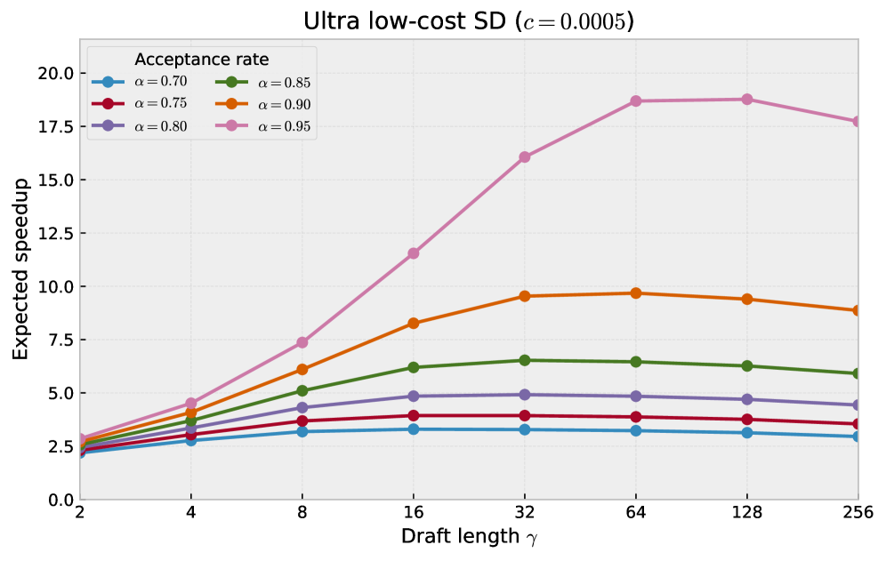

<strong style="font-size:16px;color:#1a6ba0;">要点速览</strong>

- <strong>核心痛点</strong>：投机解码（SD）想靠加大草稿预算提速，但自回归drafter成本高、双向扩散drafter树不一致，陷入「因果性-效率」两难，加速随预算增大触顶  
- <strong>解法</strong>：JetSpec训练一个因果并行草稿head，一次前向算出整棵候选树的logits，同时每个分支都条件于自身路径前缀，让草稿分布对齐目标模型自回归分解  
- <strong>结果</strong>：Qwen3-8B上预算256时MATH-500达9.64× 加速（τ=10.76），比DFlash/DDTree高一个台阶；集成vLLM后小负载吞吐翻倍  
- <strong>关键结论</strong>：forward-KL蒸馏远胜reverse-KL（差36-46%）；大预算只在低到中服务负载才划算，重负载会饱和

---

投机解码（SD）的加速随草稿预算增大而触顶，根本原因是「因果性-效率」两难：自回归drafter（如EAGLE）能画出路径条件化的高质量树，但树越深起草越慢；双向块扩散drafter（如DFlash）一次生成全部位置，可各分支互不知晓彼此选了什么token，拼出的树「各自合理、合起来矛盾」，白白浪费预算。JetSpec的做法是：**用一个因果并行的草稿head，一次前向既算完整棵树，又让每个分支对齐目标模型的真实自回归概率。**

## 方法：因果并行草稿head

JetSpec复用冻结目标模型的融合隐藏状态，训练一个轻量草稿head。关键在注意力掩码：每个树节点只能看原始前缀和自己的祖先节点，不能看后代或无关兄弟分支。这样所有深度的logits可以并行算出来，但每个节点条件于「自己这条分支上之前实际选了哪些token」，其分解形式与目标模型p(y₁:ₖ|x)=∏p(yᵢ|x,y<ᵢ) 完全镜像。

对比两类旧方案：分支不可知的扩散草稿按伪分布qsur∝∏rᵢ(yᵢ|x) 建树，会偏好「单token合理、整条分支矛盾」的续写；JetSpec的因果分解则让树在验证时接受率更高。训练用forward-KL软标签蒸馏（而非硬标签SFT或reverse-KL），保留目标模型对多种合理续写的相对偏好。

图3展示了整体设计：从冻结目标模型抽取融合隐藏特征，喂给因果并行草稿head，一次前向产出高质量候选树。

JetSpec设计总览：从冻结目标模型抽取融合隐藏特征，条件化因果并行草稿head，一次前向生成候选树

## 实验设置

在Qwen3-8B（dense）和Qwen3-30B-A3B（MoE）上评估，主实验用非思考模式。训练数据从Nemotron Post-Training V2精选780K样本（全代码/数学切分 + STEM/chat随机样本 + 20K CodeAlpaca），对续写序列用目标模型重新生成作监督。基线为EAGLE-3和DFlash，DDTree用DFlash的块扩散分布做best-first树扩展。所有方法在同一数据混合、学习率3e-4、8×H100上训练，公平可比。

## 结果：预算越大，JetSpec优势越明显

**低预算（16-32 token）**：预算16时DFlash与JetSpec几乎打平（短线性草稿已够覆盖高概率续写）；预算提到32，JetSpec继续微涨，DFlash反而饱和或下降。说明JetSpec把多出来的预算更有效地转化成了被接受的token。

**高预算（64-256 token）**：差距拉开。下表取Qwen3-8B、温度0、各基准的代表数字（Speedup / 平均接受长度 τ）：

| 方法 | 预算 | MATH-500 | HumanEval | MBPP | MT-Bench |
|------|------|----------|-----------|------|----------|
| DDTree | 256 | 8.78 / 9.81 | 6.31 / 6.96 | 6.09 / 6.70 | 4.26 / 5.41 |
| JetSpec | 256 | **9.64 / 10.76** | **7.12 / 7.78** | **6.73 / 7.43** | **4.58 / 5.94** |

（表2中EAGLE-3仅报告到预算64：MATH-500 2.36×/4.13，远低于树状方法，故高预算对比以DDTree为基准。）

数学和代码基准从低预算的4-6× 提升到7-10×；DDTree仅温和扩展到约9×，证明因果树起草比分支不可知建树接受率更高。温度1（非贪婪）下JetSpec依旧有效，收益稳健。

图1：H100上跨数学/代码/对话基准的端到端加速，JetSpec全程领先DFlash与DDTree

## 系统性能：vLLM集成与预算调度

把树起草和验证集成进vLLM（含自定义SM90 paged FlashAttention树掩码核）后，性能不只看接受长度，还受批处理、验证开销、GPU占用的牵制。关键发现是**预算要按负载选**：

- 批大小1：预算16→128，吞吐443.3→968.2 TPS，加速3.09×→6.75×
- 批大小16：预算256跌到4.51×；批大小32：跌到2.85×，和预算128几乎持平：已饱和

实际含义：低到中负载用大预算（闲着也是闲着，拿来减少解码轮数）；重负载改用小/中预算，避免每步开销吃掉批处理效率。

## 消融：哪些设计真正起作用

**蒸馏损失**：SFT与forward-KL在各数据集相差约3%；reverse-KL比forward-KL相对下降36-46%：mode-seeking把概率质量压太狠，不适合树起草。

**学习率**：3e-4达峰（8.30×），6e-4和1e-3在峰值2%内。

**模型泛化**：换到MoE的Qwen3-30B-A3B，JetSpec仍全面高于DDTree（如MATH-500 9.45/10.65 vs 8.61/9.49），因果树起草不只在dense上有效。

**训练数据**：用目标模型重新生成的续写作监督最强；直接在原始语料上训的JetSpec-Corpus落后很多（预算256 MATH-500仅3.36 vs 7.82），但仍一致加速：说明因果并行起草可塞进中训练甚至预训练。

**因果head vs扩散head**：在不同 γ（控制远离锚点位置损失降权）下，因果head全程稳健（8.29-8.50×）；扩散head敏感且在端点崩塌（γ=0仅5.46×，γ=15仅6.17×）。一个具体失败案例：MATH-500某prompt上，扩散head把「given told that」排第一，但其目标模型联合概率为 -63.32 nats（两个互斥开场硬拼），真正连贯的「are given that the」（联合 -0.08）反而排第3；因果head把「are told that」排第一，草稿分数≈目标联合，印证了分支级因果条件的作用。

<strong style="font-size:15px;color:#8b6f4c;">结语</strong>

JetSpec的价值不在于又提出一个drafter，而是把「并行起草的低成本」和「树起草的高接受率」第一次在同一种head里同时拿到，且证明大预算真能换来大加速，而不是很快触顶。  
但它受益的前提是低到中服务负载：在重负载下大预算会饱和，这意味着实际部署里预算调度（甚至动态调度）比单纯堆预算更重要，论文也把动态调度留作未来工作。  
另一个值得注意的点是训练数据来源：重新生成续写比直接用语料强一倍多，这意味着JetSpec的效果上限其实绑在「有多少目标模型的真实生成可用」上。

---

【传送门】 
<a class="normal_text_link mp_article_text_link" href="https://mp.weixin.qq.com/s/OqtF6ZaWQNu3o-VAWLfqbg" target="_blank" data-linktype="2">榨干GPU性能：流水线解码消除GPU...</a> 
<a class="normal_text_link mp_article_text_link" href="https://mp.weixin.qq.com/s/2eWh5jZJPHsv0wi9km2nVg" target="_blank" data-linktype="2">NVIDIA TriAttention解读: KV Cache压缩...</a> 
<a class="normal_text_link mp_article_text_link" href="https://mp.weixin.qq.com/s/nVqW9acA7NN1zeALDwRAsw" target="_blank" data-linktype="2">Google新论文RubricEM: 评分标准引导...</a> 
<a class="normal_text_link mp_article_text_link" href="https://mp.weixin.qq.com/s/s0Ovn3_tnbbl9jxfAC3WLg" target="_blank" data-linktype="2">阿里Sparse Attention on CXL替代RDMA做K...</a> 
<a class="normal_text_link mp_article_text_link" href="https://mp.weixin.qq.com/s/FTsibdpbEjvoPWtxGqgxkQ" target="_blank" data-linktype="2">小米MiMo罗福莉后训练新范式MOPD: ...</a> 
<a class="normal_text_link mp_article_text_link" href="https://mp.weixin.qq.com/s/3btXHAVd8_x5CM5CWETc2g" target="_blank" data-linktype="2">Agent卷向AI Infra: SGLang团队用硬核A...</a> 
<a class="normal_text_link mp_article_text_link" href="https://mp.weixin.qq.com/s/HnGKVp45C-GApBJ-LleP6g" target="_blank" data-linktype="2">小米MiMo罗福莉:8卡GPU让1T参数模...</a> 
<a class="normal_text_link mp_article_text_link" href="https://mp.weixin.qq.com/s/OoHu1yeuh1gzgCfEiPvDuQ" target="_blank" data-linktype="2">RL的下一个大突破：不是优化可...</a> 
<a class="normal_text_link mp_article_text_link" href="https://mp.weixin.qq.com/s/mjBLO4O4fHUFNk4DfR9Y-g" target="_blank" data-linktype="2">Anthropic/Claude多Agent协同五种模式...</a> 
<a class="normal_text_link mp_article_text_link" href="https://mp.weixin.qq.com/s/YnMyg85RydYrJvk6C5cLdQ" target="_blank" data-linktype="2">微软 Frontier Company 成立：25亿美...</a> 
<a class="normal_text_link mp_article_text_link" href="https://mp.weixin.qq.com/s/ZYubEusdx3fcymXYf6kwTQ" target="_blank" data-linktype="2">小米罗福莉MiMo-V2.5推理全链路优...</a> 

---

参考：https://arxiv.org/html/2606.18394v3
