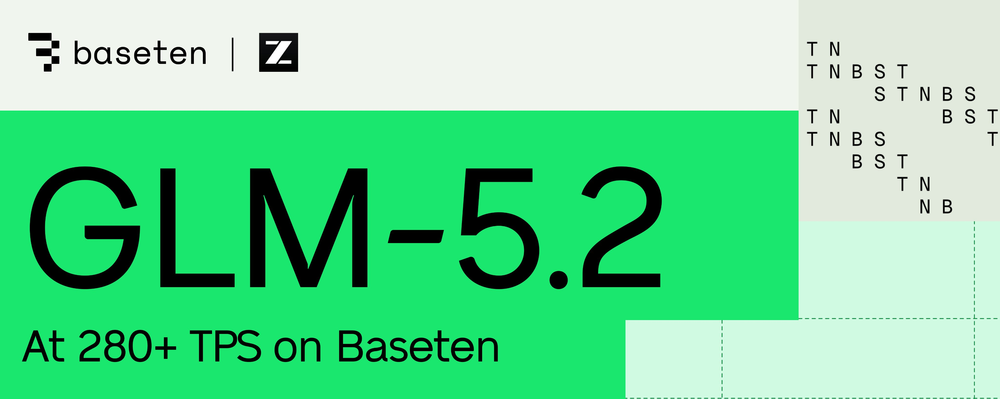
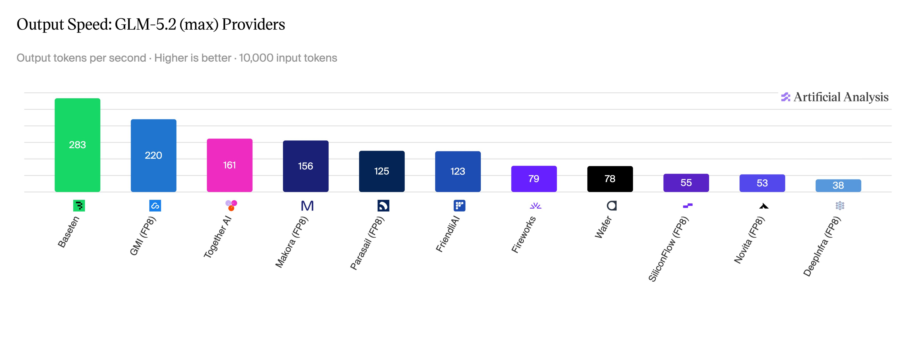
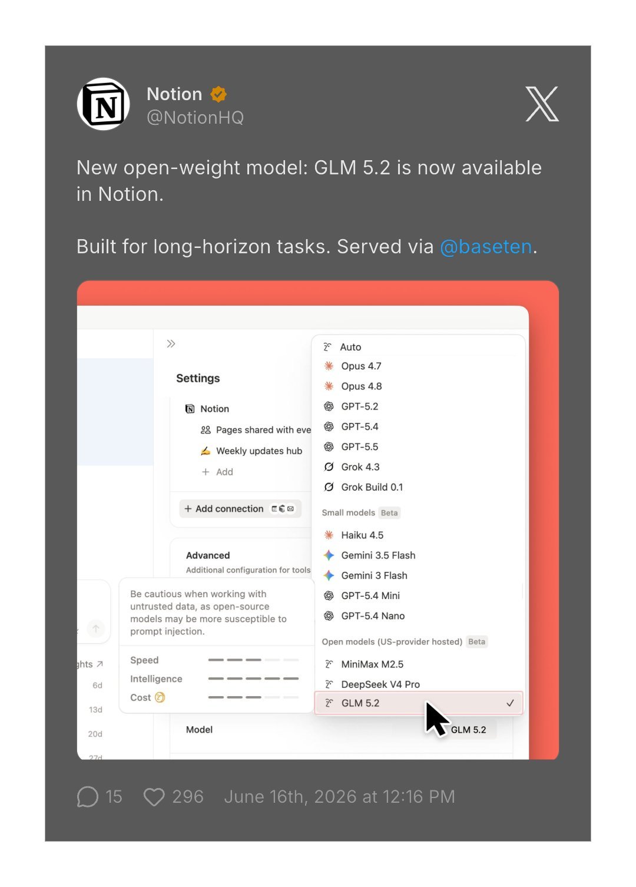
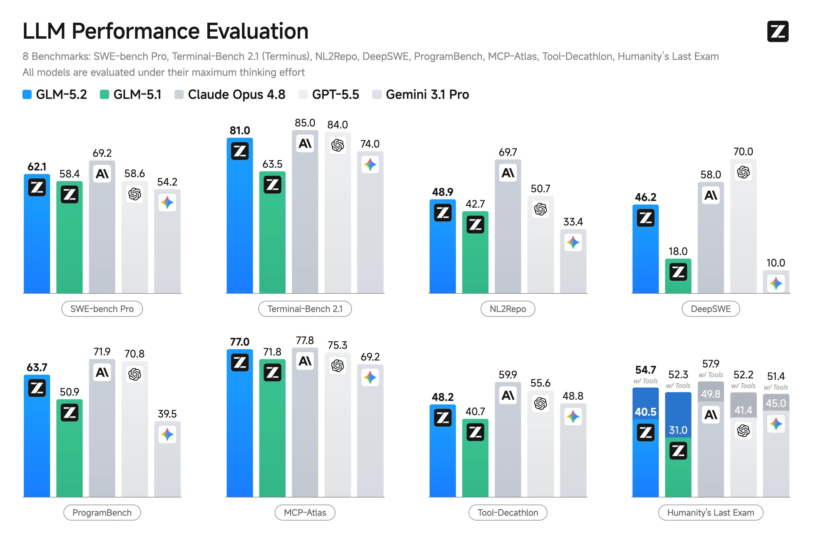
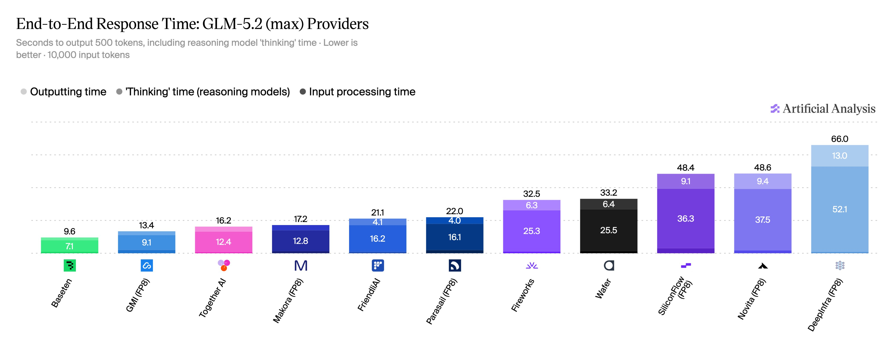
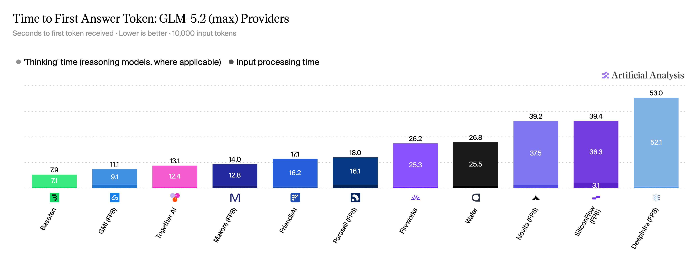
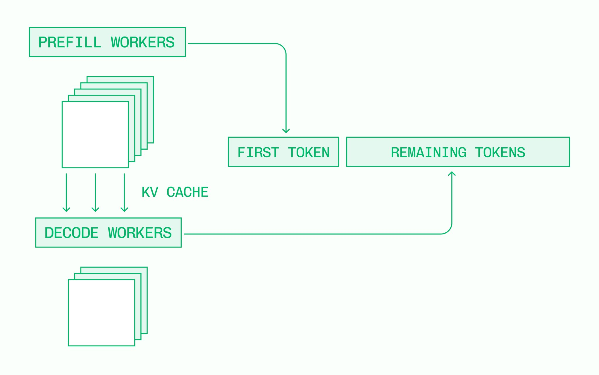
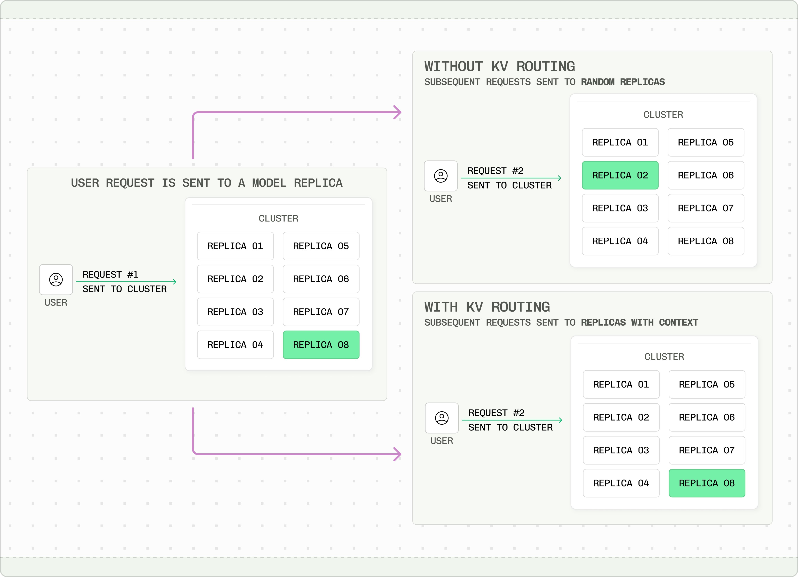

**Baseten 揭秘 GLM-5.2 推理优化：NVFP4 量化、PD 分离与 MTP 如何将吞吐推到 280 t/s**

<strong style="font-size:16px;color:#1a6ba0;">要点速览</strong>

- <strong>280 t/s 推理速度</strong>：Baseten 为 GLM-5.2 构建了最快的 API，由 Artificial Analysis 认证，通过四大核心技术栈实现。  
- <strong>NVFP4 量化</strong>：从原始 FP8 权重用 NVIDIA ModelOpt 自研量化到 4 位浮点格式，BFCL 基准测试上质量损失在误差范围内，同时大幅解锁 tensor core 速度和降低 VRAM 带宽。  
- <strong>KV 缓存感知路由 + PD 分离</strong>：基于 NVIDIA Dynamo 工具包实现缓存复用、请求路由和预填充-解码分离，分离式部署的 TPS 是聚合部署的 2 倍。  
- <strong>MTP 推测性生成</strong>：利用 GLM-5.2 原生的多 Token 预测头生成 draft token，进一步提高每秒 token 输出。

GLM-5.2 是自 DeepSeek-R1 以来开源模型领域最大的新闻。原因显而易见——在纯 token 计价上，GLM-5.2 通常比 GPT 5.5 和 Opus 4.8 便宜 70-80%，同时性能相当。这是硬件规格上的降维打击。但一个模型仅仅聪明和便宜是不够的。**要在生产环境中发挥作用，模型必须快速、可靠、可大规模可用。兑现前沿开放智能的承诺，需要卓越的推理性能。**

Baseten 构建了世界上最快的 GLM-5.2 API，由 Artificial Analysis 测得每秒超过 280 个 token。他们通过在整个推理过程中利用多种技术实现了这一性能：

- 更新定制推理引擎，为 GLM-5.2 架构实现共享 DSA
- 从原始 FP8 权重运行并校准自研 NVFP4 量化，在 BFCL 等 Agent 基准测试上表现同等质量
- 通过基于 NVIDIA Dynamo 构建的 KV 感知路由实现高缓存命中率，降低预填充负载并改善重复前缀请求的 TTFT
- 通过使用 NVIDIA Dynamo 工具包构建的分离式推理，在观察到的负载形态上实现 2x 更高的 TPS
- 通过实现对 GLM-5.2 的多 Token 预测（MTP）头支持，进一步提升 TPS

你可以通过 Baseten Model APIs 亲自体验，也提供高负载专用部署。

Z.ai 的 GLM-5.2 是一个 744B 参数的前沿 LLM，擅长 Agent 任务（尤其是编码），支持高达 100 万 token 的上下文窗口。**采用了混合专家模型（40B 活跃参数）、非思考和思考模式，以及完全开放的 MIT 许可证。** 与 GLM-5.1 最大的区别是使用了共享 DSA 权重，Baseten 在定制运行时引擎中实现了对此的支持。

**GLM-5.2 达到或超过了其基准测试所暗示的能力。** 不过，一个模型的实用性不止于标准评测上的表现。它确实是一个出色的模型，适合编写代码、运行 Agent 以及其他前沿语言模型任务。

GLM-5.2 的一个关键成本优势是推理价格。使用计算器可以估算你工作负载的节省金额——通常比 GPT 5.5 和 Opus 4.8 便宜 70-80%。

**GLM-5.2 Overview**

Baseten 在 NVIDIA Blackwell GPU 上运行模型 API，使用 Baseten Inference Stack 内的定制推理引擎。**选定运行时使用 NVFP4 权重以获得最大性能。** 从原始 FP8 权重出发，他们使用 NVIDIA ModelOpt 进行了自研 NVFP4 量化。

NVFP4 是 NVIDIA 的一种 4 位浮点数据格式，使用双缩放因子来保持高动态范围并保留模型质量。在对量化模型进行校准和测试时，团队专注于确保 GLM-5.2 在 Agent 的常见模式上表现可靠。**在 BFCL 函数调用基准测试上，原生 FP8 权重与 NVFP4 量化之间的性能大致相当，多次运行的分数都在误差范围内。**

NVFP4 量化通过解锁更快的 tensor core 并减少 VRAM 带宽负担，从而改善了首次 token 时间（TTFT）和每秒 token 数（TPS）。

**Blackwell GPU 的高质量 NVFP4 量化**

GLM-5.2 特别适合长上下文请求和复杂的 Agent 任务，这些工作负载通常有非常长的输入序列。**通过在请求之间复用 KV 缓存，可以跳过共享序列的昂贵预填充过程。**

通常 LLM 推理更关注 TTFT，但像 GLM-5.2 这样的推理模型更关心首次回答 token 时间（TTFAT），它结合了 TTFT 与推理序列的部分 TPS，这才是推理模型的实际响应时间。Baseten 的数据显示，在生成首个回答 token 的平均 7.9 秒中，有 7.1 秒用于生成推理 token，而只有 0.8 秒用于处理输入序列。**说实话这 0.8 秒对大多数场景已经够快，但推理模型的时间感知不太一样。** 将 TTFT 降到 800 毫秒对系统的整体响应能力和吞吐量仍然很重要。

**使用 NVIDIA Dynamo 进行缓存感知路由**

在生成首个回答 token 的平均 7.9 秒中，7.1 秒用于推理 token，0.8 秒用于输入处理。**KV 缓存命中率和路由策略直接影响这 0.8 秒的预填充延迟。**

在大规模生产部署中，KV 缓存在各个独立副本之间分布，团队使用 NVIDIA Dynamo 的工具来路由传入请求。**到目前为止，在相当异构的流量中观察到了高命中率，降低了预填充的负载并改善了端到端性能。**

**使用 NVIDIA Dynamo 进行预填充-解码分离**

我猜对很多人来说，影响最大的优化之一是对 GLM-5.2 进行预填充和解码的分离。LLM 推理有两个不同的阶段：预填充（Prefill）是计算密集型，决定 TTFT；解码（Decode）是内存密集型，决定 TPS。

传统上，单个 GPU 节点同时处理两者。有了分离式架构后，这些工作负载在独立的引擎上运行：预填充和解码独立运行，不会争抢资源；可以分配不均等的资源（通常预填充引擎多于解码引擎）；不同引擎可以采用不同配置，针对各自管道的特定需求优化。

KV 缓存仍然尽可能复用，预填充工作节点只用于处理新的输入序列。

**实现 PD 分离的大部分挑战在于引擎之间可靠、低开销的通信和编排。** NVIDIA Dynamo 提供了开发者工具包，包括预填充队列、基于可配置阈值的条件分离路由，以及基于 NIXL 的高效 KV 传输。

在 GLM-5.2 的头对头基准测试中，分离式部署的每秒 token 数高出 2 倍。

GLM-5.2 配备了一个改进的多 Token 预测（MTP）层，降低了生成 draft token 的成本并提高了这些 token 的接受率。

**MTP 是推测性生成的几种方法之一，是指在前向传播中一次生成多个 token，目的是提高 TPS。** 由于所有算法都有验证步骤，推测性方法是无损的性能优化。

利用 MTP 层生成 draft token，团队测试了各种序列长度，以找到生成长序列和保持高接受率之间的最佳平衡。**过去几个月对 MTP 做了大量工作，GLM-5.2 使用的推测性生成仍有提升空间。**

**GLM-5.2 的生产化运行**

看到这类基准测试结果，自然想问：同样的性能在生产环境中能否保持？**事实上，Baseten 不仅能在生产环境中提供这一性能，还能为 GLM-5.2 的大规模专用部署实现更好的工作负载特定性能。** 可用的杠杆包括：

- 使用针对预期生产数据训练的任务特定推测器
- 从单租户流量中获得更一致的缓存命中
- 调整分离配置，使预填充和解码引擎的比例与流量特征匹配
- 配置并行度和批处理设置，在延迟和吞吐量之间实现理想的权衡

<strong style="font-size:15px;color:#8b6f4c;">结语</strong>

这篇技术文章的价值不在于秀数字，而在于它完整展示了一个生产级推理优化的全链路——从模型选型（744B MoE）到量化方案（NVFP4），从系统架构（PD 分离）到算法创新（MTP），每个环节都有数据支撑。  
Baseten 不是第一个做推理优化的公司，但他们是第一个为 GLM-5.2 把每个优化手段都量化和公开的团队。280 t/s 的门槛已经设下，接下来就看其他推理平台如何回应了。  
值得关注的一点：文章提到「工作负载特定推测器」和「单租户流量缓存一致性」作为专用部署的优势——这意味着如果你只是跑公共 API，你得到的不是最优性能。大规模推理优化最终是定制化的游戏，通用 API 和专用部署之间的差距正在拉大。

---
参考：https://x.com/philipkiely/status/2069212319746506968
