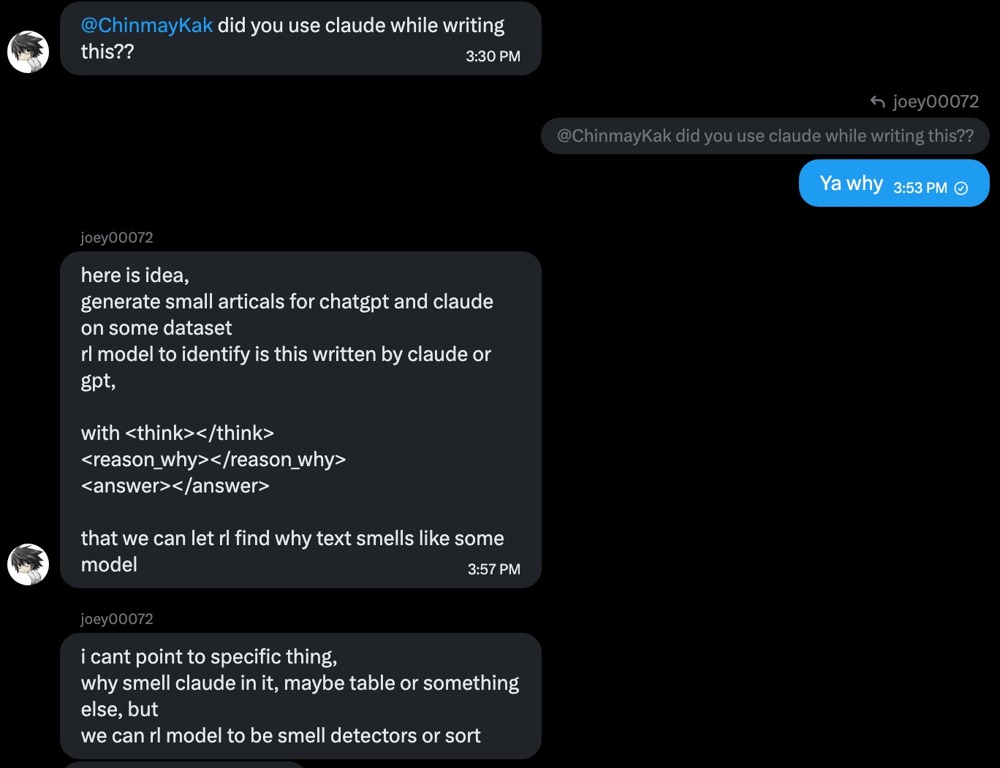

<strong style="font-size:16px;color:#1a6ba0;">要点速览</strong>

<strong>问题很简单，答案很扎心</strong>：用 RL 训练 Qwen3.5-9B 通过文字区分 Claude、ChatGPT 和 Gemini，RL 卡在 40% 就上不去了；SFT 直接 100%；一个 TF-IDF 线性分类器也 100%。  
<strong>RL 的坍缩循环</strong>：GRPO 在多分类中一旦某个类别"死亡"，零优势过滤器会使其永远缺乏梯度，即使整体奖励持续攀升。  
<strong>可分离性诊断应该第一天就做</strong>：一个线性词袋模型从未见过的话题上完美分离了三种 AI 文风，仅用功能词和标点就达 94%，而 RL 苦练两周只到 40%。  
<strong>SFT 为什么碾压 RL</strong>：RL 每样本只监督 1 个 token，SFT 监督全部 ~700 个 token，有效信号差约 26 倍。  
<strong>三条文风签名</strong>：Claude 用诚恳副词和第二人称；ChatGPT 用 hedging 和编号列表；Gemini 用 intensifiers 和 ASCII 图。

---

**能不能训练一个模型通过文字风格认出对面是谁？**

一个 MSR 实习生带着这个看似简单的问题，花了两个星期，把 Qwen3.5-9B、GRPO、各种后训练技巧轮番折腾了一遍。结果是：RL 卡死在 40%，SFT 轻松 100%，一个连深度学习都算不上的线性分类器也 100%。

这不是故事的全部。真正的教训是：选工具之前，先搞清楚问题的形状。

## 1. 引言

想法来自一次闲聊：能不能通过文字风格区分 Claude 和 GPT？这个问题看似简单，但把作者和同事拖进了两周的 RL 后训练深渊。

> TL;DR：用 RL 训练 Qwen3.5-9B 通过文字区分 Claude、ChatGPT 和 Gemini。RL 不断停滞，SFT 达到惊人准确率，一个线性分类器同时击败了二者。博客剩下的内容就是尸检报告。

作者也在思考 AI 写作。X 上那些长文读不下去的问题。选这个问题的动机有两个：第一，好玩；第二，想知道我们人类擅长捕捉的模型"气味"到底是什么，RL 能不能模拟这种能力。

**这个看似简单的问题最终花了整两周时间，把作者带入了 RL 和后训练技术的优缺点深渊。**

## 2. 数据生成和前提

初始实验很简单：用 Opus4.8 和 GPT5.5 生成一批博客，让 Qwen-3.5-9B 做 RL。初始数据集 126 篇博客，覆盖 9 个类别。第一轮 pass@4 分析显示 pass@1 仅 56%（接近随机），pass@4 达到 94.4%。

但这 126 篇博客的语料库太小了。**大多数 RL 运行在第 4 步就达到峰值，然后严重坍缩到某一个 provider 上。**

后续扩展按三个轴同时进行：provider 标签（从 4 个模型坍缩到 3 路：Claude、ChatGPT、Gemini）、类别覆盖（从 9 类扩到 21 类）、每个类别的话题数（最终约 630 个话题）。数据集最终 5258 篇博客，全部公开在 HuggingFace 上。

## 3. 奖励塑造与类别坍缩

**RL 最阴险的地方是奖励曲线可以在模型悄然死亡的同时继续攀升。** 以下是四个关键诊断探针：

1. **死亡组**：GRPO 组中所有补全都得到相同标签的比例。全错组产生零梯度。超过 30% 意味着模型即将放弃该类别。
2. **每类召回率**：聚合奖励曲线是骗子。模型 8/12 得分时奖励 0.67，但某个类别可能已经召回率 0。
3. **截断率**：高截断意味着模型在漫谈而非决策。
4. **验证曲线**：用分布内和保留类别的差距判断模型是在学风格还是记忆。

### 坍缩循环

这是最大的失败模式。**一旦某个类别进入 GRPO 的零优势循环，它就永远无法逃脱，优化器把梯度完全切断了。** 更可怕的是，此时整体奖励还在攀升：3 类平衡批次中搞定了两个类别，聚含奖励 0.67，另一个已经静默死亡。

### 修复方案

从课程学习到类平衡，各种尝试都只延迟了坍缩。真正的突破来自**对比对和三联体设计**：

- **对比对**：给模型两篇不同 provider 的博客，问"哪篇是 X？"。坍缩在结构上不可能了。
- **三联体**：给模型三篇博客（每个 provider 一篇），同时标注全部三个。最佳平衡运行来自三联体+熵衰减组合。

## 4. 算法消融

有了三个类别都存活的 0.40 检查点后，问题变成了：天花板是算法本身吗？

测试了 MaxRL 和 CISPO 两种变体，**两者都不如现有的熵方案**：

| 方法 | 最佳验证 | 发生了什么 |
| 熵（现有方案） | 0.398 | 截断从 38% 降到 2.5%，三类存活 |
| MaxRL | 0.311 | 截断卡在 37%，验证上限 |
| CISPO | 0.291→0.241 | 坍缩到 ChatGPT |

结论：**在策略、易坍缩的分类 RL 中，现代信任区域变体几乎没用。** 真正起作用的杠杆是抗坍缩压力，而这已经在做了。这是一个有用的负结果。

## 5. 保护可交付成果

RL 只奖励答案标签是否正确，不关心推理过程。到第 24 步，约 11% 的正确 rollout 的推理标签是空的，**模型在优化被测量的指标，默默杀死了真正关心的事情。**

修复方案是**乘法理由门控**：只有答案正确且理由标签包含至少 12 个不同单词时，rollout 才得分。这完美地解决了奖励破解。

经过三联体+熵衰减+理由门控组合训练后，模型学到的风格特征令人惊叹：

- **CLAUDE**：散文式、论证性、哲学框架、第一人称
- **CHATGPT**：实例演示、编号小节、大量 LaTeX/格式
- **GEMINI**：ASCII 图、数学符号、宏大隐喻

但 0.40 这个数字，三分类只比瞎猜的 0.33 好一点点，始终让人不安。

## 6. 可分离性诊断

在烧更多算力之前，应该一开始就问的问题终于被问了：**这些数据到底有多可分离？**

答案让人震惊：

| 分类器 | 验证准确率 |
| 逻辑回归，词 1-2grams | 100% |
| 逻辑回归，仅前 1500 字符 | 100% |
| **逻辑回归，仅功能词和标点，无内容词** | **94%** |
| RL 训练的 Qwen3.5-9B | 40% |

**一个线性词袋模型在从未见过的话题上完美分离了三种 AI 文风。去掉所有内容词，只用功能词和标点频率，仍然 94%。** 信号不微妙、不依赖话题、不隐藏在文本深处，就在前 1500 个字符里，在风格里。

这些特征与 RL 模型摸索的特征完全一致：

- **CHATGPT**：may、for example、such as（hedging 和枚举）
- **CLAUDE**：you、genuinely、precisely（对话式和真诚）
- **GEMINI**：furthermore、profound、paradigm（宏大和正式）

**0.40 的天花板从来不是数据的问题。三类是完美可分离的。瓶颈是利用率而不是信息量。**

### SFT 轻松解决

- **速查表探针**（零训练）：仅把风格特征写入 prompt，base 模型从 0.45 跳到 0.67，零训练直接 +0.22。
- **Gold-conditioned SFT**：在 2682 篇博客上用教师生成的推理训练，第 180 步达到 **val 1.000 / val_ood 1.000**。ChatGPT 从 base 的 0.19 召回率拉到 1.00，Gemini 从 RL 从未超过 0.45 到完美学会。
- **仅答案 SFT**：从 1071 个自门控示例中剥离推理，只监督答案 token，同样 **1.000 / 1.000**，这是整个项目最惊人的发现：**自生成的推理不仅不需要，反而是有害的。** 模仿模型自身有时虚假的推理注入了噪声。

**SFT 几乎没有通用能力代价**：困惑度仅 +3.2%，所有算术/推理/代码探针完整。

## 7. RL 的最后一次公平尝试

移除推理通道，只训练答案 token 输出，这次突破了 0.40 平台，峰值 0.65。但仍然坍缩到退化二类边界。

速查表引导的 GRPO 在训练条件（带速查表）下达到 0.66，但**一旦速查表移除，准确率跌回 0.35**。模型没有内化任何东西。

## 8. 为什么 RL 不是最佳工具

信噪比分析解释了全部问题：

**一个 GRPO rollout 中只有最终答案标签被评分。其他约 4095 个 token 不携带任何任务信号。** 每步 SNR 的上限仅约 1.7。

熵奖励分散在数百个推理 token 上，进一步淹没了那一个答案 token。**用来阻止类别坍缩的熵奖励，恰恰是淹没学习信号的东西。**

相比之下，SFT 监督每个 token：**√L 约 26 倍的有效信号优势。** 相同数据、相同模型，差别在于梯度从哪里来。

## 9. 在 RL 框架内修复

尝试了更密集的信用分配（OPCD 和 RLSD 自蒸馏）。RLSD 在第 12 步达到项目最佳推理通道结果，0.409，截断从 38% 降至 9%。但随后模式寻找导致坍缩。

真正的突破是**热启动**：先用 60 步 SFT 预热，再加 RL。准确率从 0.670 近乎单调上升到 **0.895**，零截断，零坍缩。

**之前每个推理通道 RL 的崩溃原因终于清楚了：是冷启动，不是通道本身的问题。**

## 10. 模型实际学到的特征

每个产生连贯推理的模型，无论训练方式如何，最终都描述了相同的三种风格签名：

- **CLAUDE 是散文家**，用诚恳副词（genuinely、honestly、precisely）和第二人称 you
- **CHATGPT 是 hedging 者**，用 may be、for example、not only，配编号列表和公式
- **GEMINI 是宏大形式主义者**，用 profoundly、fundamentally、massive，配 ASCII 图和密集 LaTeX

**最大的判别器是 em-dash 率（Claude 是 ChatGPT 的 19 倍）和 ASCII 图率（Gemini 是其他两者的 80 倍）。**

## 11. 无 AI 痕迹的永恒阳光

作者谈了一个更深刻的问题：LLM 能生成信息密集的文本，但一旦 AI 感触发作就读不下去。模型在编辑和润色方面超人类，但在原创思想方面则不然。

> **如果你不把努力和关心放在写作上，别人为什么要花精力去读它？**

## 12. 结语

作者正在结束 MSR 实习，寻找后训练方向的岗位。

## 附录

完整实验运行表格、文体特征数据、训练配置、可复现性陷阱详见原文。

<strong style="font-size:15px;color:#8b6f4c;">结语</strong>

这个项目的价值不在于技术成果本身，而在于它示范了一条被很多人忽略的诊断步骤，在烧算力之前先跑一次线性探针。  
AI 圈现在言必称 RL，好像只要给足够的算力和数据，RL 什么都能学会。但如果是线性分类器都能 100% 解决的问题，你却选了 RL，那不是模型的问题，是你选工具的问题。  
这个诊断本身可能就是比任何 RL 技巧都重要的一课。

---

参考：

https://chinmaykarkar.com/blog/blogger_blog/
