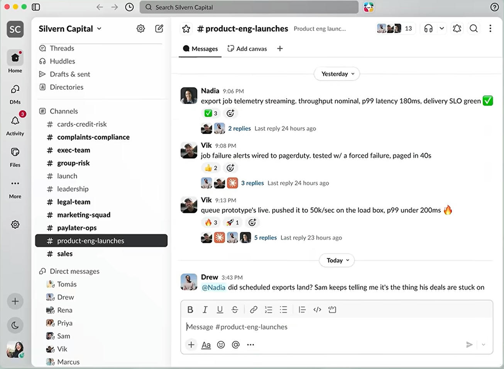
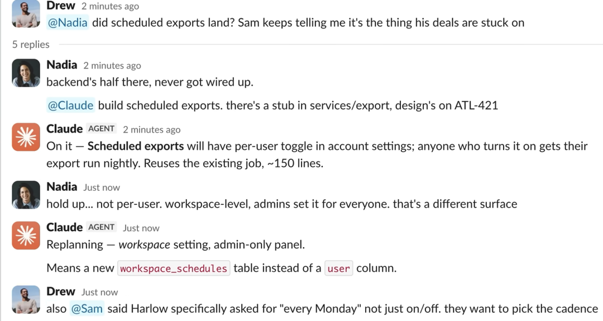
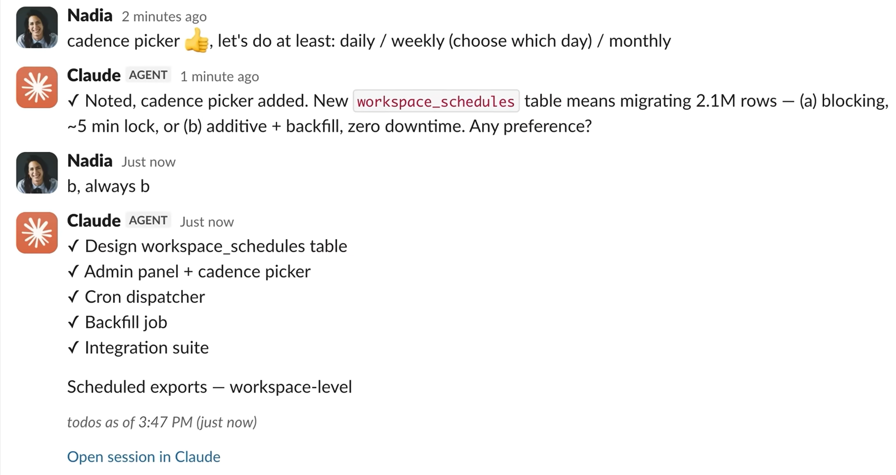
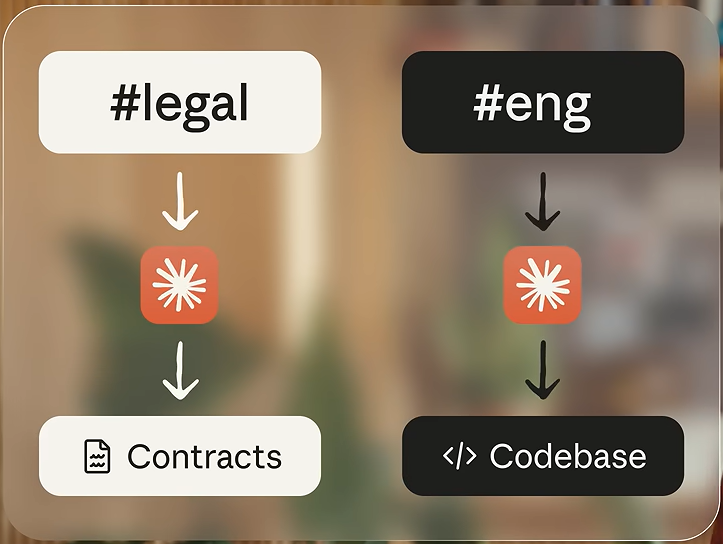
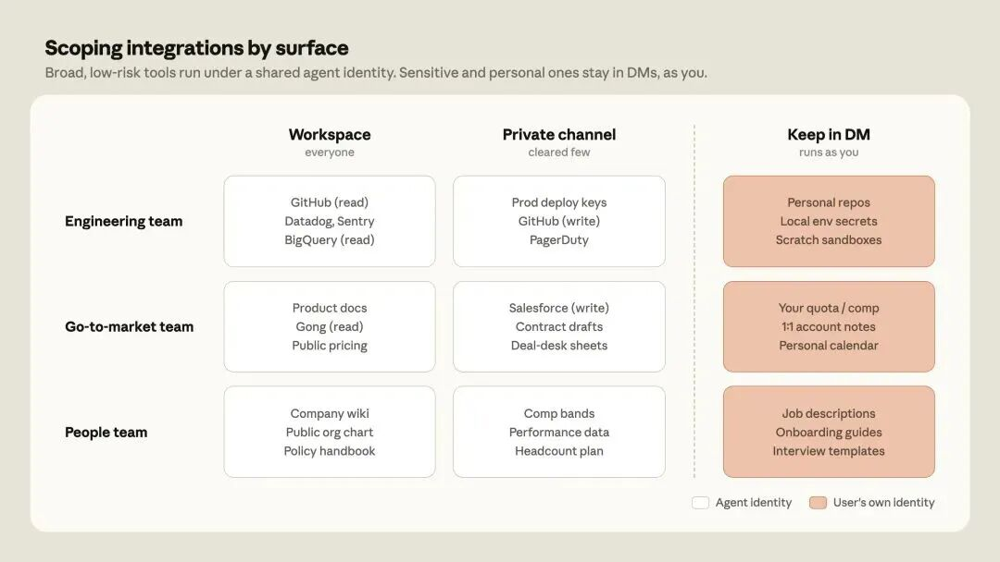

<strong style="font-size:16px;color:#1a6ba0;">要点速览</strong>

- <strong>Claude Tag 是什么</strong>：Claude 以 Slack 团队成员身份加入频道，任何人 @Claude 即可委派任务，异步执行、跨频道学习、主动汇报。Anthropic 产品团队 65% 的代码已由它生成。  
- <strong>Agent 身份模型</strong>：Claude 拥有自己的服务账号——在 Slack 以 Claude App 发帖，在 GitHub 以 Claude GitHub App 提 PR，在数据仓库以独立服务账号查询。权限按频道隔离，记忆不跨私密频道泄漏。  
- <strong>企业级 Infra 变革</strong>：Agent 自主性每四个月翻一番，多人协作场景下"以谁的身份运行"必须由 Infra 层解决。Agent 身份只是第一步，未来还有即时凭证授权和身份感知覆盖层。

**Claude Tag 的 Agent 身份革命：当 AI 不再代表你，而是代表自己**

2026 年 6 月 23 日，Anthropic 发布了 Claude Tag——Claude 以团队成员身份加入 Slack 频道。不是 Claude Code 加了个 @ 功能，Anthropic 把"多人 AI"协作的逻辑重做了一遍。

但真正值得看的不是 @Claude 本身，是它背后那个更本质的变化：**当 AI Agent 以自己独立的身份存在于团队中，不再依附任何具体用户时，企业 Infra 的权限模型得从头设计。**

**@Claude 在 Slack 频道里做了什么**

用法很直接：管理员把 Claude 接入 Slack 工作区，选好频道，连好工具和数据源。之后频道里任何人 @Claude 提需求，它就把任务拆成步骤逐一执行，做完在 Slack 线程里回复。

听起来和 Claude Code 差不多？**4 个区别让体验完全不同**：

一个频道里只有一个 Claude，所有人都能和它交互。工程师 @Claude 查了个 bug，PM 接着同一个上下文追问数据分析，对话连续，上下文共享。**这是团队协作，不是单聊。**

Claude 在频道里跟着看对话，慢慢积累上下文。用户不需要每次从头解释项目背景。授权允许的话，它还能从其他 Slack 频道和数据源自动学习，私密频道的内容不会泄漏出去。

开启"环境感知"模式后，Claude 会主动推送它觉得你需要知道的信息。某个线程沉寂了没解决，它会跟进；某个数据有异常，它会标记。

**给它一个任务，你就可以去忙别的。** 它还能给自己安排任务，几小时甚至几天后自主完成。Anthropic 内部已经习惯了同时给多个 Claude 委派任务。

**Anthropic 产品团队 65% 的代码现在由内部版本的 Claude Tag 生成。** 这个模式正在扩展到工程之外，追踪产品指标、处理支持工单、排查 bug 根因。

**视频演示中的实际场景**

官方演示视频里，工程师展示了 Claude Tag 在真实工作流中的用法。一个典型场景：开发者在 Slack 频道 @Claude 说"查一下上周的生产环境错误率趋势"，Claude 自动连数据仓库查指标，在 Slack 线程里返回图表和分析结论。**整个过程不依赖任何人的个人账号权限，全部通过管理员预先配置的 Agent 服务账号完成。**

另一个场景展示了权限隔离的实际效果：销售团队的频道里，Claude 能访问 CRM 和客户数据；工程团队的频道里，同一个 Claude 实例只能访问 GitHub 和数据仓库。**两个频道里的 Claude 共用一个模型，但身份、凭证、记忆完全隔离。** 销售频道里学到的东西，不会出现在工程频道中。

这就是 Claude Tag 和传统"AI 助手"的区别：**它不是一个附加在用户账号上的工具，是一个拥有自己身份的团队成员。**

**为什么"以用户身份行动"这条路走不通**

单人 AI 时代逻辑很简单：你连上自己的 Google Drive、GitHub、日历，AI 用你的权限读写。**到了多人场景，这条路立刻堵死。**

原因有两个。

Agent 自主性在指数级增长。Anthropic 的研究显示，AI Agent 能独立完成的任务时长大约每四个月翻一番。Agent 现在可以为自己安排未来的任务，在请求者下线后很久仍然自主运行。**当 Agent 在你下班后还在工作，它用的是谁的权限？**

多人共享频道里，没有"正确的用户"。三个工程师和一个 PM 在同一个频道里调试 bug，每个人都 @Claude 提需求。Claude 该用谁的 GitHub 权限？该用谁的数据库凭证？没有哪个选择在所有时候都是对的。

**解决方案：Agent 身份**

**Anthropic 的答案是 Agent Identity，Claude 在每一个接触的系统中都有自己的独立账户**：

团队如何界定 Claude 在 Claude Tag 中工具的访问权限：广泛且低风险的集成在共享频道中运行，且以 Agent 身份运行，而个人或团队专用工具则保留在私信中，并以用户身份运行。

- 在 Slack 中，它以 Claude App 的身份发帖
- 在 GitHub 上，它以 Claude GitHub App 的身份创建 PR
- 在数据仓库中，它以管理员配置的服务账号身份查询

**因为没有个人用户凭证参与，共享频道永远不会成为进入某人私密文档的后门。**

权限配置是层级化的：管理员在工作区级别定义一个基线身份，即 Claude 在所有地方默认持有的连接和技能集。**然后可以在频道级别覆盖**，工程频道可以额外访问 GitHub 和数据仓库，CRM 连接只限于销售频道。

管理员还能精细控制仓库读写权限、不同 API 密钥的分级连接（公开频道只读 vs 数据团队频道可写）、Claude 动态加载的指令和脚本，以及每个频道的自定义上下文。

**身份边界是硬隔离。** 每个私密频道有独立的 Claude 身份。法律频道的 Claude 无法访问工程代码，工程频道的 Claude 无法读取法律文档。记忆也遵循同样的边界，Claude 在私密频道学到的东西不会出现在更广泛的工作区中。身份属于频道，所以频道中的任何人都可以默认 @Claude。Enterprise 计划还支持基于角色的访问控制，让管理员决定哪些成员可以调用 Claude，**一个频道既管 Agent 能接触到什么，也管谁能叫它**。

**安全与审计**

管理员向频道添加连接时，凭证独立存储并映射到该频道的身份，在请求时于网络边界注入。流向未授权主机的出站流量被直接拦截。每一次 routine、记忆写入和网络调用都被记录。**因为 Claude 使用的是自己的服务账号，这些操作也会出现在每个连接系统的自有日志中**，审计线索是完整的。

**私信模式不同。** 在 Claude Tag 中，私信走的是用户个人的 claude.ai 账户，用自己的连接器、凭证，结果上也署自己的名。**这使私信成为处理不应出现在频道中的任务的正确场所**，比如草拟邮件或使用只有你有许可证的软件。

**Anthropic 的建议：先宽后窄。** 内部实践表明，Claude Tag 的价值随工具和上下文访问的增加而复合增长。每个连接的系统让其他每个系统更有用，Claude 可以从 Slack 拉线程、从 Drive 拉文档、从工单系统拉 ticket、从数据仓库拉查询，整合成一个答案。**建议先在几个频道中以基线 profile 开始，阅读审计追踪，然后逐步扩展。**

**未来：即时凭证授权**

Agent 身份只是第一步。Anthropic 计划在未来加入即时凭证授权，**用户可以在不永久扩大 Agent 权限范围的前提下，批准一次性的敏感操作**。以及面向更复杂安全等级组织的身份感知覆盖层，只有当频道 profile 和请求用户的权限同时允许时，Claude 才执行操作。

<strong style="font-size:15px;color:#8b6f4c;">结语</strong>

Claude Tag 的发布让 AI 产品从"个人工具"变成了"团队基础设施"。Agent 自主性每四个月翻一番，团队里同时跑着多个 Agent，Agent 在你下班后还在执行任务。"以谁的身份运行"这个问题，只能由 Infra 层来解决。  
Agent 身份模型是 Anthropic 给出的答案，但只是第一步。即时凭证授权、身份感知覆盖层，这些后续能力指向同一个方向：**企业大规模用 AI 的前提，是 Infra 层为 Agent 建好身份、权限、审计的完整体系。** 工具可以迭代，模型可以升级，但身份层一旦建好，就是未来所有 Agent 协作的基础。

---
参考：

https://claude.com/blog/agent-identity-access-model
https://www.anthropic.com/news/introducing-claude-tag
