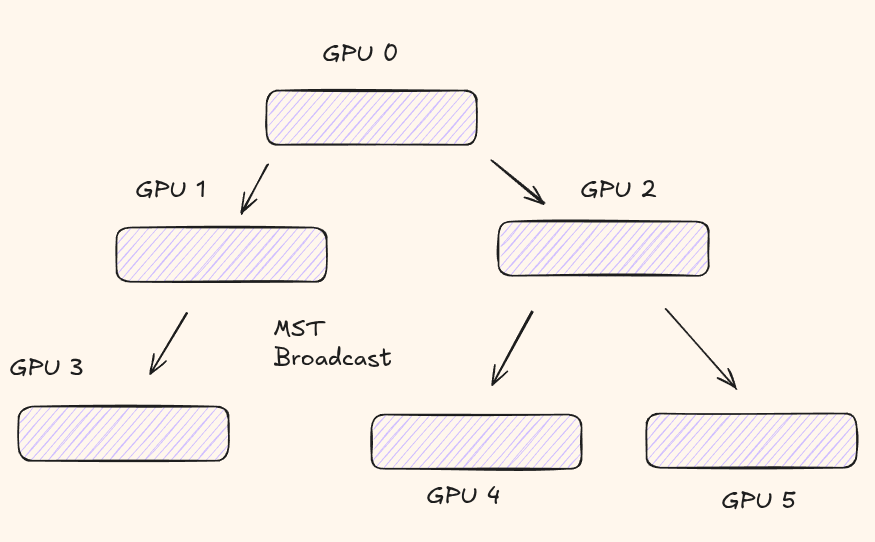
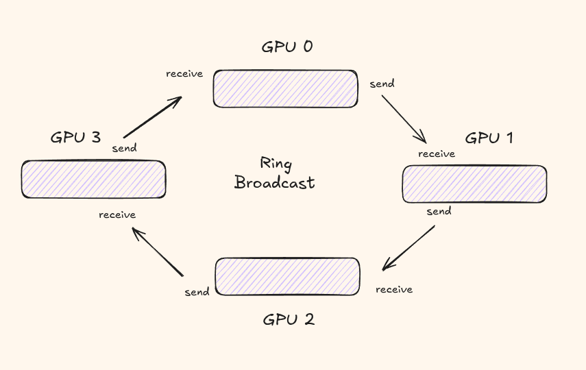

# Collective Communication 中文翻译

## 原文标题
Collective Communication for Multiple GPUs — 多 GPU 的集体通信

## 正文翻译

### 开篇

当你将训练或推理扩展到多个 GPU 时，需要在 GPU 之间进行通信。像 NCCL 这样的库专门提供优化过的 GPU 间通信原语，这些原语被称为**集体通信（Collective Communication）**。

训练和推理过程中 GPU 间共享的消息类型和数量差异很大，但通信原语是相同的。在本文中，我们将介绍开始扩展到多 GPU 所需的所有重要集体通信原语。

### Communication Model（通信模型）

GPU 间发送一条消息的总时间可以建模为：

```
totaltime = α + nβ, β = 1/B
```

其中：

- **α（alpha）** 是每次通信的固定开销，如建立连接、握手等的时间。它**不**依赖于你发送的数据量。
- **β（beta）** 是每字节的传输时间，是带宽的倒数（β = 1/B）。
- **n** 是消息大小（字节数）。
- **B** 是链路带宽（如 NVLink 的 900 GB/s）。

记住这个公式：**α 是每发一条消息就要付一次的固定成本，而 nβ 随消息大小增长。**

下面这个例子应该能帮你更清楚地理解。在 NVIDIA H100 上使用 NVLink：

- α ≈ 10 μs（建立连接的成本）
- B ≈ 900 GB/s，因此 β ≈ 每字节 1.1 皮秒

现在比较两种场景：

- **小消息（1 KB）：** α = 10 μs, nβ = 1024 × 1.1 ps ≈ 1.1 ns。α 项是 nβ 项的 **10,000 倍**。固定开销远大于实际数据传输。
- **大消息（1 GB）：** α = 10 μs, nβ = 1e9 × 1.1 ps ≈ 1.1 ms。nβ 项是 α 项的 **100 倍**。带宽占主导地位，建立成本可以忽略不计。

这个权衡决定了你选择哪种算法。当消息较小时，你要最小化通信轮数（每轮都有一个 α 成本）。当消息较大时，你要通过流水线（pipelining）让总线保持满载——每轮的固定开销基本可以忽略。

### Communication Algorithms（通信算法）

实现通信算法主要有两种——MST 算法和 Ring 算法。

#### Minimum Spanning Tree（MST，最小生成树）

MST 算法专为小消息设计，即适用于优先考虑低延迟的模型。它使用生成树结构来保证最少的数据传输轮数，但无法充分利用可用带宽。它假设网络中的每个节点一次只能与另一个节点通信。

别担心，如果这听起来不清楚，我们很快就会通过 MST 和 Ring 的对比示例来理解它们的权衡。

#### Ring（环形）

在 Ring 算法中，每个 GPU 按环形方式组织，一次只与它的两个邻居通信。

- **消息分割 (Message Split)：** 一条大消息被分成相等的 N 个块。Ring 中的 P 个 GPU 每个获得 N/P 数据。
- **数据传输 (Data Transfer)：** 每个 GPU 将自己的块传给下一个邻居。每个 GPU 从左侧邻居接收一个块，同时向右侧邻居发送一个块。
- **效率 (Efficiency)：** 每个 GPU 同时进行计算，带宽始终被占用。

现在，来看一个示例，假设我们要将一条消息从一个 GPU 发送到节点中的所有其他 GPU。

#### Broadcast in MST（MST 中的广播）



这里我们有 6 个 GPU，试图将其数据发送到组内的所有其他 GPU。

- **第 1 轮：** GPU 0 发送给 GPU 1 和 2。
- **第 2 轮：** GPU 1 发送给 GPU 3。
- **第 3 轮：** GPU 2 发送给 GPU 4 和 5。
- **总通信轮数：** log₂(6) ≈ 2.585 轮

#### Broadcast in Ring（Ring 中的广播）



- **第 1 轮：** GPU 0 发送给 GPU 1。
- **第 2 轮：** GPU 1 发送给 GPU 2。
- **第 3 轮：** GPU 2 发送给 GPU 3。
- **总通信轮数：** N - 1 = 3 轮

你可以看到 MST 直接优化了延迟——通信轮数比 Ring 算法少。而 Ring 算法则通过分块数据并让每个节点始终执行操作来优化带宽利用率。

在 ML 系统的训练和推理设置中，大多数消息是带宽受限的，因为我们需要移动大量的权重、激活值、tensor 分片等。

好了，现在我们已经掌握了直觉，是时候了解集体通信的具体操作了。

### Broadcast（广播）

Broadcast 将数据从一个 GPU（根节点）发送给组中的每个其他 GPU。每个 GPU 最终都拥有完全相同的副本。我们在上面已经看到了它在 MST 和 Ring 中的工作方式。

在训练中，broadcast 用于在开始时分发模型参数，以便所有副本从相同的初始状态开始。

### Reduce（规约）

Reduce 从每个 GPU 获取一个 tensor，并应用逐元素操作（求和、均值、求最小值、求最大值），在单个根 GPU 上生成一个结果 tensor。

这用于跨 GPU 聚合损失值，或在应用优化器之前对梯度求和。结果驻留在单个 GPU 上。

### Scatter（散射）

Scatter 将一个 GPU 持有的 tensor 分成相等的块，并将每个块发送给不同的 GPU。每个 GPU 最终获得原始数据的一个唯一部分——没有两个 GPU 持有相同的块。

在数据并行中，scatter 是将不同的 micro-batch 输入数据分配到各 GPU 的自然方式。

### Gather（收集）

Gather 是 scatter 的逆操作。每个 GPU 将其 tensor 发送给一个根 GPU，根 GPU 将它们拼接成一个更大的 tensor。

通常使用 gather 在 rank 0 上收集模型输出或激活值，用于 checkpoint 保存、日志记录或评估。

### Allgather（全收集）

Allgather 类似 gather 后跟 broadcast。每个 GPU 将其数据发送给所有其他 GPU，每个 GPU 最终获得来自所有 GPU 的完整拼接数据集。

这在 tensor 并行中至关重要——每个 GPU 持有 tensor 的一个分片，但某些操作（如 attention）需要完整的 tensor。Allgather 让每个 GPU 在无中心瓶颈的情况下重建完整 tensor。

### Reduce Scatter（规约散射）

Reduce Scatter 将 reduce 和 scatter 合并为单个操作。来自所有 GPU 的 tensor 被逐元素规约，结果被分割成块，每个 GPU 收到一个块。

### Allreduce（全规约）

Allreduce 是分布式训练中最重要的集体通信之一。它对来自所有 GPU 的 tensor 进行规约（求和或均值），并将结果广播出去，使每个 GPU 最终得到完全相同的规约 tensor。

在 DDP（分布式数据并行）中，allreduce 是梯度同步的支柱。每个 GPU 计算本地梯度，allreduce 确保每个副本应用相同的权重更新。

### Wrapping Up（总结）

有了这些知识，你应该能够理解不同的集体通信原语以及使用每种操作的权衡，并将实验扩展到单个 GPU 之外。

核心要点是：大多数 ML 工作负载是带宽受限的，这就是为什么基于 Ring 的算法在生产系统中占主导地位。而基于 MST 的算法在延迟是瓶颈且消息较小时则更为有用。

在接下来的几篇博客中，作者将重点介绍分布式技术以及更多生产就绪的库，如 torchtitan。
