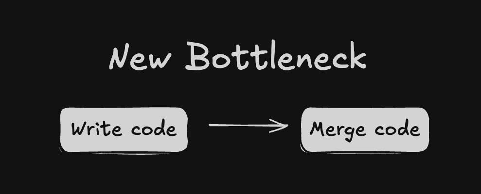
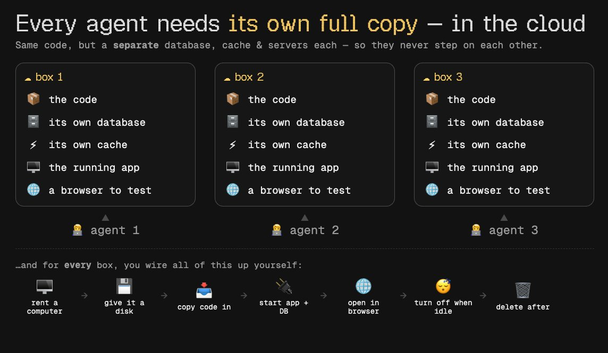
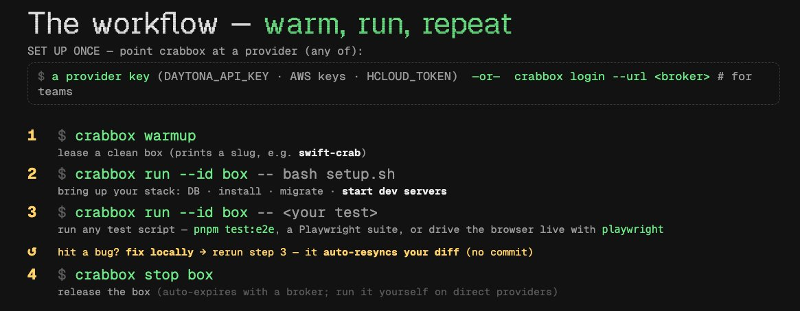
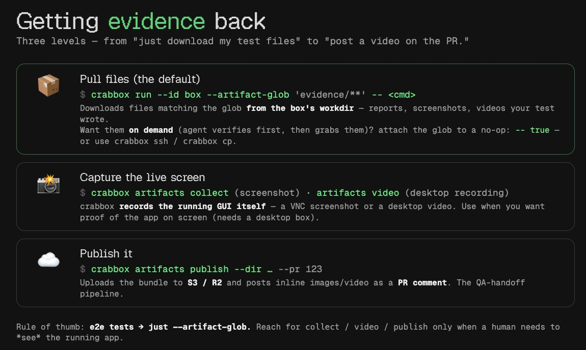

**Crabbox：Peter 的新副业项目，让每个 Agent 拥有独立云沙箱，PR 吞吐提升 10 倍**

<strong style="font-size:16px;color:#1a6ba0;">要点速览</strong>

- <strong>瓶颈迁移</strong>：当并行 Agent 数量涨到 5-10 个时，瓶颈不再是「写代码」，而是「把代码合并进代码库」  
- <strong>本地验证不扩展</strong>：端口冲突、共享 Docker/OS、资源限制——5 个完整生产栈放不进一台笔记本  
- <strong>Crabbox 的核心能力</strong>：云中隔离沙箱 + 本地脏 diff 实时同步（无需 commit），三个命令完成全流程

过去只能同时管理 2 到 3 个 Claude Code 会话的日子已经过去了。从今年 4 月设置 loops 以来，任何时候都有至少 5 到 10 个会话在并行运行——其中大部分从未被直接输入过指令。它们来自 loops：自动发现 issue、领任务、验证更改、自主开 PR。

这产生了前所未有的 PR 量——每个 PR 都必须审核并部署到真实环境，每个都带着破坏某些东西的风险。所以瓶颈从「写代码」迁移到了「把代码合并进代码库」。这个位置的变化，引出了一个新问题的答案：Crabbox。

## Agent 需要自己的盒子

让 Agent 启动子 Agent，用 Playwright CLI 测试工作并录屏附到 PR 上——这是当前验证 Agent 工作最常见的方式。**一张截图或一段流程视频贴在 PR 上，比任何代码检查都更可信。**

但当你同时运行 3 到 4 个 Agent 时，这没问题；上升到 5 到 10 个并行会话时，它立刻就碎了——它们最终会在同一个环境中测试，相互冲突。**每个 Agent 都需要自己的开发服务器真正运行在自己的代码上。** 即使给每个 ticket 分配独立的 git worktree，那也只隔离了「写代码」这个环节。

本地多次运行同一应用不具扩展性：

- **端口冲突**——端口通常写死了，第二个实例无法启动
- **共享基础设施**——一台笔记本只有一个 Docker、一个数据库、一个 OS。一个 Agent 尝试新 schema 就能同时破坏所有其他会话
- **资源限制**——真实生产堆栈极费 RAM 和 CPU，5 个放不下

**答案很明确：每个 Agent 应该获得自己在云中的隔离环境——自己的机器、自己的数据库、自己的开发服务器，沙箱互不接触。**

SToneoneX 为 SuperDesignDev 平台手工打造了一个版本，效果惊人。它运行在 Fly.io 上：一个 Firecracker VM 装着完整堆栈——docker-in-docker 的本地 Supabase、Redis、开发服务器——从基础镜像启动并配持久卷。加上机上编排器、CDP 浏览器驱动、挂起/恢复（约 3 秒热恢复）、45 分钟空闲看门狗自动关停。这解锁了大量可能性。

**但有一个硬伤：代码上盒子的唯一途径是 git fetch（从 GitHub 拉取分支）。必须先 push。** 未提交的工作目录更改完全无法验证。于是出现了一个尴尬的场景：Agent 在盒子上测试发现问题、在本地机器上修复、然后你卡住了——本地一个脏文件，盒子只知道已 push 的内容。

常规 commit → push → CI 在这里不行。仓库里塞满垃圾 commit，也不想每次从零重建盒子。

**你需要的很简单：做一个更改，在几秒内重新测试。**

这就是 OpenClaw 之父 Peter Steinberger 的新副业项目 **Crabbox** 的切入点。

## Crabbox：三个命令的完整验证循环

**Crabbox 让 Agent 在云中预热一个盒子，从本地工作目录实时同步脏 diff，然后运行测试。** 三个命令完成全流程：

1. `crabbox warmup` —— 启动一个盒子
2. `crabbox run -- <command>` —— 在云盒子上运行任意命令，就好像它在本地一样。**每次运行首先从你的机器同步 diff，你甚至不需要 commit。** 只要文件夹是 git 初始化的，它就会同步所有未提交的更改，然后执行
3. `crabbox stop` —— 关闭并删除盒子

这三条命令构成完整循环。没有复杂的 CI 配置，没有容器编排概念要学，没有 SSH 连接步骤。**对开发者来说，体验就像在本地跑，但资源是云的。**

这种设计直接回应了之前 Fly.io 方案的痛点：不再需要先 push 再测试。本地修改 → 实时同步到云盒子 → 测试 → 发现问题 → 本地修 → 再测，在几秒内完成。**脏 diff 同步让 Agent 的迭代速度从「commit → CI」变成了「改完即测」。**

Crabbox 的定位并非取代 CI/CD，而是填补 Agent 工作流中的一个关键缺口：**在 PR 被合并之前，如何快速、可靠地验证一个不干净的本地工作目录。** 当 Agent 会话数量从 3 个增长到 10 个时，这个缺口从一个小麻烦变成了瓶颈。

---

<strong style="font-size:15px;color:#8b6f4c;">结语</strong>

Crabbox 的核心价值不在技术层面有多深——docker-in-docker、Firecracker VM、CDP 浏览器这些都不是新东西。它的价值在于精准定位了当前 AI 编程工作流中一个被忽视的瓶颈：Agent 验证的隔离问题。当行业内所有注意力都在「让 Agent 写更多代码」时，Crabbox 在解决「Agent 写了代码怎么快速验证和合并」。  
Peter 从 OpenClaw 体系里孵化的这个副业，本质上是一种「验证即服务」——不碰代码编写能力，专注解决验证的摩擦。如果它真能像描述那样把「改完→测完」缩短到秒级，那它对 Agent 工作流的加速效果可能比写代码能力的提升更显著。

参考：
https://x.com/jasonzhou1993/status/2069413003897012435
