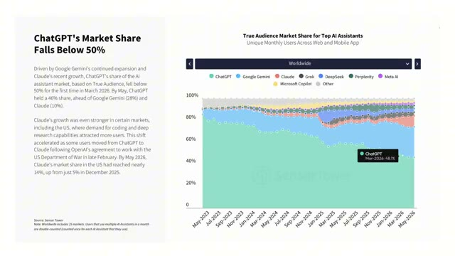
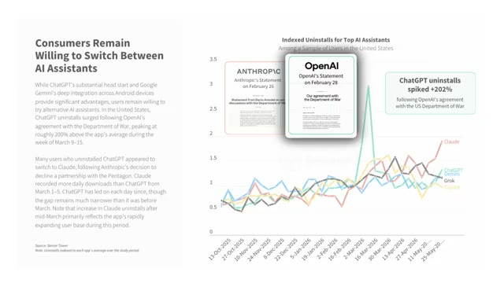
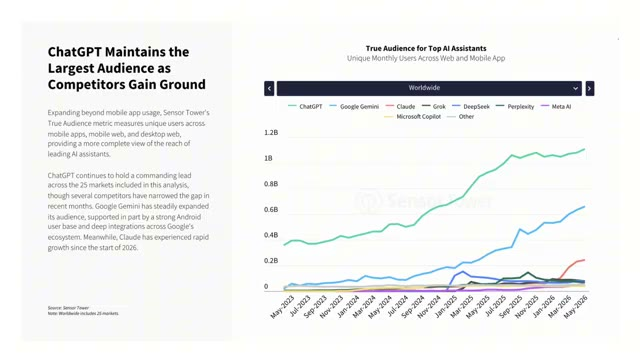
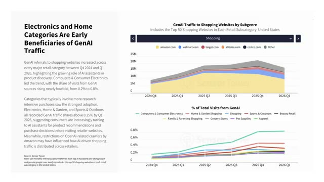
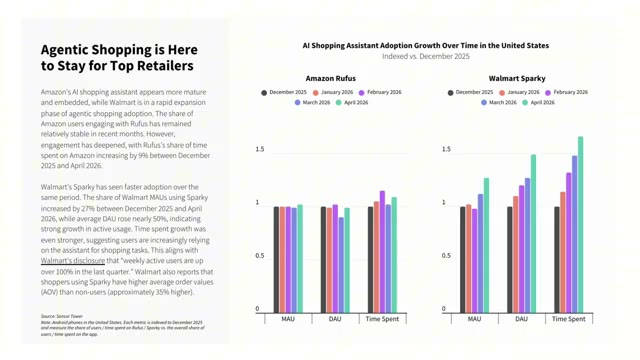
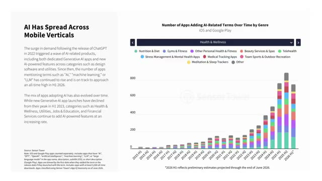
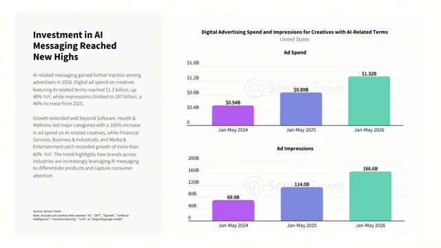
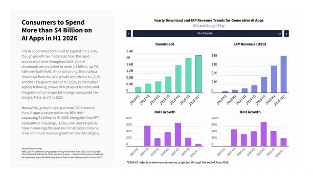
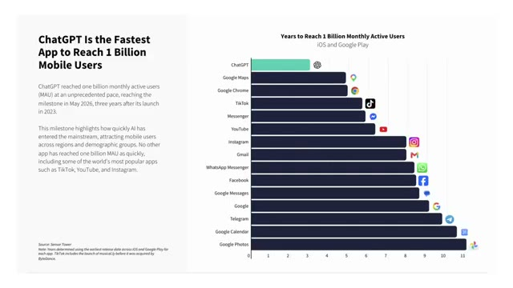

**Sensor Tower 2026 AI 行业报告：ChatGPT 份额跌破 50%，Agentic Shopping 重构电商，AI 广告投入 13 亿美元**

<strong style="font-size:16px;color:#1a6ba0;">要点速览</strong>

- <strong>ChatGPT 市场份额首次跌破 50%</strong>：2026年5月降至 46%，Gemini 28%、Claude 10%。OpenAI 与国防部合作导致卸载量暴涨，用户因企业立场直接更换主力 AI 工具。  
- <strong>下载增速放缓，付费暴涨</strong>：2026上半年全球 AI 应用下载 23 亿次（环比+7%），但内购收入突破 40 亿美元（环比+36%）。Claude 单用户月均收入从 $0.5 涨到 $2.76。  
- <strong>Agentic Shopping 重构电商</strong>：亚马逊 Rufus 用户转化率 40%+（普通用户仅 20%），沃尔玛 Sparky 用户客单价高出 35%。AI 渠道访问占比从 0.2% 升至 0.8%。  
- <strong>AI 广告投入 13 亿美元</strong>：ChatGPT 开启广告测试，5 月底广告量提升 7 倍。全行业 20 万+ 应用标注 AI 功能，健康类 AI 搜索涨幅 651%。

---

<section style="text-align: justify;margin-left: 8px;margin-right: 8px;line-height: 1.75em;">
2026 年整个生成式 AI 市场正在发生结构性转变：不再是单纯靠新用户下载来拉动增长，用户留存、付费转化、跨行业落地成为行业核心主线。Sensor Tower 最新出炉的 2026 人工智能行业完整报告，从 C 端用户行为、电商变革、广告生态、区域市场差异四个维度，还原了当下 AI 市场的真实现状。
</section>

**一、AI 助手赛道：市场高度集中，但用户忠诚度极低**

<section style="text-align: justify;margin-left: 8px;margin-right: 8px;line-height: 1.75em;">
全球用户使用 AI 助手的总时长里，前三名产品占据了 89% 的份额。但这种市场垄断并不稳固——<strong>2026 年一季度，ChatGPT 的真实受众市场份额首次跌破 50%，到 5 月降至 46%</strong>。谷歌 Gemini 占 28%，Claude 达到 10%。
</section>

<section style="text-align: justify;margin-left: 8px;margin-right: 8px;line-height: 1.75em;">
消费者会根据不同使用需求在多个 AI 平台之间频繁切换。最典型案例：OpenAI 和美国国防部达成合作后，ChatGPT 卸载量暴涨，同期 Claude 下载量激增。<strong>用户会因为企业的合作立场直接更换主力 AI 工具。</strong>
</section>

<section style="text-align: justify;margin-left: 8px;margin-right: 8px;line-height: 1.75em;">

<section style="text-align: justify;margin-left: 8px;margin-right: 8px;line-height: 1.75em;">
分区域看，Claude 在美国市场增长速度尤为突出——2025 年 12 月仅 5%，2026 年 5 月接近 14%。2026 年 3 月 1 日至 5 日，Claude 每日下载量一度超过 ChatGPT。ChatGPT 用户流失占比从 1 月 12.7% 上升至 4 月 14.5%，反观 Claude 的用户流失比例快速下降，留存指标持续向 ChatGPT 靠拢。
</section>

**二、商业化：下载增速放缓，付费规模高速上涨**

<section style="text-align: justify;margin-left: 8px;margin-right: 8px;line-height: 1.75em;">
2025 年全行业 AI 应用下载量爆发式增长，到 2026 上半年增速已小幅放缓。但付费规模持续高速上涨——<strong>机构预测 2026 上半年全球 AI 应用内购收入突破 40 亿美元</strong>。
</section>

<section style="text-align: justify;margin-left: 8px;margin-right: 8px;line-height: 1.75em;">
付费增长的核心驱动力是产品转向专业和工具化使用场景。Claude 深耕企业办公、学术研究、代码开发，<strong>单用户月均收入从 2025 年 9 月不足 0.5 美元涨到 2026 年 5 月的 2.76 美元</strong>。Perplexity 和 Grok 也出现同步上涨。
</section>

**三、Agentic Shopping 重构电商消费**

<section style="text-align: justify;margin-left: 8px;margin-right: 8px;line-height: 1.75em;">
智能体购物（Agentic Shopping）正在彻底重构电商消费行为。AI 不再只是辅助查询工具，而是完整介入用户从商品调研到下单成交的全链路。
</section>

<section style="text-align: justify;margin-left: 8px;margin-right: 8px;line-height: 1.75em;">
电子产品、家居园艺等需要大量前置对比调研的品类最先吃到 AI 流量红利。各大零售平台自研的内置 AI 购物助手已成标配：<strong>亚马逊 Rufus 用户成交转化率接近普通用户的两倍</strong>，沃尔玛 Sparky 也迎来大规模增长。
</section>

<section style="text-align: justify;margin-left: 8px;margin-right: 8px;line-height: 1.75em;">
使用 Rufus 的亚马逊用户成交转化率稳定在 40% 以上，普通用户仅 20%。AI 工具能补齐用户下单前需要的全部信息，大幅降低消费决策阻力。沃尔玛 Sparky 用户客单价比普通用户高出 35%。
</section>

**四、AI 成为全行业流量挖掘与营销载体**

<section style="text-align: justify;margin-left: 8px;margin-right: 8px;line-height: 1.75em;">
AI 已脱离科技行业专属工具的定位。目前 iOS 和谷歌应用商店超过 20 万款应用在产品介绍中主动标注 AI 功能。<strong>消费者主动搜索 AI 关键词下载应用的行为呈爆发式增长</strong>——健康类应用相关搜索涨幅 651%，金融服务类 536%。
</section>

<section style="text-align: justify;margin-left: 8px;margin-right: 8px;line-height: 1.75em;">
广告投放端，广告主累计投入 13 亿美元用于 AI 相关数字广告。ChatGPT 在 2026 年 2 月开启广告测试，到 5 月底平台广告总量提升 7 倍。
</section>

**五、全球市场大盘**

<section style="text-align: justify;margin-left: 8px;margin-right: 8px;line-height: 1.75em;">
2026 上半年全球生成式 AI 应用累计下载量预计 23 亿次，环比上涨 7%。付费收入环比上涨 36%，突破 40 亿美元。总使用时长预计 360 亿小时，同比翻倍。
</section>

<section style="text-align: justify;margin-left: 8px;margin-right: 8px;line-height: 1.75em;">
分区域：亚洲市场出现 13 个季度连续增长后的首次下滑。巴西超越中国升至全球第三。北美付费能力最强——美国厂商贡献近 60% 全球下载量、85% 付费收入。
</section>

**六、用户行为与使用场景**

<section style="text-align: justify;margin-left: 8px;margin-right: 8px;line-height: 1.75em;">
主流 AI 助手用户基础依旧偏年轻、男性占比更高，但各产品都在拓宽受众圈层。ChatGPT 女性用户占比从 32% 提升至 35%，微软 Copilot 从 33% 涨到 39%。
</section>

<section style="text-align: justify;margin-left: 8px;margin-right: 8px;line-height: 1.75em;">
使用场景分化明显：Claude 和职场、开发工具绑定更深；ChatGPT、Perplexity 与电商购物场景关联度最高。<strong>ChatGPT 用户每月平均使用 215 分钟，但过去三个季度持续下滑。</strong>竞品迎来高速增长——DeepSeek 从 57 分钟涨到 189 分钟，Claude 从 40 分钟涨到 120 分钟。
</section>

**七、全品类 AI 功能渗透**

<section style="text-align: justify;margin-left: 8px;margin-right: 8px;line-height: 1.75em;">
全球超 20 万款 iOS 和谷歌商店应用在产品描述里标注 AI 能力。2026 上半年带有 AI 标签的应用累计下载量接近 100 亿次，同比上涨 25%。<strong>营收层面，标注 AI 功能的应用内购收入预计 120 亿美元，同比上涨 61%。</strong>
</section>

<section style="text-align: justify;margin-left: 8px;margin-right: 8px;line-height: 1.75em;">
视频剪辑、图片编辑、AI 内容生成和 AI 虚拟陪伴是新增 AI 功能最多的赛道。
</section>

<strong style="font-size:15px;color:#8b6f4c;">结语</strong>

这份报告最值得关注的信号不是 ChatGPT 份额跌破 50%，而是整个 AI 行业增长引擎的切换——从"拉新"到"留人"到"赚钱"。下载增速放缓是必然的，但付费收入暴涨说明用户愿意为真正的生产力价值买单。Claude 单用户月均收入从 $0.5 到 $2.76 的增长曲线，比任何市场占有率数字都更能说明问题。  
Agentic Shopping 的爆发则预示着 AI 正在从"问答工具"变成"消费决策基础设施"。当亚马逊 Rufus 用户转化率是普通用户的两倍、停留时长是四倍时，电商平台的竞争逻辑已经被重写。

---

参考：

https://youtu.be/MxpuORrjc1E
