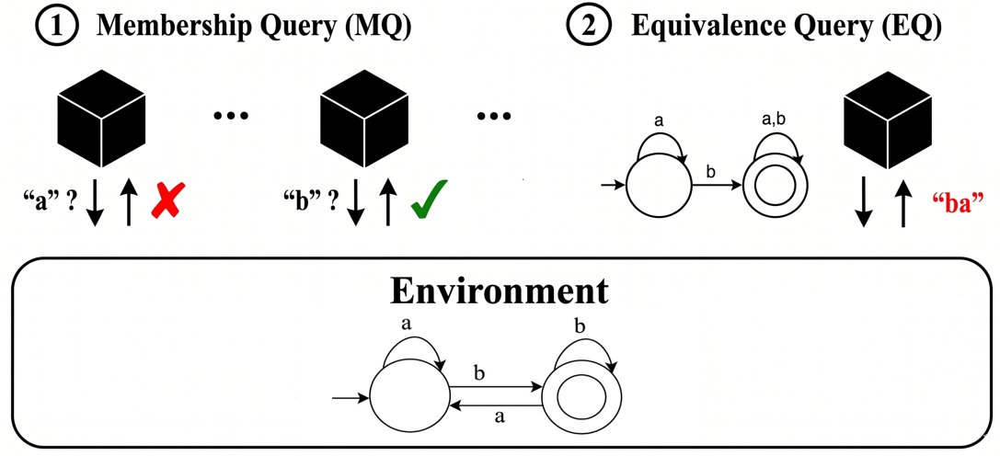
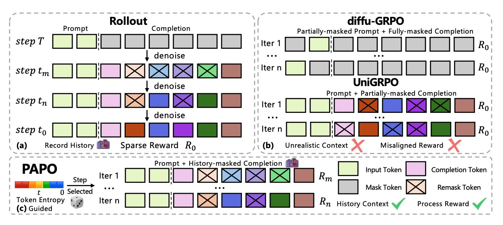

<strong style="font-size:16px;color:#1a6ba0;">要点速览</strong>

- <strong>空间推理突破</strong>：NVIDIA 的 SpatialClaw 用代码替代直接文本输出做 3D/4D 空间推理，训练免费且模型无关，在 20 个基准上平均 59.9%  
- <strong>组合技能路由</strong>：SkillWeaver 将复杂查询分解为子任务，从数千技能库中检索并编排，任务分解质量是瓶颈——迭代反馈提升准确率 51.0% → 67.7%  
- <strong>计算机使用 Agent 可编译</strong>：PreAct 将首次成功运行编译为状态机程序，后续回放无需逐步调用模型，速度快 8.5-13 倍  
- <strong>长期记忆原子化</strong>：AtomMem 将记忆拆为原子事实，用关联图重组碎片，在 LoCoMo 基准上达 SOTA  
- <strong>Diffusion LLM 的 RL 训练</strong>：PAPO 解决稀疏奖励和轨迹漂移两大问题，GSM8K 和 MATH500 上提升 4.5%-42.2%

**DAIR.AI 每周十大论文，这个栏目我追了一段时间了。** Eliza 团队每周日从过去一周的论文堆里挑出 10 篇最值得看的，每篇配一段解读和 Why it matters。这期是 6 月 14 日到 6 月 21 日的，覆盖空间推理、Agent 技能组合、Diffusion LLM 强化学习——每个方向都有一篇值得翻的。

**SpatialClaw：用代码做空间推理**

通用视觉语言模型做 3D/4D 空间推理还差点意思。它们直接输出文本答案，不是真正测量空间关系。NVIDIA 的 SpatialClaw 换了个思路：不要求模型直接回答，让 Agent 写代码来算。

Agent 每次写一个 Python cell 到持久的 Jupyter 内核里，内核预装了感知原语（SAM3 分割、Depth-Anything-3 重建等）和科学计算库。Agent 执行代码、看中间结果、修正策略，几步下来逼近答案。

结果是模型无关的。在两个模型家族、六个 VLM 主干上，SpatialClaw 在 20 个空间推理基准上平均准确率 59.9%，比以前最好的空间 Agent 高出 11.2 个百分点。不需要训练，任何能写代码的 VLM 都能用。

**SkillWeaver：当技能库膨胀到数千条**

真实任务很少只用一个技能。Agent 得从大库里挑几个可复用的来组合。SkillWeaver 把这个事形式化为 Compositional Skill Routing，搞了一个分解-检索-编排的三段式流水线。

先用 LLM 把查询拆成子任务，用双编码器配合 FAISS 索引匹配到最合适的技能，然后做依赖感知的规划拼出执行计划。作者同时发布了 CompSkillBench 基准——300 个组合查询、2,209 个真实 MCP 服务器技能，覆盖 24 个功能类别。

研究发现任务分解质量是主要瓶颈。引入迭代式技能感知分解后，把检索信息反馈到分解步骤，准确率从 51.0% 提到了 67.7%。

**PreAct：把 Agent 的一次操作编译成可重用的程序**

计算机使用 Agent 通过屏幕操作软件，但每次任务从头开始——重新读屏、重新推理、逐步调模型。PreAct 做了一个简洁的改进：把第一次成功运行编译成一个状态机程序。状态节点检查屏幕是否符合预期，转移节点执行操作。后续同类任务直接回放，不再调 Agent。

效果很直白：回放比逐步调用模型快 8.5 到 13 倍。每一步检查屏幕是否匹配，一旦异常就把控制权交回 Agent。只有独立评估器确认能从干净状态解决任务的程序才会被存下来。

**LLM Agent 能推断世界模型吗？**

这个问题现在可以换一种精确的方法来问了。研究者把世界模型推断转化为确定性有限自动机（DFA）学习：Agent 通过两个接口与 oracle 交互——成员查询（问某个字符串是否属于目标语言）和等价查询（问提议的自动机对不对）。自动机的大小本身就是难度旋钮。

Agent 有时候确实能完成非平凡的交互式发现，但性能随 DFA 规模增大下降得很快。分析轨迹发现，Agent 在查询规划、证据整合和假设构建上存在系统性问题。推理模型明显优于非推理模型，但和经典自动机学习算法之间的差距说明，系统性交互式世界模型构建仍是没解决的能力。

**From Trainee to Trainer：让 Agent 设计自己的训练环境**

RL 流水线训练 LLM 通常依赖人工在阶段之间重新设计环境——从业者猜哪种配置能改善当前策略。这篇论文让模型自己来做这个事：提出 LLM-as-Environment-Engineer 框架，让当前策略诊断自己的弱点并提议下一阶段的训练环境配置。

有意思的发现：当前的 RL checkpoint 比原始基座模型更适合做环境工程师——学会了行动，模型诊断自身局限的能力也跟着提高了。人工在阶段之间调环境是 RL for LLMs 中最不可扩展的环节，让策略自己设计课程正好堵上了这个瓶颈。

**OpenClaw-Skill：集体技能树搜索**

给 LLM Agent 装备有效技能是实际系统中最关键的环节。但大多数技能归纳工作一次只蒸馏一条轨迹——得到的技能窄而且脆弱。OpenClaw-Skill 提出 Collective Skill Tree Search，用多个模型生成和评估候选技能，构建结构化的技能树。技能按层次组织，Agent 要学习怎么检索和应用这个层次。

**Back on Track（PAPO）：Diffusion LLM 的稳定 RL 训练**

Diffusion LLM 的生成方式和自回归模型完全不同，没法直接套用自回归模型的 RL 训练方案。两个具体问题：奖励稀疏——一个终端奖励没法引导中间生成步骤；策略更新可能漂移到不自然的轨迹上。PAPO 把终端奖励拆成细粒度的逐步骤信号，在高不确定性时刻回放真实生成路径。

在 GSM8K 和 MATH500 上取得了 4.5% 到 42.2% 的提升。

**AtomMem：原子级长期记忆**

LLM Agent 的长期记忆有两个常见问题：粗粒度摘要随时间漂移，不受限的更新破坏已存信息。AtomMem 把记忆单元弄到极小——用 Fact Executor 从长交互中挑出高价值的原子事实，组织成层次化事件结构和时间线用户画像，辅以关联记忆图在检索时重组碎片。在 LoCoMo 长期记忆基准上达到 SOTA。

**Beyond Domains / SkillMigrator：跨站 Web 技能迁移**

Web Agent 通常每步读一次新页面、发一个低级动作，任务长度和 LLM 推理次数都很大。SkillMigrator 把已习得的技能存为与页面布局结构绑定的可迁移交互模式——不按指令相似性或站点元数据索引。在 A 站学到的技能，只要 B 站页面有相同的交互形状就能触发了。在 WebArena 和 Mind2Web 上以可比的成功率把平均 LLM 调用次数减少了 8-10%。

**Stanford EDGAR 数据集：152B tokens 的金融文档**

用于预训练的干净长上下文文档还很少，尤其在金融领域。Stanford 从美国 SEC 企业披露文件中重构了 152B tokens 的 MultiMarkdown 格式数据集（SEFD-v1），完整档案估计 550B tokens，涵盖 1,850 万份文件，和 Common Crawl 语料库的重叠率低于 0.1%。同时发布了两个衍生基准：EDGAR-Forecast（数字预测）和 EDGAR-OCR（金融表格转录）。

---

<strong style="font-size:15px;color:#8b6f4c;">结语</strong>

这期的 10 篇论文有个共同的方向：Agent 系统正在从"一个模型包办一切"变成"多个组件协作"。SpatialClaw 用代码改写推理接口，SkillWeaver 和 OpenClaw-Skill 把技能库当作基础设施，PreAct 把 Agent 执行结果编译成可复用的程序。三篇指向同一个趋势：Agent 正在变成可组合、可调试、可持久化的工程构造，不是一次性调用的黑盒。  
AtomMem 和 SkillMigrator 在解决另一边的问题——长程 Agent 靠记忆维持上下文连续性，跨站 Agent 靠技能迁移降低重复成本。这两个方向跑通的时候，Agent 离"放到后台让它自己跑"就更近了。

---
参考：https://x.com/dair_ai/status/2068724104815890889
