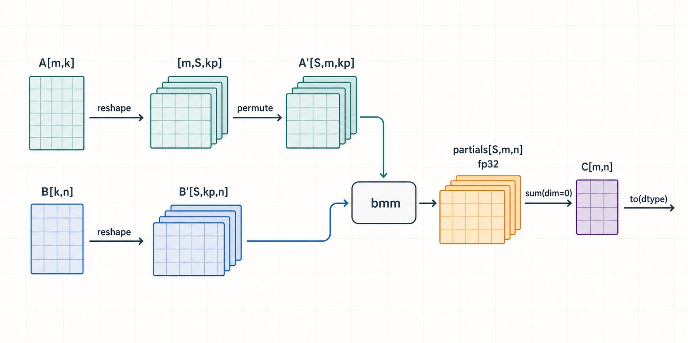
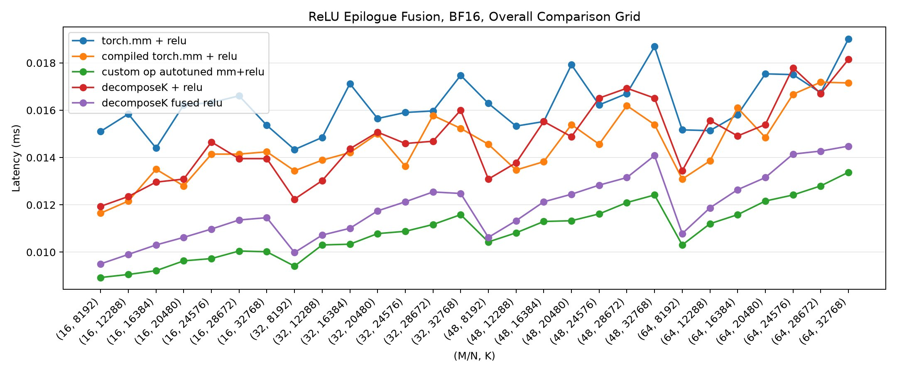
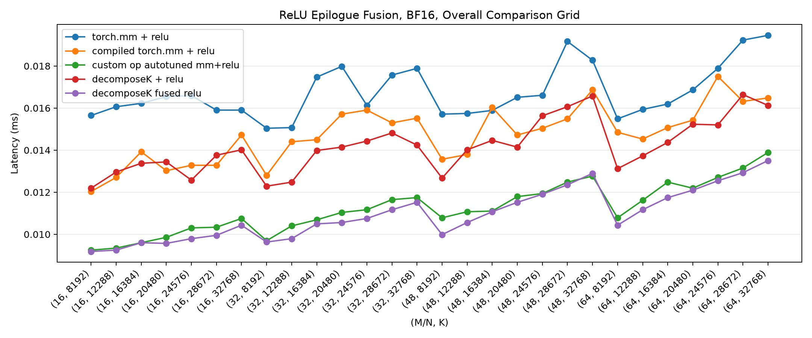
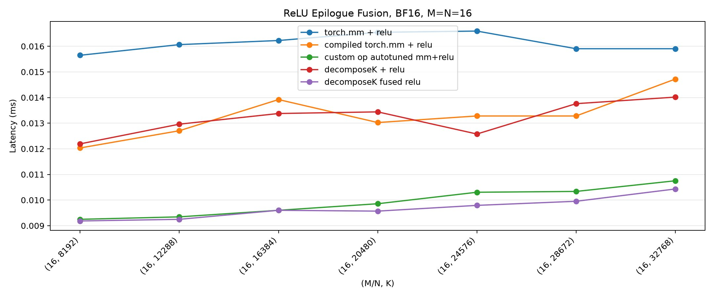
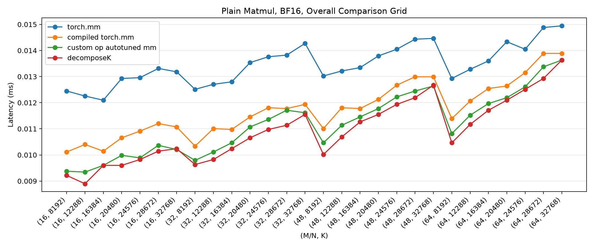

<div style="background:#e8f4fd;padding:14px 16px 10px 16px;border-radius:6px;margin-bottom:18px;">
<div style="text-align:center;margin-bottom:10px;">
<strong style="font-size:16px;color:#1a6ba0;">要点速览</strong>
</div>
<div style="font-size:14px;color:#3f3f3f;line-height:1.75;">
- <strong>核心问题</strong>：当 M 和 N 很小而 K 极大时（如 M=N=16, K=32768），标准 GPU GEMM 的 tile 并行性消失，132 个 SM 闲着等一个串行规约<br><br>
- <strong>Decompose-K 方案</strong>：将 K 维度分成 S 块，拆成 S 个独立 batched matmul 再加总，暴露 K 轴上的并行性<br><br>
- <strong>优化路径</strong>：torch.compile 基线（1.26ms）→ 手写 Triton（1.14ms）→ Pipeline（473μs）→ Double-buffering + cp.async（354μs），最终快 3.5 倍<br><br>
- <strong>关键教训</strong>：赢在规约器重构（向量化 tl.sum 替代 tile 串行规约）和 ReLU 融合，而非 matmul 本身
</div>
</div>

**这篇文章来自 Shreyansh Singh 对 Decompose-K 的实现与基准测试，灵感来自 Meta 工程师在 PyTorch Conference 上的演讲。核心问题极端专注：当矩阵乘法的 K 维度远大于 M 和 N 时，标准 GPU 实现为什么会崩溃，以及怎么修复它。**

**标准 Matmul 的并行性假设**

一个标准的 GPU GEMM 工作方式是：把输出矩阵 C[M, N] 切成 BLOCK_M × BLOCK_N 的 tile，每个程序负责一个 tile，在 K 维上流式累积。这在 M 和 N 都很大时工作良好——有大量输出 tile，GPU 有足够多的独立工作填满所有 SM。

问题场景是「瘦长 K 主导」的矩阵乘法：M 和 N 极小而 K 极大。比如 M = N = 16, K = 32768，输出只有 16 × 16 = 256 个元素，也就一两个 tile。**GPU 有 132 个 SM 闲着，看着一两个程序串行走完长度为 32768 的规约。Matmul 是规约受限的，但标准切块在唯一的大维度 K 上几乎没有暴露任何并行性。**

**Decompose-K：把规约变成并行**

方案出奇简单：既然唯一的大的维度是 K，那就把 K 拆开，在拆开的块上并行化。

将 K 分成 S 个独立块，计算 S 个部分 GEMM，再加总：

```
A[M, K] @ B[K, N] → partials[S, M, N] → sum(partials, dim=0)
```

每个部分是一个 K/S 规模的 matmul。S 个部分彼此独立，自然地变成 batch dimension = S 的 batched matmul（bmm）。比如 M = N = 16, K = 32768, S = 64，a_reshaped 变成 [64, 16, 512]，b_reshaped 变成 [64, 512, 16]，**bmm 现在有 64 个独立程序可以并行执行，调度器可以将它们分布到所有 SM 上。**

每个部分只累积 512 的规约而不是 32768——用 S 个短并行规约取代一个长串行规约，再加一次 S 个部分结果的最终规约。**部分结果在 fp32 中累积（`out_dtype=torch.float32`），因此拆分不会损失精度。**



**为什么它对 Epilogue 友好**

使用原子加法写入输出的 split-K 设计有一个问题：输出 tile 在所有 split 完成之前不是最终的，因此不能在累积过程中应用 ReLU。需要额外的独立 pass。

Decompose-K 将部分结果保存在独立的 [S, M, N] 缓冲区中，做显式规约。**规约步骤是每个输出元素变为最终值的自然位置，epilogue 可以直接折叠进规约的 store 操作：** 先 sum 再 relu 再 store，无需第二遍读写输出。对小输出这是真实收益，约 1.2-1.4x。

**适用场景**

Decompose-K 在以下情况下有优势：K 极大且 M/N 较小（如 M=N=16..64, K=8192..32768）；对延迟敏感、固定 shape 比通用 GEMM 更重要的场景（如 DeepSeek-V3 MoE 路由 GEMM）；可以融合 ReLU 等 epilogue。**当 M 和 N 已足够大、K 较小、或额外缓冲区成本占主导时，不值得使用。**

**从 torch.compile 到手写 Triton**

作者的优化过程分四步走，每一步都是增量优化：

**1. torch.compile 基线。** 让 PyTorch 的 Inductor 编译器自动生成 kernel，在 A100 80GB 上测得 1.26ms。**这是起点，不是终点。** 实际测试发现 `max-autotune-no-cudagraphs` 模式最优——开启模板自动调优但跳过 CUDA graph，避免小调用的额外开销。

Inductor 对 `decomposeK` 函数的编译会生成两个操作：一个外部 cuBLAS 批处理 bmm kernel，加上一个融合 sum+cast 的 Triton 点运算 kernel。更关键的是，如果直接写 `relu(mm(a, b))` 让 Inductor 决定：**小 K 时生成单个融合 matmul template（ReLU 融合进 store 后缀），大 K 时 Inductor 自动选择 Decompose-K 路径——但 ReLU 仍作为独立点运算 kernel 在规约之后发出。这是手写 kernel 可以收回的融合机会。**

**2. 手动 Triton 实现。** 手写 Decompose-K 的 Triton kernel，用纯 Triton 实现 bmm + reduction。不加任何高级优化，1.14ms——比 torch.compile 略微快一点。**分两阶段：部分 matmul（2D 发射网格，每个程序为一个 split 计算一个 tile）+ 规约/epilogue。**

有趣的是：**这个手写 kernel 并没有比 Inductor 快。** Inductor 对同样 Decompose-K 数学的 lowering 中位数快约 8-13%。原因在于规约器——手写规约器按输出 tile 形状，一个程序串行遍历所有 SPLIT_K 部分结果，规约并行性被绑定到了输出切块上，这是错误的方向。

**3. 多 stage pipeline。** 引入软件流水线，把规约的 load-compute-store 拆成多个 stage 重叠执行。Triton 的 `core.advance_to_next_stage` 自动处理等待和信号，开发者只需要声明 stage 边界。**耗时降到 473μs——第一次显著优于 Inductor。**

**4. Double-buffering + cp.async。** 使用 Triton 的 `core.double_buffer` 对 load buffer 做双缓冲，配合 NVIDIA 的异步拷贝指令 cp.async，让数据加载和计算完全重叠。**最终 kernel 耗时 354μs——比 torch.compile 基线快 3.5 倍，GPU 利用率从几乎为 0 提升到了接近满载。**



**Custom-op 自动调优的意外发现**

在写最终 kernel 之前，作者先试了 Inductor 的 `register_custom_op_autotuning` API。这个 API 允许传入一个操作的多种分解方案列表（普通 mm + 每个合法 split 数对应的 Decompose-K 分解），让编译器按 shape 基准测试并选择胜者。

**结果：纯 PyTorch 级别的 decomposition 列表打开自动调优后，击败了 naive 手写 Triton kernel 在所有 28 个 shape 上的表现。** 如果你只想做一件事，可以只做这个——无需手写 CUDA/Triton，只需向编译器提供更多分解选项。



**优化的 Triton Kernel：赢在规约器**

最终 kernel 保持两阶段结构但重写规约器，四项关键改动：

**1. 规约器围绕 split 轴重构。** 将输出矩阵展平成 1D 元素索引，把 split 作为 2D 向量规约的规约轴。每个程序用 `tl.sum` 在 split 轴上一次性规约——规约切块与 matmul 切块解耦。**这是从「输在哪」到「赢在哪」的决定性改动。**

**2. Flat contiguous 快速路径。** 对连续的 row-major 张量，地址计算简化为 `partials + r * stride_ps + x`，无需恢复 (m, n) 的除法和取模。

**3. 匹配微小 tile 的 Warp 数。** 16x16 只有 256 个 fp32 累积器，4 个 warp 过多（更多调度开销、更少驻留程序）。优化配置包含 1-2 warp 的 tile（16x16x64）和 4 warp 的较大 tile（64x32, 64x64）。

**4. 更多 split 候选。** 显式尝试 2 的幂次计数（2,4,8,16,32,64,128,256），匹配向量化规约器使用的 RBLOCK。

**优化结果：从输 28/28 到赢 26/28。** 向量化规约器将 median 从 0.917x 提升到 1.026x——约 11% 的摆幅，完全来自规约并行化和 ReLU 融合。



**性能全景**

在 A100 80GB 上，各版本逐级提升清晰可见。`epilogue-bf16` suite 的关键数字（do_bench median, ms）：

| M=N | K | eager mm+relu | compiled mm+relu | custom-op | Decompose-K fused |
|-----|---|---------------|------------------|-----------|-------------------|
| 16 | 8192 | 0.0156 | 0.0120 | 0.0092 | 0.0092 |
| 16 | 32768 | 0.0159 | 0.0147 | 0.0108 | 0.0104 |
| 32 | 16384 | 0.0175 | 0.0145 | 0.0107 | 0.0105 |
| 64 | 32768 | 0.0195 | 0.0165 | 0.0139 | 0.0135 |

**融合 Decompose-K 始终是最快列**，比 eager 快约 1.5-1.7x，比 compiled mm+relu 快约 1.2-1.4x。仅融合收益（同一配置下 ReLU 分开 vs 融合）稳定在 1.19x-1.4x。



**这个案例的意义不止于一个 kernel**

Decompose-K 解决的是一个在推理场景中越来越常见的模式。MoE 路由、MLA（Multi-head Latent Attention）的解码阶段、以及各种稀疏门控结构都涉及瘦长的大 K 矩阵乘法。**当 batch size 很小时，这些操作会成为推理的关键瓶颈。**

更重要的是，这个案例展示了从 PyTorch 高层 API → torch.compile 自动编译 → custom-op 自动调优 → 手写 Triton kernel 的完整降级路径。**PyTorch 的编译器和 Triton 生态让 kernel 开发从「必须懂 CUDA 汇编」降到「可以在 Python 里迭代」，但最终的极致性能仍然需要理解 GPU 的存储层次和流水线模型。**

作者诚实地总结了收益比：手写 kernel 相比 custom-op 自动调优只有几个百分点的优势，而做到这一点需要重写规约器、扩展搜索空间、理解 GPU warp 调度。**对大多数场景，正确使用的 torch.compile 加上 custom-op 自动调优就足够了。** 当 shape 固定且延迟确实至关重要时，手写 kernel 的「最后几个百分点」才值得你去拿。

---

<div style="background:#f5f0eb;padding:14px 16px 10px 16px;border-radius:6px;margin-bottom:16px;">
<div style="text-align:center;margin-bottom:8px;">
<strong style="font-size:15px;color:#8b6f4c;">结语</strong>
</div>
<div style="font-size:14px;color:#3f3f3f;line-height:1.75;">
这篇优化案例的底层逻辑其实很简单：**GPU 编程的核心是「暴露并行性」，而通用编译器能做的优化有天花板——它不懂你的算法语义。** Decompose-K 暴露了 K 轴并行性，这是在编译器「视图」之外的一个数据结构变换。<br><br>
值得注意的是，**Inductor 已经学会在大 K 时自动走 Decompose-K 路径**，但它不融合 epilogue。这个小缺口恰好界定了编译器与手写代码的分界线：编译器能做大部分的「形状感知」优化，但「语义感知」融合（知道规约完成时是融合点）当前仍需要人工介入。随着 MoE 和稀疏推理越来越主流，瘦长 Matmul 的优化可能会从「特殊技巧」变成「标准知识」——而编译器也会逐步吸收这些模式。
</div>
</div>

---
<span style="font-size:12px;color:#888888;">参考：https://x.com/shreyansh_26/status/2069125463860302212</span>
