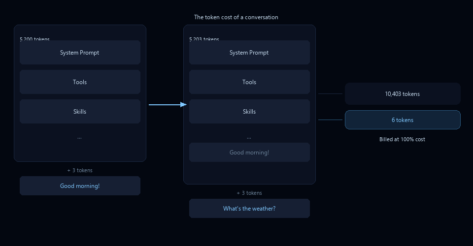
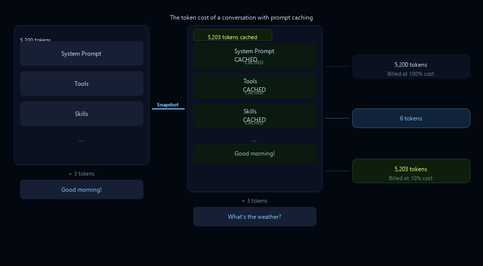
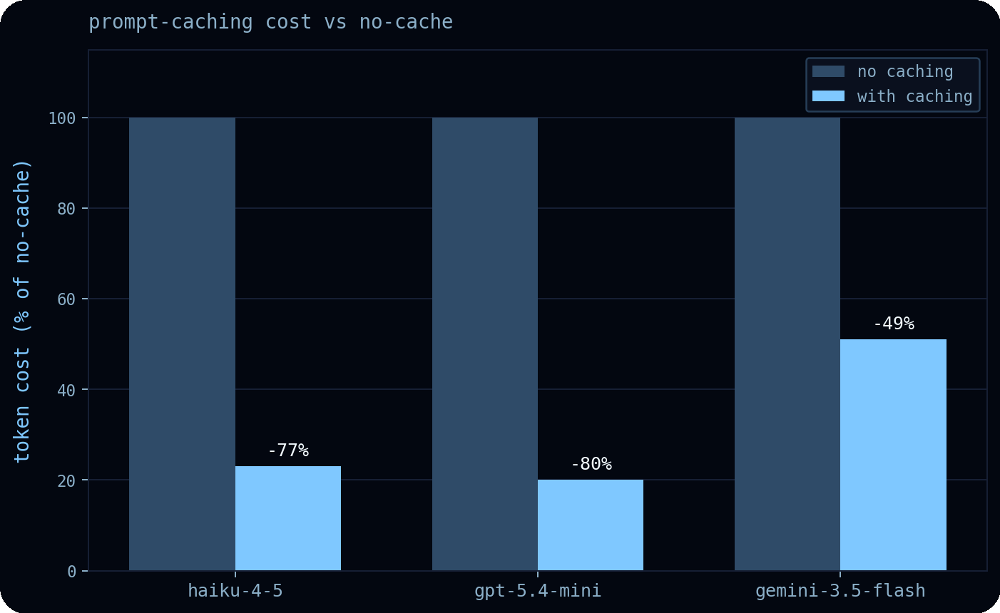
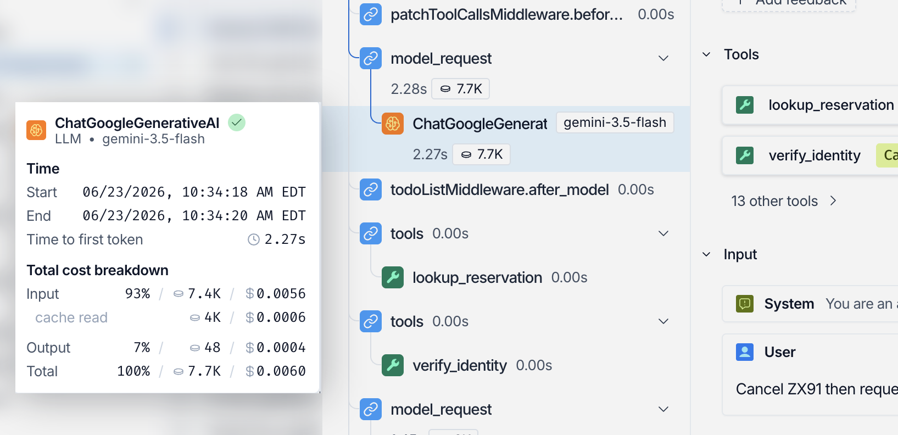

<div style="background:#e8f4fd;padding:14px 16px 10px 16px;border-radius:6px;margin-bottom:18px;">
<div style="text-align:center;margin-bottom:10px;">
<strong style="font-size:16px;color:#1a6ba0;">要点速览</strong>
</div>
<div style="font-size:14px;color:#3f3f3f;line-height:1.75;">
- <strong>Prompt Caching 省 49-80% 成本</strong>：在 claude-haiku-4-5（-77%）、gpt-5.4-mini（-80%）、gemini-3.5-flash（-49%）三个中端模型上实测验证<br><br>
- <strong>跨厂商自动适配</strong>：Deep Agents 编排层自动检测模型提供商，支持显式断点（Anthropic/Gemini）、隐式缓存（OpenAI）、路由键等差异化策略<br><br>
- <strong>单一指标决定一切</strong>：Manus AI 指出 KV-cache 命中率是生产级 AI Agent 最重要的单一指标<br><br>
- <strong>对话越长收益越大</strong>：缓存前缀跨轮复用，长时间运行的任务受益最多
</div>
</div>

**Prompt Caching 把推理成本砍掉 80% 的同时，还能保持相同的响应质量：这不是魔法，是所有主流模型提供商都已经支持的功能。问题在于，每家支持的缓存策略都不一样。**

如果你在 Anthropic 上设了显式断点，切到 OpenAI 就不工作了。反过来，OpenAI 的自动前缀缓存搬到 Fireworks 上也没有效果。

**LangChain 的 Deep Agents 编排层给出了一个跨厂商统一的方案**：自动检测当前模型提供商，选择合适的缓存策略，最大化跨轮对话的缓存命中率。从实测数据看，这在中端模型上能节省 49-80% 的 Token 成本。

在规模化运行 Agent 时一个强大的降本杠杆是 **Prompt Caching**，这是模型提供商提供的一项功能，可将推理的 Token 成本降低 41-80%。正如 Manus AI 所说：

> 如果只能选一个指标，我会说 KV-cache 命中率是生产级 AI Agent 最重要的单一指标。

然而，不同模型提供商对缓存控制的支持策略各不相同，这使得跨厂商的通用缓存方案成为一个棘手的问题。

**Deep Agents 是 LangChain 的通用、模型无关的 Agent 编排层**，支持所有主流提供商的 Prompt Caching 功能。下面深入探讨 Deep Agents 如何利用 Prompt Caching 来降低 API 成本。

**聊天模型对话的 Token 成本增长很快。** 每条新消息，模型都必须重新处理对话中的每一个历史 Token。下图展示了没有缓存时的对话成本：每次轮次都要重算全部上下文。


<span style="font-size:12px;color:rgb(153,153,153);">无缓存时，每轮对话的 Token 成本由全部历史上下文决定</span>

**启用 Prompt Caching 后，提供商会存储模型在处理完提示词后的状态快照。** 下一次请求时，模型从该快照恢复，只处理新的文本。


<span style="font-size:12px;color:rgb(153,153,153);">启用 Prompt Caching 后，缓存部分只计 10% 成本，仅新 Token 按全价计费</span>

然而，加载新的技能或工具可能会修改对话中**较早**的提示词，可能导致缓存失效。部分提供商允许在提示词中较早位置添加显式缓存断点，这样可以在提示词的子集上实现缓存命中，而不是完全缓存失效。但并非所有提供商都支持显式缓存断点：

|  | Anthropic | OpenAI | Gemini | AWS Bedrock | Fireworks |
|---|-----------|--------|--------|-------------|----------|
| 显式断点 | ✅ | ❌ | ✅ | 视提供商而定 | ❌ |

**显式缓存只是 Prompt Caching 的一个特性，各提供商的支持情况也不相同。** 可配置 TTL、缓存预热、路由键：每家支持的组合都不同。

|  | Anthropic | OpenAI | Gemini | AWS Bedrock | Fireworks |
|---|-----------|--------|--------|-------------|----------|
| 显式断点 | ✅ | ❌ | ✅ | 视提供商而定 | ❌ |
| 可配置 TTL | ✅ | 视模型而定 | ✅ | 视提供商而定 | ❌ |
| 缓存预热 | ✅ | ❌ | ❌ | Anthropic | ❌ |
| 路由键 | ❌ | ✅ | ❌ | OpenAI | ✅ |

提示缓存功能支持的格局变化很快。各提供商不同的实现和功能支持，使得跨厂商实现最高成本节省成为一个挑战。

## Deep Agents 的跨厂商解决方案

Deep Agents 编排层通过以下方式自动利用 Prompt Caching 功能：

1. **在支持时设置显式缓存断点**
2. **在不支持显式断点时启用提供商端的隐式缓存**
3. **结构化提示词以最大化缓存读取**

这些策略支持**所有主流提供商**，因此你可以随时切换提供商，仍然获得最大的 Token 节省。为利用特定提供商的功能，编排层会检测当前模型的提供商，并将缓存委托给特定于提供商的中间件。

```javascript
// 使用 Deep Agents 免费获得 Prompt Caching
const agent = createDeepAgent({ model: 'gpt-5.5' });

// 在 LangChain 中，通过中间件启用：
const agent = createAgent({
  model: 'claude-haiku-4-5-20251001',
  middleware: [anthropicPromptCachingMiddleware()],
});
```

**Deep Agents 编排层还会结构化你的提示词和显式缓存点，以最小化缓存退化。** 理想情况下，模型调用中的静态前缀（工具描述、技能、系统提示词）应保持不变。但当更新记忆或压缩对话时，它**可能**发生变化，导致缓存失效。

**Deep Agents 的思路是结构化你的提示词和显式缓存点来最小化影响范围**：例如，如果记忆被更新，你仍然可以在提示词的子集上获得缓存读取。这不是完全避免缓存失效（那不可能），而是把失效的「爆炸半径」控制到最小。

## 真实成本节省

功能表告诉我们什么是可能的。为了看看 Prompt Caching 实际能节省多少，Deep Agents 团队在三个中端模型上运行了评测套件：`claude-haiku-4-5`、`gpt-5.4-mini` 和 `gemini-3.5-flash`。结果令人印象深刻。


<span style="font-size:12px;color:rgb(153,153,153);">三类模型在 Agent 轨迹上的 Prompt Caching 节省比例实测数据</span>

- `claude-haiku-4-5`：**-77%**。利用 Anthropic 的显式断点，保持提示词中很大一部分被缓存，显著降低了每次请求的 Token 成本
- `gpt-5.4-mini`：**-80%**。OpenAI 的自动最长前缀缓存带来了 80% 的成本降低
- `gemini-3.5-flash`：**-49%**。Gemini 的隐式缓存不提供明确的节省保证，但仍然有可观的效果

**缓存对长对话的回报更大。** 缓存的前缀在每一轮对话中被复用，因此长时间运行的任务受益最多。

## LangSmith 的可观测性

Prompt Caching 的成本节省只有在你能够衡量它们时才真正有价值。**LangSmith 在单次调用和单次轨迹层面提供了 API 成本、缓存读取和 Token 使用情况的可视性。**


<span style="font-size:12px;color:rgb(153,153,153);">LangSmith 提供每轮调用的缓存命中数据与成本分析</span>

对于每次调用，你可以获得首 Token 时间、总输入 Token 数、缓存读取 Token 数和总输出 Token 数，汇总到单次轨迹的聚合数据中。由于缓存读取被单独列出，你可以确切地看到每次提示中有多少来自缓存而不是被重新处理。

LangSmith 也是本文数据的来源：对每个 Agent 配置运行 Deep Agents 评测套件 → 在 LangSmith 仪表盘中检查轨迹数据 → 通过 SDK 拉取运行数据 → 在 Jupyter Notebook 中计算各提供商的成本差异。

**LangSmith 让我们能够区分来自缓存、轨迹长度和更便宜轮次的节省，这可以指导我们如何优化 Agent。**

## 接下来的方向

模型提供商尚未就 Prompt Caching 的通用功能集达成一致。显式断点推动了上述部分节省，但只是开始。**缓存预热、路由键、可配置 TTL：这些功能有望解锁进一步的成本和延迟优势。**

现在你可以通过使用 `createDeepAgent` 来利用当前支持的功能，无需额外配置。随着模型提供商添加更多功能支持，LangChain 表示将继续将它们整合到现有编排层中。

<div style="background:#f5f0eb;padding:14px 16px 10px 16px;border-radius:6px;margin-bottom:16px;">
<div style="text-align:center;margin-bottom:8px;">
<strong style="font-size:15px;color:#8b6f4c;">结语</strong>
</div>
<div style="font-size:14px;color:#3f3f3f;line-height:1.75;">
这篇文章出自 LangChain 官方博客，本质上是一篇产品推介，但数据的含金量很高。77% 和 80% 的节省来自显式断点和自动前缀缓存这两种完全不同的机制，且在同一套评测基准上测得，这个对比本身就很有参考价值。<br><br>
跨厂商的缓存适配是个典型的「中间层机会」问题：每家的实现都不同，但如果有一层帮你自动适配，用户就不用操心。Deep Agents 做的正是这件事，而 LangSmith 的可观测性则确保你不会盲目相信省钱数字：能看到就是能管理。<br><br>
如果你的 Agent 已经在生产中跑长对话，且用单一模型提供商，大概率已经在享受部分缓存收益了。真正的价值在于：当你想切模型或混合使用时，缓存策略不需要重写。
</div>
</div>

---

<span style="font-size:12px;color:#888888;font-family:'Courier New',monospace;">参考：

https://www.langchain.com/blog/deep-agents-prompt-caching</span>
