

<strong style="font-size:16px;color:#1a6ba0;">要点速览</strong>

- <strong>DeepSeek 的战略不是卖模型，而是催生中国 AI 硬件生态</strong>：通过 KV Cache 压缩、MoE、MLA 等创新降低对 HBM 和高端 GPU 的依赖，为国产存储（YMTC、CXMT）和 ASIC 创造市场  
- <strong>KV Cache 压缩是核心杠杆</strong>：V4 Pro 在 1M 上下文仅需 5.48GB HBM（GLM5 需 60GB，Qwen3 需 89GB），使 SSD 卸载长时缓存成为经济可行的方案  
- <strong>用股权合作的模式实现千亿美元估值</strong>：效仿 OpenAI-AMD 的认股权证模式，与国产存储、ASIC、网络设备商深度绑定，在10万亿的中国 AI 硬件产业中分得一杯羹

---

DeepSeek 至今没有 coding plan，没有多模态模型，没有语音和视频产品，连 Agent Harness 都还在招聘中。他们还坚持长期开源、乐于共享秘方。即将拿到 100 亿美元融资的 DeepSeek，是在烧钱还是另有棋局？

**答案是后者。这是一盘价值10万亿美元的棋局。**

本文作者以\"英雄之旅\"的叙事框架梳理了 DeepSeek 自 2024 年以来的所有关键创新，并推导出这家公司真正的终极目标：不是卖模型或 API，而是赋能一个中国自主的 AI 硬件生态系统，同时为自己实现 10 万亿美元估值。

## KV Cache 压缩：小到可以上 SSD

理解 DeepSeek 战略的起点是一组数字。在 1M 上下文长度下：

- **DeepSeek V4 Pro 仅需 5.48GB HBM**
- GLM5 需要 60GB HBM（已使用 DeepSeek 的 MLA 和 DSA）
- Qwen3-235B-A22B 需要 89GB HBM（使用 GQA 注意力）

注意 V4 Pro 是 1.6T 参数的模型，是三者中最大的。它的 KV Cache 却只有 GLM5 的 1/11、Qwen3 的 1/16。

1M 上下文下三款模型的 KV Cache 内存占用对比：DeepSeek V4 5.48GB vs GLM5 60GB vs Qwen3 89GB

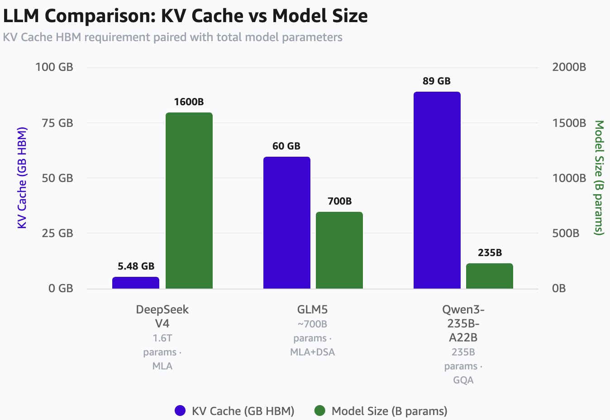

**极小的 KV Cache（且是无损压缩）让长时缓存可以卸载到 SSD 并经济高效地重新加载。** DeepSeek 的缓存命中价格不到 Sonnet 4.6 的 3%，还能保持数小时。这降低了对中国 AI 硬件产业最稀缺、最难制造的 HBM 的需求。

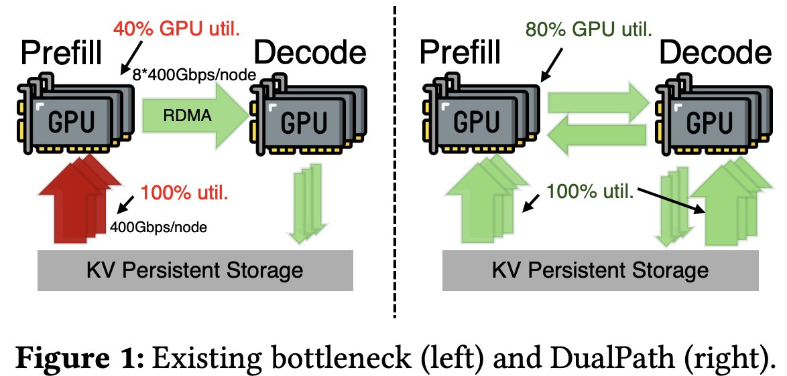

## 被低估的受益者：存储芯片

**谁在大量供应 SSD？YMTC（长江存储）正在崛起为 3D NAND 巨头。** NAND 让 DeepSeek 避免重新计算 KV，而 DeepSeek 又为 NAND 和 SSD 创造了巨大的增量市场：不仅属于 YMTC，还包括全球所有 NAND 厂商。

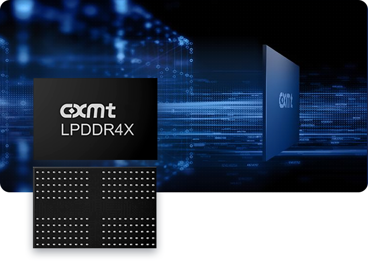

不止是 NAND。LPDDR 内存有潜力成为存放模型权重的地方，按需流式传输到 HBM，进一步减轻 HBM 的压力。SGLang 团队已有详细的研究。**DeepSeek 的 MoE 架构（大量专家 + 4-bit 权重）天然适合这一方案。**

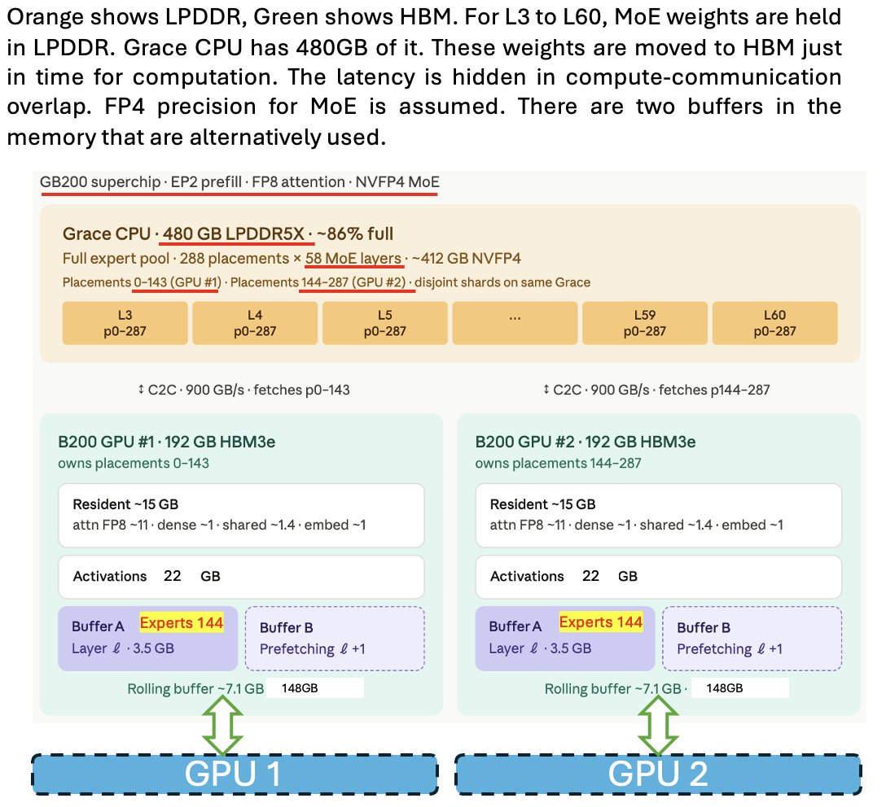

**中国做 LPDDR 的是 CXMT（长鑫存储），速度仅落后 0.5 代、密度落后 1 代。** 加上充足的国产 NAND，中国 AI 硬件生态在存储侧并不遥远。

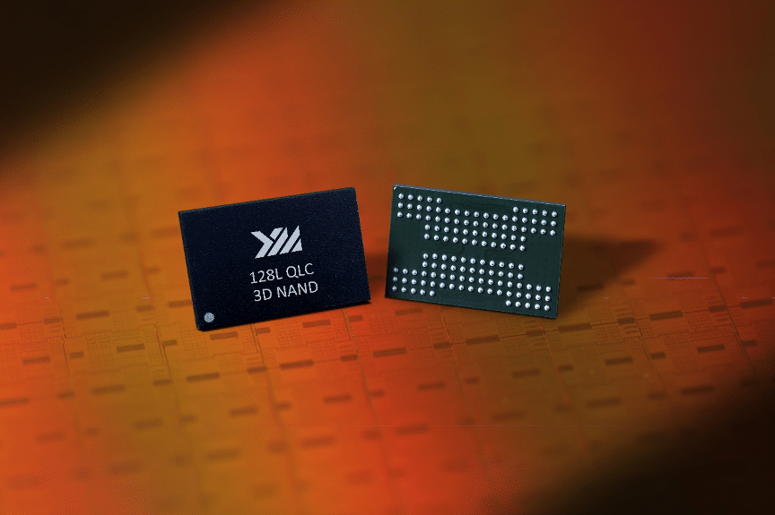

## Engram：用记忆换计算

LPDDR 还可以存放另一种东西：Engram。DeepSeek 的 Engram 论文将经典 N-gram 嵌入现代化为 O(1) 哈希查找，创建了一种称为\"条件记忆\"的互补稀疏轴。**这是一种经典的内存-计算置换：一次 LPDDR 查找的代价远低于 Transformer 层的前向传播，在大规模部署下这一置换极为有利。**

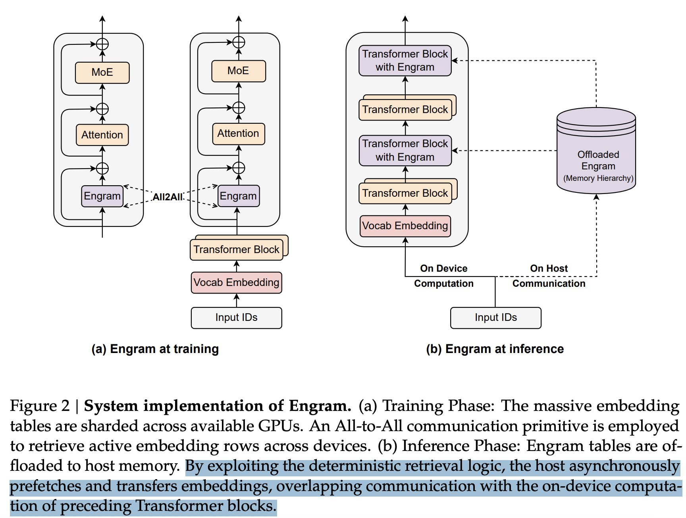

中国 GPU 和 ASIC 因缺乏 EUV 光刻机，晶体管密度永远落后西方，封装技术也有差距。**在这样的硬件约束下，用丰富的存储换稀缺的计算是一种极其理性的选择。**

## 七大创新的逻辑链

DeepSeek 的每一项创新都有明确的指向性，七项组合在一起勾勒出完整的战略版图：

**1. MoE + MLA（DeepSeek V2，2024年5月）**：MoE 用少 40-50% 的计算训练出高智能模型；MLA 将 KV Cache 减少 90%。这两项是后续一切创新的基础。

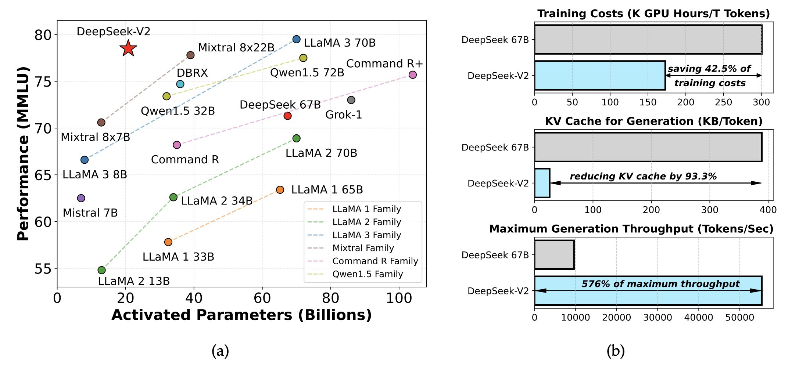

**2. DSA（DeepSeek V3.2 Exp）**：专为长上下文设计的注意力机制，处理时间随上下文增长保持平稳，不线性增加。

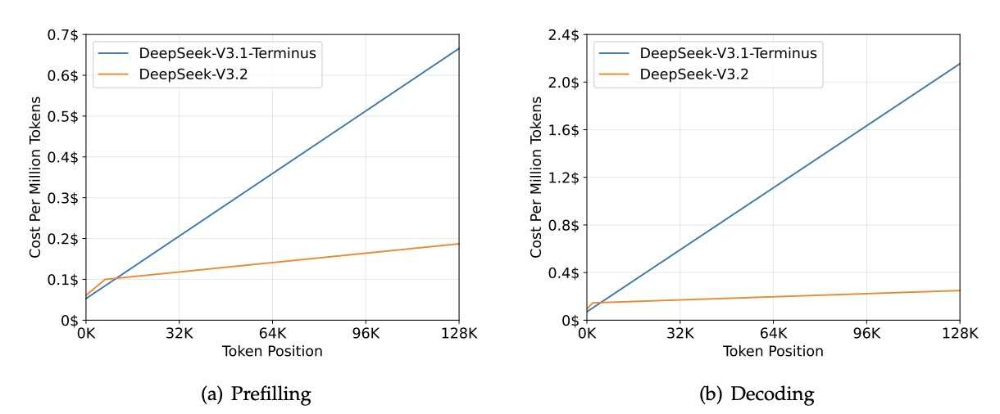

**3. mHC（2025年12月）**：用多平行信息高速公路替代标准残差连接，通过双随机约束保证信号在深度网络中不被放大或衰减。27B 参数下各项基准提升显著（BBH +7.2，DROP +3.2）。计算开销仅 6.7%。

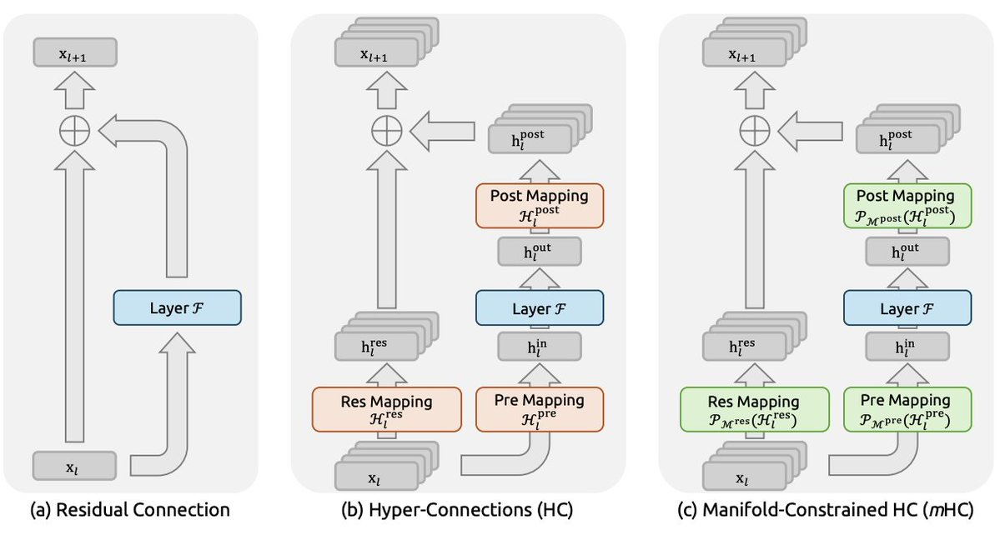

**4. CSA / HSA（DeepSeek V4，2026年4月）**：KV 需求再降 90%，同时大幅减少 FLOPs。

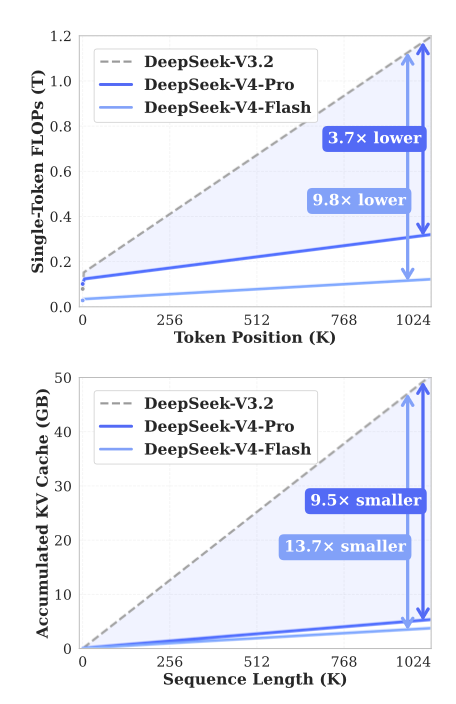

**5. Engram（2026年Q1）**：用 LPDDR 记忆换计算。

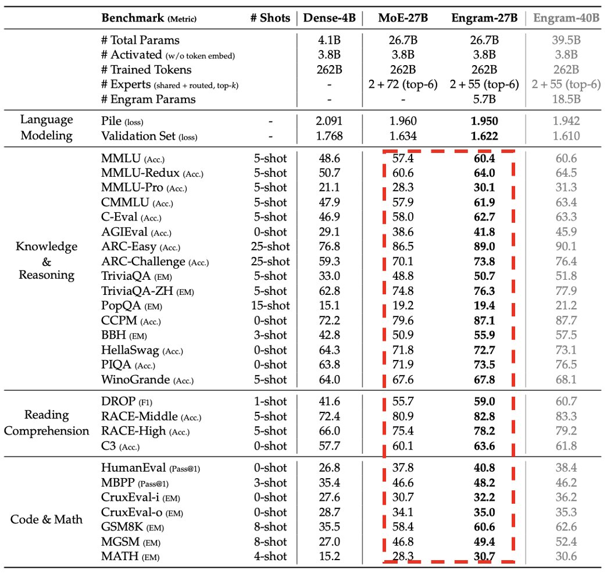

**6. 计算通信重叠与 Dual Path**：DeepSeek 甚至在论文中直接为硬件厂商提供 ASIC 设计建议。

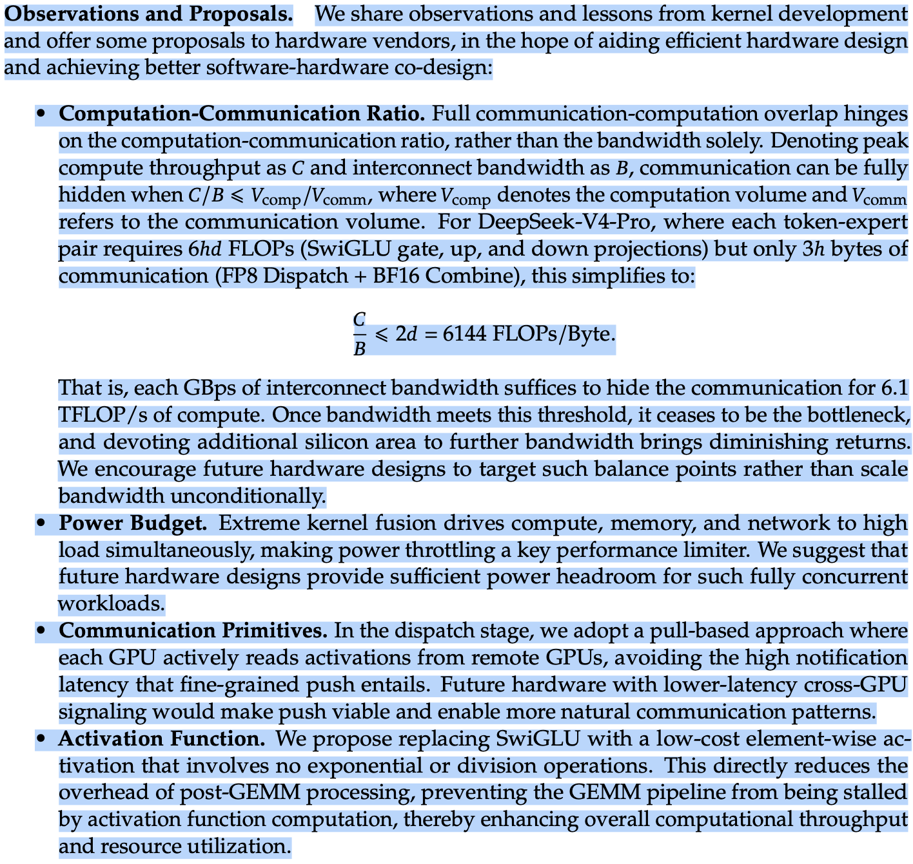

**7. TileLang**：一次编写 Kernel，多硬件平台运行，间接打破 CUDA 护城河。**这不止解决了 DeepSeek 自身的算力瓶颈，是在为整个中国硬件生态扫清软件障碍。**

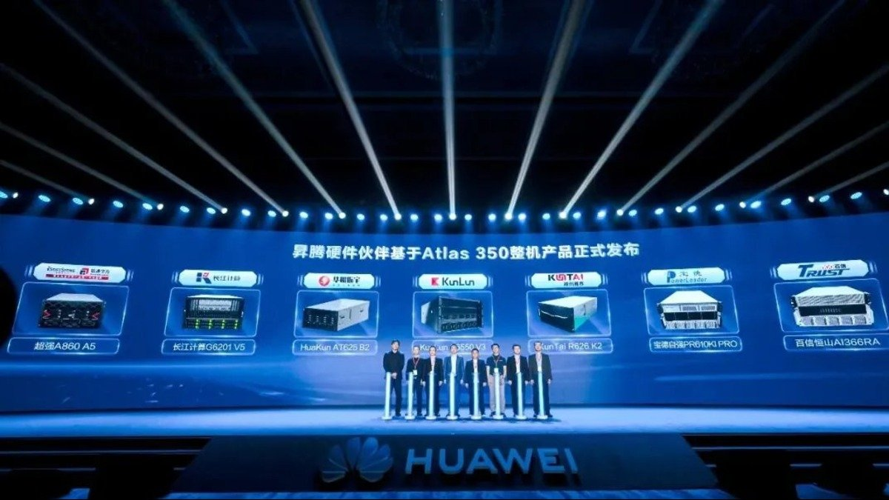

## DeepSeek 今天做的，行业明天抄

DeepSeek 的 MoE、MLA、DSA 已经被全球和中国 AI 实验室广泛采纳。ZAI（GLM 系）使用 MLA 和 DSA。Kimi（Moonshot）明确表示架构基于 DeepSeek。作为回馈，DeepSeek 使用 Moonshot 首次大规模应用的 Muon 优化器。

## 如何赚钱：学 OpenAI，但放大到全生态

OpenAI 与 AMD 的交易提供了一个有趣的参考模型：OpenAI 以低价获得 AMD 和 Cerebras 的认股权证，基于消费里程碑分期兑现。**AMD 向 OpenAI 发行了最多 1.6 亿股普通股的权证，与部署规模和股价挂钩。**

AMD-OpenAI 战略性合作伙伴关系公告中关于认股权证的条款

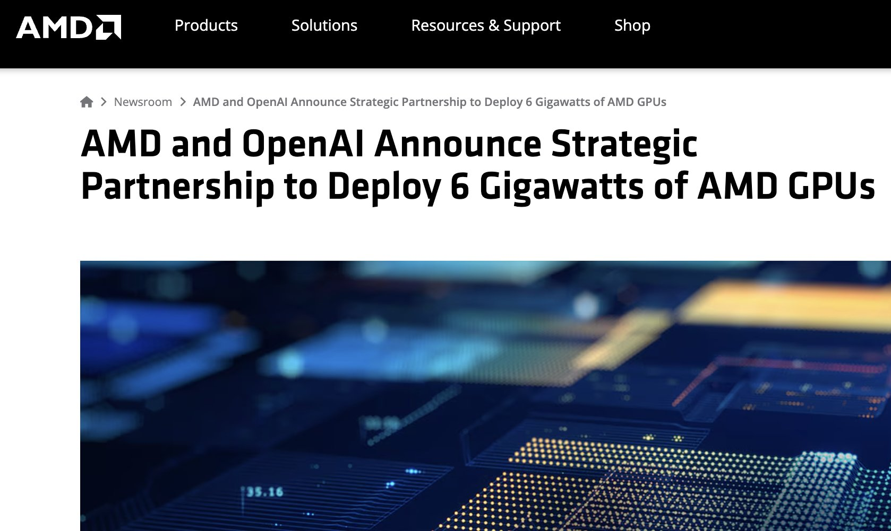

**作者的判断是，DeepSeek 将与多家中国存储、ASIC、CPU 和网络设备厂商签署类似的股权绑定协议。** 通过紧密合作使它们的硬件栈适配领先 AI 工作负载，同时通过股权分享产业增长红利。

西方 AI 相关股票的合计估值远超 10 万亿美元。中国至今没有对等的硬件生态。如果 DeepSeek 能帮助缔造这个生态，他们在其中的份额，结合股权合作：足以实现自身 1 0万亿美元估值。

<strong style="font-size:15px;color:#8b6f4c;">结语</strong>

本文提供了一个统一的叙事框架，把 DeepSeek 从 MoE 到 TileLang 的创新串成了一条逻辑链。最有意思的洞察不是\"DeepSeek 在做硬件\"（这已经是共识了），而是\"每一项创新的第一性原理都是在有限的硬件条件下最大化可用资源\"：用更少的计算实现相同智能，用更丰富的存储替代稀缺的计算。  
但这里有一个值得追问的问题：如果 DeepSeek 的成功依赖于国产硬件生态的同步成熟（YMTC、CXMT、国产 ASIC 的制程突破），那么这份宏图的时间线就不仅由 DeepSeek 决定。这是一个需要整个产业共同跳级才能兑现的愿景。

---
参考：

https://x.com/bookwormengr/status/2057909493250539891
