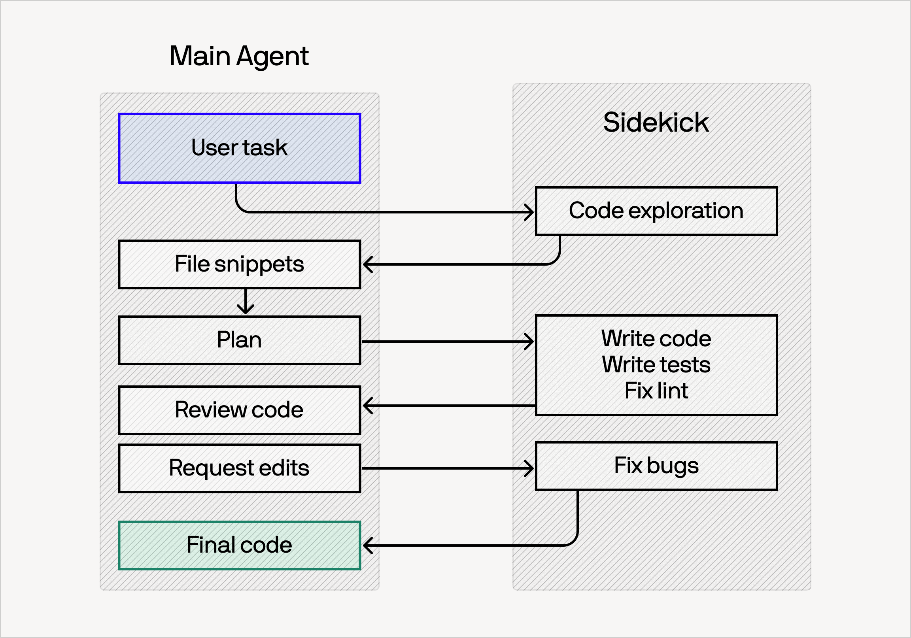

<strong style="font-size:16px;color:#1a6ba0;">要点速览</strong>

- <strong>Devin Fusion 是什么</strong>：Cognition 发布的多模型编排框架，运行两个并行 Agent（前沿模型 + 低成本 Sidekick），在 FrontierCode 基准上以 35% 低成本维持前沿性能  
- <strong>核心创新一：Sidekick</strong>：主 Agent 只做关键决策（计划、歧义解释、最终审查），常规工作委派给 Sidekick。两个模型各自维护持久化缓存上下文，避免模型切换时的缓存未命中代价  
- <strong>核心创新二：动态会话中路由</strong>：在上下文压缩（cache miss 不可避免时）切换模型，实现"免费"模型切换。甚至可以在不回到主模型的情况下升级 Sidekick 模型  
- <strong>实际效果</strong>：Cognition 内部 88% 的合并 PR 完全由自动化 Fusion 路由器驱动。使用单一模型做所有事情的时代正在结束

工程团队正在把钱烧掉。**对每个任务都使用最昂贵的模型已经不再可持续，但现有模型混用工具往往在基准测试上漂亮、实际写代码时一塌糊涂。** Cognition 今天发布了 Devin Fusion：一种新型多模型编排框架，在 FrontierCode 基准上以前沿模型 **35% 的低成本维持同等性能**，接入 Fable 5 后这一数字进一步达到 41%。

这个问题的本质是一个成本悖论：你需要前沿模型的判断力来处理复杂任务，但你的大部分工作并不需要前沿模型。问题在于，什么时候用贵的、什么时候用便宜的？现有方案要么提前路由（提示不足以判断难度），要么逐任务切换（缓存无法共享，切换代价极高）。

**Devin Fusion 用两个关键设计解决了这个悖论：Sidekick 并行 Agent 和动态会话中路由。**

## 诀窍：Sidekick

核心架构是运行两个并行的 Agent：一个装备前沿模型执行关键判断，另一个用更具成本效益的"Sidekick"模型处理常规工作。**两者都是功能完备的 Agent，拥有自己的工具集和持久化缓存上下文。这意味着来回切换时不会丢失已缓存的上下文。**

随着任务推进，主 Agent 决定哪些交给 Sidekick，哪些自己做。但 Cognition 在实践中发现，**主 Agent 的最佳策略是"少做多看"**：只做计划、歧义解释和最终审查，其余全部委派和监控。

Sidekick 架构：前沿主 Agent 与低成本 Sidekick Agent 并行运行，各自维护独立缓存上下文

这个方法解决了基础模型路由的三个核心问题：

**保留真正的前沿智能，而非基准测试分数。** 路由器经常过拟合特定基准，但通过保留前沿模型在组合中，Sidekick 让系统继续受益于前沿模型的创造力和泛化能力。

**能泛化到单提示任务之外。** 模型路由器通常为整个任务绑定一个模型。但提示往往不足以判断难度，用户可能提出简单的初始问题然后跟一个困难的后续。Sidekick 的动态切换机制让系统能应对这种不确定性。

**避免模型间路由的昂贵缓存未命中。** 之前的一些方案（如 Smart Friend、Anthropic's Advisor）的核心是让模型用工具查询另一个模型。但每次调用时上下文不以可缓存方式共享，代价极高。Sidekick 中两个模型各自维护独立持久化缓存，切换不丢失缓存状态。

### Sidekick 随模型变强而更好

一个有意思的发现：**越聪明的模型在 Sidekick 中表现越好。** Fable 5 在 Sidekick 中的成本节约达 41%，而 Opus/GPT-5.5 级别为 35%。Fable 更智能地委派工作、更高效地请求上下文、更精确地规划，Sidekick 模式让这些优势放大而非缩小。这表明 Sidekick 不是模型不够好时的权宜之计，而是一个随着基础模型变强会越来越有价值的架构模式。

## 动态会话中路由

Sidekick 解决的是"谁来做"，但还需要解决"用什么模型做"。不同任务类型和复杂程度需要不同的模型搭配。**Cognition 的做法是在上下文压缩期间切换模型：因为压缩本身就会触发缓存未命中，模型切换等于是"免费"的。**

关键在于时机选择：每次触发上下文压缩，系统评估当前情况，决定是否切换负责的模型。这意味着甚至可以在不回到主模型的情况下"升级"Sidekick 模型，且没有任何额外的缓存惩罚。

## 结果与合理性检查

Devin Fusion 在 FrontierCode 基准上的表现：

| 配置 | 评分 | 平均成本/任务 |
|------|------|-------------|
| Fusion + Fable 5 | 57.6 | $3.00 |
| Fable 5 (medium) | 57.0 | $5.12 |
| Opus 4.8 (high) | 48.8 | $3.24 |
| Fusion | 47.9 | $2.38 |
| GPT-5.5 (high) | 44.8 | $3.64 |

**Fusion + Fable 5 以最低成本（$3.00）获得了最高评分（57.6），比纯 Fable 5 便宜 41%。** 即使没有 Fable，纯 Fusion 也比 GPT-5.5 和 Opus 4.8 更便宜、得分更高。

但 Cognition 最引以为豪的数据不在基准测试里：**为内部用户启用 Fusion 后，88% 的合并 PR 完全由自动化 Fusion 路由器驱动**。这意味着团队在真实开发中几乎从来不觉得需要人工覆盖路由器的模型选择：路由器自主判断什么时候该用贵的、什么时候用便宜的，开发者信任它的判断。

## 混合模型编排的必然性

**使用单一模型完成所有工作的时代即将结束。** 前沿智能的成本在持续攀升，同时次前沿模型在正确提示下已经能胜任绝大部分工程工作。你不会开兰博基尼去杂货店，那为什么用能发现零日漏洞的模型去做圆角按钮？

更重要的是，不同模型有各自的相对优势。Cognition 发现某些模型特别擅长 UI 测试，而另一些擅长识别 PR 中的复杂 bug。随着开源模型生态的丰富和针对特定语言/任务/库的专精模型出现，**多模型编排能力将成为 Agent 基础设施的核心组件，而不是可选的优化手段。**

---

<strong style="font-size:15px;color:#8b6f4c;">结语</strong>

Devin Fusion 有意思的地方不在于它发明了"多模型"：这条赛道已经够挤了。它的真正贡献在于把模型路由从"选择"问题变成了"编排"问题。提前选择哪个模型不够好，因为你不知道任务的难度曲线；在每个点做调用级别路由也不够好，因为缓存代价太贵。Sidekick + 动态会话中路由的组合，是让系统在"不知道下个任务多难"的前提下仍能高效运作：该框架把模型切换的成本结构从 O(n) 降到 O(1)。  
另外值得注意的一点是，Fable 5 在 Sidekick 中表现更好这一发现，暗示了模型评估的一个盲点：当前基准测试几乎都是单模型场景，但未来 Agent 的工作模式越来越可能是多模型协作。一个在单模型基准上评分一般的模型，在 Sidekick 中可能因为委派能力和协作效率而表现异常出色。这可能是 Agent 时代需要的新评估维度。

---

参考：

https://cognition.com/blog/devin-fusion
