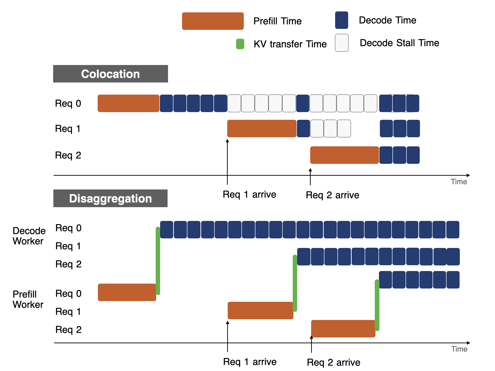
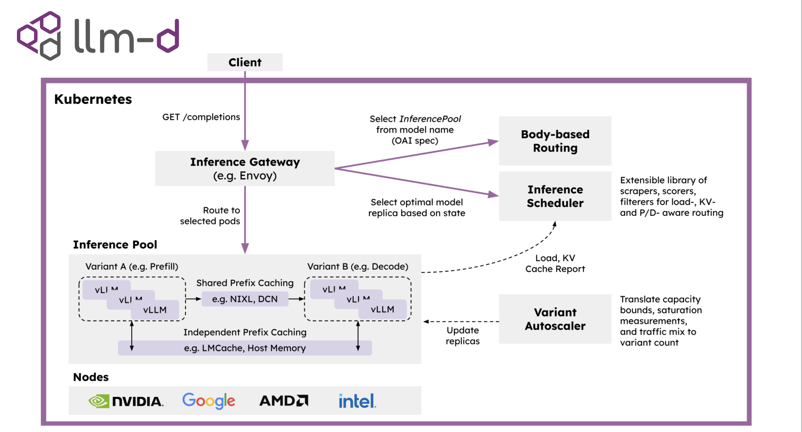
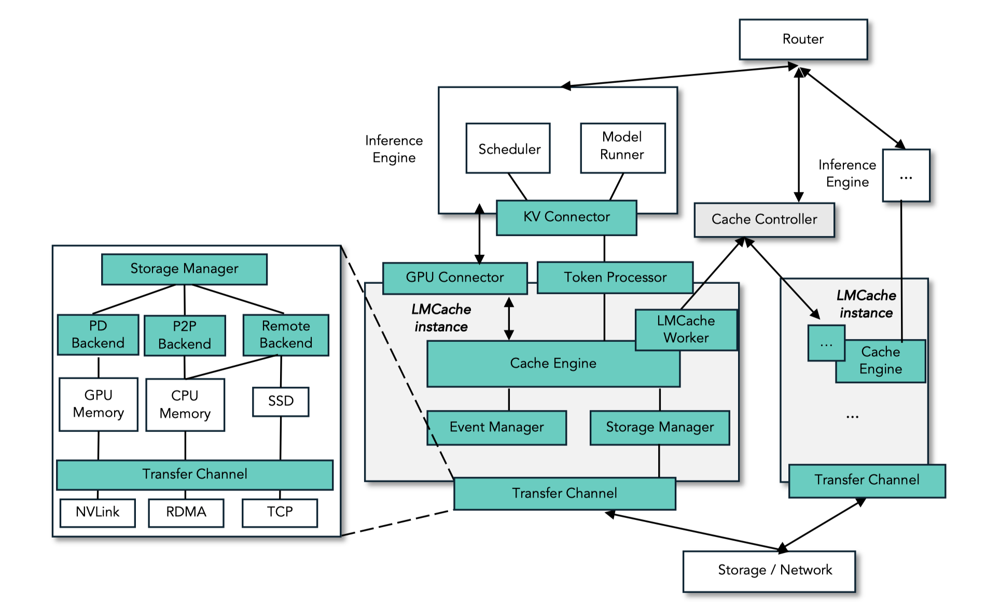
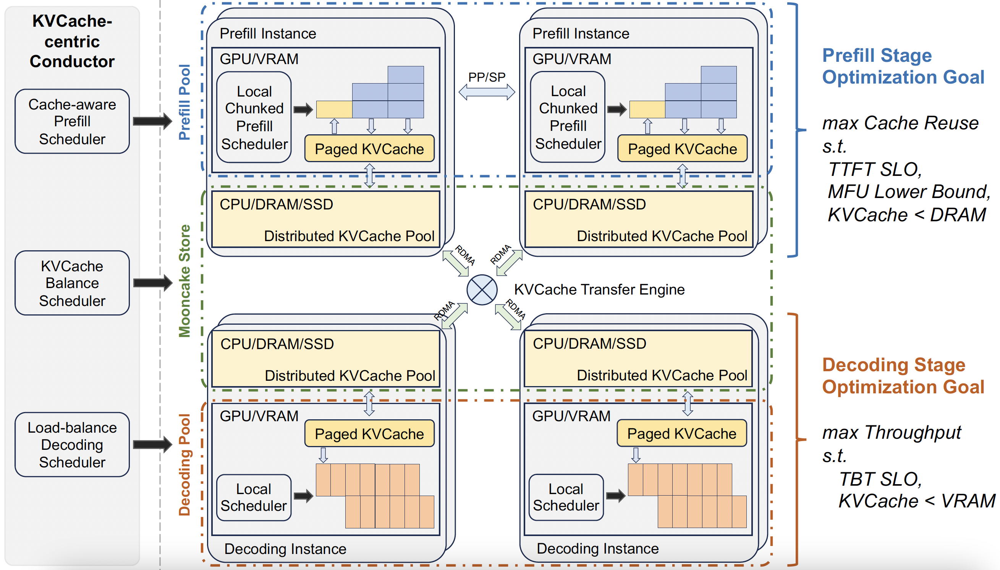
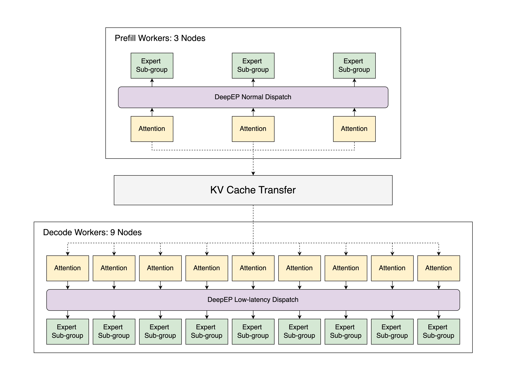

<strong style="font-size:16px;color:#1a6ba0;">要点速览</strong>

- <strong>DistServe 的 18 个月回顾</strong>：Hao AI Lab 回顾了他们 2024 年提出的 Prefill-Decode 分离推理架构如何从学术原型变成行业标准：NVIDIA Dynamo、SGLang、vLLM、DeepSeek 全部采用  
- <strong>两条核心优势</strong>：消除 prefill 和 decode 之间的相互干扰（burst 下 decode 延迟激增 2-30x），解耦资源分配（各自独立扩缩容，不对 TTFT/TPOT 做 tradeoff）  
- <strong>2025 年引爆的催化剂</strong>：企业大规模采用 LLM 后，延迟 SLO 变得比吞吐更重要；模型变大后必须跨数百 GPU 部署，分离架构的优势自然放大  
- <strong>下一前沿：Attention-FFN 分离（AFD）</strong>：既然 P/D 可以分离，A/F 为什么不行？MoE 模型的 all-to-all 通信模式让额外数据传输几乎免费

十八个月前，Hao AI Lab 提出了 DistServe，核心思想简单到只有一个动作：**把 LLM 推理拆成 prefill 和 decode 两阶段，让它们在不同计算池上独立扩缩容。** 今天，几乎所有生产级 LLM 推理框架：NVIDIA Dynamo、SGLang、vLLM、llm-d、Ray Serve LLM、LMCache、MoonCake，都运行在分离架构上。

这篇博客是原始设计者的实地报告。TTFT 和 TPOT 这两个现在每个推理基准都在用的延迟指标，也正是在分离架构的视角下被普及的。

分离架构工作原理：prefill 和 decode 分别运行在不同 GPU 池上

## 为什么 colocation 会失败？

在 DistServe 之前，几乎所有推理框架都将 prefill 和 decode 放在同一个 GPU 上。Continuous batching 把尽可能多的请求塞进一次迭代，跑一步，生成一个 token。

**但共存有两个根本缺陷：**

**干扰。** 当 prefill 和 decode 共享 GPU 时，一个大的 prefill 请求会让 decode 延迟暴增 2-30 倍。系统要么暂停正在进行的 decode 来优先处理 prefill，要么把 prefill 和 decode 一起 batch：无论哪种，decode 的 TPOT 都会剧烈抖动，在 burst 场景下尤其严重。

上：prefill（橙色）和 decode（蓝色）共存时产生干扰，decode 被阻塞。下：分离后两者互不干扰

**耦合扩缩容。** 生产环境中，TTFT 和 TPOT 是关键的用户面延迟 SLO。当 prefill 和 decode 共享 GPU 时，资源分配必须同时为两者的最坏情况做预算，导致严重的资源超配。

DistServe 的解决方案极其简单：把 prefill 和 decode 放到不同的 GPU 集合中，从根本上消除干扰；然后分别搜索最优配置（GPU 数量和并行策略），让各自独立满足 TTFT 和 TPOT 的 SLO。

## 为什么 2025 年爆发？

DistServe 在 2024 年被提出时遇到了不少反对意见：分离架构意味着需要重构现有推理系统，工程代价很大。整个 2024 年几乎没有广泛采用。

**但 2025 年形势骤变。** 原因有二：

**第一，企业大规模采用 LLM 后，延迟 SLO 成了业务生死线。** 当竞争对手在全力跑规模时，系统吞吐不再是唯一重要的指标。DistServe 精准解决了这个痛点：让 prefill 和 decode 的延迟可监控、可控制。

**第二，模型越来越大、流量越来越 burst，推理系统必须扩展到数百甚至数千 GPU。** 在这个规模下，分离架构真正发光：它可以独立分配资源给不同阶段，并与不同的并行策略（EP、DP、TP）有效配合。

更重要的是，分离架构意味着更可组合的系统。它解锁了整个推理栈每个组件的优化机会：KV cache 传输、网络通信、异构硬件适配。一个完整的新研究领域由此展开。

## 谁在用？几乎所有人

**NVIDIA Dynamo。** GTC 2025 上发布的 Dynamo 是分离推理最具代表性的生产级框架，在 GB200 NVL72 上创造了 SemiAnalysis InferenceMax 和 MLPerf 的 SOTA 成绩。它把 prefill worker 和 decode worker 作为一等公民，通过 KV-aware Router 连接，并配有 GPU Planner 自动扩缩容。

**SGLang 和 vLLM。** SGLang 在 96 张 H100 上用 PD 分离部署 DeepSeek-R1，达到了每节点 52.3k input TPS 和 22.3k output TPS：可能是第一个匹配 DeepSeek 官方博客数字的开源实现。vLLM 和 llm-d 的配合在 96-way EP 下达到每 H200 GPU 约 2k tokens/s。

llm-d 架构：Kubernetes 原生分离推理

**DeepSeek。**

**存储层。** LMCache（芝加哥大学）和 MoonCake（Kimi，FAST'25 最佳论文）已成为大规模 LLM 推理的标准 KV cache 存储后端。

LMCache：KV cache 存储与推理引擎解耦

MoonCake：KVCache 为中心的分离推理平台

DeepSeek-V3/R1 PD 分离参考架构（SGLang）

## Attention-FFN 分离：下一个前沿

如果你已经相信 P/D 分离，那 A/F 分离就是自然的下一步。理由很简单：decode 阶段，attention 是内存密集型（需要更多内存存 KV cache），FFN 是计算密集型（需要大量但恒定的内存存权重）。**把 attention 和 FFN 分到不同的硬件上，理论上可以让两者都达到高 MFU。**

过去 A/F 分离被认为不切实际：每层需要传输两次激活值，网络开销巨大。但 MoE 大模型（如 DeepSeek-R1、Qwen3-235B）的出现改变了局面。这些模型在 expert parallelism 下每个 decode step 已经有两轮 all-to-all 通信。**把 attention-FFN 的拆分对齐到已有的 all-to-all 模式，额外数据传输几乎免费。**

当然，这个思路目前只在 MoE 模型上验证有效。密集模型仍然是开放挑战：通信开销更高，很难做计算通信重叠。

---

<emphasis style="font-size:15px;color:#8b6f4c;">结语</emphasis>

这可能是 2025 年最值得读的推理系统博客之一。它不是一篇论文，而是原始设计者亲眼看到自己的 idea 从被质疑到成为行业标准的过程记录。这种"从学术原型到 NVIDIA 硬件架构"的路径，在 AI 基础设施领域并不常见：DistServe 做到了。  
注意一个细节：TTFT 和 TPOT 这两个指标之所以普及，不是因为它们客观存在，而是因为**分离架构需要新的评估维度。** 当 prefill 和 decode 不在同一个 GPU 上时，你自然需要分开测量。这暗示了一个更普遍的道理：好的架构不仅解决问题，还会创造新的语言来描述问题。

---

参考：

https://haoailab.com/blogs/distserve-retro/
