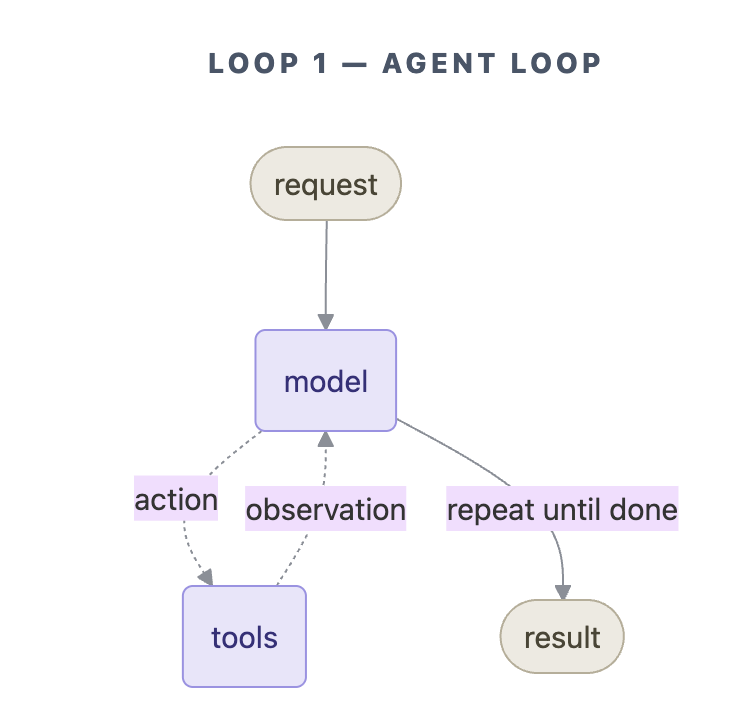
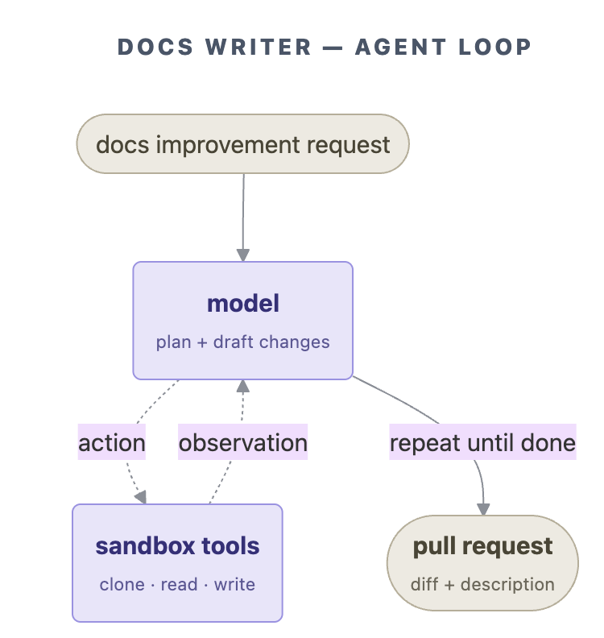
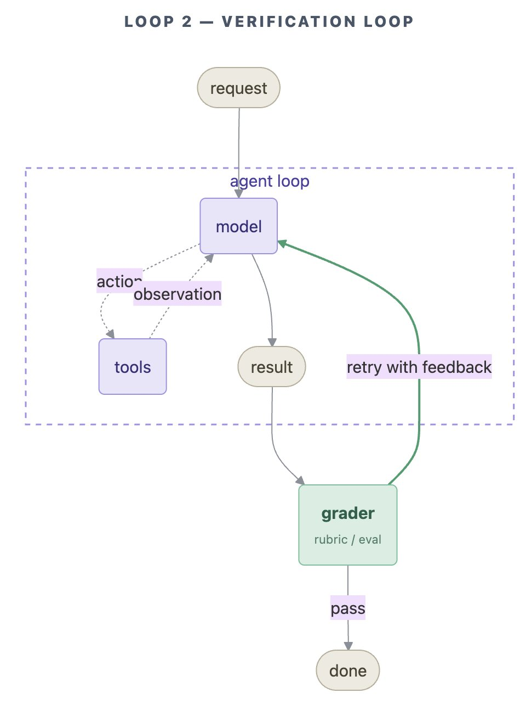
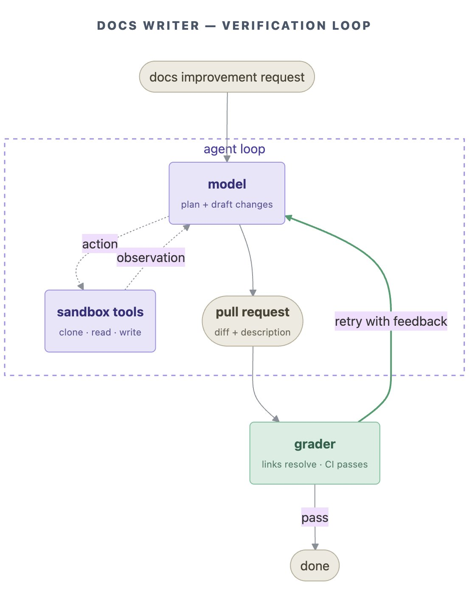
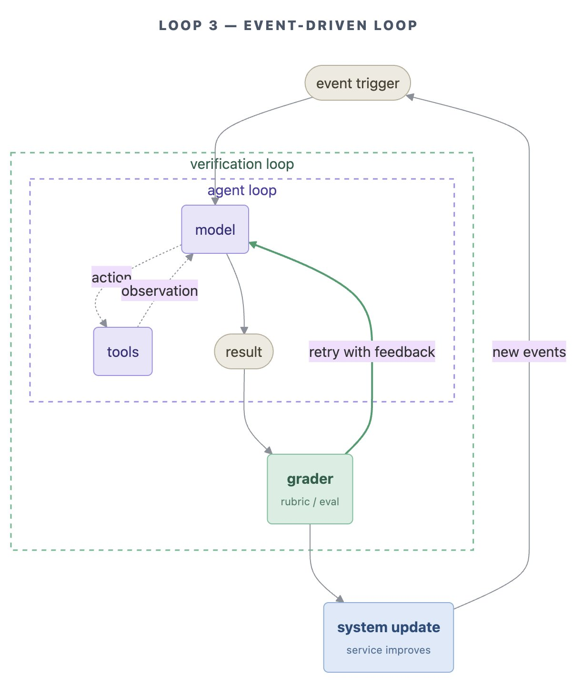
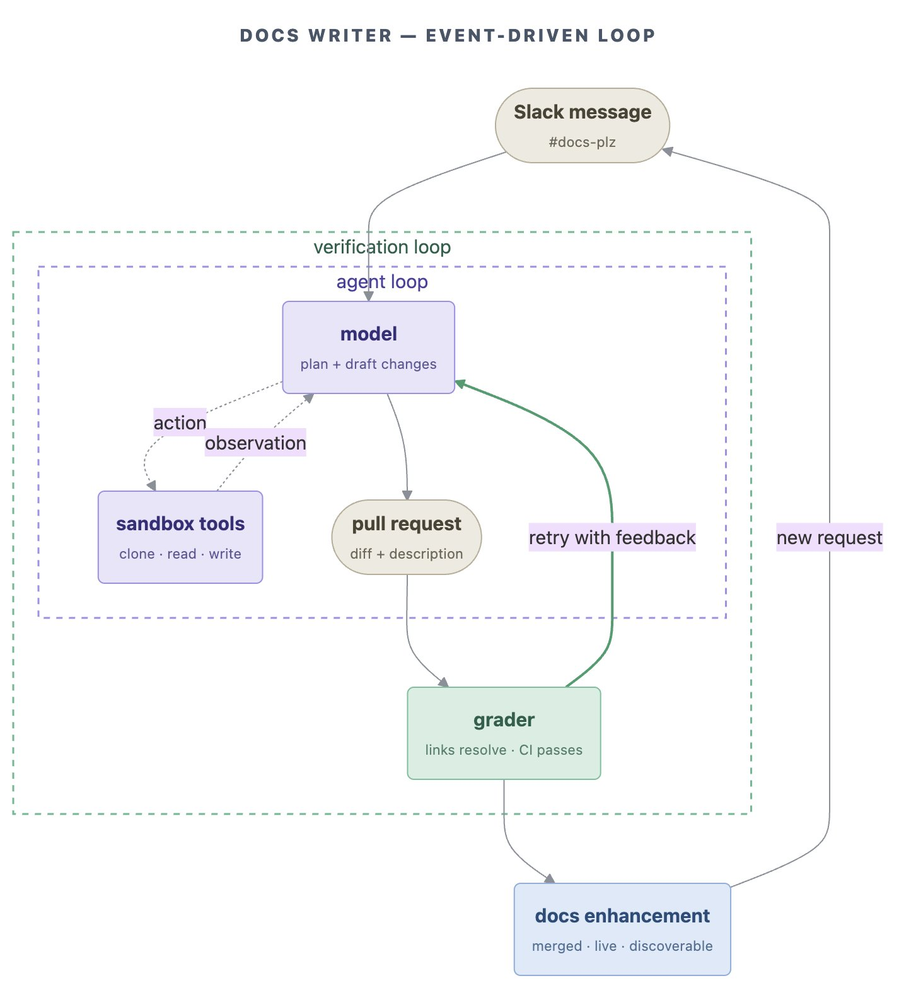
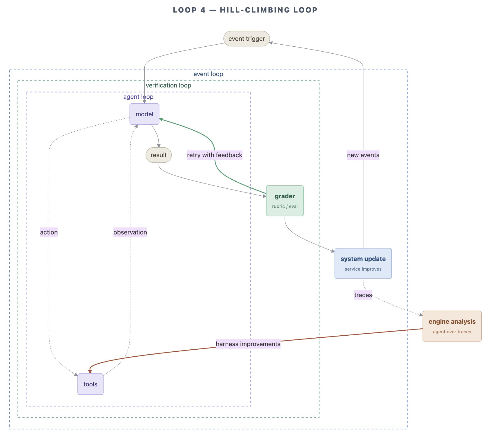
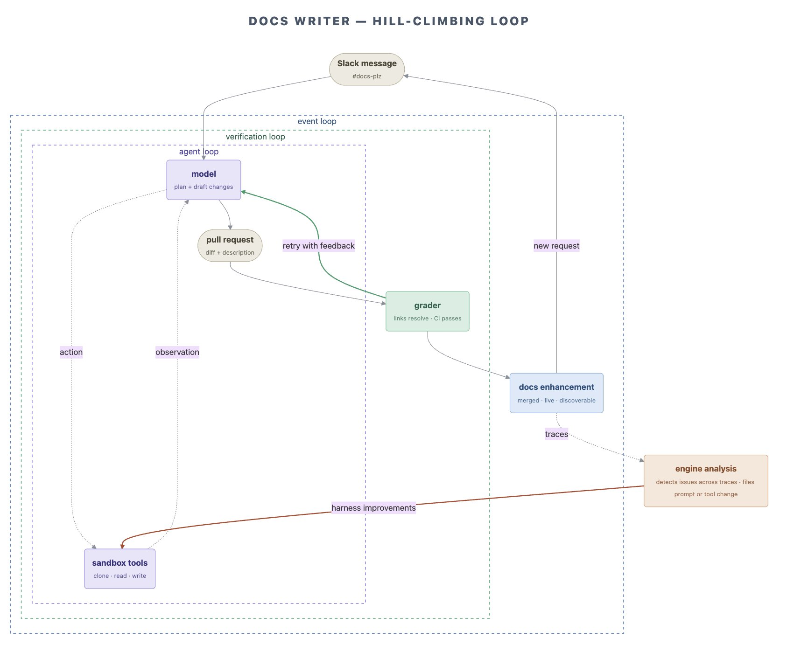
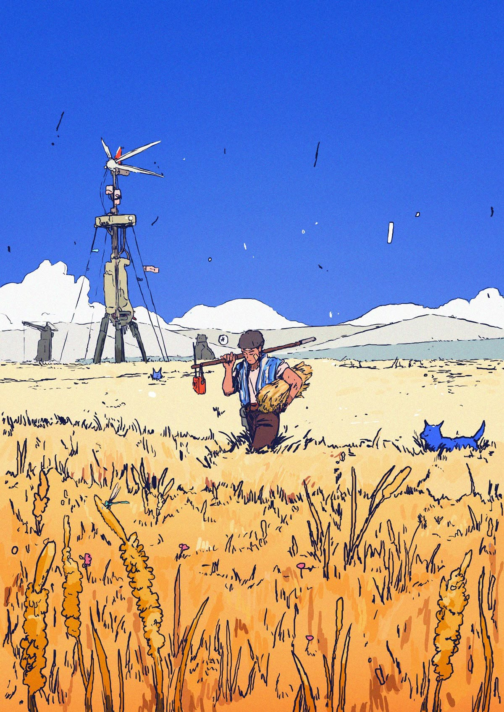

<strong style="font-size:16px;color:#1a6ba0;">要点速览</strong>

- <strong>四个 Loop 台阶</strong>：Agent Loop → Verification Loop → Event-driven Loop → Hill-climbing Loop，90% 的人卡在第二级  
- <strong>关键切换</strong>：从「你提示 Agent」变成「你构建提示 Agent 的系统」  
- <strong>LangChain 原语</strong>：`create_agent`、`RubricMiddleware`、LangSmith Deployment、LangSmith Engine  
- <strong>1% 日更</strong>：1.01³⁶⁵=37.8，四层都搭好后 Agent 自己评分、修复、重写自身配置

**1% 每晚改进，一年复利 37 倍。1.01³⁶⁵ = 37.8。** LangChain 刚刚发布了四层 Loop 剧本，让你睡觉时也能达到这个数字。

大多数人还在手动敲提示词，一个 Agent 一个请求地跑。**把四层都叠上，你的 Agent 们就会自己评分、修复、重写——你醒来时它们比你睡下时更好。**

我在第二级停了大半年。我认识的每个在搞这个东西的人几乎都是这样。Loop 工程同一周达到了 650 万浏览，LangChain 出了这个剧本——**我不觉得有任何人注意到这两件事是同一回事。**

**模型已经好几个月不是瓶颈了。** 剩下来的是它外面的 harness——而 harness 其实就是 loop 套 loop。

整个故事归结为一次交换：**你不再是提示 Agent 的那个人，你去构建那个替你来提示 Agent 的系统。**

四层台阶。**大多数人在第二级悄悄掉队。**

**Loop 1——Agent Loop**

模型调一个工具，读返回结果，再调另一个，一直持续到任务完成。你已经有了这个了。给它上下文，给它工具，让它一直跑到「完成」。**这是 Agent 的基础模式，LangChain 用 `create_agent` 一行代码搞定。**

**这是地板，不是天花板。** 停在这里，你得到的不过是一个更花哨的自动补全。

**Loop 2——Verification Loop（验证循环）**

Agent 完成后，不再是你亲自盯着输出看，而是一个评分者按评分标准给它打分。如果没过线，反馈直接送回去重试。**没有人在那里站着点重试。**

确定性检查处理「无聊」的事情——链接能打开、CI 能通过、范围匹配需求。LLM-as-judge 处理模糊的事情——**它真的回答了问题吗？这一层把「人盯着看」变成了自动化验收。**

LangChain 原语：`RubricMiddleware`。

它每个任务可能多跑 2-3 倍的 token，没错。**但你花的是几分钱，而 Agent 永远不会交给客户一个错误答案。** 生产环境中的一个错误答案，给你造成的损失超过一千次重试的总和。

**90% 的人停在这里。讽刺的是，钱从头到尾就在这里。**

**Loop 3——Event-driven Loop（事件驱动循环）**

到这里它不再等你打开终端了。`#docs-plz` 里的一个消息触发它。一个 webhook 触发它。一个你半忘记设置的凌晨 3 点 cron 任务触发它。**没有人调用它。它就在你整天都在用的工具里面，自动运行，有规模。** 不需要人调用，活在你已经在工作的地方。

LangChain 原语：带 cron/webhook 的 LangSmith Deployment，或 Fleet channels。

到了这个点，**它不再是你去访问的一个应用了。它是一个永远在线的同事，而且从来不开发票。**

**Loop 4——Hill-climbing Loop（爬山循环）**

这一层我花了一段时间才真正相信。每次运行都会留下一条痕迹。这些痕迹喂给一个分析 Agent，它读取它们，发现哪些失败在反复出现，然后重写 Loop 1 的提示词和工具配置。**所以返回箭头不是回到起点。它伸到里面去修改 Agent 本身。**

它注意到自己在哪里反复搞砸，然后它修补自己的设置。**你醒来时得到了一个比你合上电脑时更好的 Agent。**

LangChain 原语：LangSmith Engine。

**LangChain 那个广告碰巧说对的部分**

好笑的是，这是一个 LangSmith 广告，但**它完全正确。**

Loop 1 和 2 是每个人都在互相挤的地方。更好的提示词、更好的模型、更好的评分者。挤满了。**Loop 3 和 4 基本上空着。全部的 edge 就在那里。**

**明年胜出的公司不会是那个拥有最好模型的公司。** 每个人租的都是同一个模型，同样的权重，同样的价格。胜出的会是那个 Agent 一年中每晚都自行改好 1% 的公司——当竞争对手还在手动敲提示词的时候。37 倍，如果你相信这个计算的话。

提示工程有过辉煌的时光。**它被一个无聊的技能取代了：构建那个替你来写提示词的 Loop。** 而最后一个 Loop？没有人需要提示它。它提示了自己。

---

<strong style="font-size:15px;color:#8b6f4c;">结语</strong>

Loop 3 和 4 基本空着这个判断是否准确，验证只需一步：你身边有几个人在跑事件驱动的 Agent？有几个在让 Agent 自己改自己的配置？这个数字趋近于零就是答案。  
Hill-climbing Loop 把「Agent 自我改进」从一个抽象概念变成了可执行方案：收集痕迹、分析失败模式、重写提示词配置。LangSmith Engine 恰好提供了执行的基础设施——但需要注意的是，这一层目前高度绑定 LangChain 生态，尚不具备跨平台可移植性。

---
参考：https://x.com/dunik_7/status/2069079047510864322
