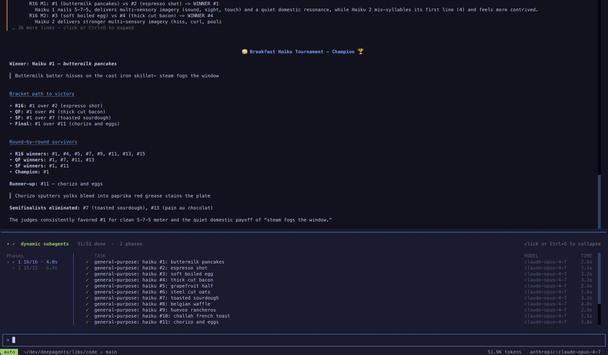
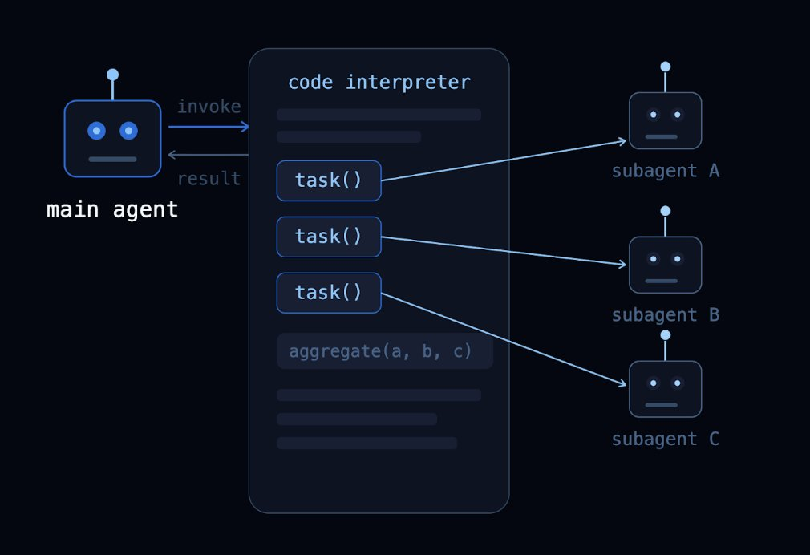
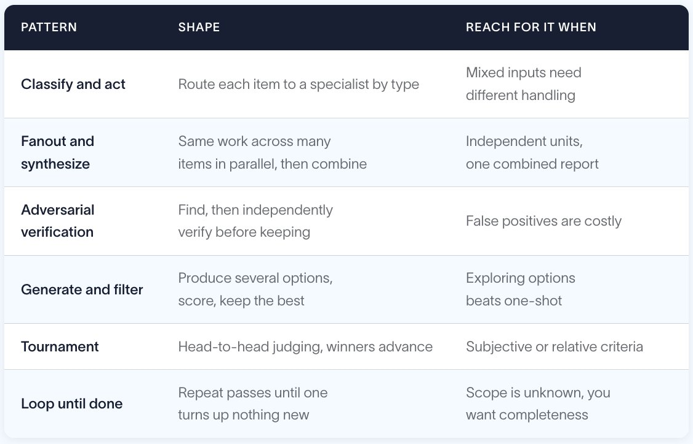
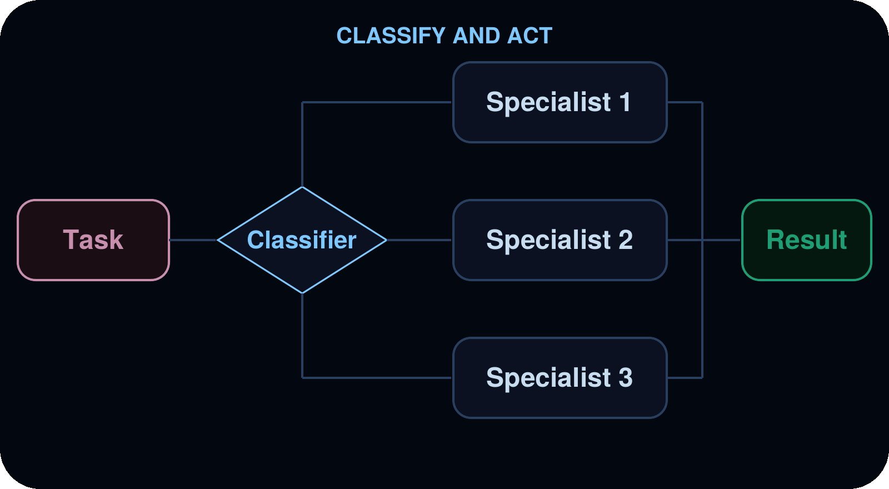
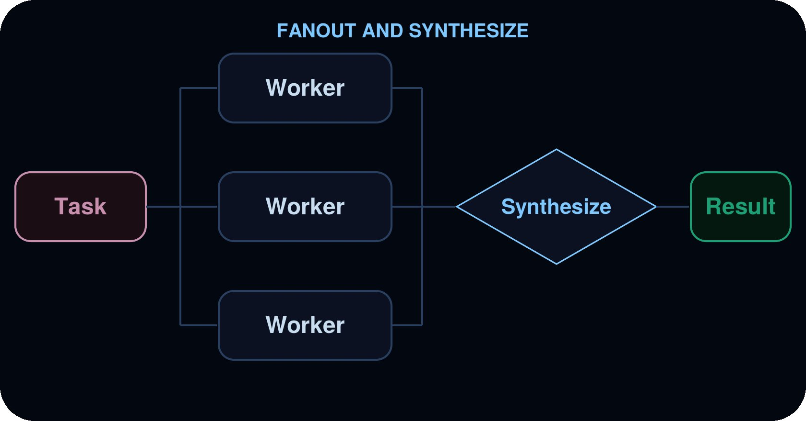
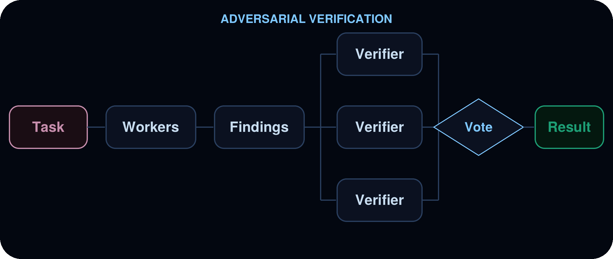
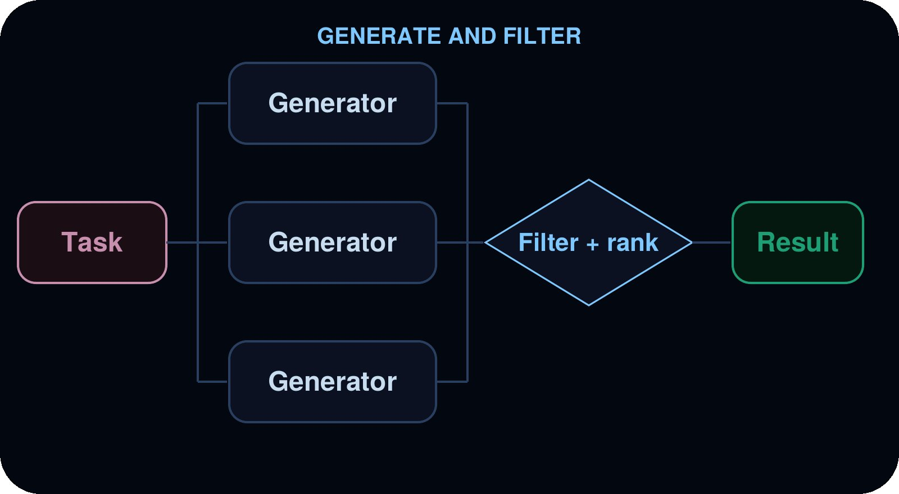
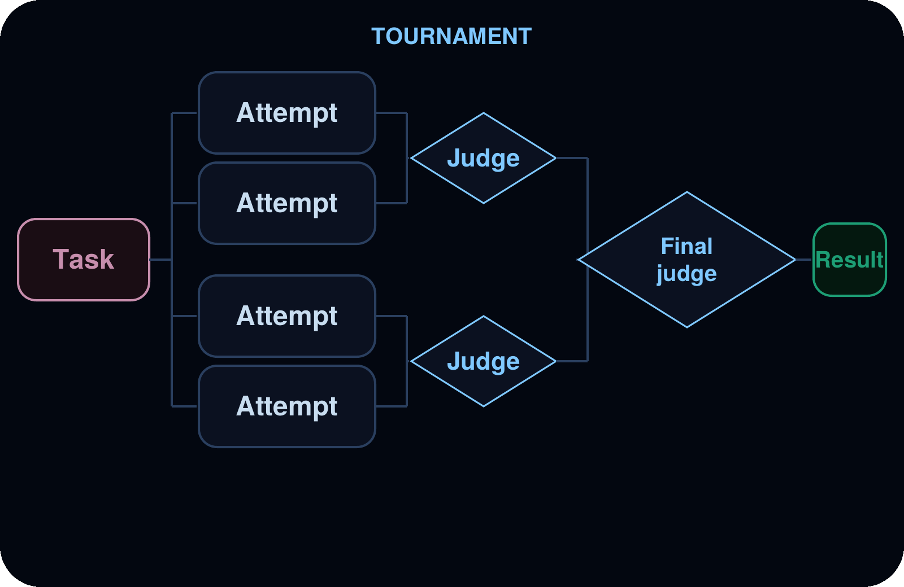
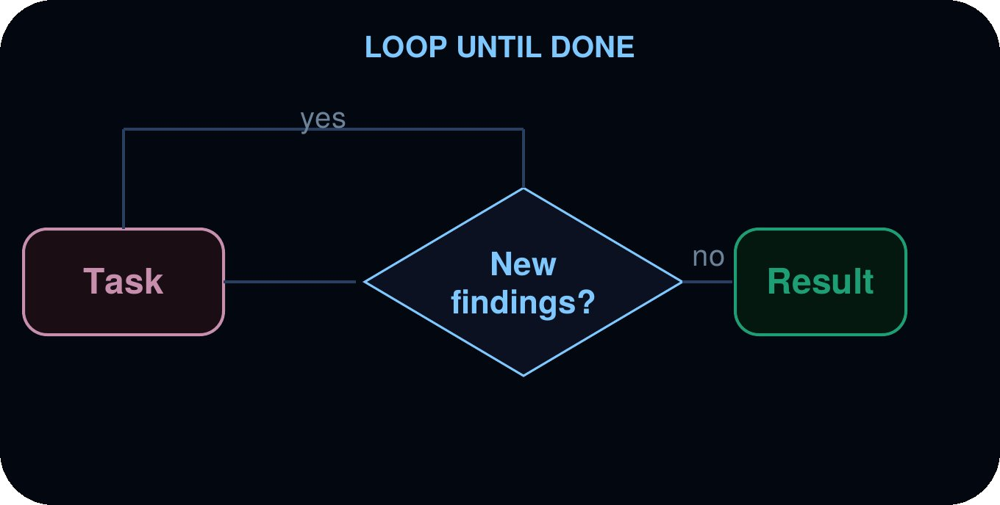

# Introducing Dynamic Subagents in Deep Agents

## 引言

当 Agent 承担更雄心勃勃的任务时，它们会遇到两个难题：

1. 可靠地大规模完成任务
2. 管理自己的上下文

我们一直在尝试以"Dynamic Subagents"的形式来解决这些挑战：Agent 不再通过通用的工具调用来下发子任务，而是编写一个简短脚本来驱动 subagent 执行。这意味着模型可以利用自己擅长编写的代码模式（如循环、分支或并发）来编排适合当前任务的协调逻辑。

## 为什么需要 Dynamic Subagents？

Deep Agents 已经支持 Subagents。它们隔离上下文，让主 Agent 可以委派离散的工作单元，并将中间结果排除在主上下文窗口之外。那为什么还需要 Dynamic Subagents？

使用普通 subagent 时，它们是逐个被调用的——由主模型直接调用它们。这在小型规模下可行。但当需要生成数百个 subagent，或编排逻辑是条件式或多阶段时，这种方式就失效了。

Dynamic Subagents 通过程序化编排解决了这个问题。Agent 不再逐轮进行工具调用，而是编写一个简短脚本，编排并调用 subagent，然后在一个轻量级解释器中运行它。

典型案例：一个 300 页文档，每页一个 subagent。与其调用 subagent 工具 300 次，Agent 写一个循环：

```javascript
const results = await Promise.all(pages.map(page =>
  task({ description: `Summarize page ${page.number}`, subagentType: "summarizer" })
));
```

这解锁了两个基于工具调用的编排无法可靠交付的能力：

**确定性覆盖（大规模）。** 如果没有结构，Agent 会自行判断范围——筛选 500 项中的 75 项就宣布完成。而调度循环不会。覆盖成为一种结构性保证，而不是提示工程问题。

**可靠的复杂编排。** 将编排编写为代码，比让模型以一系列工具调用的形式重现它更可靠，特别是对于扇出+合成、多阶段流程或条件分支。

这与 Claude Code 中的 Workflows 和 Recursive Language Models (RLMs) 背后的思路相同：模型编写代码，代码调度更多 Agent。

## 快速开始

Dynamic Subagents 需要两样东西：下派工作的 Subagents，以及一个 Code Interpreter——一个轻量级安全运行时，模型在其中编写和执行编排代码。Deep Agents 包含一个基于 QuickJS 的可选代码解释器。要使用它，先安装 QuickJS 中间件包，然后在 create_deep_agent 中通过 middleware 参数传入 CodeInterpreterMiddleware。

```bash
pip install -U "deepagents[quickjs]"
```

```python
from deepagents import create_deep_agent
from langchain_quickjs import CodeInterpreterMiddleware

agent = create_deep_agent(
    model="openai:gpt-5.5",
    middleware=[CodeInterpreterMiddleware()],
)
```

Deep Agents 内置了一个通用 Subagent，因此已经有一个通用 subagent profile 可用于工作流。对于专门的场景，可以配置自定义 Subagent，设置自己的名称、描述和系统提示——名称和描述是 Agent 知道该调用哪个角色的依据。

要触发 Dynamic Subagents，向 Agent 发送包含"workflow"关键词的提示：

```python
result = await agent.ainvoke({
    "messages": [{"role": "user", "content": "Run a workflow that reviews every file in src/routes/ and summarizes the top risks."}]
})
```

### 与编码 Agent 配合使用

试用 Dynamic Subagents 最快的方式是使用 dcode——一个基于 Deep Agent 构建的终端编码 Agent。它已启用代码解释器，因此无需额外配置——Dynamic Subagents 开箱即用。

安装：
```bash
curl -LsSf https://langch.in/dcode | bash
```

运行：
```bash
dcode
```

要触发 Dynamic Subagents，只需要求一个"workflow"。Agent 不会自己埋头干活，也不会试图用它的原生 task 工具来管理 subagent 扇出——它会编写一个编排脚本，调用内置的 task() 全局函数并在代码解释器中执行它。例如："run a workflow to review every file in src/ for SQL injection."

当 subagent 生成时，dcode 会在 Dynamic Subagents 面板中实时显示它们，按调度的阶段分组。



你也可以通过 ACP 在你选择的工具中使用它（如 Zed）。

## 工作原理

Agent 被赋予一个 Eval Tool。它编写 JavaScript，在解释器中安全执行。当配置了 Subagents 时，解释器暴露一个内置的 task() 全局函数，用于从代码中调度它们。根据手头的任务，模型编写不同的代码——一个循环、一个分支、一个 Promise.all——解释器确定性地运行它。



task() 接受 description、subagentType 和一个可选的 responseSchema——当提供时，结果已经是一个类型化对象，可以直接过滤或传递给下一步。

```javascript
const result = await task({
  description: "Review src/auth/login.ts for security issues.",
  subagentType: "reviewer",
  responseSchema: {
    type: "object",
    properties: {
      severity: { type: "string", enum: ["high", "medium", "low"] },
      issues: { type: "array", items: { type: "string" } },
    },
  },
});

const critical = result.severity === "high" ? result.issues : [];
critical; // model sees the last line
```

更多信息见 Programmatic subagents 和 Interpreters 文档。

## 常见编排模式

Anthropic 的 Dynamic Workflows 推广了一组并行 Agent 工作的编排模式。它们不是你可以开启的功能，而是从工作中自然涌现的形状——Agent 随着任务变化而切换到不同的模式。下表将每种模式映射到它适合的工作类型。



下面我们深入介绍每种模式在 Deep Agents 中的工作方式，附有实时追踪。我们还制作了一个视频解释这六种模式，可以在这里查看。

### 分类并行动（Classify and Act）

项目先被分类，然后每个项目由专门的 subagent 根据其分类处理。这让你可以处理混合输入，其中不同项目需要不同的专业知识。



**适用场景：** 分类支持工单、错误日志、用户反馈，或任何需要根据类型进行不同处理的批量项目。

**示例：** 分类支持工单积压。Agent 读取工单并将每个分类为 bug、feature request 或 question。Bug 交给 bug-investigator，feature request 交给 feature-analyst，question 交给 support-responder。最终输出按类别汇总的报告。

查看追踪。

### 扇出与合成（Fanout and Synthesize）

Agent 将同类型的工作并行分发给多个项目，然后合并结果。



**适用场景：** 跨目录的代码审查、批量文档分析、处理日志文件、跨多个服务运行相同的检查。

**示例：** 跨源代码树的逐文件安全检查。Agent 发现 src/ 下所有的 TypeScript 文件，并行为每个文件调度一个 security-reviewer。然后它将结果合并到一个按严重级别排序的优先级报告中，注明需要修改的行。

查看追踪。

### 对抗验证（Adversarial Verification）

两阶段模式。第一遍产生发现。第二遍将每个发现发送给独立的验证者，只有通过共识的发现才被保留。这减少了当置信度比速度更重要时的误报。



**适用场景：** 误报代价较高的安全审计、合规检查、任何需要高置信度的审查。

**示例：** 误报不可接受的安全审计。审计员广泛扫描潜在漏洞，然后将每个发现交给独立的验证者，后者重新阅读代码并返回 CONFIRMED 或 REFUTED 的判断。只有确认的发现进入最终报告。

查看追踪。

### 生成与过滤（Generate and Filter）

多个 subagent 独立生成同一问题的解决方案。Agent 在代码中比较、评分和过滤结果，只保留最好的。



**适用场景：** 架构方案、重构策略、内容变体，任何需要先探索多个选项再承诺的任务。

**示例：** 竞争性的限流器重新设计方案，进行排名。Agent 让架构师生成几个独立的 rate-limiter.ts 重新设计方案，每个写入自己的文件以免互相覆盖。然后根据突发下的正确性、多实例支持和复杂度进行评分。最强方案胜出，附有理由。

查看追踪。

### 锦标赛（Tournament）

变体由评判 subagent 进行头对头比较，胜者通过淘汰轮次晋级。



**适用场景：** 主观标准下的优化、样式选择、竞争实现之间的选择。

**示例：** 对混乱的 createOrder 处理器的重写进行成对淘汰赛。几个写手各自产生不同优先级的候选重写方案，然后评判者进行头对头比较，胜者逐轮晋级，直到一个冠军脱颖而出。返回评判者的推理过程。

查看追踪。

### 循环直到完成（Loop Until Done）

Agent 运行一个发现循环，对已发现的结果进行去重，直到没有新结果出现。适用于工作范围未知的情况。



**适用场景：** 穷举搜索、死代码检测、依赖审计，任何追求完整性而非固定结果数量的扫描。

**示例：** 分轮安全检查。Agent 运行一轮扫描，在代码中检查发现的内容，只有在前一轮发现新问题时才启动下一轮。当一轮扫描没有发现新问题时停止。报告整合后的发现和共计多少轮。

查看追踪。

## 结论

Dynamic Subagents 是让 Agent 获得更高自主性和更可靠性的方式。代码处理覆盖和中间上下文，模型仍然负责判断密集型工作。上述模式只是一个起点。在实践中，Agent 会根据任务需求组合和混合它们。

这就是 Recursive Language Model 思想的最简形式：一个编写代码的 Agent，而代码调度更多 Agent。这是一个递归调用自身的 Agent，不受上下文窗口的限制，也不被框死在固定工作流中。Agent 可以任意深入分解问题，然后以任何适合的形状重新组装各部分。上面强调的编排模式只是可能性的早期一瞥，但随着模型越来越擅长编写代码，天花板只会继续升高。

Dynamic Subagents 是 Deep Agents 今天就将这一切交到你手中的方式。赶紧添加代码解释器到你的 Agent，或直接使用 dcode——Dynamic Subagents 开箱即用。

## 致谢

共同作者：@colifran_ 和 @huntlovell。感谢 @hwchase17、@masondrxy 和 @chester_curme 的审阅。
