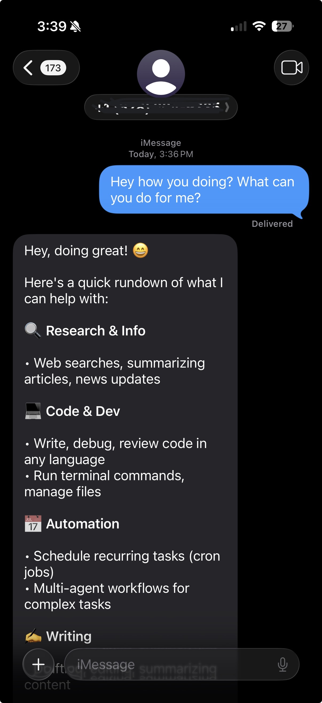
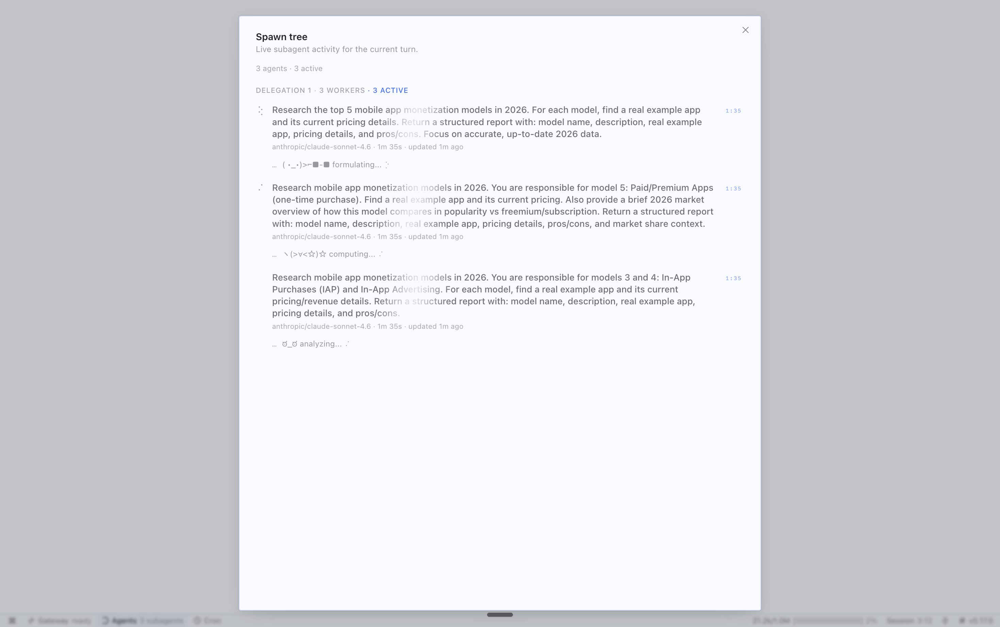
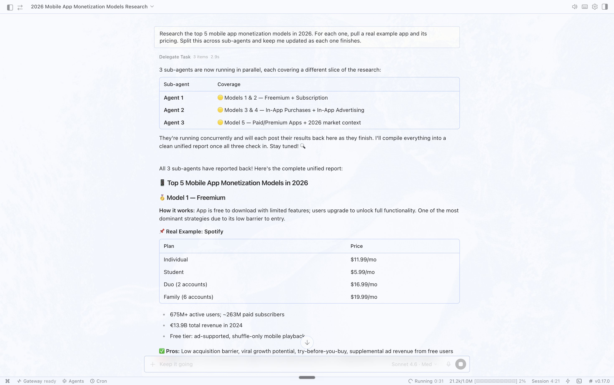
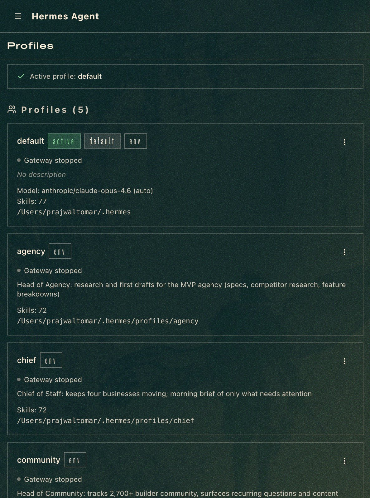
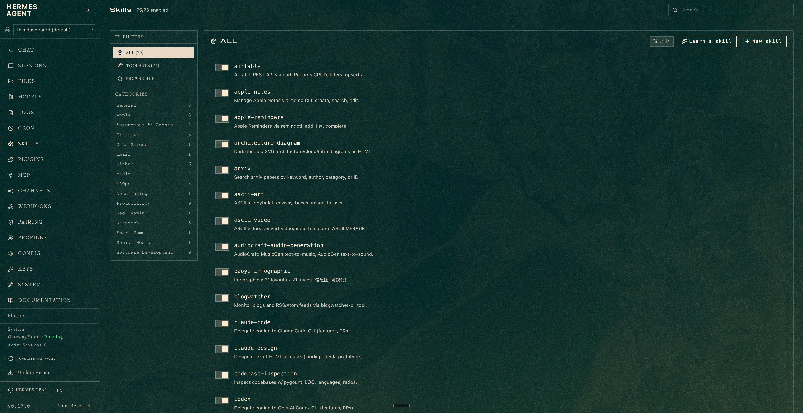
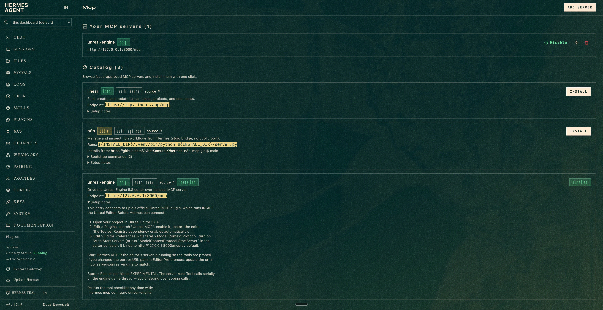
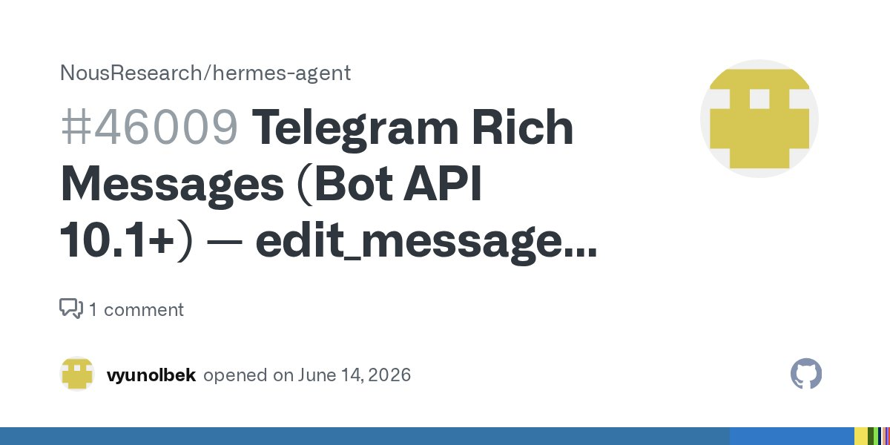

<strong style="font-size:16px;color:#1a6ba0;">要点速览</strong>

- <strong>iMessage 原生接入</strong>：Hermes Agent 现在可以通过原生 iMessage 联系，像跟人发短信一样跟 Agent 说话，不需要单独打开 App 或登录仪表板  
- <strong>后台 Agent 默认开启</strong>：复杂任务自动在后台运行，你可以继续聊其他事。子 Agent 面板实时可见，瓶颈从「等多久」变成「能跑几个」  
- <strong>多 Profile 替代多工具</strong>：两分钟创建一个独立 Agent（Profile），各有独立记忆和技能。跑四个 Profile 分别管策略、客户、内容和社区，覆盖五个生意  
- <strong>Skills Hub 和自改进循环</strong>：可直接从仪表板安装热门技能，新 Profile 上线当天就能用。Agent 在工作中自动优化技能文件，用得越久越好

一个人同时管五个生意，日常还能保持清醒吗？

对创业者来说，答案基本是不可能。五个生意意味着五个方向的客户、五套任务清单、五倍的上下文切换成本。每天早上坐下来的第一件事不是做决策，而是回忆：上周这个项目到哪了、那个客户说过什么、内容方向定下来没有。

**「持久化 Agent」和「session 式 Agent」之间的差距，比想象中要大。**

Prajwal Tomar 同时经营一家 MVP 代工机构（月经常性收入 $20K）、在线教育社区（教了 3500+ 人用 AI 做软件）、移动端应用工作室、一对一创始人咨询和 5 万粉丝的 Instagram。几周前他写了 Hermes Agent 的初评，那个版本只是「可以信任的后台工具」。上周 Nous Research 发了一个大更新，**他直接把五个生意的运营搬了上去。**

---

**绝大多数 AI Agent 是基于 session 的。** 你打开 Claude Code 或 Cursor，交给它一个任务，关掉标签页，第二天早上它把你和你的工作全忘了。

Hermes 是反过来的。它跑在服务器上，全天在线，记住每一段对话，并在运行过程中自己写技能文件。你用得越久，需要解释的东西就越少。

第一篇评测时，这个区别已经很明显。上周的更新让整体体验足够好，好到运营任务真的搬了上去。

---

你能想象你的 AI 助手出现在 iMessage 里，跟你的家人和团队聊天框在同一个 App 中吗？

**设置只需要几分钟。** 最简便的方式是 Photon，一个托管的 iMessage 线路，不需要自己维护一台 Mac。在终端跑一条命令，浏览器确认设备登录，它就分配一个号码，你发短信就能联系到你的 Agent。

这听起来很小，但用上之后就很难回到原来的方式。你的 AI 不再藏在需要主动去找的登录页后面，它就在你口袋里，跟其他人所有的消息在同一个收件箱里。**你会在想法冒出来的瞬间就把工作交给它**，比如两个咨询电话之间想起一个跟进方案，而不是等到回笔记本前才处理。

Hermes 的原生 iMessage 界面，跟给人发短信一样自然

---

后台 Agent 现在默认开启。过去用任何 Agent 的流程都是：给任务、等、跟进、再等。现在你发出一个复杂任务后，**它会安静地启动子 Agent 在后台运行，你可以继续跟它聊别的事。**

**对创业者来说，这是助理和正式员工之间的区别。** 一个团队里的初级成员不会每次你交给任务就把整个对话卡住。他们会去做然后回来汇报。Hermes 现在也是这样工作的。这一个默认行为的改变，让用户放心地把客户调研和初稿工作交给了它。担心的不再是「等多久」，而是**「能同时跑多少个还不把账算丢」。**

---

桌面 App 的更新合在一起，把它从一个聊天框变成了更像控制室的东西。

→ 聊天窗口可以弹出来变成独立窗口，一边看一个 Agent 工作一边在另一个窗口干活
→ 模型选择器移到了底部，你真正会去够的位置
→ **实时的子 Agent 面板**是整天都开着的功能，当后台 Agent 在跑客户工作时，能看到实际的工作进行而不是靠猜，才放心离开去接咨询电话
→ 内置终端，不需要在 Hermes 和独立终端窗口之间来回切换

Hermes 桌面 App 的实时子 Agent 面板

弹出窗口和多任务操作界面

---

**Profile 是这次更新里一个容易被忽略的功能。** Hermes 里的 Profile 本质上是一个与其他 Profile 并行的独立 Agent，各有独立记忆和技能。现在可以从浏览器直接创建：`hermes dashboard` → Profiles → 几分钟搞定。

实战用法是跑四个 Profile，分别对应「想克隆自己时最需要雇的人」：

→ **Chief of Staff Profile**：了解五个生意中的所有优先事项，跑早上简报
→ **Agency Profile**：处理客户调研和 MVP 项目的初稿需求文档
→ **Content Profile**：撰写 X 文章草稿、推文和赞助内容初稿
→ **Community Profile**：持续感知社区的提问并提炼主题

**一条值得偷师的经验：即使你只需要一个 Profile，也至少跑两个。** 一个 Profile 是单点故障。两个就是互相照应的团队，一个出问题，另一个可以修复。

Profile 配置界面，浏览器中即可完成

---

Skills Hub 解决了这次更新前一个明显的痛点。Hermes 在运行中自己写技能文件，但之前没有简便的方式获取别人已经建好的技能。**新 Skills Hub 就在仪表板里，让你可以浏览并一键安装热门技能。**

以前每个新 Profile 从零开始，需要几周才能建立起有用的技能库。**现在第一天就可以用经过验证的技能播种一个新 Profile**，让它从那里开始专业化，而不是从零开始建库。

Skills Hub 界面，可按需浏览和安装热门技能

---

自改进循环在这次更新中变得更聪明了。**Agent 在工作过程中更积极地编写和更新技能，对自己的记忆所做的编辑质量也更高。** Hermes 最初的定位就是「用得越久越好」，这次更新加速了这个曲线。Agency Profile 在每次客户构建后已经会自动调整需求文档的写法，**这种边际效应在运行中不断累积。**

大多数 AI 工具在第 90 天和第一天一样好。**Hermes 一直在自己写自己的操作手册，用得越久差异越明显。**

---

这是更新中比较特别的一项：Hermes 现在有了 Unreal Engine 5.8 MCP。**当一个 Agent 能驱动 Unreal 时，问题不再是「它能建什么」，而是「它连不了什么」。** 对大多数人来说这只是炫技，不是日常工具。但它是一个重要的信号，Hermes 周围的 MCP 生态正在扩展到严肃的专业软件，不只是小网页工具。

Unreal Engine 5.8 MCP 已连接，Agent 可直接驱动游戏开发

---

还有几个旁注。Telegram 现在能发送带格式的富消息，iMessage 处理快速提示，Telegram 处理需要可读输出的深度工作。

Telegram 上的格式化消息输出

---

**把功能放在一起看，大概能看出这次更新的方向。**

这篇评测的第一版时，Hermes 是一个强大的 Agent，你需要在机器上驱动它。这次更新之后，**它变成了一个随时可以接触到的 Agent，默认在后台运行工作，用多 Profile 运作，并且能自我提升。**

这不是一个新工具。是同一个工具长大了。而且整个设置仍然只需要约 30 分钟。

说几个实在的警示。**后台 Agent 默认开起来很好用，但别忘了它们消耗 Token。** 你启动的每个子 Agent 都是实打实的费用，第一个星期盯一下用量，在账单吓到你之前先摸清自己的使用模式。**至少跑两个 Profile，但别第一天就建十个，每个 Profile 需要真正的工作，空的 Profile 只会弄乱仪表板和工作流程。Browser 和 Computer Use 出于安全考虑默认关闭，应该保持这个状态，直到某个 Profile 真的需要。**Unreal MCP 令人印象深刻，但还在早期**，在它经受真实场景考验之前，把它当实验而非生产流水线。

**今年把这些搭建起来的人，明年会在效率上有明显优势。** 他们只是省去了每天向一个记不住上下文的工具重新解释的麻烦。

---

<strong style="font-size:15px;color:#8b6f4c;">结语</strong>

这篇文章其实从现实场景说明了「持久化 Agent」和「session 式 Agent」的区别。大多数 Agent 工具的单次对话体验已经足够好，区别不在单个 session 内，而在 session 之外。每天早上的上下文恢复成本、跨任务的记忆断裂、非前台场景下的可用性，决定了 Agent 到底是个工具还是一个员工。Hermes 这次更新回答的恰恰是这些问题。从 iMessage 的「零摩擦提问」到后台 Agent 的「异步协作」，到 Skills Hub 的「知识复用」，每一个更新都在把 Agent 从需要你去伺候它，变成它来伺候你。

---
参考：

https://x.com/PrajwalTomar_/status/2070465742605316405