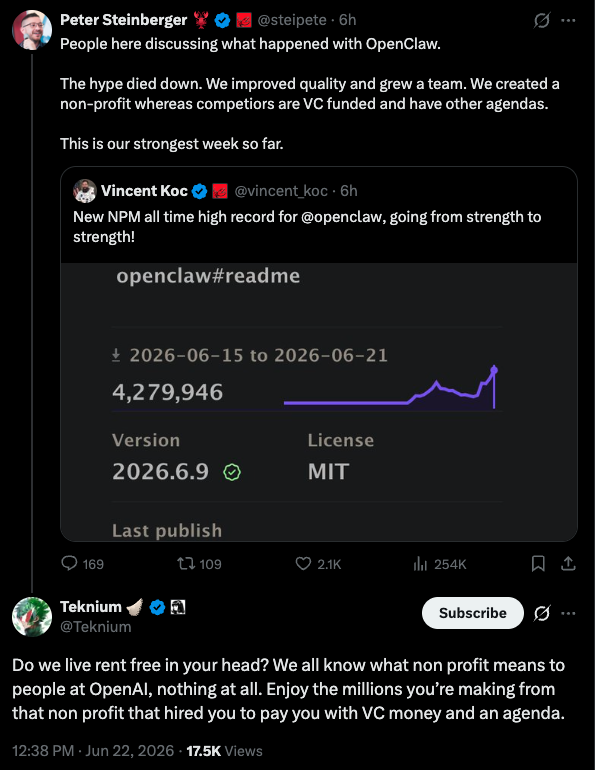
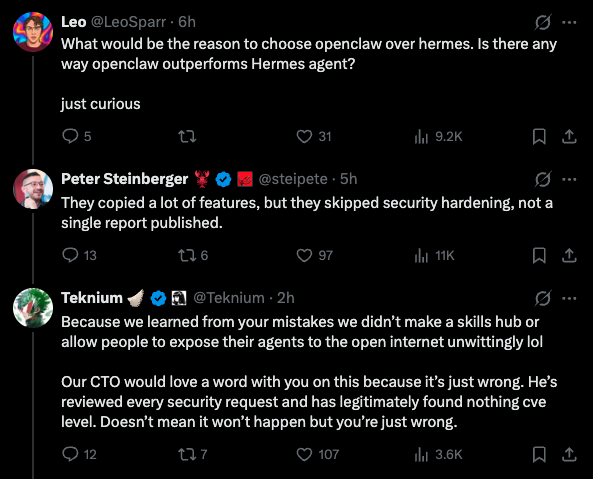
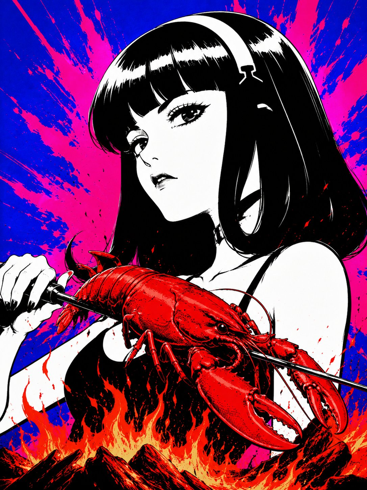

**Hermes vs OpenClaw创始人隔空互怼：假星标，抄袭，死亡威胁各种瓜**

<strong style="font-size:16px;color:#1a6ba0;">要点速览</strong>

- <strong>导火索</strong>：OpenClaw 创始人 Peter Steinberger 发推庆祝 npm 下载量新高，强调 OpenClaw 是非营利而"竞争对手是风投资助的、有其他议程"  
- <strong>反击升级</strong>：Hermes 创始人 Teknium 用"免费住在你脑子里"直接回击，随后双方社区在回复区爆发 300+ 条混战  
- <strong>数据级冲突</strong>：Peter 的原推 4,050 点赞/641K 观看，Teknium 的回击 2,844 点赞/370K 观看，整条推文链累计超 44 万次互动  
- <strong>争议升级</strong>：OpenClaw 被指 39% GitHub 星标为假星标，OpenClaw 团队成员指控对方社区存在死亡威胁行为

从一种冷静意义上说，这是两个创作者之间的技术路线分歧。但从另一种意义上说，这是一场发生在 X 上的、围观人数超过 44 万的公开掐架。

6 月 22 日，OpenClaw 的创始人 Peter Steinberger 发了一条看起来无害的推文。他庆祝 OpenClaw 的 npm 下载量创下历史新高，同时抛出了一个重磅炸弹：**OpenClaw 成立了非营利组织，而"竞争对手是风投资助的且有其他议程"。**

他说："hype 已经消退，我们提升了产品质量、扩大了团队。我们创建了一个非营利组织，而竞争对手是 VC 资助的且有其他议程。这是我们迄今为止表现最强的一周。"

这条推文本身没什么问题——问题出在它的潜台词上。Peter 引用的 Vincent Koc 推文本意是庆祝 npm 记录，但 Peter 用 "non-profit" vs "VC funded" 的画线方式，让 Hermes 社区的人感到被暗指。

**当有人问"为什么要选 OpenClaw 而不是 Hermes"时，Peter 的回复精准地点燃了火药桶。**

> 他们复制了大量功能，但跳过了安全加固，一份安全报告都没发布过。

Peter 没有点名 Hermes，但他的措辞——"复制功能""跳过安全"——在 Hermes 看来指向性太明显了。**这句"复制功能"成了整场冲突里杀伤力最大的一句话。** 毕竟 Hermes 是开源项目，代码公开，复制不复制一查便知。但"跳过安全"这个指控，直接质疑了对方工程团队的职业操守。

三个小时后，Hermes Agent 的创始人 Teknium 杀到了回复区。

> 我们是不是免费住在你脑子里？我们都知道非营利对 OpenAI 的人来说意味着什么——屁都没有。好好享受从那个非营利组织赚来的几百万吧——它雇了你，却用风投的钱和议程来付你工资。

**这里的关键在于 Peter 的 OpenClaw 在 2026 年被 OpenAI 收购了。** 一个被 OpenAI 收购的"非营利"项目，却在指责别人"被风投污染"，这种讽刺感让 Teknium 无法忍受。Teknium 随后补充说：他主动提出过握手言和，但 Peter 无视了。**"我提议和解，他无视了。现在他诋毁我们，好像我们是风投资助的就是腐败了。"**

之后的事态就变了味。双方支持者在回复区展开了超过 300 条回复的混战。

**支持 Teknium 的一方**认为 Peter 的双标站不住脚。一位叫 Salma 的用户直接开喷："他表现得好像他发明了轮子，CODEX 和 Claude Code 早就是 harness 了。你只是把 Telegram 黏上去而已。OpenClaw 让我讨厌 AI。"另一位用户抱怨产品稳定性："Hermes 从没停过工。OpenClaw 每天都有网关故障。""我花了更多时间在每次更新后修 OpenClaw，而不是真正做点有用的事。"

还有人翻出了 OpenClaw 的 GitHub 星标数据：一份独立的星标分析显示，OpenClaw 的 GitHub 星标中有 39% 是假的。**"40% 的 GitHub 星标是假的。"** 一位用户直接在 Eric 的回复下面贴出了这份分析。

用户 django 则提供了一个更微妙的视角："这么说吧，pete 在 X 上把我拉黑了，但 teknium 在我试图贡献时接受我的合并提交。我知道我应该站在哪边。最重要的是，Hermes 就是更好的软件。"

**支持 Peter 的一方**则质疑 Teknium 的攻击姿态完全没必要。Jeff Escalante 写道："这个回复真的太难看。他一个字都没提你的产品，你就莫名其妙冲出来狂喷。你说他'在诋毁你'，感觉是反过来的。"Henry Mascot 也问："我以为你决定过要和平了，你也一直挺冷静的。为什么要回到人身攻击？不需要这样。"

用户的反应像一面镜子——有人说是"Mac vs Windows 2.0""爸妈又吵架了""龙虾人 vs 动漫人"。

**OpenClaw 团队成员 Vincent Koc 的加入让事态升级到了新高度。**

> 所有的 gaslighting 和谎言只是为了炒作他们的营销——这就是为什么我们和 @Teknium 处不来的原因。更不用说来自他们的水军账号的死亡威胁和自杀笑话了。

**死亡威胁的指控把这场争论从"理念分歧"推进了"安全红线"的区域。** Vincent 贴出了来自 Hermes Discord 成员的对话截图，以显示这不是空穴来风。Teknium 本人并没有直接参与这些威胁行为，Vincent 指控的是"他们的水军账号"和"Discord 成员"——虽然这一点在混乱的回复区并没有多少人注意到。

当整个事件被总结为"龙虾熟了"的表情包时——Peter 的 X 头像正是一只龙虾——这场冲突的某种荒诞感也表露无疑。到 6 月 23 日，两个最大的 AI 编码 Agent 项目之间的裂痕已经无法掩盖。

Peter 的原始推文获得了 4,050 点赞、641K 观看和 312 条回复。Teknium 的反击获得了 2,844 点赞和 370K 观看。另一个社区成员 Olie Gray 用"return of the claw" GIF 回应 Peter 的原始推文，显示仍有人支持 OpenClaw。但搜索兴趣数据显示，OpenClaw 的搜索热度在 2026 年初达到峰值后已经明显回落。

用户 Mordy 写道："Teknium 说得很对。说实话我真不知道该怎么办了。我喜欢用 OpenClaw，但也要重新试试 Hermes——那个桌面版本太棒了！我只需要一个好用的、真正开源的 Agent，没有贪婪的董事会。"

**社区的情绪已经一目了然：一个开源 Agent 的生态正在变成阵营之争。**

django 补充道："HERMES IS MY GOAT（Hermes 是我心中的史上最佳）"。另一位用户则持不同态度："两位创始人都容不下别人的自我。我不觉得这两个产品能长久。"还有人不无戏谑地说："slop vs slop 终于开始了。"

<strong style="font-size:15px;color:#8b6f4c;">结语</strong>

这场冲突真正揭示的不是谁的产品更好——两个都是可用的开源工具，都有忠实用户。它揭示的是开源 AI Agent 社区在快速增长中积累的裂痕：项目创始人的性格冲突、资金模式的意识形态对立、社区安全边界的模糊。当两个项目都在同一赛道上争夺用户和贡献者时，冲突几乎是必然的。但死亡威胁的指控是一道红线——跨过它之后，"良性竞争"就变成了信任崩塌。  
另一个值得注意的点是：整场冲突的导火索来自于 Peter 的一条主观评论（"其他议程"），而非 Hermes 方面的主动挑衅。Teknium 的回应虽然激烈，但 Peter 先开了第一枪。在一个健康的开源生态中，围绕项目资金模式的讨论本应有更成熟的表达方式。这场"Agent 大战"不会是最后一场，也肯定不是最严重的一场。

---

参考：https://x.com/Hesamation/status/2069054694056468481
https://x.com/Teknium/status/2069007211087675756
https://x.com/steipete/status/2068961217524490739
https://x.com/steipete/status/2068964066954268908
https://x.com/Teknium/status/2069016103523901582
https://x.com/Teknium/status/2069056977028980769
https://x.com/vincent_koc/status/2069212484637217264
https://x.com/___4o____/status/2069100709661044797
