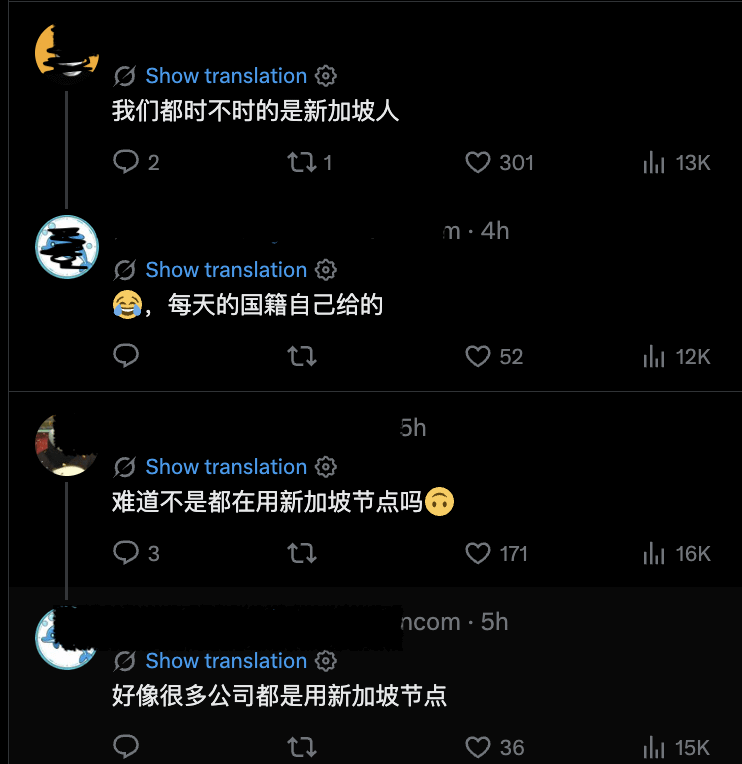
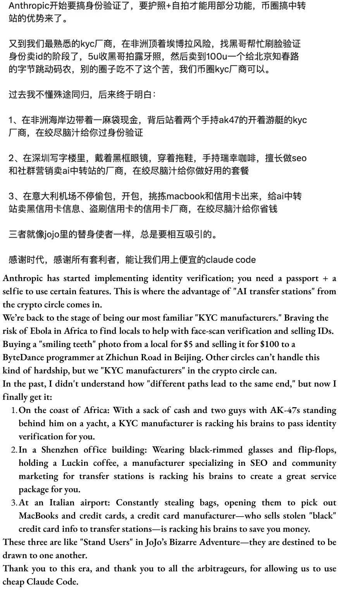

<strong style="font-size:16px;color:#1a6ba0;">要点速览</strong>

- <strong>中转站灰色经济</strong>：中国开发者通过API代理（中转站）以低至官方价10%的价格使用Claude，一条完整的产业链已覆盖GitHub、淘宝、Twitter和Telegram  
- <strong>一鱼三吃盈利模式</strong>：中转站通过三重手段赚钱，访问加价（账号批量注册/APImaxxing）、换模型注水Token（静默替换为低端模型）、出售用户日志（用于蒸馏/训练）  
- <strong>AI 安全的盲点</strong>：Anthropic的KYC、Clio等检测系统在中转站面前效果有限，代理运营商控制推理层，封禁账号几小时内可重建，且全球南方居民的面部数据可能被二次利用

**中国开发者用 10% 的价格买到 Claude Token，秘密全在中转站**

2026年4月，白宫发布备忘录警告"工业规模"的蒸馏攻击，中国实体利用"数万个代理账户"规避检测，系统性提取美国前沿 AI 模型。两个月前，Anthropic 也报告了类似的案例：一个代理网络管理着超过2万个欺诈账户。

两份文件都将"代理"视为少数中国前沿实验室的刻意设计。但牛津中国政策实验室的研究员 Zilan Qian 在 ChinaTalk 上发文指出：它们都误读了它们所描述的代理经济。

在少数实验室之下，是一个规模大得多的市场。

**一个在 GitHub、淘宝、Twitter 和 Telegram 上公开运营的灰色经济**

API 代理，中国开发者称之为"**中转站**"：一台位于开发者和 Anthropic 基础设施之间的海外服务器。它接受 API 请求，转发给 Anthropic 就像请求来自中转站所在地一样，再把响应传回来。用户把软件重定向到代理的服务器，通过微信或支付宝以人民币付款。

就这么简单。VPN 和海外信用卡都省了。

知名中转站被收录在社区仓库中，按实时价格和在线率排行。更大的尾巴是那些来了又走的小型项目。

虽然这个设置听起来和 OpenRouter 这类合法的西方 API 聚合器差不多，但中转站运行在一个完全不同的合法性宇宙里。合法的聚合器简化开发者工作流，基于透明的企业协议收费。中转站是明确为规避而构建的，通过不负责的中介路由你的数据。

**中转站本身在中国技术上也不合法。** 根据中国的 AI 服务注册规定，未经备案和安全评估的 AI 服务是非法的。但就像一些小企业可以不注册一样，大多数中转站也没人管。不过，生意越大越不安全。

中文互联网上流传的表情包："你觉得你比 Claude 聪明吗？"

**三层控制，三层规避**

Anthropic 是目前地理封锁最严的美国 AI 公司，它在中国问题上建了三道墙。

第一道：**账号注册需要手机号、海外信用卡和匹配账单地址。** 2025年9月，Anthropic 进一步禁止任何总部位于非支持区域（如中国）的公司持股超过50%的实体访问，堵住了子公司漏洞。

第二道：**2026年4月，Anthropic 开始要求部分用户用政府签发的身份证+实时自拍验证身份。** 这是首个实施这种级别身份验证的消费 AI 平台。按理说，能伪造电话和地址也伪造不了匹配政府文件的实时自拍。

第三道：**持续检测与封禁。** Anthropic 的 Clio 系统能识别跨账号的协调滥用模式，自动封禁异常账号。

新加坡在2026年4月"意外"领先全球人均 Claude 使用量：中国开发者开玩笑说："我们时不时都是新加坡人"

结果呢？

**中国人不仅能访问，还能以10%的价格买 Token。**

新加坡在2026年4月"出人意料"地领先全球人均 Claude 使用量。中国开发者在 Twitter 上调侃："不就是因为我们都用新加坡节点吗？"据说很多公司都在用新加坡节点。

通过中转站，每1美元 Token 只需1元人民币：比官方价低70-90%。

**中转站供应链：很少有人跑通全程**

中转站不是单一实体。它位于分层供应链的中间。

**上游**是资源提供者：批量注册或收购 Anthropic 账号的账号商、提供海外手机号的短信验证平台、逆向分析 Anthropic 客户端代码找认证捷径的技术人员。还有更暗黑的，AI 生成假身份证、深度伪造数字克隆通过生物识别、代理人前往非洲和拉丁美洲招募真人完成面对面验证。Worldcoin 黑市早有先例：在柬埔寨和肯尼亚收集的虹膜扫描不到30美元就能买到。

**中间**是中转站本身：接收请求→转发给 Anthropic（假装来自合法账号）→返回响应，加上支付宝/微信支付集成，以及轮换账号、平衡负载、适配 Anthropic 检测更新的运营层。

**下游**是客户：用 Codex 或 Claude Code 的独立开发者、通过代理路由工作流的企业、嵌入 API 的应用开发者，以及在淘宝上转售的二级经销商。

几乎没有人跑通整条链。**大多数参与者只拥有一两个环节，从中获利，形成了有弹性的模块化系统。** Anthropic 可以封禁个别运营者，但上游账号池和下游客户群保持完整。需求在，替代品几小时内就能上线。

开发者微信群中流传的截图，调侃绕过 Anthropic KYC 的供应链；上方为中文原文，下方为作者加的翻译

**一鱼三吃：中转站到底怎么赚钱**

这才是整篇文章最精彩的部分。常被称为"**一鱼三吃**"。

**第一吃：访问的加价。** 上游通过至少五种策略叠加代理：批量注册账号农场 Anthropic 的5美元免费额度、转售他人未用配额、企业/教育折扣套利、"**APImaxxing**"（一张200美元的 Max 套餐分给多个用户，利用固定订阅与按 Token 付费的价差）。还有更暗黑的，被盗或欺诈信用卡购买的账号以零成本进入代理池。

**第二吃：换模型和注水 Token。** 这是最阴险的。用户选择 Opus 4.7，代理可以静默路由到 Sonnet、Haiku，甚至中国模型 GLM 或 Qwen，然后假装是 Opus 的输出。德国 CISPA 研究所审计了17个 API 代理，发现通过代理访问"Gemini-2.5"在医疗基准上只达到37.00%，官方 API 可是83.82%。用户端只有在复杂任务上输出不对（"降智"）时才能察觉，但没有办法证明。除了换模型，代理还可能故意浪费 Token：轮换账号破坏缓存连续性，逼用户为本来近乎免费的上下文花全价 Token。

**第三吃：日志就是产品。** 这是最重要的，因为它踩在数据隐私和蒸馏的交汇点上。每个通过代理的请求：完整提示、完整响应、工具调用、迭代：都留在运营商的服务器上。对于 AI 编程 Agent 来说，日志包含长推理链、真实工程决策、仓库上下文、人类验证过的输出。这些是后训练的黄金数据集：用于微调，或者捕捉 Claude 的推理模式蒸馏到更小的模型中。

**前两吃只能让价格比官方便宜一点。要让价格低得离谱：10%甚至5%：必须吃第三吃。** 多位中国开发者透露：加价只是获客手段，日志收割才是真正的利润。用户同时是付费客户和免费数据生产者，拿私人数据换低价。还有人警告基于泄露数据的定向诈骗、敲诈风险。

**AI 安全的盲点：控制权在中转站手里**

Anthropic 的 Clio 系统能通过跨账号模式检测协调滥用：比如识别出使用相似提示结构生成垃圾信息的账号网络并封禁。**但通过代理路由后，Anthropic 看到的 IP 是代理的，不是真实用户的。** 封一个账号，上游几小时内建一个新代理。

对于更复杂的攻击：把有害查询分布在多个阶段和多个代理账号上，每个请求单独看人畜无害：跨账号模式的可见性远低于协调垃圾信息。

**更可怕的事：灰色经济的危害不分国界。**

为绕过 KYC 采集的面部数据可以转售用于开设欺诈金融账户、伪造就业记录或生成深度伪造。原始当事人（往往是全球南方居民）承担法律和声誉后果。路由 Claude 请求的同一基础设施可以用来换模型诈骗、基于泄露数据的定向勒索。账号养殖业务培育了整个犯罪市场：垃圾电话、钓鱼短信、欺诈贷款、信用卡诈骗。

**防火墙和地理封锁想按国界分隔谁能获得前沿技术，但危害是不可分割的。**

一个被地理封锁的开发者绕过控制的方式，在结构上与一个恐怖分子访问前沿模型制造生物武器而不被追踪的方式相同。今天，伤害似乎离我们很远。但历史告诉我们：访问封锁很少阻止决心十足的人：它们只是提高了成本，而降低成本就会变成一门好生意。

<strong style="font-size:15px;color:#8b6f4c;">结语</strong>

本文最值得思考的不是"怎么买到便宜 Claude Token"：而是中转站暴露了 AI 安全框架的一个根本性假设错误：控制推理层的不是你，是你以为你封禁了的对手。  
当每个封锁措施都催生一个更大的规避市场时，问题不再是封锁够不够严，而是除了封锁之外还有什么其他选择。至少对于中国开发者来说，答案显然是"没什么选择，所以接着用中转站"。

---
参考：https://www.chinatalk.media/p/how-to-buy-cheap-claude-tokens-in
