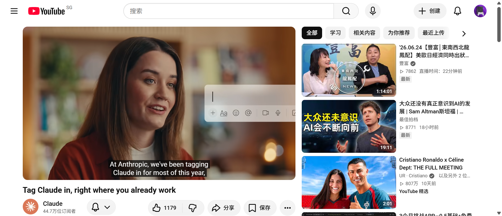
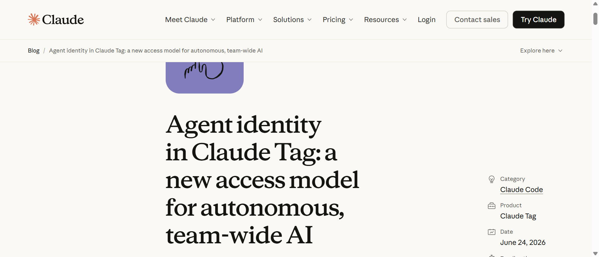

**Claude Tag + Agent Identity：在 Slack 里 @Claude，65% 代码由它生成**

<strong style="font-size:16px;color:#1a6ba0;">要点速览</strong>

- <strong>Claude Tag 是什么</strong>：Anthropic 推出的新功能，让 Claude 作为团队成员加入 Slack，任何人都可以 @Claude 委派任务  
- <strong>内部数据惊人</strong>：Anthropic 产品团队 65% 的代码由内部版 Claude Tag 创建，且已扩展到工程之外——追踪指标、处理工单、排查 Bug  
- <strong>四大特性</strong>：多人协作（频道内共享一个 Claude）、持续学习（积累频道上下文）、主动行动（环境模式下主动推送信息）、异步工作（设定任务后自主完成）  
- <strong>Agent Identity 权限模型</strong>：Claude 以自身身份行动（非用户身份），每个频道有独立权限隔离，管理员可精细控制工具/数据/记忆的作用域  
- <strong>可用性</strong>：即日起以 Beta 版面向 Claude Enterprise 和 Team 客户开放，运行在 Opus 4.8 上

---

AI 正在从"单人模式"走向"多人模式"。过去你打开一个聊天窗口，一个人跟模型对话。**现在 Claude 可以作为一个固定成员待在 Slack 频道里，谁需要谁 @它。** 这是 Anthropic 刚刚发布的 Claude Tag。

**Claude Tag 是团队使用 Claude 的一种新方式。** Claude 能作为团队成员加入 Slack，授权它访问选定的频道，连接你选择的工具、数据——甚至代码库。频道中的任何人都可以 @Claude 并委派任务给它，同时专注于其他工作。**Claude 通过记住频道中的相关信息来构建上下文，并且可以规划未来要完成的任务。**

Anthropic 认为 Claude Tag 是 Claude Code 演进的开端：**它让模型更加主动，并且与整个团队配合得更好。** @Claude 现在是 Anthropic 内部完成工作的主要方式之一。今天，产品团队 65% 的代码是由内部版 Claude Tag 创建的。同样的模式正在工程之外广泛传播——他们在用 Claude 追踪产品指标和数据、处理支持工单，甚至帮助找出棘手 Bug 的根本原因。

选择 Slack 作为首发平台，因为它是团队与 AI 之间协作的自然场所，也是 Anthropic 大部分日常工作已经发生的地方。**今天以 Beta 版形式提供给 Claude Enterprise 和 Team 客户，目标是未来扩展到更多平台。**

**@Claude 的四大超能力**

如果你用过 Claude Code 或 Cowork，Claude Tag 会让你感到熟悉。用简单的语言 @Claude 提出请求，它会将任务分解为多个阶段，然后依次完成，使用它可以访问的工具。完成后，它会在 Slack 线程中回复。

但 @Claude 带来了四个传统 chatbot 没有的优势：

**1. 多人共享。** 在给定的 Slack 频道内，只有一个 Claude 与所有人互动。任何人都可以看到它在做什么，并且可以从上一个人离开的地方继续对话。这更像是与一个队友协作，而不是在单个聊天或单个任务中工作。

**2. 持续学习。** 随着 Claude 关注其频道，它会构建更多关于工作的上下文。用户不用一遍又一遍地向它解释事情。Claude 甚至可以自动从其他 Slack 频道和数据源学习（如果被授予权限的话，它不会从私密频道报告）。**这是它能提供最佳工作的基础。**

**3. 主动行动。** 如果启用了"环境"行为，Claude 会主动让你了解它认为你可能需要知道的事情。它会从它所在的频道和连接的工具中标记相关信息，并跟进那些已经沉寂但尚未解决的线程或任务。

**4. 异步工作。** 给 Claude 设定一个任务，你可以专注于其他优先事项。它还可以为自己安排任务，在数小时或数天内自主推进项目。Anthropic 发现这特别有用：他们现在花更多时间并行地向多个 Claude 委派任务。

你也可以给 Claude 发送直接消息——它会使用你设置的个人工具和连接器私下回复。

**多人 AI 的核心难题：权限归谁？**

到这里你可能已经想到一个问题：当 Claude 待在共享频道里，同时服务多个人的时候——**它的权限应该跟谁走？**

在"单人"AI 体验中，你连接自己的 Google Drive、GitHub 和日历，Agent 以你的身份读写，这很简单。但在"多人"AI 体验中，三个工程师和一个 PM 在同一个频道里调试 Bug，**当不止一个人在指挥时，谁的权限适用？** 没有单一的"正确人选"。

Agent 自主性的增长让问题更复杂。AI Agent 能自主完成的任务时长大约每四个月翻一番。Agent 现在可以为自己安排未来的任务，并在请求者下线很久后响应事件。**传统的"以用户身份执行"模型在 Agent 自主运行数小时甚至数天后，完全失效。**

Anthropic 的答案是 **Agent Identity（Agent 身份）**——一套专门为多人、自主 AI 设计的权限模型。

**Agent Identity：Claude 以自身身份行动**

在启用了 Claude Tag 的频道中，Claude 不以单个用户的身份行动。**它在它接触的每个系统中都有自己的账户：** 在 Slack 中以 Claude 应用的身份发帖，以 Claude GitHub App 的身份打开 PR，以管理员配置的服务账户身份查询数据仓库。

因为没有个人用户凭证参与其中，共享频道永远不会成为访问某人私人文档的后门。

**权限继承体系是这样运作的：** 管理员在工作区级别定义一个身份——Claude 在任何地方都拥有的基础连接和技能集——每个频道默认继承它。然后，在需要的地方，他们可以在频道级别覆盖：

- **仓库访问**：Claude 可以读写哪些仓库
- **连接器**：Claude 用来完成工作的工具和 API 密钥，不同频道可以用不同权限级别的密钥
- **技能和插件**：Claude 动态加载的指令、脚本和资源
- **常设指令**：每个频道的自定义指令和上下文

**每个私密频道有独立的 Claude 身份**，公共频道共享工作区级别的身份。Claude 在法律频道的身份无法访问未授权的代码，它在工程频道的身份无法读取未授权的法律文档。**记忆和访问都遵循这些边界：Claude 在私密频道中学到的东西永远不会出现在更广泛的工作区中。**

**Agent Identity 的核心转变：** 将问题从"这个用户能做什么？"变成了"**这个 Agent 在这个隔离区能做什么？**"这意味着没有直接仓库访问权限的频道成员，如果频道的 profile 授予了 Claude 该权限，就可以让 Claude 读取该仓库。这听起来有点反直觉，但 Anthropic 认为这是面向自主、多人 Agent 的必要一步。

**直接消息走另一套逻辑。** DM 运行在用户个人的 claude.ai 账户上——使用他们自己的连接器、凭证和身份。这使得 DM 成为处理那些绝不应存在于频道中的任务和工具的正确场所。

**安全与审计方面**，当管理员向频道的 profile 添加连接时，凭证被独立存储并映射到该频道的身份，然后在请求时在网络边界注入。发往管理员未允许的主机的出站流量被直接阻止。每个例程、记忆写入和网络调用都被记录，并且由于 Claude 以自有服务账户行动，这些操作也会出现在每个连接系统的日志中。

**开始使用**

Claude Tag 是为团队和组织设计的：**@Claude 对敏感数据和任务特定工具的访问可以被非常严格地控制。**

系统管理员指定模型应该访问哪些工具和信息，在哪些频道中。说白了就是为不同用途创建独立的 Claude 身份——所有内容，包括它的记忆，都将限定在管理员定义的频道范围内。例如，为销售工作设置的模型不会将其记忆传递给为工程设置的模型，也不会让工程师访问任何销售数据或工具。

一旦权限设置完成，每个人都可以立即开始 @Claude。管理员可以设置 Token 消费限制（针对组织和个人频道），并且可以查看 @Claude 所做的一切的日志，以及每个任务的请求者。

如果你是 Claude Enterprise 或 Team 客户，从今天开始你就可以使用 Beta 版。只需四步：

1. 将 Claude Tag 与你的 Slack 工作区配对
2. 授予 Claude 访问你的工具的权限
3. 设置你组织的月度消费上限
4. 在私密频道中测试 Claude 以确认其正常工作

Claude Tag 取代了现有的 Slack 版 Claude 应用。管理员可以在 30 天内选择迁移。Anthropic 正在向符合条件的 Enterprise 和 Team 组织发放启动积分，以便整个公司都可以试用。Claude Tag 运行在 Opus 4.8 上。

**未来计划**包括即时凭证授权（用户可以在当下批准单个敏感操作，而不永久扩大 Agent 的范围），以及面向更复杂权限结构的身份感知覆盖层。

<strong style="font-size:15px;color:#8b6f4c;">结语</strong>

Claude Tag 最值得关注的点不是"Slack 里能 @AI"这个功能本身——Copilot for Slack 之类的东西已经存在了。真正有意思的是它背后的模式转变：从"人类打开一个 AI 聊天窗口问问题"变成了"AI 作为一个固定成员待在频道里，谁需要谁叫"。65% 的产品代码来自 @Claude 这个数字，说明在 Anthropic 内部这已经不是一个实验，而是基础设施了。  
Agent Identity 模型是这次发布里最有价值的部分。传统上权限是绑定到人的——你登录了就有权限，你没登录就没有。但 Agent 不是人，它不需要"登录"，它可以 24 小时自主运行。**把权限从"人"绑定到"频道/身份"是一个根本性的架构变化。** 这直接关系到企业敢不敢让 AI Agent 在自己的基础设施里自主行动——如果权限模型不对，要么太松（安全风险），要么太紧（Agent 什么都干不了）。Agent Identity 给出了一个中间方案：以频道为隔离单元，以管理员配置为边界。  
另外，直接消息走用户个人账户、共享频道走 Agent 自有账户的双轨设计也很聪明——既保留了个人使用的灵活性，又保证了团队协作的可审计性。

---
参考：https://www.anthropic.com/news/introducing-claude-tag
https://claude.com/blog/agent-identity-access-model
