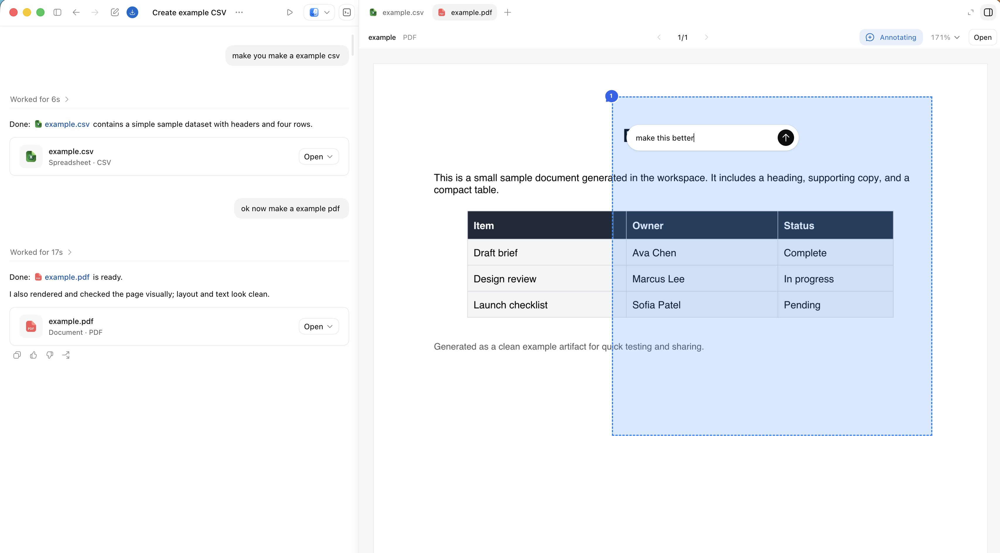
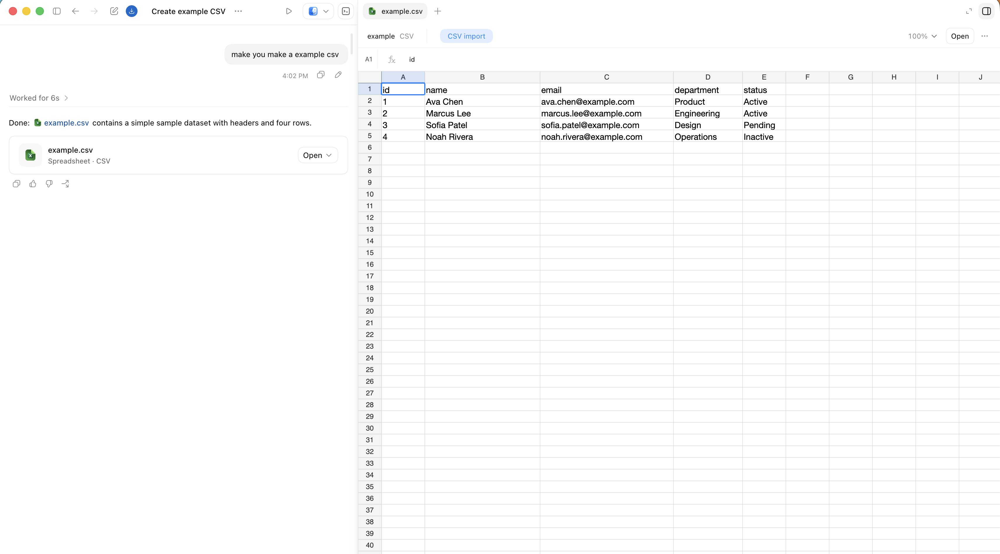
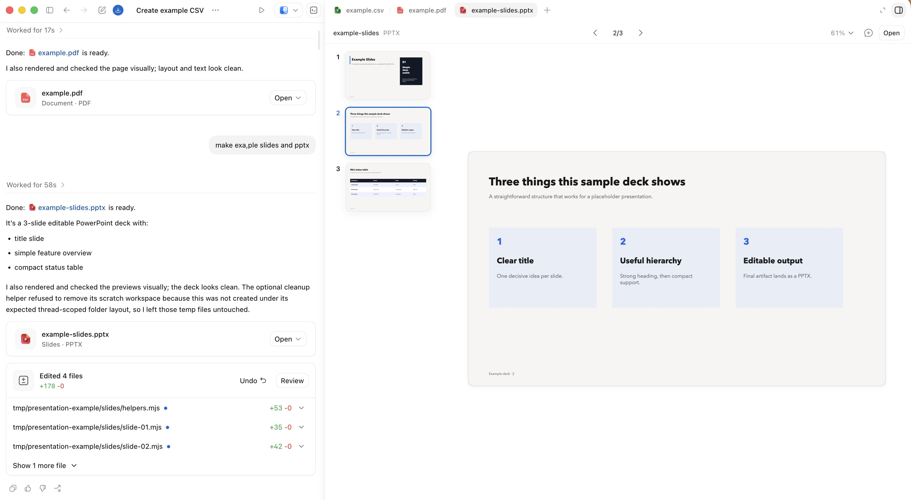

<div style="background:#e8f4fd;padding:14px 16px 10px 16px;border-radius:6px;margin-bottom:18px;">
<div style="text-align:center;margin-bottom:10px;">
<strong style="font-size:16px;color:#1a6ba0;">要点速览</strong>
</div>
<div style="font-size:14px;color:#3f3f3f;line-height:1.75;">
- <strong>Codex 的边界在扩展</strong>：从编码助手变成「做计算机工作的系统」——浏览器、桌面 GUI、MCP 服务器、自动化<br><br>
- <strong>持久线程 + 语音 + 操控/排队</strong>：线程跨会话保持上下文，语音捕捉粗糙想法，操控和排队控制正在进行的任务<br><br>
- <strong>线程自动化 + Goals</strong>：定时唤醒线程检查和推进工作，Goals 提供可验证的终点线<br><br>
- <strong>共享记忆</strong>：用 Obsidian vault 存持久上下文，AGENTS.md 定义更新规则
</div>
</div>

**大多数开发者首先用编码 Agent 做代码相关的事——检查仓库、生成 diff、跑测试、开 PR。这仍然是 Codex 的重心。但计算机上的大量工作已经通过代码来中介了：执行 shell 命令、浏览网页、调用 API、响应事件。当这些面都对接上 Codex 之后，它开始感觉不像是一个狭义上的编码助手，而更像一个做计算机工作的系统。**

Codex App 让这个转变变得具体——一个线程可以保持上下文、使用工具、展示产物、跨提示继续运行，而不是每次交互后重置。**充分利用 Codex 意味着把这些能力组合起来用：** 持久线程保留上下文；语音、操控和排队让用户还在环中时更高效；浏览器、计算机使用、MCP 服务器和连接器让 Codex 能在仓库之外行动；线程自动化和 Goals 让它在用户离开时继续工作；侧面板让用户可以在其中审查产物。说实话，读完整篇我觉得最值钱的就是「排队」那个概念。让 Agent 干完手头活自动接下一个，比手动喂指令高效太多。

**持久线程（Durable Threads）**

持久线程是长期运行的 Codex 线程，跨重复会话保留工作上下文。钉住的线程（Pinned threads）让持久线程随手可及——对重复性工作流很有用，比如参谋长线程、发布线程、文档审查线程、外部监控线程。**这些是持久的工作区，不是简短聊天。** Codex 可以随时间跨度多次访问它们，保留之前的决策、偏好和工作上下文。Command-1 到 Command-9 可以直接跳转到已保存的线程。

**语音输入（Voice Input）**

**语音输入为什么值钱。它捕捉的是想法未经压缩的粗糙版本，在它被压缩成精炼文字之前。** Codex 有内置语音输入，对说起来自然但打起来别扭的模糊起点尤其有效："我好像记得有个叫 Ben 的在 Slack 里提过这个。" "去查一下。" 对于一个能搜索、收集上下文并回报的 Agent 来说，这往往已经够了。对于任务成型前的两到三分钟思路倾泻，一段原始的会议转录或口述的规划笔记，往往比一段简短摘要提供更好的素材——因为它保留了不确定性、重点和未完成的思路线。**语音输入最有用的不是全覆盖，而是任务起步时的模糊思路捕获——先把粗糙的想法倒出来，让 Agent 自己去搜索和填充上下文，用户在思维刚成型时不需要把话说完。**

**操控和排队（Steering and Queuing）**

当语音与对活动任务的显式控制配合使用时，会更管用。**操控（Steering）** 在当前步骤完成之前，用新方向中断正在进行的 Codex 任务——在 Agent 正朝错误方向前进时需要修正时很有用。比如审查网站时，用户可以在侧面板上标注界面的同时中断工作："这个做小一点" "这两个元素之间的间距感觉不对" "这个文字是错的"。

**排队（Queuing）** 在当前步骤完成后，为 Codex 添加新工作——不会中断正在进行的任务，而是把下一个任务加到队伍里。用户可以说："等工作做完，把预览链接发到 Slack 给审阅者。" **操控改变 Codex 现在正在做的事。排队改变下一步应该发生什么。两者都让用户在事情进行中保持接近——操控是针对当前步骤的修正，排队是针对未来步骤的安排。**

**工具和覆盖范围（Tools and Reach）**

一旦线程有了连续性，下一个问题就是它能做什么。Codex 可以向外分层推进：`$browser` 侧面板内应用内浏览器；`@chrome` 已登录的浏览器状态；`@computer` 只存在于桌面 GUI 中的任务。**MCP 服务器和连接器把同一套思路延伸到工作流的其他部分——Slack、Gmail 和 Calendar 重要，因为许多重要任务首先以消息、收件箱条目或调度问题的形式出现，然后才变成代码。**Skills 让重复的工作流变得可复用**——一旦一个工作流被证明有用，把它打包成一个 skill，这样 Codex 可以在不重新学习整套流程的情况下再次运行它。**

**Codex 移动 App 改变了用户必须在桌前才能工作的情况。** 一个任务可以在 Mac 上启动——文件、权限和本地设置已经在那里了——然后用户通过手机查看时继续运行。**本地环境保持就位；用户不需要在场。**

**自动运行（Automations）**

Automations 按计划运行 Codex 工作。当重复性工作应该从一个工作区重新开始时，用 scheduled automation。当计划应该返回到一个活跃的对话及其运行中的上下文时，用 thread automation。

**线程自动运行（Thread automations）** 是心跳式的周期性唤醒调用，按计划返回到同一个 Codex 线程。一个线程自动运行可以每隔几分钟或几小时检查一次，持续直到满足某个条件，并随时间调整节奏。一个参谋长线程可能每 30 分钟运行一次：检查 Slack 和 Gmail 中需要关注的未回复消息，排好优先级。**当用户回来时，收集上下文的昂贵部分往往已经完成了。人仍然决定什么被发出去。**

线程自动运行也适合反馈循环——审阅者在 Slack 中分享一个视频，线程自动运行按计划检查线程，在评论到达时渲染更新版本，并在同一线程中回复并标记审阅者。如果一个集成无法完成最终上传，桌面自动运行可以通过 GUI 完成这个步骤。**这个 loop 跨越了 Slack（反馈）、代码库（渲染）和桌面自动运行（最终上传），形成了跨系统的全自动反馈链路。**

**Goals**

当任务有一条 Agent 能持续推进的终点线时，Goals 最强大。一个弱目标："实现这个 Markdown 文件中的计划。" **一个更强的目标有可衡量的成功标准。** 例如，将一个内部工具从 Python 迁移到 Rust——新的实现在单元测试通过之前不算完成。一个 goal 将持续执行与一个验证器结合起来——用户定义结果、停止条件，以及表明 Codex 是否在接近目标的信号。有用的验证器包括：测试套件、基准测试、bug 复现步骤、验证矩阵、端到端工作流。**有雄心是好的，但没有验证就只是愿望。**

**侧面板（The Side Panel）**

**侧面板把工作放在产生它的对话旁边。** 不是导出产物并切换上下文，用户可以在原地审查它。输出可能是代码，但也可能是演示文稿、PDF、浏览器页面、表格。它擅长四个工作：检查产物、标注需要修改的内容、操作网页界面、审查变更。

在 Codex 中的应用内浏览器让 Codex 可以检查渲染后的页面、控制它，并直接在正在审查的界面上响应标注。**网页既是输出又是控制平面。** Codex 可以构建一个产物，在侧面板中打开它，检查它，调试它，并不断在原地优化同一个对象。这些界面尤其好用：index.html（轻量级静态产物）、Storybook（UI 审查）、Remotion Studio（程序化动画）、基于浏览器的幻灯片演示、数据分析工作流的数据应用。**一个单独的 index.html 文件可以变成一个持久的交互式产物，不需要服务器。** 线程自动运行也可以随时间刷新静态产物，这样当用户回来时线程有新的东西在等着。说实话，我最喜欢这个模式——它把浏览器变成了 Agent 自己的输出终端。




**共享记忆（Shared Memory）**

**长期运行的线程当它们在单次对话之外共享记忆时会变得更加有用。共享记忆是存储在单个线程之外、使未来的工作可以从显式且可审查的内容继续进行的持久上下文。**

一个持久的模式是将持久线程锚定在一个 Obsidian vault 中——一个纯文本文件夹，始终保持检查、编辑、移动和长期保存的便利性。团队可以将该文件夹存储在云存储、Git、Dropbox、Google Drive 或其他同步层中。一个 vault 可能看起来像：

```text
vault/
├── TODO.md
├── people/
├── projects/
├── agent/
└── notes/
```

**仓库存放代码。Vault 存放滚动上下文：** 涉及到的人、什么变了、什么被阻塞了、什么需要跟进、以及那些否则会在会话之间消失的信息。重要的上下文不应该只存在于对话记录中——把它写下来，让下一个线程能接上。**不要照抄某个 vault 结构。教 Agent 持久上下文应该存在哪里、应该保留什么上下文、以及什么时候不要制造变动。** 一个实用的 AGENTS.md 可能这样写：将 ~/vault 视为持久工作记忆；优先使用规范笔记而非笔记泛滥；将 TODO、人、项目、每日摘要和草稿笔记明确分配；保留决策、阻塞项、负责人、日期和有用的链接；如果没有有意义的变化，不要变动 vault。



Codex 也有第一方的记忆功能，在 Settings > Personalization > Memories 中找得到。它们存偏好、重复工作流和已知陷阱。**这些功能补充显式的书面上下文，而不是替代它。** Chronicle 也在朝同一方向推进，帮助 Codex 从最近的屏幕上下文中构建记忆——为那些不会自然写进 vault 的交互提供了一个轻量级的记忆层。

**从代码向外延伸**

**Codex 仍然从代码出发。但更多围绕代码的工作现在可以通过同一个系统触及了：MCP 服务器、浏览器界面、桌面控制、线程自动运行和可审查的产物。** 这改变了控制模型——操控中断进行中的工作，排队排列下一个任务，线程自动运行在用户离开时保持线程活跃，Goal 为 Codex 可以持续推进的目标添加一条具体的终点线。**Codex 现在可以将一个工作流从指令带到执行再到产物审查，即使当工作离开了仓库。** 从编码开始，扩展到浏览器、计算机、MCP 服务器、Slack、Gmail、Calendar——许多重要任务首先以消息、收件箱条目或调度问题的形式出现，然后才变成代码。

---

<div style="background:#f5f0eb;padding:14px 16px 10px 16px;border-radius:6px;margin-bottom:16px;">
<div style="text-align:center;margin-bottom:8px;">
<strong style="font-size:15px;color:#8b6f4c;">结语</strong>
</div>
<div style="font-size:14px;color:#3f3f3f;line-height:1.75;">
这篇文章最值得注意的不是功能列表——是 jxnlco 给这些功能排的优先级。他把「共享记忆」放在最后，把「从代码向外延伸」放在最后一段，暗示了他的判断：Codex 的根仍然是写代码，但它的价值正在从「写代码」移到「围绕代码做一切」。线程自动化 + Goals + 共享记忆这三件套在一起时，才真正形成了一个不需要人在环中的工作系统。<br><br>
那个 AGENTS.md 的建议值得单独记下来——「如果没有有意义的变化，不要变动 vault」是一条被低估的设计原则。Agent 的最大隐患从来不是能力不够，是太勤快。
</div>
</div>

---
<span style="font-size:12px;color:#888888;">参考：https://x.com/jxnlco/status/2057153744630890620</span>
