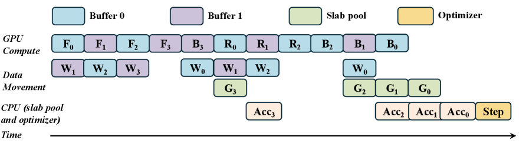
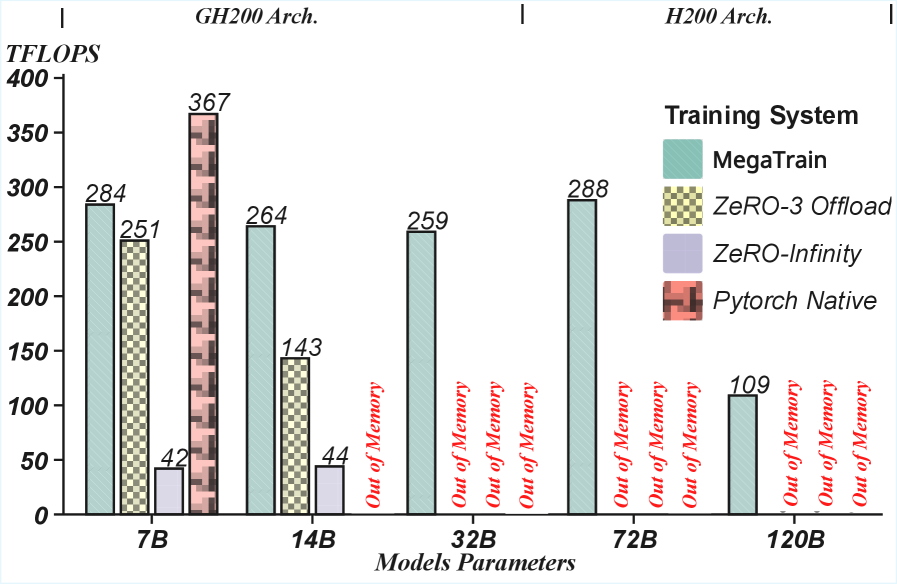
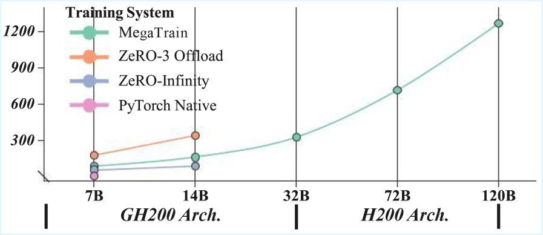
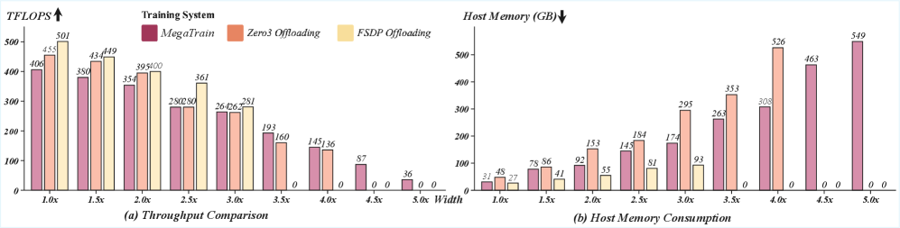

<strong style="font-size:16px;color:#1a6ba0;">要点速览</strong>

- <strong>CPU 内存当主仓库，GPU 只做计算引擎</strong>：MegaTrain 颠覆了传统训练系统的内存架构：参数和优化器状态全部放在 CPU 内存（DDR），GPU 只作为瞬时计算引擎，用完即释放，把显存需求从"模型规模"解耦为"单层大小"  
- <strong>双层流水线 + 无状态模板</strong>：通过三路 CUDA 流（参数预取、计算、梯度回传）叠加双缓冲乒乓策略，隐藏 CPU-GPU 数据传输延迟；用无状态层模板替代持久化 autograd 图，消除全局计算图的显存开销  
- <strong>单卡 120B 参数全精度训练</strong>：在 H200（141GB HBM + 1.5TB DDR）上全精度训练 120B 参数模型；14B 规模吞吐达 ZeRO-3 Offload 的 1.84 倍；GH200 上支持 512K token 超长上下文

---

大模型训练面临一个矛盾：**后训练阶段（指令微调、对齐、领域适配）的计算量其实不重，单节点就能搞定，但显存放不下。** 论文中引用了一组数据：167 所美国大学中，只有 2 所达到了平均每个 CS 学生能分到一张 H100。当 GPU 极度稀缺时，把 100B+ 参数的模型全部塞进显存里训练，对绝大多数团队来说是奢望。

但问题出在**一个被低估的资源上**：CPU 内存（DDR）。一台服务器随便插几条内存条就是 1-2TB，成本是 HBM 的十分之一。问题是 CPU-GPU 之间的 PCIe 带宽只有 128GB/s（H200）或 900GB/s（GH200 NVLink-C2C），跟 HBM 的 4-5TB/s 完全不是一个数量级。

**MegaTrain 的核心思路就是把参数从 GPU 显存搬到 CPU 内存，GPU 只做瞬时计算，用完了就清掉**。每层计算时把参数从 CPU 流进来，算完立刻释放，梯度也马上传回 CPU。这个设计让显存占用从"跟模型总大小挂钩"变成了"跟单层大小挂钩"，彻底解耦。

MegaTrain 系统架构：CPU 内存是持久参数仓库，GPU 是瞬态执行引擎，通过异步参数流和梯度回传进行层式计算

但参数搬出显存只解决了容量问题，**PG 性能才是真正的瓶颈**：每秒 128GB 的 PCIe 带宽怎么喂饱每秒能算几万亿次浮点运算的 GPU？MegaTrain 的答案是两层优化。

**第一层：三流流水线 + 双缓冲。** 传统的做法是"把参数搬进来→算完→搬出去→再搬下一层"，每一步都等着前一步做完。MegaTrain 开了三条 CUDA 流：**WeightStream（参数预取）、ComputeStream（计算）、GradStream（梯度回传）**。再加上双缓冲轮替：计算流用 Buffer 0 算第 i 层时，WeightStream 已经在往 Buffer 1 里搬第 i+1 层了。三流并行，参数传输的延迟被完全隐藏在计算背后。

端到端流水线执行时序：参数预取（W）、计算（F/R/B）、梯度回传（G）三流叠加，CPU 上的梯度累积（Acc）异步进行

**第二层：无状态模板绑定。** PyTorch 的 autograd 机制默认会构建一张全局计算图，假设所有参数和中间激活在整个训练过程中都驻留在显存里。但在逐层流式训练中，参数算完就被赶走了，全局计算图这个概念本身就失去意义。MegaTrain 的做法是维护一组**无状态的层模板**（每个模板就是一个空的计算核，没有持久的权重指针），每次要算某一层时，把刚从 CPU 流进来的权重动态绑定到模板上。算完一层，模板复位，等下一层权重。这消除了全局 autograd 图带来的元数据开销。

整个训练循环分为三个阶段：

**流式前向**：参数逐层从 CPU 流进 GPU 权重缓冲区；计算流立即绑定并执行该层；每 K 层设一个激活检查点（供反向时重计算用）；每层算完立即释放权重缓冲区。

**流式反向**：按反向块顺序执行。每个块从检查点开始，先正向重计算该块内所有层的激活值（`RecomputeBlock`），再反向逐层计算梯度（`LocalBackward`），每算完一层的梯度立刻通过 GradStream 传回 CPU。

**CPU 优化器更新**：参数、梯度、动量全部在 CPU 端，用 Adam 在 CPU 上执行更新。作者引用 ZeRO-Offload 的观察：优化器更新是 I/O 密集型而非计算密集型，在 CPU 上做反而避免了把优化器状态来回搬运的额外开销。

不同模型规模下的持续 TFLOPS：MegaTrain 保持高效稳定，Offload 基线在模型变大时因显存受限而下降甚至崩溃

来看结果。**在一张 H200（141GB HBM + 1.5TB DDR）上，MegaTrain 稳定训练到 120B 参数模型。** 在 GH200 上，**14B 规模的训练吞吐达 ZeRO-3 Offload 的 1.84 倍**，32B 规模持续超过 250 TFLOPS。此时 Offload 基线已经 OOM 了。

深度扩展方面，在 48 层（2.7B）到 180 层（10B）的范围内，MegaTrain 始终保持 350-400 TFLOPS 的高效区间，而 ZeRO-3 和 FSDP 在层数增加时吞吐逐渐下降，最终因主机内存耗尽而 OOM。

深度扩展测试：MegaTrain 在所有层数下保持高吞吐，Offload 基线随深度增加性能衰减并最终 OOM

宽度扩展方面，从 1.0× 到 5.0× 宽度，MegaTrain 的吞吐下降最平缓（35%），而 ZeRO-3 和 FSDP 分别下降了 42.4% 和 43.9%，且在 4.0× 后双双 OOM。

宽度扩展测试：MegaTrain 退化最慢，在更宽模型中保持可行，主机内存增长也低于 Offload 基线

**超长上下文测试**显示，从 1K 到 512K token，MegaTrain 的 TFLOPS 从 264.8 持续提升到 407.4：更长序列意味着更大的 attention 计算量、更高的算术强度，硬件利用率反而更好了。显存占用稳定在 62-88GB 之间，没有出现激活爆炸。这是因为逐层执行的设计让激活只驻留一层，不随序列长度线性增长。

在消费级硬件上：**RTX 3090（24GB）上成功训练 14B 模型**（30.19 TFLOPS），而 ZeRO-3 Offload 在同样设置下直接 OOM。**A6000（48GB）上达到 56.82 TFLOPS**，批大小可达 9-15，显存利用率超过 93%。

<strong style="font-size:15px;color:#8b6f4c;">结语</strong>

MegaTrain 的核心观点很清晰：<strong>大模型训练的瓶颈是内存系统没有被充分利用，而非 GPU 算力不够。</strong> 当参数从"持久驻留"变成"流式穿过"之后，连 RTX 3090 这种消费级显卡都能训 14B 模型。这个思路在推理侧已经被广泛验证了（llama.cpp 的 offloading、各种推理加速方案），但在训练侧，MegaTrain 的系统级实现填补了一个重要空白。  
当然也有明显局限：它依赖足够大的主机内存（120B 模型需要 1.5TB），且优化器更新全部在 CPU 上做，对 CPU 性能有一定要求。作者在多卡扩展和 SSD 分层存储上留了伏笔。如果这些方向都能落地，万亿参数模型在普通工作站上训练是可能的。

---

参考：

https://arxiv.org/abs/2604.05091
