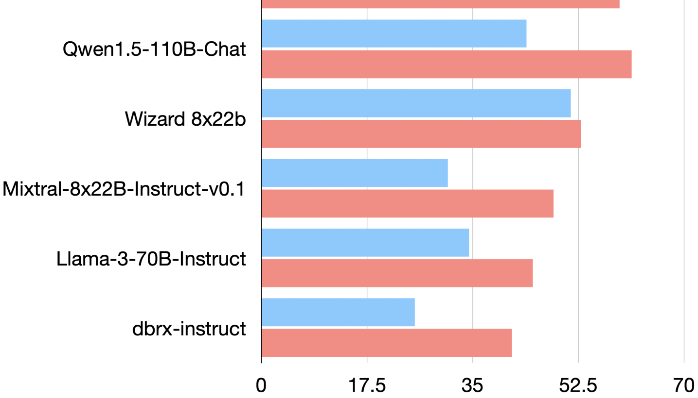
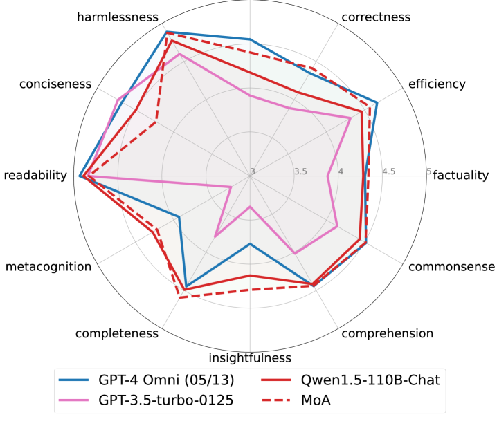
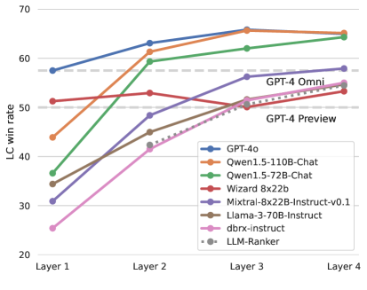
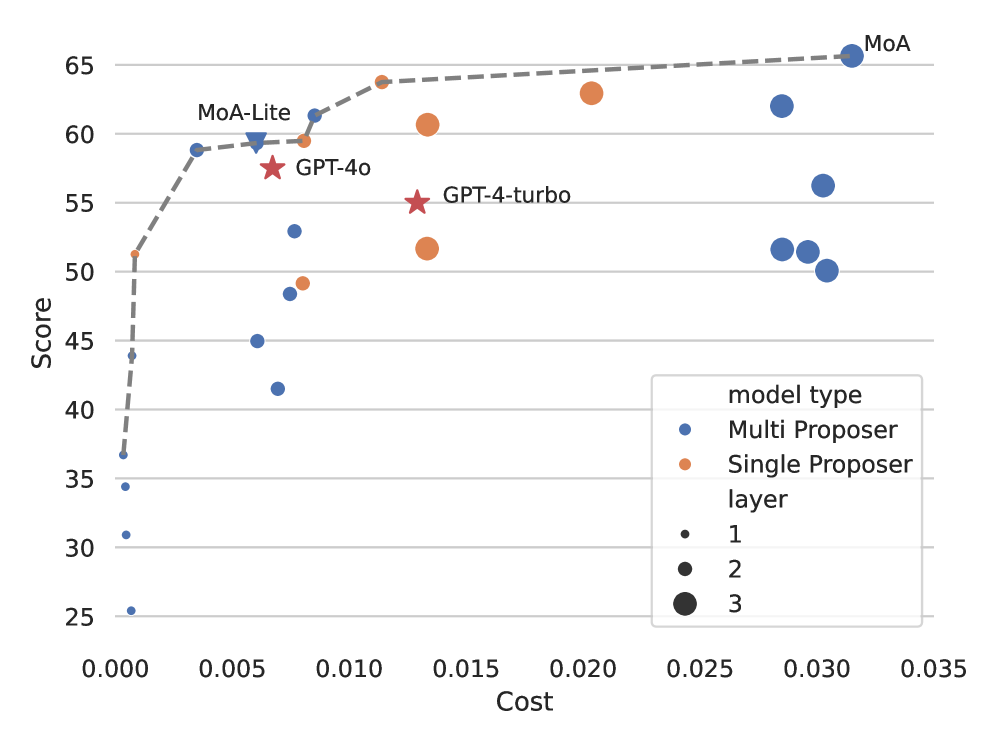
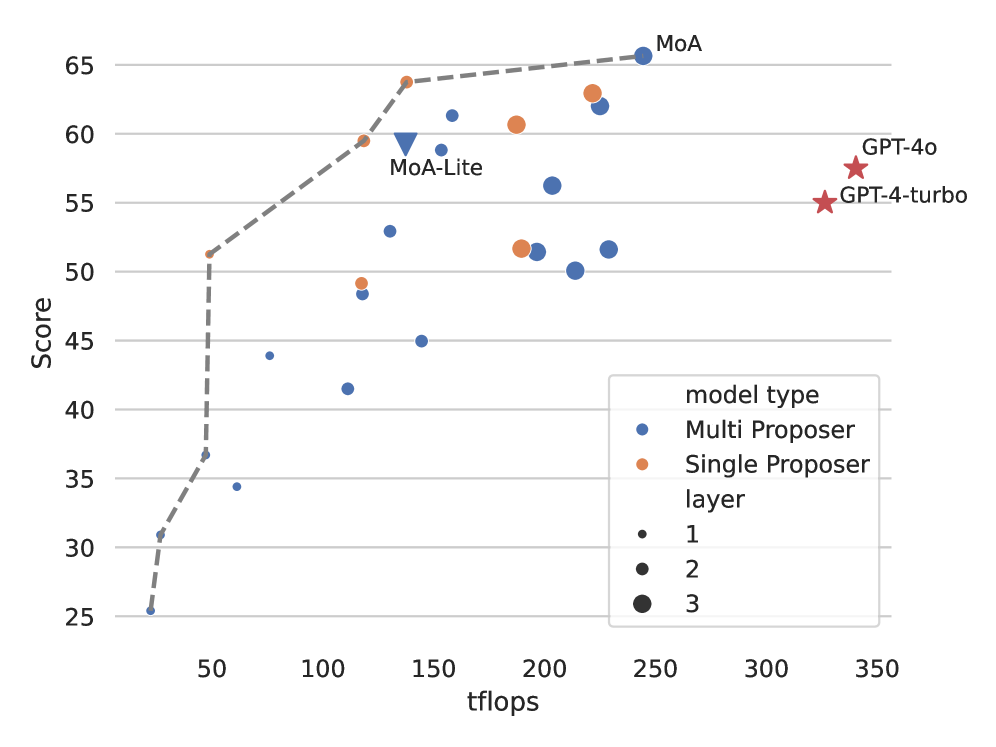
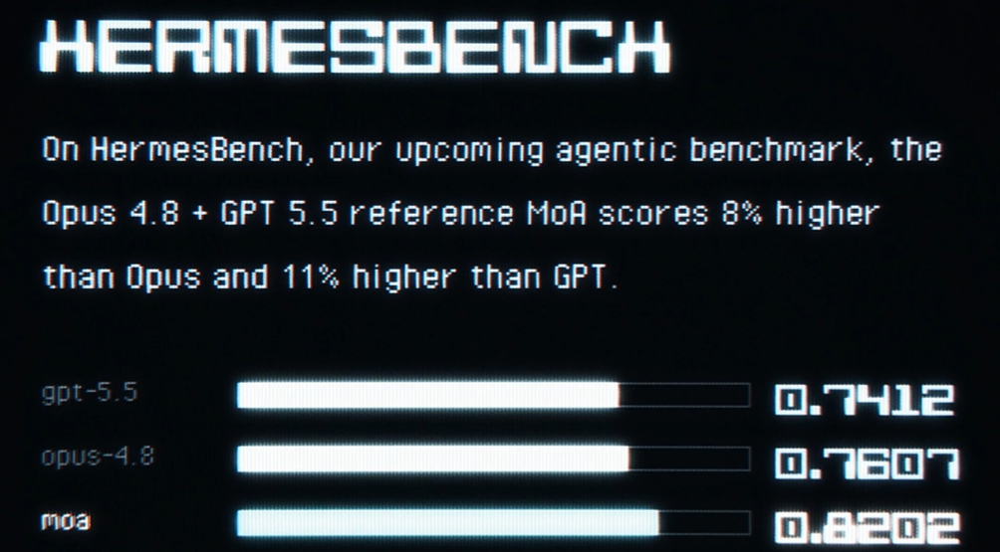

<strong style="font-size:16px;color:#1a6ba0;">要点速览</strong>

- <strong>单模型天花板到了，多模型协作才是出路</strong>：Together AI 提出的 MoA（Mixture-of-Agents）方法，通过多层多 Agent 架构，仅用开源模型就让 AlpacaEval 2.0 LC win rate 从 GPT-4 Omni 的 57.5% 飙到 65.1%  
- <strong>开源模型的「协作性」比想象中强</strong>：即便辅助模型输出质量较差，LLM 仍能从中受益：这意味着你不需要每个 Agent 都是顶配  
- <strong>Hermes Agent 已原生支持 MoA Preset</strong>：多个参考模型提供建议，一个聚合模型执行操作，效果据称比 Opus 4.8 高 8%、比 GPT 5.5 高 11%  
- <strong>性价比 Pareto 最优</strong>：MoA-Lite 在匹配 GPT-4o 成本的同时质量更高，MoA 比 GPT-4 Turbo 好 4% 但成本低一半多

你有一个 Prompt，你把它扔给 GPT-4o，GPT-4o 给出一个回答。这就是最常见的 LLM 用法：一个模型独立完成所有推理。

但如果你把这个 Prompt 同时发给 6 个不同的模型，让它们各自生成一个回答；然后把这些回答打包，交给第 7 个模型，让它综合所有观点，给出一个最终的、更高质量的回复：会怎样？

结果就是：**仅用开源模型，就能在主流评测上超越 GPT-4 Omni 近 8 个百分点。**

这是 Together AI、Duke、Stanford、芝加哥大学联合提出的 **Mixture-of-Agents（MoA）** 方法，发表在 arXiv:2406.04692。同时 **Nous Research 的 Hermes Agent 已经在产品中原生支持 MoA Preset**，让你直接开箱即用这种多模型协作能力。

## LLM 的「协作性」：一个反常识的发现

先看一个实验。研究人员把 6 个主流 LLM 各自对 AlpacaEval 2.0 的 response 混在一起，然后把每个模型的输出作为「辅助信息」喂给其他模型。结果有点意思：**几乎所有模型在看到其他模型的输出后，自己的生成质量都提升了。**

图1：6个主流模型在有/无辅助响应时的 LC win rate，所有模型在参考其他模型输出后均提升

更有意思的是：**即使辅助输出的质量低于模型自己独立生成的水平，提升依然存在。** 这个现象被作者命名为 LLM 的「协作性」（collaborativeness）。

这个发现引出了 MoA 的核心架构设计：把 LLM 分为两个角色：

- **Proposers（提议者）：** 擅长生成参考 response。好的 proposer 不一定要自己得分高，但必须提供丰富的上下文和不同的视角
- **Aggregators（聚合者）：** 擅长把多个 response 合成为一个高质量输出。好的 aggregator 即使看到质量不高的输入，也能保持输出水准

论文中的实验数据表明，**GPT-4o、Qwen1.5、LLaMA-3 在两种角色上都表现优秀，而 WizardLM 作为 proposer 很出色但 aggregating 能力偏弱。**

## MoA 架构：多层多 Agent 的迭代精炼

MoA 的结构就像一个多层级的智囊团。第一层的多个 Agent 各自独立生成回答；然后将所有回答打包交给第二层；第二层的 Agent 在看过第一层的所有回答后，生成自己的回应；以此类推。

图2：MoA 架构示意图，展示 4 层 MoA 每层 3 个 Agent 的协同链路

数学上，给定输入 prompt x1，第 i 层输出 yi 可以描述为：

yi = 聚合(Ai,1(xi), Ai,2(xi), ..., Ai,n(xi)) + x1

这里的「聚合」使用一个专门的 prompt，要求 LLM 综合所有输入 response 来生成一个精炼版本。

**关键细节：** Aggregator 不只是选一个最好的 response 来用。论文通过对比实验证明，MoA 显著优于 LLM ranker（即让模型从候选输出中选一个最满意的）。Aggregator 在真正地做「综合」：它会从每个 response 中提取精华部分，融合成更好的整体。

## 用开源模型吊打 GPT-4 Omni

在 AlpacaEval 2.0 上，MoA 的表现很亮眼。实验采用 6 个开源模型（Qwen1.5-110B-Chat、WizardLM-8x22B、LLaMA-3-70B-Instruct、Mixtral-8x22B-v0.1 等）作为 proposer，Qwen1.5-110B-Chat 作为最终 aggregator：

AlpacaEval 2.0 LC win rate 得分对比，MoA 65.1% 领先 GPT-4 Omni 的 57.5%

| 模型 | LC win rate |
|------|------------|
| **MoA w/ GPT-4o** | **65.7%** |
| **MoA（仅开源）** | **65.1%** |
| **MoA-Lite（2层）** | **59.3%** |
| GPT-4 Omni | 57.5% |
| GPT-4 Turbo | 55.0% |
| WizardLM 8x22B | 51.3% |
| Qwen1.5 110B Chat | 43.9% |

**MoA w/ GPT-4o 以 65.7% 排名第一**，纯开源 MoA 以 65.1% 紧随其后。最有说服力的是 MoA-Lite：只用 2 层，aggregator 换成更小更强的 Qwen1.5-72B-Chat，依然以 59.3% 超过了 GPT-4 Omni 的 57.5%。

在 MT-Bench 上，MoA w/ GPT-4o 拿到 9.40 分，MoA 9.25 分，GPT-4 Turbo 9.31 分。

在细粒度评测 FLASK 上，**MoA 在 robustness、correctness、factuality、insightfulness、completeness 等维度显著领先 GPT-4 Omni**，唯一的薄弱点是 conciseness：输出略微冗长，毕竟它综合了 6 个模型的答案。

FLASK 12 维度技能评分对比，MoA 在绝大部分维度上优于 GPT-4 Omni

## 什么让 MoA 效果好？

论文做了大量消融实验，几个发现值得关注：

**多样性的价值 > 单个模型的质量。** 对比「6 个不同模型」和「6 次相同模型（高温度采样）」两种配置，6 个不同模型的效果全面领先。不同模型从不同角度理解问题，异构性本身就是信息增益的来源。

**Agent 数量越多效果越好。** 从 n=1 到 n=6，LC win rate 单调递增（47.8% → 61.3%）。即使使用同一个模型生成多个候选，n=6（56.7%）也显著高于 n=1（47.8%）。

不同聚合器的 LC win rate 对比（左）及 BLEU 相似度与胜率的 Spearman 相关性（右）

**模型角色有天然分工。** 有些模型（Qwen、LLaMA-3）既能当 proposer 也能当 aggregator，而 WizardLM 作为 proposer 贡献巨大（63.8%）但作为 aggregator（52.9%）远不及 Qwen（61.3%）。这说明**选对角色比选对模型本身更重要。**

## 性价比：Pareto 前沿上的最优解

论文做了详细的预算分析。当把 LC win rate 与推理成本画在一起时，发现 MoA 和 MoA-Lite 正好落在 Pareto 前沿上：**在同等的性能水平上，MoA 的成本是最低的。**

LC win rate vs 推理成本对比，MoA 和 MoA-Lite 落在 Pareto 前沿上

LC win rate vs tflops 消耗对比

MoA 比 GPT-4 Turbo 高出约 4 个百分点，同时成本效益是后者的两倍以上。MoA-Lite 在匹配 GPT-4o 成本的同时，质量更高。

## Hermes Agent 的原生 MoA 实现

论文是理论，但 Nous Research 已经把它变成了可以用产品。就在昨天，**Hermes Agent 正式发布了 MoA Preset 功能**，将其暴露为虚拟模型，让用户可以直接在 Agent 中使用多模型协作。

Hermes Agent MOA preset 配置界面（来源：tonbistudio）

工作原理上，Hermes 的 MoA 模式引入了两类模型：
- **参考模型（Reference models）：** 读取对话并提供思考和建议，但没有工具访问权限，不会直接回复用户
- **聚合模型（Aggregator）：** 看到正常对话 + 参考模型的私有建议，然后真正做出工具调用并写最终回复

从 Hermes 的视角看，聚合模型的输出就是模型自身的响应，所以 `/goal` 等工作流命令完全兼容。

据 Nous Research 官方数据，**Hermes 的 MoA Preset 比 Opus 4.8 高 8%，比 GPT 5.5 高 11%**（基于他们自己的评测基准）。MoA 论文用的是 2024 年中的模型，Hermes 的实现则用了当前最强的模型作为基座，这个提升幅度是基于最新模型加权的结果。

## 局限性

MoA 并非万能。最明显的短板是 **TTFT（Time to First Token）：由于需要等所有 proposer 完成第一轮生成，模型的第一个 token 迟迟不能输出。** 对于流式应用来说，这是一个取舍。

论文也指出，部分模型（如 dbrx-instruct）作为 aggregator 时效果不佳（41.5%），但其作为 proposer 的贡献（55.1%）仍然可观。**在 MoA 体系中，选一个「全面型选手」做 aggregator 比选一个「偏科型选手」重要得多。**

<strong style="font-size:15px;color:#8b6f4c;">结语</strong>

MoA 告诉我们，「堆更多的模型」不是重点，关键是「模型之间的协作本身就是一种智能」。当一个模型看到另一个模型的输出时，它不只是参考信息——它在学习从不同的视角审视同一个问题。这个能力是 LLM 本身固有的，不需要微调，不需要特训，只要正确的 Prompt 设计就能激活。  
如果单个模型已经足够强，为什么多个模型协作会更进一步？答案可能在于视角的多样性：每个模型在训练数据、alignment 路径、架构选择上的差异，都让它对同一个问题有着不同的偏好和盲区。MoA 把这些盲区互为补充，说白了就是用群体的智慧弥补个体的偏见。  
Hermes Agent 把 MoA 做成 Preset，让开发者不需要了解论文细节就能享受多模型协作的红利。对于 AI 编码工具用户来说，这意味着你可以在同一个会话中同时获得多个模型的优势——比如一个模型擅长推理，一个擅长代码生成，另一个擅长格式把控，而不需要在工具间切来切去。

---
参考：

https://arxiv.org/html/2406.04692v1
https://x.com/tonbistudio/status/2070626555710320648
https://x.com/NousResearch/status/2070626555710320648
