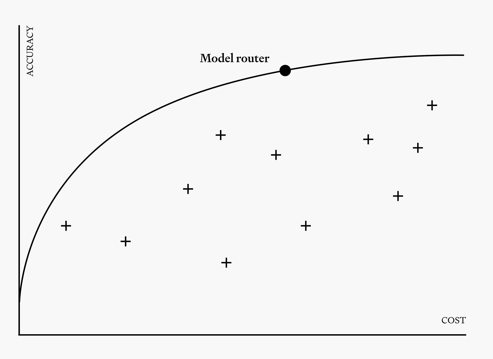

<strong style="font-size:16px;color:#1a6ba0;">要点速览</strong>

- <strong>模型路由 vs 网关</strong>：网关让你能访问模型（统一 API、认证、计费），路由器决定用哪个模型（优化成本/质量/延迟）。两者不是竞争关系，生产栈需要两者  
- <strong>路由对 Agent 至关重要</strong>：单个 Claude Code 会话每分钟消耗 100 万 token，公司年度编码 Agent 预算不到一个季度烧完。路由是唯一能在不牺牲质量的前提下大幅降低支出的方案  
- <strong>缓存感知路由是最容易被忽视的关键</strong>：不了解缓存的路由器可能把你路由到"更便宜的模型"，但新模型无缓存重新处理整个上下文，总成本反而更高。缓存感知是 Agent 路由与聊天路由最主要的区别  
- <strong>六种路由技术</strong>：启发式→语义→LLM基础→复杂度分类器→预测性→级联。生产路由器通常是组合式：级联叠加预测分类器

**模型路由正迅速成为现代 AI 基础设施最重要的层之一。** 原因很直接：Agent 推理支出正在爆炸。一个 Claude Code 会话能在几分钟内消耗 100 万 token，按这个速度，许多公司的年度编码 Agent 预算在不到一个季度内烧完。与此同时，前沿模型越来越贵，但便宜模型也在变好，这意味着你不用前沿模型的地方越来越多。

Not Diamond 刚刚发布了一篇全面的模型路由指南，从基础概念到技术选择到实际评估，覆盖了你想知道的一切。以下是核心提炼。

## 基础概念：网关不是路由器

这两个术语经常被混用，但区别很简单：**网关让你能访问模型，路由器决定用哪个模型。**

网关的价值是整合：统一 API 接口、跨厂商认证、标准化格式、统一计费。但网关不决定用哪个模型，这个决策硬编码在你的应用里。路由器的价值是优化：它接收请求并动态选择处理它的模型，目标是让简单请求便宜处理、复杂请求交给强模型。

两者不是竞争关系。生产级 AI 栈需要两者：先通过网关访问模型池，再通过路由器做智能选择。

模型路由的帕累托曲线：在成本和质量之间找到最优平衡

## 路由在 Agent 栈中的四层结构

一个好的路由方案不是"一个决策做到底"。**路由应该在 Agent 工作流的多个层级发挥作用：**

**会话级。** 修 typo 的会话和重构模块的会话需要不同的模型锚定。有些团队用简单规则分类（提示长度、用户等级），但更智能的做法是用分类器判断复杂度。

**Sub-agent 级。** 编码框架经常启动 sub-agent 并行工作或隔离子任务。每个 sub-agent 有自己的上下文和需求画像。Sub-agent 级路由为每个生成的 worker 选择合适的模型。

**任务级。** 规划任务不同于代码生成，不同于做摘要。用户也可能在会话中途切换任务。任务级路由为每个工作单元选择正确的模型。

**步骤级。** 在一个任务内，单步的变化可能更大：解释工具调用结果与提出修复的推理步骤有完全不同的需求。

## 缓存感知：被忽视的关键

这是路由领域最容易被忽视但可能最重要的问题。**不了解缓存的路由器是在用一个误导性的成本函数做决策。**

当 Agent 发送带有大共享前缀（历史消息、系统提示、工具 schema）的请求时，provider 会缓存这个前缀，后续命中只收标准输入价格的约 10%。如果路由器把前十轮发给模型 A，下一轮切换给模型 B，新模型必须无缓存地重新处理整个上下文，**总成本可能超过一直留在更贵的模型上**。

真正的缓存感知路由器应该：
- 追踪缓存何时真正"热"、何时因 TTL 过期（通常 5 分钟）、上下文压缩、媒体附件或前缀编辑而失效
- 权衡缓存经济性和路由经济性：短会话不需要考虑缓存保持，强模型+多个便宜模型的组合可以只让强模型保持热缓存

一个在单轮评估中表现很好的路由器，可能在真实编码会话中失去所有纸上节省，因为它没考虑缓存。这是 Agent 工作负载路由与聊天路由最主要的区别。

## 六种路由技术对比

**启发式路由。** 基于关键词、提示长度、正则模式做规则。设置快但脆弱，难以处理语义细微差别。

**语义路由。** 用示例短语的向量嵌入做余弦相似度匹配。比关键词更健壮、可扩展、理解语义，但依赖示例短语的质量和维护。

**LLM 基础路由。** 用 LLM 读输入做分类。灵活、能处理细微差别，但自相矛盾：每次路由决策本身就要一次 LLM 推理调用，正好抵消了你路由想节省的代价。

**复杂度分类器路由。** 训练一个小分类器估计请求难度。快速便宜，但复杂度是粗糙信号：两个相同难度的请求可能适合完全不同的模型。

**预测性路由。** 学习模型预测每个候选模型的表现，选择最佳结果。数据驱动，最能利用帕累托前沿，但构建难度最高，需要好的训练信号和衡量方法。

**级联路由。** 先发给最便宜的模型，质量不够好就升级。保守成本并提供自然质量保障，但需要验证机制比便宜模型本身还便宜，且不适合延迟敏感场景。

生产系统中这些技术通常是组合使用的：级联叠加预测分类器，或语义路由加上确定性关键词回退。

---

<strong style="font-size:15px;color:#8b6f4c;">结语</strong>

这篇指南最有价值的部分不是技术细节，而是它点出了一个行业阶段转折：**路由正在从"可选的优化手段"变成"必要的核心基础设施"。** 当你花几千美元在 API 上时，写几个 if/else 规则就够了。当你每月烧几十万美元时，你需要的不是一个开关，而是一个持续优化的系统。  
结合之前翻译的 Devin Fusion 文章，两条线索正在汇聚：Cognition 从"怎么做路由"的角度给出了具体实现（Sidekick + 动态会话中路由），Not Diamond 从"为什么要路由和路由长什么样"的角度给出了全景图。两篇一起读，基本能建立起对模型路由的完整认知框架。

---

参考：

https://www.notdiamond.ai/blog/a-comprehensive-guide-to-model-routing
