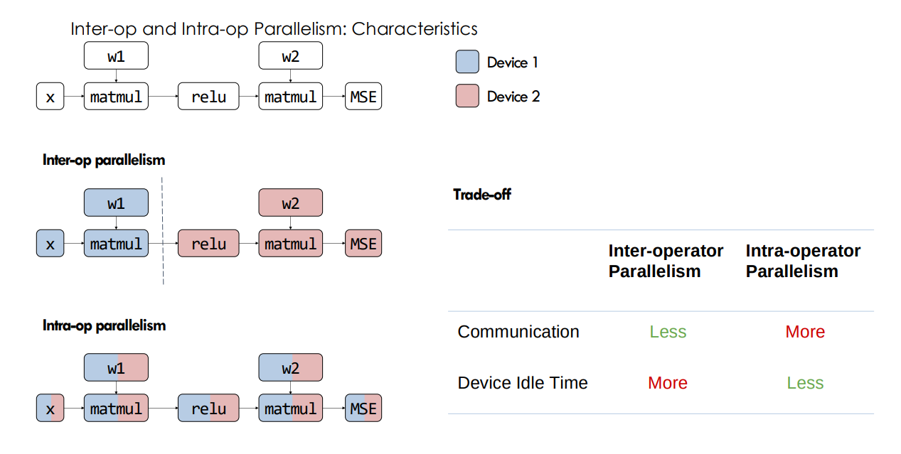
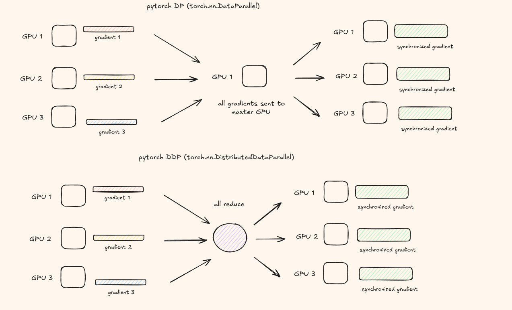
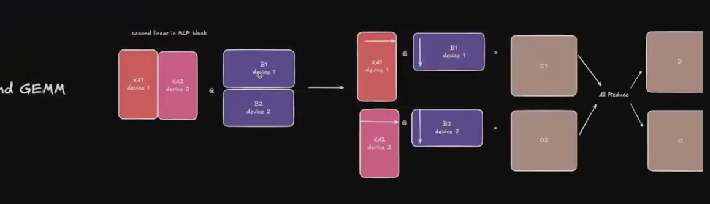
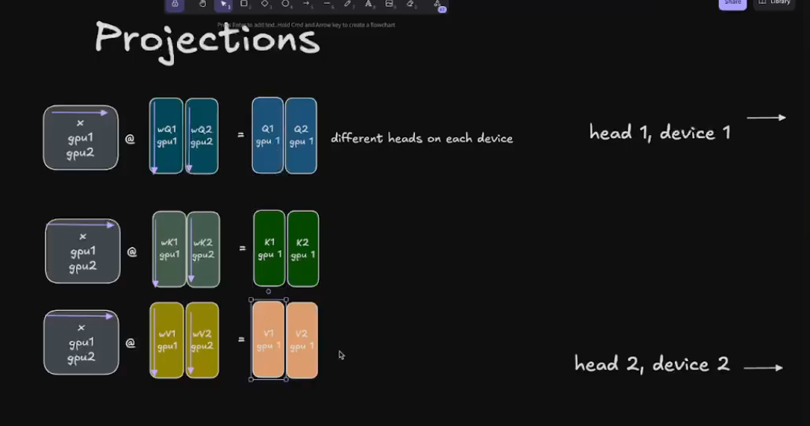
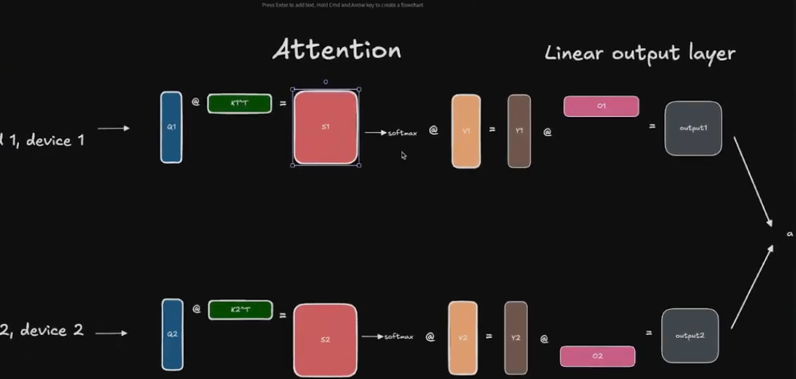
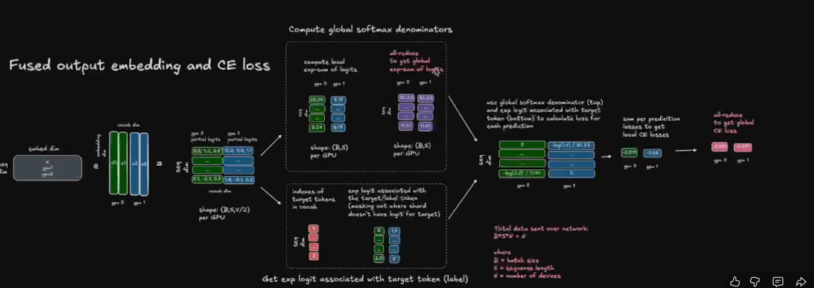

<strong style="font-size:16px;color:#1a6ba0;">要点速览</strong>

- <strong>从单卡到多卡的四种并行层次</strong>：数据并行（DP→DDP→ZeRO）解决「模型能放进单卡但想加速」的问题；张量并行解决「单层放不进一张卡」的问题；流水线并行解决「层太多一张卡放不下」的问题；三者可以组合使用  
- <strong>ZeRO 三阶段渐进式显存优化</strong>：ZeRO-1切分优化器状态，ZeRO-2再切分梯度，ZeRO-3连模型参数一起切分，每阶段节省 Nd 倍显存（Nd=数据并行度）  
- <strong>张量并行只在单节点内有效</strong>：每个transformer block需要2次all-reduce，通信开销对互联带宽极度敏感，跨节点InfiniBand延迟太高，必须走NVLink  
- <strong>流水线并行的三种调度演变</strong>：从All-Forward-All-Backward到One-Forward-One-Backward再到Interleaving Stages，逐级解决气泡率和内存问题

**当你的 LLM 放不进一张 GPU 时，你需要并行策略。** 当你有多个 GPU 想加速训练时，你需要并行策略。从最基础的 DP/DDP 到 ZeRO，再到张量并行和流水线并行，每一种方案解决的都是不同层次的问题。

评估并行效率最直观的指标是 **MFU（Model FLOPs Utilization）**：**MFU = (FLOPs / t) / peak FLOPS**，告诉你 GPU 利用率达到了理论峰值的百分之几。影响 MFU 的因素包括算子类型（matmul 高、element-wise 低）、精度与硬件、通信开销和代码优化。

---

## Inter-op 与 Intra-op：两种最基础的并行思路

**Inter-op 并行**把不同算子分配到不同设备，算子 2 依赖算子 1 的输出，设备间通过点对点通信传递中间结果。缺点是当一个算子提前算完，要等待下游完成才能继续，GPU 空闲。

**Intra-op 并行**把单个算子拆分到多个设备上执行，例如把一个大矩阵乘法切分到多张 GPU 上各算一部分再合并。它依赖集体通信（all-reduce、all-gather、broadcast 等），通信开销在算子不够大或网络不够快时比较显著。

---

## 数据并行：最直觉的方案及其进化

### DP：单进程的瓶颈

PyTorch 最早的 `torch.nn.DataParallel` 基于单进程。主 GPU 将数据切分到所有 GPU，模型复制到各 GPU，各 GPU 独立 forward+backward 算梯度，梯度发回主 GPU 更新参数，新权重再复制回各 GPU。**所有梯度汇总到主 GPU，主 GPU 成为瓶颈**，其他 GPU 在等待期间完全空闲。GPU 越多，扩展性越差。

### DDP：多进程的去中心化方案

`torch.nn.DistributedDataParallel` 用多进程方案解决了瓶颈问题。**每个 GPU 对应一个独立进程**，初始化时模型参数同步。梯度计算完成后各 GPU 通过 **all-reduce** 拿到全局平均梯度，各自独立更新权重。没有主 GPU 瓶颈，扩展性远优于 DP。

### 数据并行的进阶：重叠计算与通信

数据并行有两个优化技巧。一是 **与 backward pass 重叠**：最后一层的 backward 一旦完成，立即对该层的梯度做 reduce，同时前面的层还在继续 backward，由于反向传播从后往前，可以流畅地流水线化。二是 **梯度桶（Gradient Bucketing）**：将多个梯度分组后再一次性通信，减少通信次数。

但数据并行有其上限：**当 GPU 数量超过某个阈值后，通信开销会吃掉所有收益**。而且它有一个根本假设：**模型必须能放进单张 GPU**。

---

## ZeRO：从优化器状态开始的显存革命

**ZeRO 的核心思路是把模型参数、梯度和优化器状态切分到各数据并行 rank 上，每张卡只存一份切片，用的时候再重构。**

### ZeRO-1：切分优化器状态

传统数据并行中所有 rank 算出相同的梯度，做相同的优化器更新，**大量的重复计算和冗余存储**。ZeRO-1 的理念是把优化器状态（momentum、variance 等）切分到 N 张 GPU 上，每张卡只维护 1/N。流程是：Forward pass 各 replica 用完整参数 → Backward 算本地梯度 → All-reduce 但只用 scatter-reduce，每张卡只保留 1/N 梯度 → 各 GPU 对自己切片执行优化器步骤 → All-gather 将更新后的完整参数广播回所有 GPU。相比传统 DP，**优化器状态的内存节省量达到了 Nd 倍**。

### ZeRO-2：再切分梯度

ZeRO-1 只需要 1/N 的优化器状态，相应地也只用到 1/N 的梯度。**梯度的 all-reduce 替换为 scatter-reduce**，每张卡只保留自己需要的那份梯度切片，梯度存储也节省了 Nd 倍。

### ZeRO-3：连模型参数一起切分

假设模型有 10 层，每张卡只存 1/N 的层。每次 forward 和 backward 需要某层时通过 all-gather 把该层完整取回来，计算完再丢弃。**ZeRO-3 通过预取实现了重叠**：当第 N 层正在计算时，第 N+1 层已经在 prefetch 了，GPU 不会空闲。

**ZeRO 的局限**：它无法切分激活值（activations），因为激活值依赖于输入数据，不能通过数据并行方式切分。

---

## Transformer 训练中的显存分布

训练 LLM 时显存主要消耗在四个方面：

- **模型参数**（weights）：4N 字节（FP32）
- **梯度**（gradients）：4N 字节
- **优化器状态**（optimizer states）：8N 字节（Adam 保存 momentum + variance）
- **激活值**（activations）：取决于 batch size 和 sequence length，**增长最快也最难控制**

激活值之所以棘手，是因为它随 batch size 和序列长度急剧膨胀，且不能像参数那样通过数据并行来切分。这就需要引入张量并行。

---

## 张量并行：切分计算本身

**张量并行（Tensor Parallelism, TP）不仅能切分权重、梯度和优化器状态，连激活值也能一起切分。** 它的数学基础是矩阵乘法的分块性质。对于 Y = XA：按列切分 A，各 GPU 算出一部分输出列；或者按行切分 X 和 A，各 GPU 做部分点积后求和。

**限制**：dropout、layer norm 等操作需要完整的 hidden dimension，这些层的激活值无法被切分。

### Megatron-LM 的标准做法

**Megatron-LM 交替使用列并行和行并行**：列并行的输出 all-gather 后直接输入给行并行，每个 transformer block 只需要 2 次通信：一次在行并行后的 all-reduce，一次在 MLP 后。

**Attention 模块**：各 GPU 分到一部分注意力头。32 个头分到 4 张 GPU，每张卡 8 个。因为注意力头之间相互独立，切分天然干净。

**MLP 模块**：列并行将权重矩阵垂直切分，各 GPU 算中间 hidden dim 的一部分。行并行将权重水平切分，各 GPU 做部分 matmul 后 all-reduce 求和。

**Embedding 层**：词表大小 50K 时并行 embedding 很划算，但索引可能不在本地 GPU 上。实现方式是**如果索引在本地就取值，否则补零**，最后通过 all-reduce 拿到完整结果。

**输出层**：类似行并行策略。

*列并行 + GELU 独立应用*

*第二个 GEMM 按行 split + all-reduce + dropout*

*注意力头在各 GPU 间切分*

*embedding 层的并行策略*

**张量并行的通信代价**：每个 forward 和 backward 都需要在 TP group 内做 all-reduce。**TP 只建议在单节点内使用（通过 NVLink）**，跨节点 InfiniBand 的延迟太高。另一个问题是 TP 度增大后每张 GPU 的计算块变小，小 matmul 无法充分利用 GPU，失去了计算效率。

---

## 流水线并行：把模型切成段

**流水线并行（Pipeline Parallelism, PP）把模型的不同层分配到不同 GPU 上。** 比如 GPU1 负责 1-5 层，GPU2 负责 6-10 层。每张卡只存模型的一部分，显存压力骤减。

### 技术 1：All-Forward-All-Backward

naive 的层分布的问题是 GPU2 要等 GPU1 算完才能开始。解决方案是 **micro-batching**：把一个大 batch 切成多个 micro-batch，GPU2 在处理 micro-batch 1 时 GPU1 可以开始算 micro-batch 2。新问题是你需要在显存中保留所有 micro-batch 的激活值直到 backward 用到它们，**micro-batch 越多，内存爆炸越严重**。

### 技术 2：One-Forward-One-Backward

核心思路是**尽快开始 backward**：不一次跑完所有 forward 再统一 backward，而是交替进行。这样只需要保留 pp 个 micro-batch 的激活值（pp = pipeline 深度），内存占用大幅降低。在 32 个 micro-batch、4 个 stage 的场景下效果显著。

### 技术 3：Interleaving Stages

one-forward-one-backward 的问题在于不能无限增加 micro-batch，全局 batch size 有限。Interleaving 的思路是**让每张 GPU 持有多个非连续的模型块**。GPU1 拿 1、3、5、7 层，GPU2 拿 2、4、6、8 层。每个 micro-batch 需要多次遍历所有 GPU 才能完成完整的 forward pass，但每次遍历更短，交错更紧密。代价是通信次数翻倍。

---

## Megatron-LM v1：完整实现

**Megatron-LM 的核心贡献是用少量同步原语实现了高效的模型并行。** MLP 块按列切分权重矩阵，GELU 可以独立应用在每张 GPU 上，不需要立即做 all-reduce。第二个 GEMM 再按行切分，all-reduce 后做 dropout。Attention 块各注意力头天然独立，直接切分到不同 GPU。Embedding 层词表切分后通过 all-reduce 汇总缺失的索引。输出层类似行切分策略。

整套方案在 8 张 GPU 的单节点上表现极佳，是张量并行在实际工程中最成熟的应用。

---

<strong style="font-size:15px;color:#8b6f4c;">结语</strong>

这些并行策略不是互相替代的关系，它们解决着不同层面的问题。数据并行处理的是训练吞吐，ZeRO 解决的是显存瓶颈，张量并行搞定单层放不下的问题，流水线并行处理层数太多的场景。  
Megatron-LM 和 TorchTitan 的实践表明，真正实用的方案往往是多种并行策略的叠加：FSDP + TP + PP + CP 的 4D 并行已经成了 100B+ 参数训练的标配。  
选择什么策略组合，核心取决于你的硬件拓扑：单节点内用 TP，跨节点用 PP 和 FSDP，ZeRO 用在数据并行维度。把每一种策略的通信模式搞清楚，就不会在选型上走太多弯路。

参考：https://github.com/JINO-ROHIT/ml-systems-notes/tree/main/distributed_techniques/parallelism_strategies
