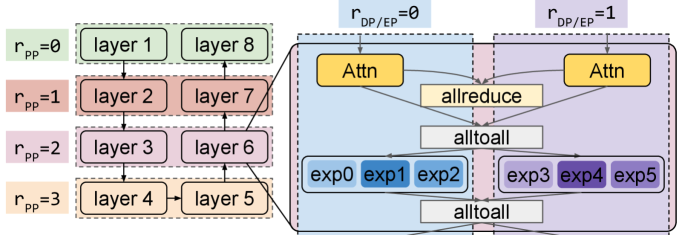
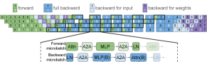
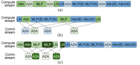

<strong style="font-size:16px;color:#1a6ba0;">要点速览</strong>

- <strong>Piper 是什么</strong>：华盛顿大学提出的可编程分布式训练系统，将策略与运行时解耦。用户通过标注+指令声明策略，系统自动编译为逐设备执行计划
  
- <strong>核心创新</strong>：统一全局训练 DAG（IR），所有并行策略操作表示为统一图中的节点和边。调度指令对 IR 应用变换（微批次拆分、设备流赋值、排序约束），实现组合策略的联合调度
  
- <strong>性能表现</strong>：常见策略与现有框架持平，在 DualPipe 等组合策略上 6-30% 吞吐量提升，3-8 倍批量大小扩展
  
- <strong>行业意义</strong>：像 DualPipe 这样的定制策略不再需要从头实现运行时，通过组合指令即可在 Piper 中表达

华盛顿大学的研究者们提出了 Piper，一个将分布式训练策略与运行时实现解耦的可编程系统。Piper 允许用户通过少量模型标注和调度指令声明完整的分布式训练策略，自动编译为每个设备的执行计划。该系统在常见策略上与现有框架持平，在组合策略上实现 6-30% 的吞吐量提升和 3-8 倍的批量大小扩展。

## 1. 引言

随着 ML 模型规模增长，预训练现在需要扩展到数百到数千个加速器。这很困难，因为切分和复制模型的方式很多，每种方式都会引入不同且可能相互影响的通信开销。例如，现代工作负载现在组合使用数据并行 (DP)、张量并行 (TP)、专家并行 (EP)、上下文并行 (CP) 和流水线并行 (PP)，再加上 ZeRO 等内存节省优化。没有一刀切的解决方案，因为正确的策略取决于工作负载和硬件。

一个工作负载的分布式训练策略可以分解为：(1) **高层并行策略**，如沿哪些维度切分和复制模型及激活值；(2) **每个设备的低层执行策略**，用于执行高层策略规定的计算和通信操作。

目前，策略空间的极端规模使得完全自动化仍然不可行。因此，虽然有些解决方案能在特定子空间内找到最优策略，但实际部署的系统仍然主要依赖人类专家。例如，DeepSeek-V3 引入的 DualPipe，一个自定义的 PP 调度，需要人工工程协同设计高层并行策略和逐设备执行策略，以管理 GPU 内部资源。这种系统需要大量人力；专家必须设计**并实现**一个针对特定模型和集群特化定制的固定策略，导致系统很难适应新策略。

另一方面，Megatron、DeepSpeed 和 TorchTitan 等通用框架提供了更灵活的策略接口，但它们急于将每个高层并行维度的操作独立下发，好像这些维度互不相关，导致很难对组合策略的操作进行联合调度。例如，DualPipe 在概念上让两个 PP 微批次共享一个 GPU，这在假设每个微批次分配完整 GPU 的现有框架中很难实现。

**Piper 的核心问题就是分布式训练系统的可扩展性。** 目标是构建一个最小化指定和实现任意分布式训练策略所需努力的系统。核心洞察是**解耦"策略应该是什么"和"运行时如何实现它"**。

## 2. 设计

Piper 的设计灵感来自之前 SPMD 风格张量标注和 PP 调度的工作。它提供了一个 API，用于在任意 PyTorch 模型中放置不同张量，可用于指定高层并行策略，如 PP 阶段边界或是否使用 EP。

更重要的是，Piper 设计了一个 API 来指定相应的低层执行策略（每个设备上所有运算符的执行顺序）。简单方案（让用户完全自己写调度器）提供完全控制但不现实。另一方面，API 必须足够表达能力强，以捕捉像 DualPipe 这样的新型策略。

Piper 的解决方案是暴露一组**指令（directives）**，用于将系统的 IR 降低为每个设备的执行策略：

1. 编译器从模型代码中提取一个**非分布式 DAG**
2. 用户在 IR 上应用**变换指令**，如将批次拆分为微批次以增加重叠机会，或将设备流等资源分配给块
3. 用户指定**排序约束**来控制计算节点间的执行顺序
4. 系统用**通用调度策略**填充其余部分

这种设计的巧妙之处在于**用户控制粒度是分级的**：需要精细控制的地方用户指定，其余由系统自动补全。Piper 保证所有变换的安全性，即每个用户指令应与原始高层策略兼容。

DualPipe 示例：结合 PP-4（跨层）、EP-2（专家层）和 DP-2（非专家注意力层）。使用 PP 阶段交错配置。

## 3. IR：统一全局训练 DAG

Piper 的核心是一个中间表示 (IR)，它是一个表示所有计算和通信的**统一全局训练 DAG**。所有高层并行策略（DP、TP、EP、CP、PP）和 ZeRO 在 IR 中都被表示为操作节点和边。

每个调度指令对 IR 应用变换：
- 批次切分为微批次
- 设备流赋值
- 排序约束插入

相比现有框架，Piper 的关键优势是能**联合调度来自组合策略的操作**。例如，PP + EP 组合中，每个设备可以使用本地微批次重叠来隐藏 EP 通信开销，这在假设维度独立的框架中很难实现。

DualPipeV 调度：4 路 PP、8 个微批次、8 层。加粗框内的组合前向-后向微批次被重叠。

## 4. 运行时与评估

Piper 实现为 torch.compile 后端，使用 Ray 实现分布式运行时。使用集中式调度器生成和分发每个设备的本地执行策略。每个 worker 加载模型权重后执行本地调度来分配共享设备资源（内存、通信器、GPU 流）。

DualPipeV 调度细节：组合前向-后向微批次的重叠执行

关键结果：
- **6-30% 吞吐量提升**：在 DualPipe 等组合策略上，相比 Megatron 和 TorchTitan
- **3-8 倍批量大小扩展**：通过案例研究验证，结合 PP 与不同 ZeRO 级别时，部分策略在现有框架中完全不可行
- **常见策略性能持平**：Piper 在广泛支持的策略上与通用框架性能匹配

论文还展示了一个案例研究，结合 PP 与不同 ZeRO 级别时，其他通用框架无法支持某些组合，而 Piper 可以支持所有策略。

## 5. 意义

Piper 的贡献在于它不只是另一个分布式训练框架，而是**改变可扩展性的基础架构**：从"专家为特定模型+集群硬编码策略"转向"用户声明策略，系统自动编译和执行"。这意味着新策略（如 DualPipe）不需要从零开始实现整个运行时，而是通过组合指令在 Pipper 中表达。

随着模型结构越来越异构（如 Qwen3-Next 使用多样化的注意力层，多模态模型使用模态特定的编码器/解码器），这种**可编程性变得比峰值性能更重要**。

---

<strong style="font-size:15px;color:#8b6f4c;">结语</strong>

Piper 的 DualPipe 案例很有说明力。DualPipe 是 DeepSeek-V3 的核心性能创新之一，但它需要从头实现整个 PP 调度。Piper 展示了这种策略可以通过几组指令在通用系统中表达，这意味着未来新策略的研发和部署周期可能大幅缩短。  
另外值得注意的一个点是，Piper 选择基于 torch.compile 而非完全重写运行时。这意味着它在实际部署中能与现有 PyTorch 生态兼容，而不需要推倒重来。这种务实的选择可能是它区别于纯学术系统、有潜力被实际采用的关键。

---

参考：

https://arxiv.org/html/2606.11169v1
